去院子前兩週 我還完全不知道竹山到底有什麼好玩時 玟姿問"要去梯子吊橋嗎?" 我爽快的回答"好阿"  玟姿提高音量強調著說(我從MSN揣想)"那是去"爬"山喔 不只是"走"喔" 當下我腦海只浮現網友們分享的漂亮又長長的吊橋 完全不擔心會有什麼難 況且我們家還蠻能走的 不過我想那時的玟姿應該很是擔心我們家能爬梯子吊橋嗎?! 而沒想到一週後 玟姿自己先跑去竹山玩了 還去梯子吊橋爬回來半殘了好些天 不過玟姿卻對我們家走完梯子有信心了 她相信我們家行的啦! 而果然我們家輕輕鬆鬆挑戰成功! 還真擅玩的一家子!!

往梯子吊橋的步道由當地居民管理維護 所以遊客是需要買票才能進入的 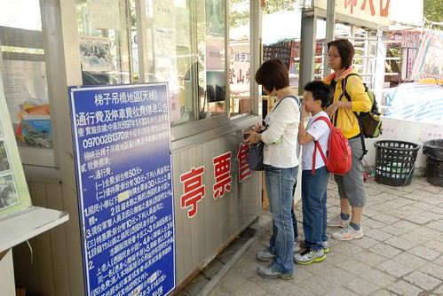 入口處 大家來個誓師大合照 "我們一定會成功!"  通過入口處後 迎接著的便是孟宗竹林 有種被頓時拉到叢林裡的時空轉換感 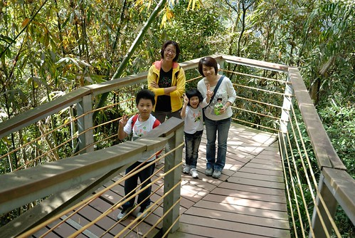 而嚇人的是緊接著一連串的下階樓梯  幸好走到讓人開始擔心回程時會有多累時 變成了平緩的泥道  不過舒服沒多久便又是一連串的下坡階梯  在休息處買的竹杖開始派上用場  大家努力的走阿走  連續下坡了約半小時總算看到梯子吊橋的蹤影了 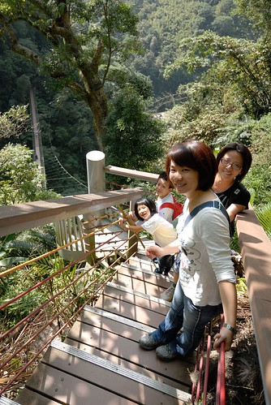 哇! 看起來真的聲勢浩大 頗嚇人的哩 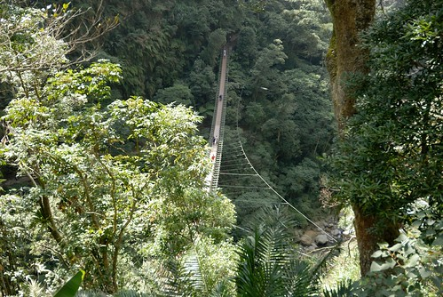 而即將抵達前的這旋轉直下樓梯 更是讓人走著走著忍不住雙腳抖了起來 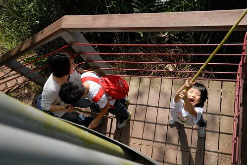 吊橋的聲勢加上下坡的負擔 讓阿徹的雙腳抖個不停 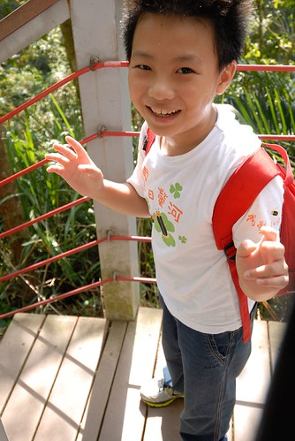 總算踏到吊橋端  除了阿徹外大家都好興奮  玟姿阿姨也幫我們一家子在FB上打卡 留下這紀念性一刻  臉一直很憂 腿一直很軟的阿徹 在媽媽這個小李子的攙扶下努力一步一步走著  而那個下港有名聲的大膽愛則一個人大搖大擺 逕自的往前走 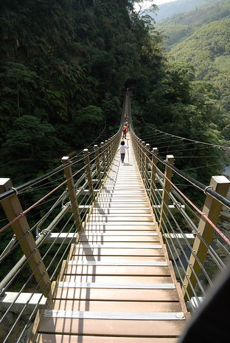 小妮子好似跑的快走 讓我跟徹爸緊張萬分 直喊著"愛愛 慢一點" "愛愛 等一下" 愛愛搞不懂我們為什麼要這麼緊張壞了她的快感  於是就在一個唉 一個high的情況下  大伙平安走過136公尺長 208階的梯子吊橋 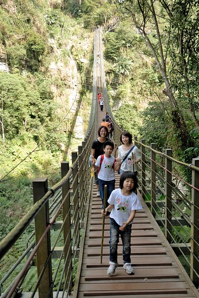 過橋後 看到椅子趕緊讓阿徹坐下休息 平復心情 有經驗的玟姿阿姨分享爬天梯的重要祕訣 就是看到椅子就要休息 真的就會好很多~ 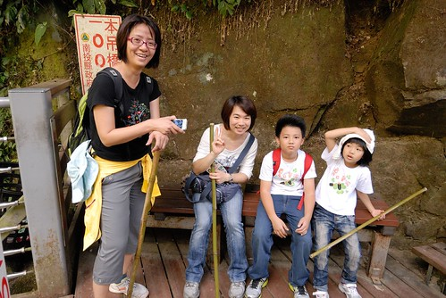 回頭再看剛走過的吊橋 "真的好壯觀!"的讚嘆之後是"天ㄚ! 回去更是辛苦"的莫可奈何 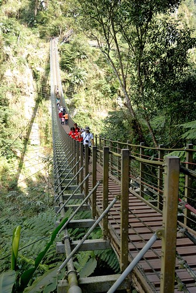 今日我們的目的不僅僅只有走完天梯(梯子吊橋) 我們還要把天梯風景區內的步道走完 從南端到北端 雖然之後依舊是一整路的下坡 但已通過天梯考驗 大家鬥志更是高昂 走的也更顯輕鬆了  抵達我們預定的午餐地點 青龍瀑布  藍天白雲好天氣下 瀑布雖小但也氣宇非凡  除了徹爸外 我們都趕緊脫掉鞋子 把腳沁到冰涼的水中 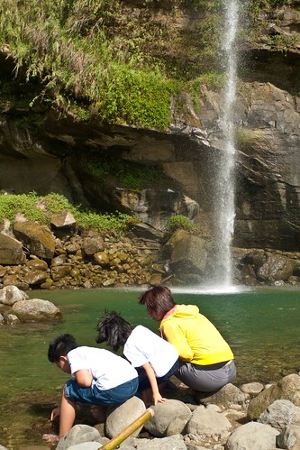 就如工作過後的啤酒最好喝 爬山之後的嬉水也最是令人消疲  大膽愛遇到也是大膽著稱的玟姿阿姨 兩人總容易擦撞出更大膽的火花 就如這兒個看到玟姿阿姨往更近瀑布的地方去 愛愛也如小猴子般的東爬西攀 想盡辦法跟過去  然後為娘的我只好也跟著學猴子似的 護駕愛愛平安到達阿姨的地方 PS. 危險動作沒有大人在場 請勿模仿  雖然行前玟姿特別嘖嘖強調在瀑布下野餐的閒情逸致棒到無話說 但今日天氣太好 加上接近正午時分 我們還是選擇回頭到石蔭下吃中餐 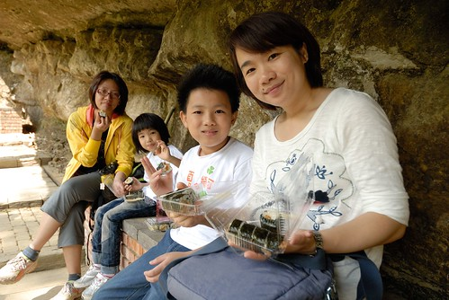 玟姿特別從台中買來的壽司 山下小7的茶葉蛋 加上橘子跟蘋果 很是豐盛的野餐 大家吃飽飽 包包也空了後 繼續再上路~  一樣繼續的連續下坡 直到天梯風景區南端出口前的一座老吊橋 老吊橋短很多也寬很多 但略有搖晃的讓阿徹又緊張了一下  天梯風景區成立的最大原因乃是這裡的太極峽谷地形 有西部太魯閣之稱 我們努力的尋找最漂亮的觀賞點  我跟愛愛甚至跟著玟姿往更深的大巨石區邁進 (阿徹看到頹毀的禁入告示牌怎樣都不肯冒險 可玟姿阿姨向來冒險氾濫 而愛愛又很愛跟隨阿姨 以致最後男生女生兵分兩路) 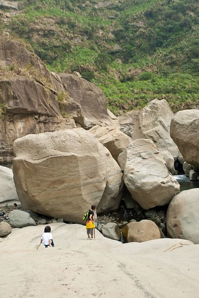 走到這 就真的很有大自然恐怖力量的親臨感了! 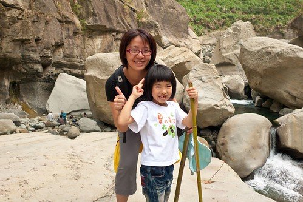 而三個女人也總算心滿意足願意打道回府了  (每次跟玟姿阿姨一起去郊遊 愛愛真的特high阿)  這是玟姿另一個指明這回非得看明白的人面巨石 臉 在哪?! 我想我應該沒有會錯意 拍錯石  同時間 阿徹跟徹爸一股作氣的往回走  聽說阿徹一路表現很勇健 連天梯也是毫無所懼的 一口氣走完喔 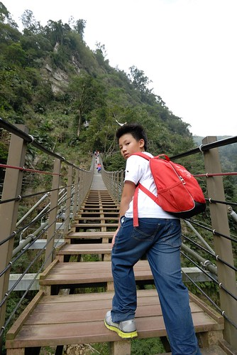 然後父子倆在最後一段最辛苦的向上階梯前 等了我們好多十分鐘  聽到阿徹已經在吃冰愛玉了 我們三個女生更是快馬加鞭 雖然連續的向上階梯讓人果然看到椅子就想休息 但每次歇不到一分鐘愛愛變又催促著上路 真的! 我跟阿姨完全追不上愛愛的青春了 愛愛還很搞笑的在阿姨說"看到椅子就休息" 順口溜就接著"看到樓梯就走 看到吊橋就抖" 看到愛愛這樣有活力 我跟阿姨也只能拼了老命努力走阿~  於是我們全部很順利 很"平靜"的爬完梯子吊橋! 梯子吊橋果然如大家說的回程是條不好走的路 但沒到大多網友們形容的"想哭"境界 吊橋本身也果然壯闊的讓人肅然起敬 兩腿發麻 真的很是值得走一遭!
