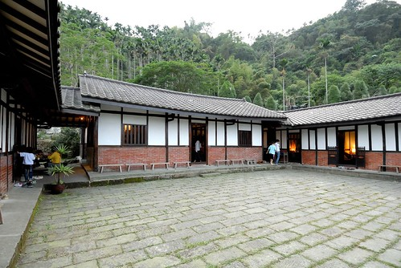

知道院子 已經是好多年前的事了 雖然很感動於院子的歷史與故事 但因為不很喜歡那被檳榔樹圍繞的環境 便也一直沒想過去院子 直到去年不知怎麼的跟玟姿有了個一起去院子發呆的不知道是不是約定的約定 然後我又因緣際會的跟玟姿說起院子在找管家 而最後玟姿的妹妹竟然成了院子的管家 於是秋高氣爽的11月 我們一家子跟著玟姿一起去院子找管家妹妹 一起在院子裡發呆... 院子比我預期還要多的迷人  尤其是房子本身 就如徹爸說的 100年歷史的老三合院就如日本百年物語中所形容的"是有生命 有靈氣的房子" 在院子裡 我們似乎感受到這股氣也被這股氣所深深吸引 很恬淡卻很幸福的天空的院子! 

我們準時的在院子可以入住的時間抵達 打算要把停留時間達到極大 而在要踏入院子的院子前 因著管家妹妹的迎接我們的心情更是期待與開心  抵達後 管家妹妹與我們做個簡單的院子介紹與說明 一百歲還多一些的三合院 果然百聞不如一見 很有精神 很有靈魂 很聶人 很感動 而曾經居住一大家子30多人的房子如今被規劃為僅有的六間客房  這次因著管家姐妹 是我難得做最少功課(其實是完全沒費心)的一次旅行 甚至直到人在院子後 我才發現玟姿早費心的幫我們"訂"了她覺得院子裡最棒的一間房間 有大陽台的四人房  兩張雙人床的臥室 燈光與設備都很恰到好  據說是老闆最滿意的浴室 不過卻是玟姿絕得整個院子裡最不搭的地方  寬敞的客廳 可惜我們沒怎麼利用到  因為從入住後 我們大半的時間就是賴在屋簷下或是院子裡  院子除了院子與客房外 正房的三個空間也被規劃為公共空間  分別為廚房 客廳與閱讀區  兩天中我們便這樣方便與自在的穿梭在院子中 還把廚房裡的"米香"吃光光  天黑前 我們享受地坐在院子裡 感受著天空 呼吸著院子的呼吸  我們拿出相機猛拍 想補捉我們在這的幸福感覺  一家人 一座有傳統家庭使命的三合院  真的好對味阿  我們還忍不住裝模作樣起  假裝我們也是熱血沸騰的文青阿  不過還是自然的最好 最美 謝謝玟姿幫我們catch到這些瞬間  留下我們在院子美好回憶的見證  因著黃家姐妹 讓我們的院子更顯美好  謝謝玟姿阿姨還有管家妹妹!  我們包場似的盡情嘻遊在院子的院子裡  我好喜歡這樣有"庭"的房子 可以曬棉被 可以玩遊戲 可以聊天話家常 或是什麼事也不做的發呆曬太陽....  真是很棒的"庭"阿~  徹愛兄妹倆肯定跟我ㄧ樣喜歡的不得了  

院子提供的早晚餐是具傳統客家風味的便當 自己可以選擇在院子的任何地方用餐  我們理所當然似的跟管家說"院子裡" 等到六點用餐時間 院子仿佛在辦桌....  這是最棒的燈光美 氣氛佳的用餐環境!  在管家妹妹的介紹下 我們迫不及待的打開便當的花布  哇! 水里特製的窯燒便當盒好漂亮  蓋子打開後 滷肉香 飯香 菜香撲鼻而來... 再配上酸脆剛好的脆筍湯 好吃的讓阿徹完全不挑食的全吃光光  飯後我們繼續在院子吃水果聊天 洗澡過後也繼續在院子玩大富翁 突然 有人端著蛋糕出現在我們面前 哇~  原來是之前玟姿問起愛愛是這月幾號生日 我順口說起 在院子的這一天倒是我跟老爺的十週年結婚紀念日 沒想到玟姿便告訴了管家妹妹 然後一起給了我們這樣的驚喜 我跟徹爸 我們一家子 第一次慶祝我們的結婚紀念日!  而且還有算是我們媒人的玟姿見證!! (玟姿一定滿臉疑問她什麼時後變我們的媒人了 話說我跟徹爸是在大三上玟姿安排但她自己後來沒去的大雪山旅行時 才對彼此有多些/不同的了解 如果不是那次旅行 我跟徹爸這兩個無緣的學伴也不會有接下來的友情發展 愛情的演化)  而除了蛋糕外 妹妹還又送了隻烤雞給我們吃 若是晚餐時刻 我們一定一鼓作氣把這超好吃的雞啃光光 可惜我們肚子已經好飽了... 殘念....  茶足飯飽又玩完遊戲後 趁著其他房客都去"上山閱讀"看夜景時 管家們貼心的把戶外燈都關了 讓我們在院子裡賞星 於是我們躺在長凳上 對照著徹爸手機上的星座圖 看著滿天星斗 而其他房客回來後也紛紛加入院子的賞星行列 那時後夜很暗 不知道也沒想到這是什麼樣的景像 直到隔天早上起床踏出房門後 看見所有長凳如排隊似的併列在院子中  想起大家一起躺在長凳上看星星 很美的天空 很棒的院子阿~  同我一起床的阿徹跟著我一起繞著房子散步一圈  途中阿徹讚嘆了好幾次"真是漂亮" 還指導我可以拍下哪些景像  散完步 愛愛也起床了 於是我們繼續在院子裡用我們的早餐 就如玟姿說的 早餐是院子最不優的地方 這很具古早味的清粥便當真的很不得愛愛的歡心 以後如果再來該自備個肉鬆的  吃完早餐 我跟徹爸如被管家拿出來照太陽的植物般 也曬在院子裡  同時間 徹愛則跟著玟姿阿姨到到她最喜歡的陽台"學習"  玟姿阿姨用功的(雖然不知道心有沒有在)念著paper  徹愛寫功課 閱讀 更多的時後是遊戲吵阿姨  我跟徹爸泡壺民宿提供的日月潭紅茶 在院子裡閱讀著 享受著愜意 雖然被主人帶來參觀的部落客給稍打擾了 但還是個美好早晨  (離去前阿徹還吹起笛子)  院子是很棒很美的老房子  而這樣的氛圍尤其適合一家子的無所事事  即使在院子裡做多事的就是發呆跟照相  但一家人的感情好像又更親密了些  其實旅行真的不用遠 不用長 這樣一夜一日就很足夠  而且旅行最重要的意義乃在於跟什麼人在一起做了什麼事(沒做事也是做事的一種)  謝謝黃家姊妹許了我們這次的院子小旅行  我們一家子很開心 很滿足~  後記: 這隻蟲是否也在高舉雙手喊棒ㄋ... 
