井仔腳瓦盤鹽田是台南北門第一座鹽田 也是現存最古老的鹽田遺址 雖然2002年起台灣曬鹽業已經結束 但在這的鹽田風景卻依然不減 在北門 我總算看到這真是令人驚艷與難忘的美麗鹽田 再加上傍晚時分 潟湖上一群群黑腹燕鷗的到訪與停留 真的! 好一個美麗寶島台灣 好一個讓人著迷的濱海小鎮~ 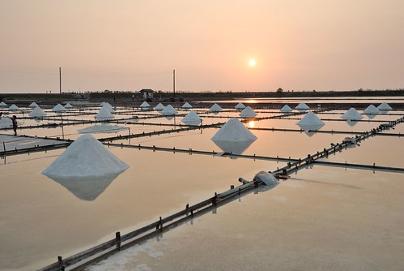 

10月20日的週六 我們從台北直接南下到台南的北門 在區中心的廟口 遊客中心與北門嶼教堂遊玩大半個下午後 四點時分我們總算來到鄰近潟湖的井仔腳瓦盤鹽田 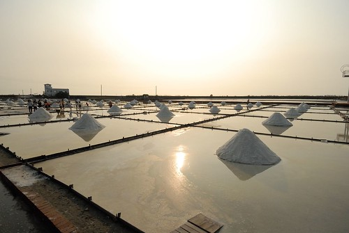 看到這片就像以前雜誌上 阿徹學校教學影片上看到的鹽田 我跟阿徹興奮不已 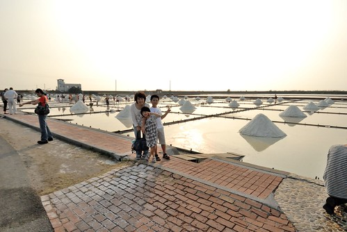 而且行前上網做功課時便明瞭這裡有體驗區 我帶著徹愛一股勁的往可以玩的鹽田走去 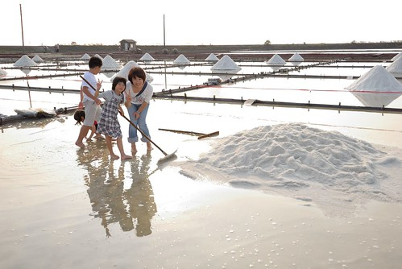 徹愛看到這活生生 可以踩可以堆的鹽田更是開心不已 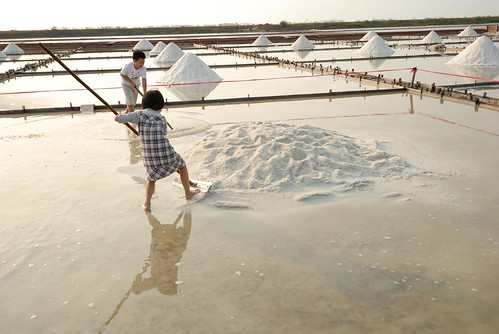 兩人賣力的推 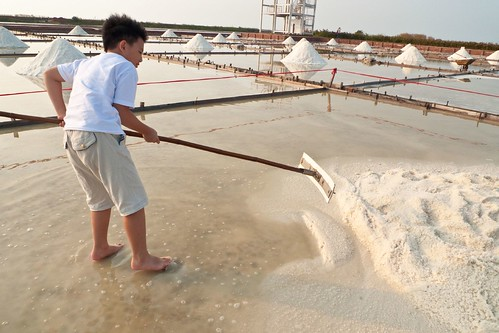 賣力的堆 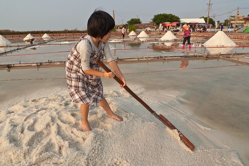 根本是把鹽當作沙在玩 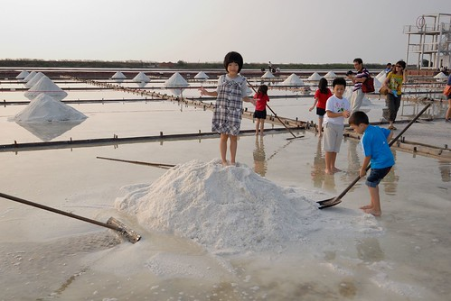 所幸因為鹽田踩起來刺刺的而且會"醃" 所以雖然遊客不少但實際下田去體驗的只有少部分的小孩與像我這樣貪玩的媽媽 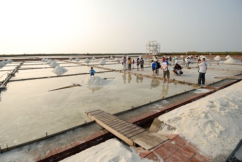 我們母子三人愛死這片鹽田了 要不是因為要顧家教 得把耙子讓給別人使用 徹愛大概就算堆到天黑都願意(媽媽我也願意) 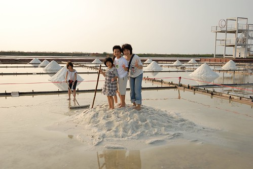 而除了堆鹽山 另一邊亦有扁擔讓人擔擔看 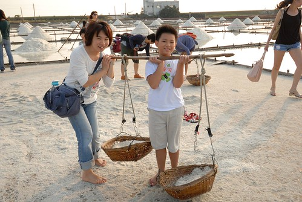 可別小看這些鹽 沉甸甸的 很重啊~ 我們家只有徹爸可以這樣帥氣的擔著 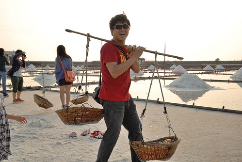 這裡除了親自體驗的樂趣外 兩位阿嬤在鹽田認真工作的模樣更是構成一幅幅動人的景像 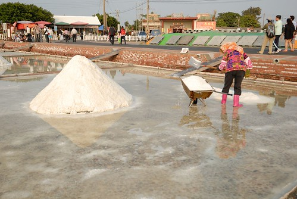 本來以為阿嬤們只是觀光性的存在 後來才發現她們真的在產鹽耶~ 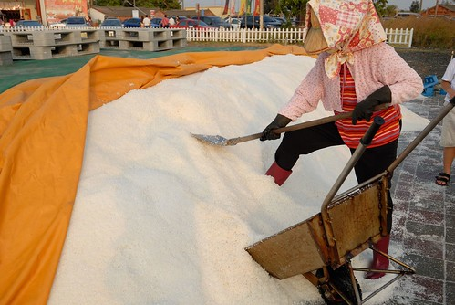 雖然以前台灣鹽業的盛況已不復見 但這片保留的鹽田讓我們還能有機會帶著小朋友來遙想當年 感受台灣曾經的歷史與風情 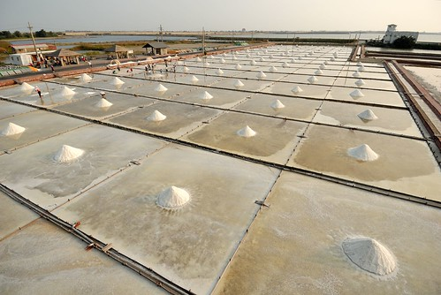 真的很棒 很美的一個地方! 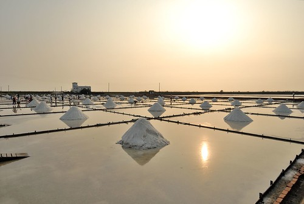 體驗過癮後 我們接著到一旁的紀念品店尋寶 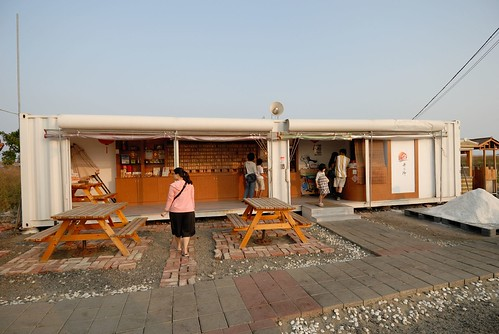 在這也才仔細明白井仔腳鹽田目前的狀況 原來這裡跟夕遊出張所一樣是委外給同一家企業所經營 而且雖然是委外經營 但是是沒有收門票的喔 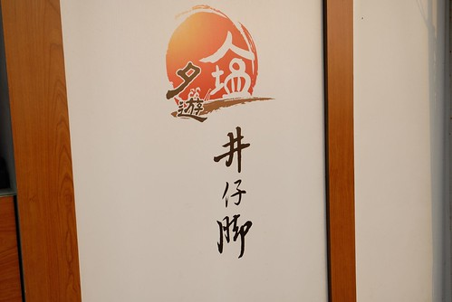 更佛心來的是 紀念品店外側還有一小座鹽山讓人可以帶些鹽回家做紀念或使用(除了不能吃) 只要去鹽田入口處附近的XX廟登記 便可一人領取一個鹽袋  小鹽袋裝滿鹽也裝滿了我們在這的美好回憶 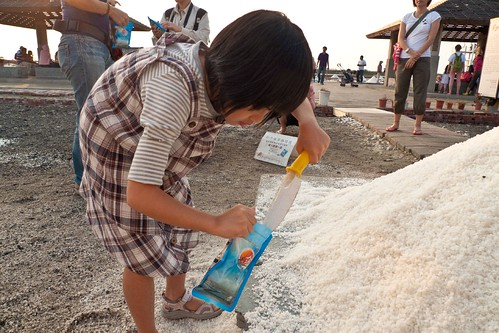 在這徹爸也偷聽到解說員的解說 才發現尚未精緻的鹽原來長得這樣有稜有角 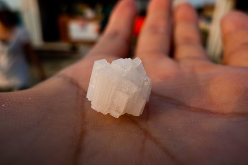 紀念品店裡有一片頗壯觀的牆 很像中藥鋪裡的藥櫃 先來看的徹愛兄妹倆一見著我便問"可以買我的生日的紀念品回家嗎" 完全搞不清狀況但浸在美好氛圍中的我傻傻便也答應了 後來付了錢 坐在鹽田等夕陽時 徹愛打開後我才明瞭原來是每個日子專屬的生日彩鹽阿  那時候吸引我的是這些產自於這裡的鹽 真的是這裡的鹽喔  我忍不住買了一罐回家.. 期望著加了這些鹽的料理帶有濃濃台灣西南沿海的海之味 不管是生日彩鹽還是各種用途的鹽產品 都是來這旅行最棒的紀念品阿 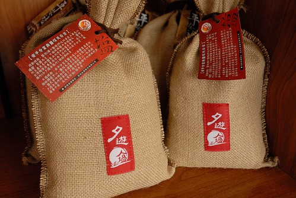 買完紀念品 天也差不多到了太陽西下的時候 我們坐在鹽田旁 一堆巨砲前(很多人來這拍夕陽還有拍這季節的黑腹燕鷗)等著夕陽下的鹽田 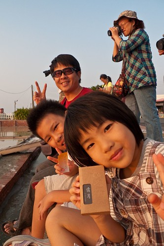 徹愛迫不及待的想打開自己的彩鹽 這時我們也才仔細研究兄妹倆的生日意義與代表的顏色 阿徹: 二月二十二日 如月 特徵: 愉快追求著新奇事物的樂天派 含意: 感性 歡熱氣氛 藝術才能 而代表的彩鹽是 活潑亮麗的黃 我們說"哇~ 還真是這樣ㄋ" 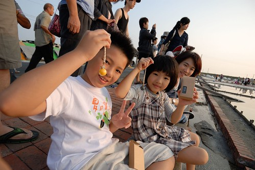 十一月愛愛: 十一月二十五日 霜月 特徵: 讓人感到威嚴和神祕的人 含意: 保守的 易變心 嚴肅 代表的彩鹽是 不常見但沉穩的綠黑色 我們大呼"哇! 好準好準 難怪你常戲弄哥哥的感情 答應他的事情常變來變去" 愛愛有點不好意思但沒有反駁 只是她說她不喜歡這個顏色 不好看...她想要換顏色.... 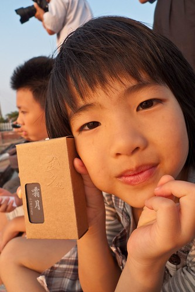 我們邊聊著天邊看著太陽的西下以及鹽田阿嬤認真又俐落的工作身影 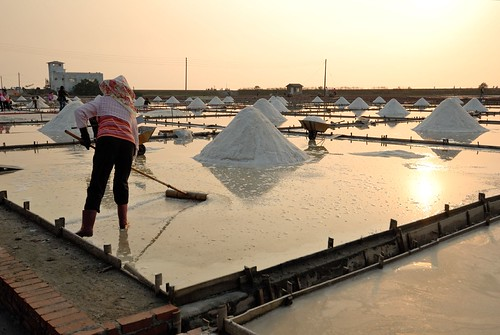 真的是很美很令人陶醉的畫面阿 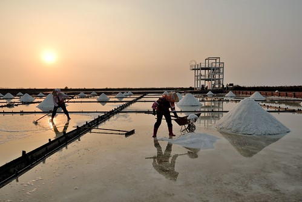 這景象印在我腦海好幾天才淡淡散去 而每每想起依然怦然不已 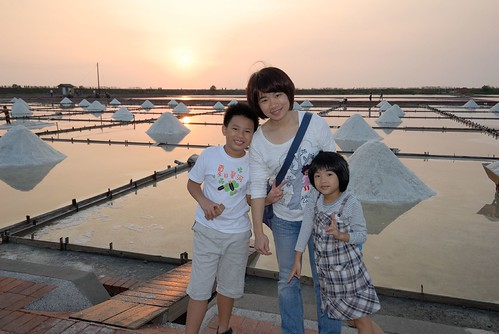 值得走一遭的好地方! 徹家在這好開心 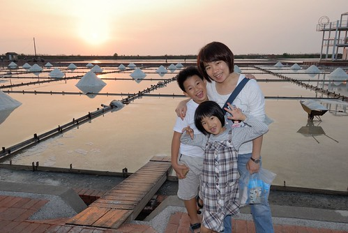 趁著天黑前 我們也順著賞鳥人潮往隄邊走 這時節剛好有黑腹燕鷗南徙到北門  聽說今天可能會有一萬隻的鳥喔 我們沒賞過鳥但下午在北門遊客中心觀賞黑腹燕鷗影片後嚮往不已 因此我們逮住機會的順道賞起鳥 (從隄邊那頭看過來的鹽田震撼度又不一樣了) 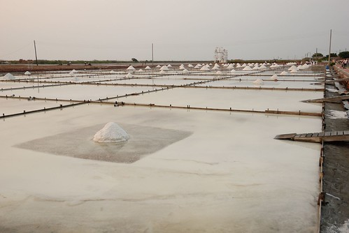 除了七股的黑面琵鷺外 北門的黑腹燕鷗也是很美很有名氣的喔 有名的隄邊的海巡處都像是個黑腹燕鷗遊客中心了 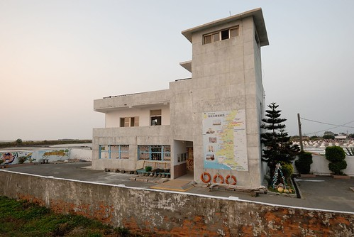Z 我們坐在隄邊上等著候鳥們的大駕光臨 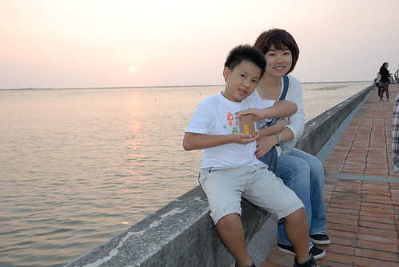 雖然今日夕陽沒有美麗的雲彩 最後候鳥數也不如大家期望 但這瀉湖美景 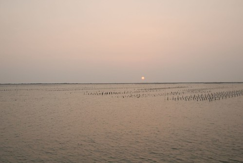 以及一群群紛紛飛來的黑腹燕鷗還是令我們這一家子的賞鳥菜鳥驚艷不已 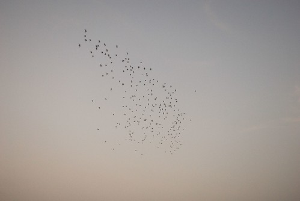 尤其黑腹燕鷗準備停留休息時 "刷"的漂亮身影真的真的會讓人想買隻望遠鏡下次再來瞧個過癮 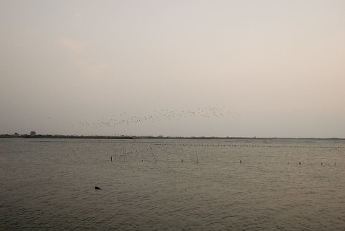 影片說每年11-12月下午4點多就可以看到黑腹燕鷗群舞的樣子 (10月要等到5點多) 真的好令人期待 好令人衝動阿~~~
