除了田仔腳瓦盤鹽田外 錢來也雜貨店與北門遊客中心是北門鄉裡遊客較多的地方 那天下午我們陸續看到遊覽車載來一群群鬧哄哄的人潮 但卻也總在10幾分鐘的熱鬧過後 便咻的一聲立時回復寧靜 好在雜貨店環境美氣氛佳 而遊客中心更像是座寶山一樣不讓人空手而回  都是值得走一遭的好地方! 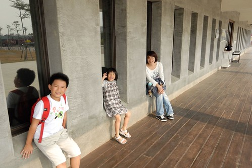

第一次到北門那天 天還沒黑不過5點多但雜貨店已打烊 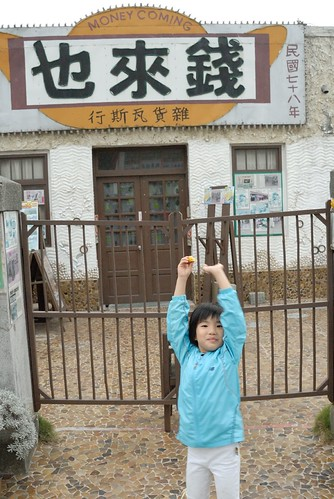 我們只能從大門外窺見雜貨店的庭園 雜貨店裡外的好氛圍加上那个俗到很響亮的店名讓我們很是好奇 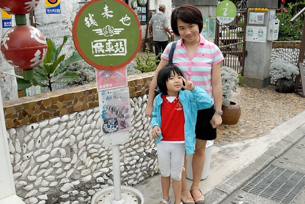 所以再一次到北門 我們當然要來"錢來也" 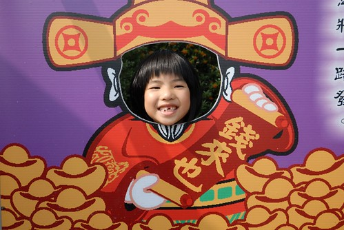 徹愛們超級愛這種有得吃有得玩有得買的雜貨店 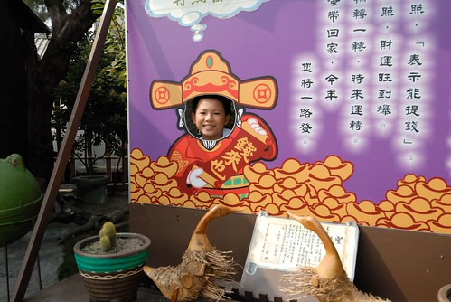 雖然真的有那麼點俗氣去 但誰不愛財ㄋ.. 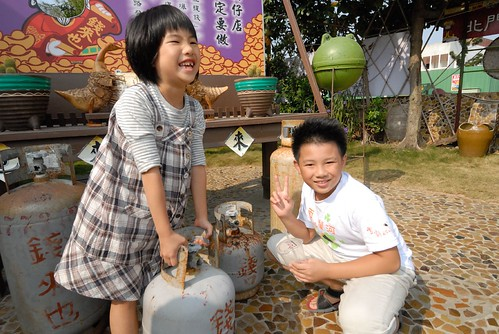 就連阿母我也搶著要提錢  雜貨店的戶外庭園頗大也裝置的饒富古意與童趣 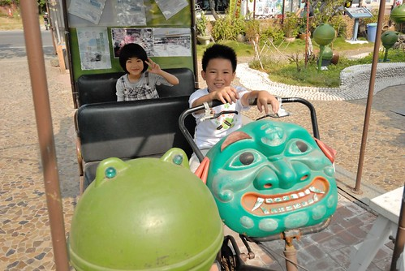  並且與當地生活結合 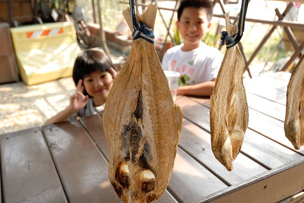這裡甚至還曾經是偶像劇的拍攝場之ㄧ(雖然我也沒聽過這部啦) 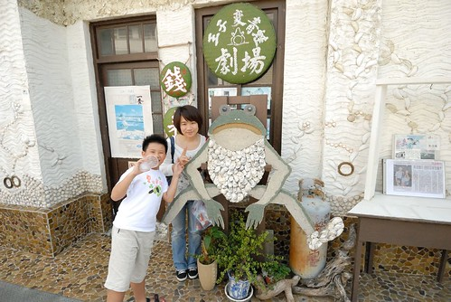 徹愛兩人在裡頭東摸西玩不亦樂呼 (旅行時安排點小人的菜很重要) 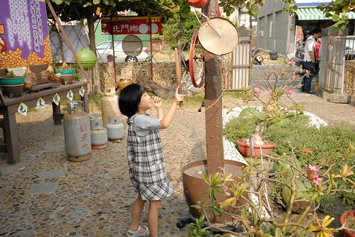 戶外玩累了 再進到雜貨店裡尋寶 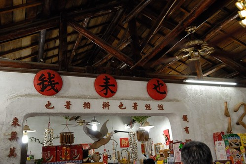 好多的小玩具讓徹愛看的心好癢... 我們努力的把徹愛的目光拉回到那些我們小時候的小零嘴 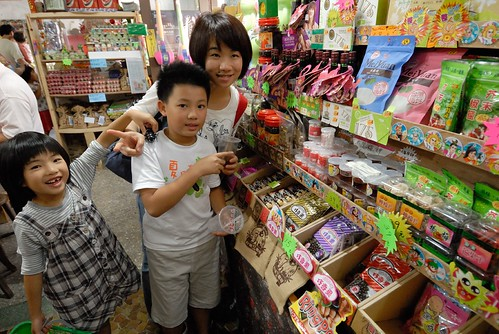 紅吱吱小零嘴是我們那年代的小時候味道 只是怎麼現在吃起來沒那麼好吃ㄋ 還忍不住邊吃邊念"色素的東西哪好吃" 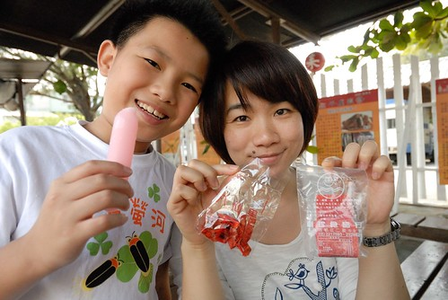 而想不到就連徹愛也不喜歡我們那小時候的冰棒 直喊著"好怪的味道" 看來用現代的機器做古時候的東西果然不是正解 不過偶而這樣仿古一下還挺不錯的 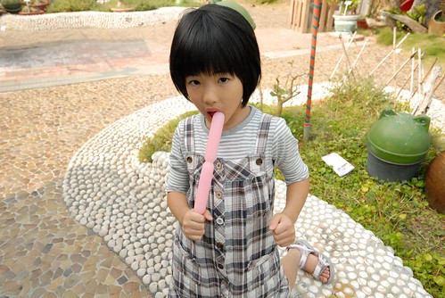 

雜貨店的後頭是雲嘉南濱海風景區的北門遊客中心  水泥外觀看起來很沒有什麼 甚至讓人會懷疑是不是蚊子館 但想不到遊客中心裡頭可先進也很豐富 尤其裡頭的多媒體互動遊戲以及當地的生態介紹影片很適合帶小朋友來體驗與了解 (外牆裝飾有好多幅當地素人畫家的畫作 饒富趣味)  遊客中心內最顯眼的便是那座幾年前擱淺北門的抹香鯨標本 那個比人身長還長的大嘴巴便足以讓人懾服於它的巨大 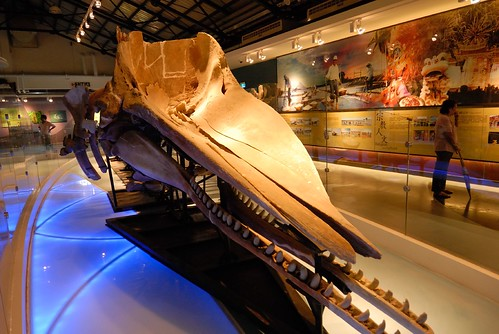 本以為徹愛會對這鯨魚標本有高度興趣 沒想到兄妹倆卻被一旁一個個的多媒體互動遊戲給完全吸引 兩人從左玩到右 再從右玩回左 玩了一兩個小時還眷戀不捨不想走人 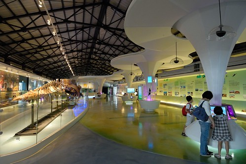 這是透過塗色來瞭瞭當地鳥禽的遊戲 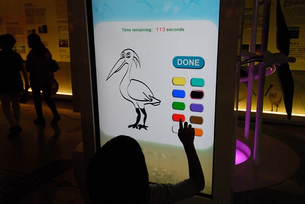 只是發現好像不管小人怎樣亂塗鴉 得到的回應都是"恭喜" 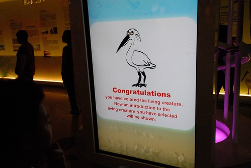 不過這隻鳥真的很好上色 所以愛愛有真的答對喔 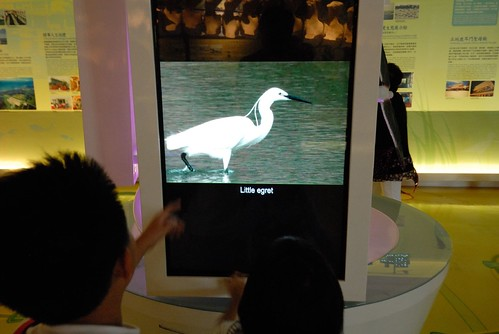 這是擲杯遊戲 明明就掛了個維護中 但阿徹三番兩次偷跑去玩  還超級誠懇模樣的許願 擲杯 阿徹堅持不肯透露他許了什麼願 而老天爺給他的答覆也一直都是笑杯 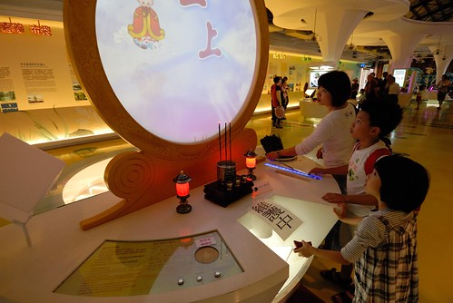 介紹當地食材料理方法的煮菜遊戲 雖然是最弱的一個遊戲但也滿足了愛愛拿鍋鏟的樂趣 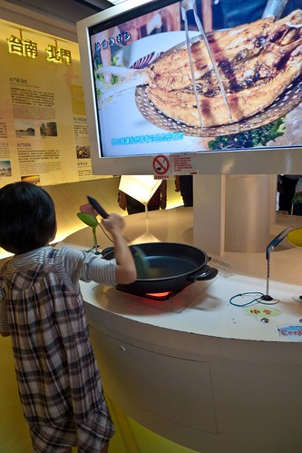 捕魚遊戲 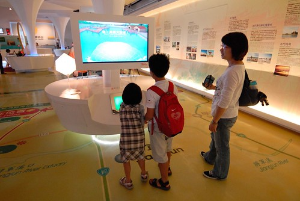 我們四個人各自努力撒網捕魚 競技誰補的魚比較重  沒想到一家子忙了好一陣後才發現大家釣的魚都一樣重  我們只能哈哈大笑 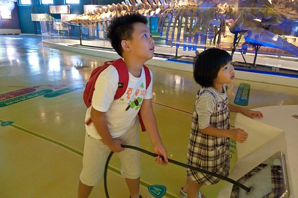 而最後讓我們玩的最high的是這個攝影棚 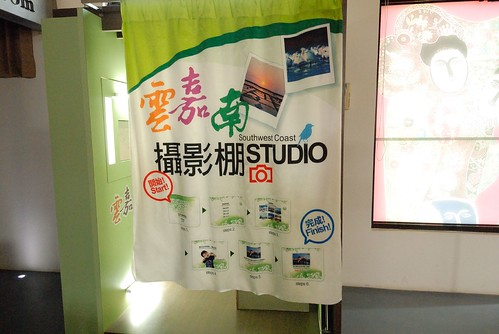 完全沒人注意到的角落攝影棚 讓徹爸給發現了還自己先偷拍一張 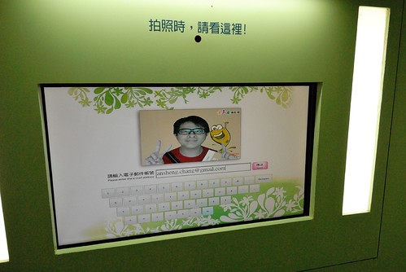 然後直到我們玩了好久遊戲也看完影片 準備離去前 徹爸才一臉神秘的把我們帶到這攝影棚裡  我們分別設定了好幾種背景模式猛拍 越拍越有趣 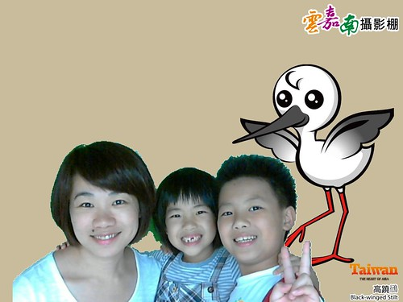 而且利用Email即時傳送到徹爸信箱的照片是今日很棒的旅遊紀念品 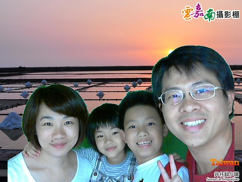 小小攝影棚讓我們彷彿盡收了雲嘉南濱海四季風采 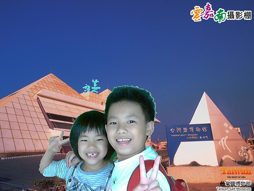 也留下我們一家子在這的美好回憶  真的! 不用錢的遊客中心真的很好玩很值得!!! 而且台灣越來越多這樣的好地方了...
