來北門之前 我對於台南北門的印象與了解一直只在於工作中常聽到的"烏腳病地區" 與學甲以及嘉義的布袋及義竹同樣處在因砷井水使用而還未全褪盡的陰霾中 向來不喜歡悲情的我 老實講是有點怯步於這樣的悲情小鎮 但想不到我們的車子第一次開進北門後 所見卻完全出乎我們的意料 乾淨的街道 寧靜的氛圍 見證與述說著小鎮歷史的教堂 紀念館與老房子等... 一切的一切都很是令我們驚喜與喜歡! 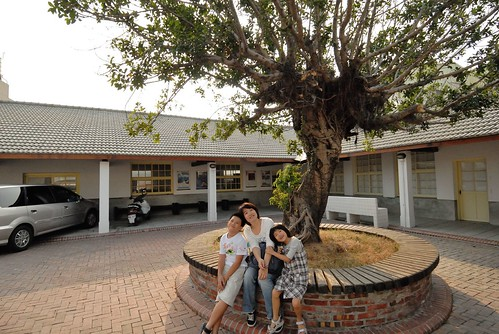 

就如同台灣大部分的鄉鎮 居住的地方往往都集中於主要幹道的火車站或是廟口旁 我們從七股依著路標來到北門 一進入便也是北門最熱鬧的地方 烏腳病文化園區 衛生所 電信局  廟口 商家 北門遊客中心...全都在這條路上 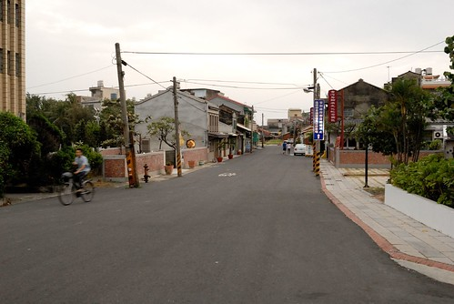 北門嶼教堂 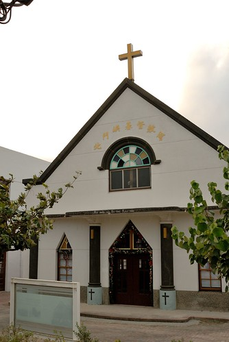 免費診所紀念館 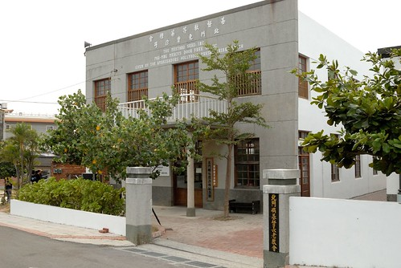 烏腳病紀念館 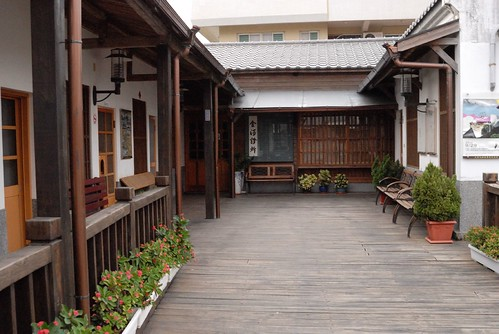 以及鄰近幾處老建物都散發著沉靜但引人著迷的氣息 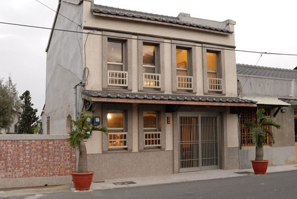 而當我們散步到北門遊客中心處時 看到這一排連棟的小樓房 我跟徹爸兩人更是忍不住讚嘆"這房子 讚!" 不僅僅是房子夠有年紀夠有人味  最引人的乃是家家戶戶所擁有的好景觀 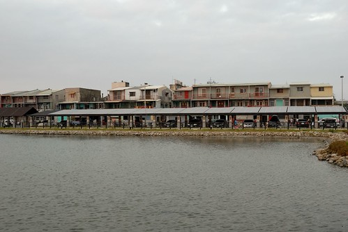 面對著這幕太陽西下 徹爸笑說這才真叫做景觀豪宅阿! 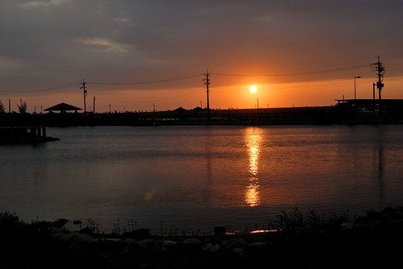 這幅美景讓久居都市鳥籠裡的我們實在好生嚮往阿~ 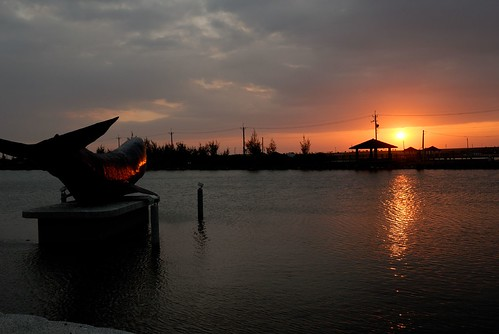 我們眷戀的散步徘徊於此 等待太陽的西沉 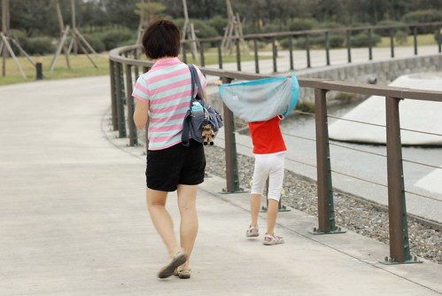 雖然身旁只有愛愛一個小孩有點不習慣 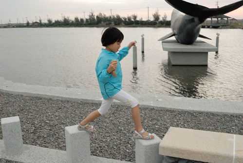 但美景下 心情卻平靜的很溫暖 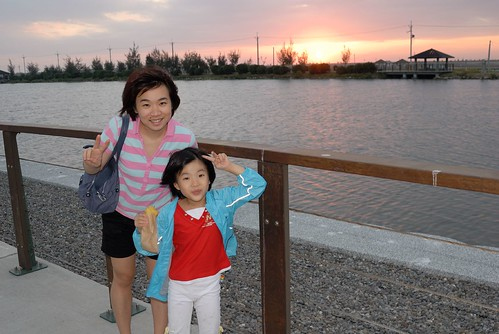 我第一次深深感動於台灣西南沿海小鎮風情 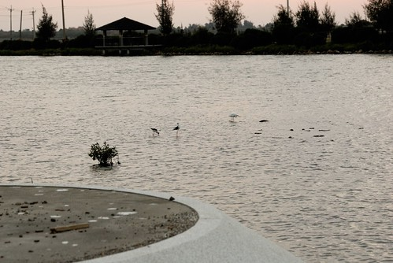 第一次我想 我們該更多走入西部的小鄉小鎮 相信肯定存在著很多與東部同樣的迷人處 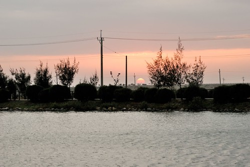 最後離去前 在烏腳病文化園區旁的這一景也很是讓我驚喜 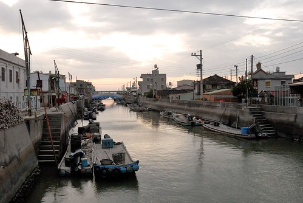 雖然沒去過威尼斯 但我驕傲的覺得這裏一點都不輸水都阿(照片沒拍出當下的感動啦...) 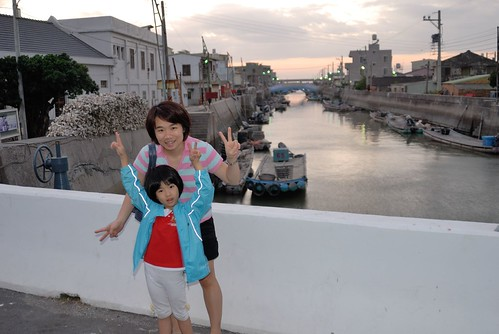 

而想不到時隔不過三週 我們再度來到北門 這次我們從當地生活中心的廟口出發 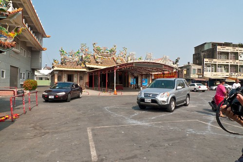 就如同在北門遊客中心詢問工作人員所得到的答覆 在北門的一切不論吃還是喝全都集中在廟口附近 雖然其實真的沒幾家店但卻也夠了 甚至讓人更是喜歡這樣傳統生活般的簡單樸實 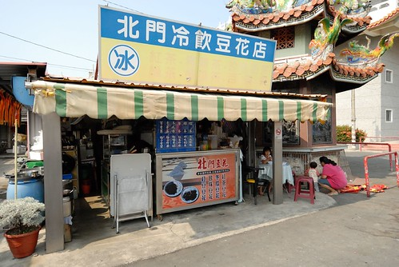 進了一家很不起眼的小吃店 有著鮮甜海味的蛤蜊湯便讓我們滿意不已 而有數十多年歷史的豆花店 好喝又便宜的飲料以及那真的難怪會印在旅遊DM上的豆花 解了我們的渴也熱了我們的心 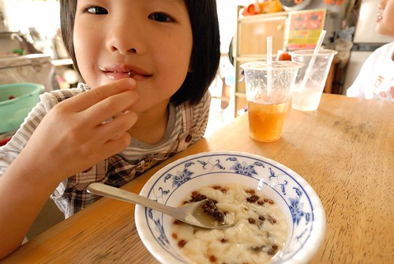 (頑皮的愛愛把粉圓塞到掉牙的上門牙縫裡 好像裝了一顆黑假牙) 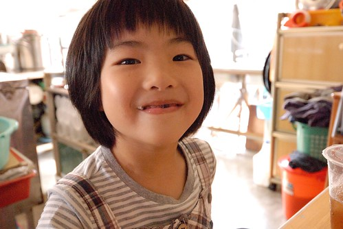 雖然不喜歡蚵仔但忍不住想在這濱海的小鎮來個蚵嗲 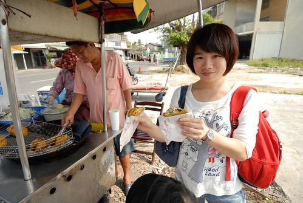 迥異於別處的蚵嗲(話說我也一直對於別處的蚵嗲沒興趣啦)  我們喜歡這蚵嗲的清脆與爽口 我們邊吃邊看著老闆做蚵嗲 還好奇的提問些問題 最後老闆說"我們的蚵嗲很好吃而且只有周末才有賣 要多幫我們廣告廣告" 雖然我心裡OS著"老闆你誤會啦~" 但我還是笑著點頭...(起碼我可以跟張嬤說 哈哈) 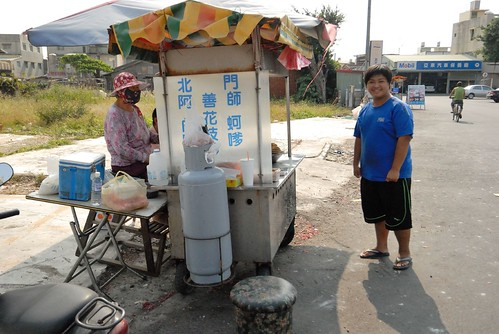 在廟口飽食一頓後 我們散步到錢來也雜貨店與北門遊客中心嘻遊(另篇) 最後我們又再回到烏腳病文化園區 北門嶼教堂後方的這片小廣場 上次來過後我特別的喜歡 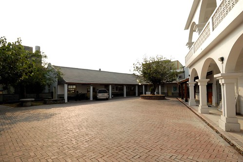 坐在大樹下 看著藍天白屋 好不愜意的午後 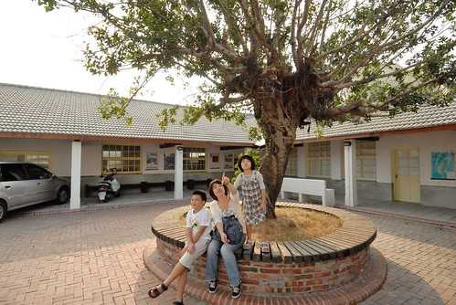 這回我們也進到免費治療診所紀念館裡 老實說 雖然我在公衛領域也十多年了但還是很怕看到那些生老病死的照片與診療相關器具 所以我跟阿徹一樣是半瞇(矇)著眼從後頭走到前頭 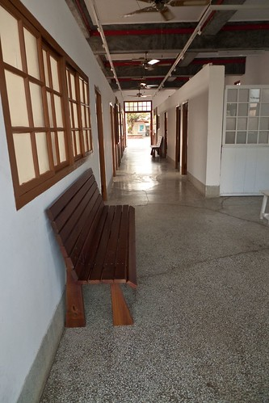 直到在候診掛號處才感覺自在點 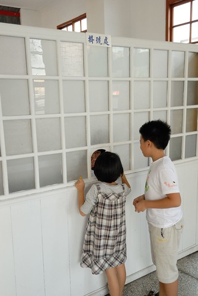 在園區裡我們跟阿徹談論/討論了好多有關砷井水 有關從前 有關城鄉的事 每天打開水龍頭就有自來水可用的阿徹很難理解為什麼從前這裡的人要喝井水 也難以想像30年前更甚至50年前的台灣農村生活 雖然我明瞭現在我們走過這些地方所能帶給小孩的影響很有限 但我總是樂觀的相信應該能在他們心底留下一點點些什麼 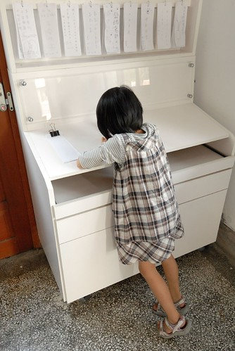 就如身在紀念館裡當下的他們體認平平安安最重要! 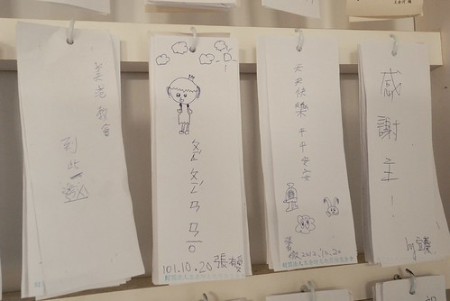 北門 雖然曾經傷痛但現在有的寧靜氛圍更是讓人感動與珍惜 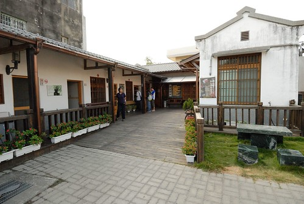 我喜歡這樣一個靜靜述說著歷史 努力走過歷史的美麗小鎮 真高興我們有緣與她交會~ 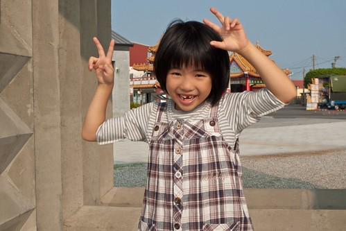
