以前很不喜歡夏天的旅行 因為總有種快中暑的感覺 會看著外面的大太陽不想下車 會三點不到就候在飯店外等著可以check-in的那一刻 陽光 沙灘 太平洋 這樣的組合 我光用想的就會熱到沒動力 這回好像是我們第一次在夏天走這麼長的海線 看這麼多的太平洋 還有這樣盡情地曝曬在陽光下 沙灘上 台11上的太陽依舊如記憶中的毒辣但風是涼的 就因為這從太平洋吹來的涼風 讓我們卸下心防的愛上夏天的太平洋~ 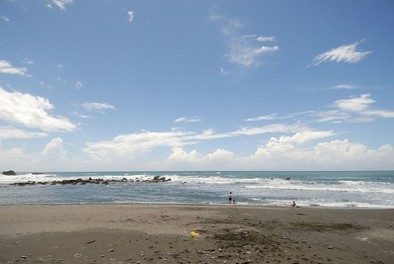

看了兩天的稻田與山 阿徹忍不住哀嚎"我比較喜歡看海 浪不一樣 很多變化" 果然當我們穿過玉長公路 從山的這頭來到海的這邊 阿徹一整個雀躍了起來 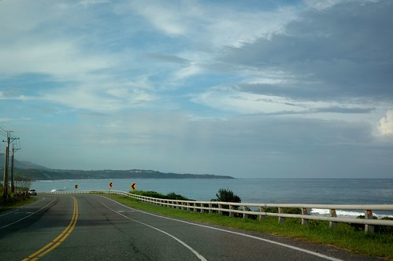 玉長公路(台30)是花蓮境內最短的穿越海岸山脈的公路 約莫20分鐘的車程就能讓人從置身山中的台9(玉里)來到緊臨太平洋的台11(長濱) 公路的前半段像是往山裡去 而過個隧道後迎來的卻是一片海  很難不讓人驚喜的大轉變  而且我們完全沒想到在台9一整天的陰霾天氣 在過到山的這一邊後竟是這樣陽光普照的好天氣  車子一從玉長公路切到台11後 看到可以停車的遊憩點 我們馬上停車看海  看到阿徹像是換了精頂電磁醒過來的模樣 我忍不住笑說"果然是陽光小子阿" 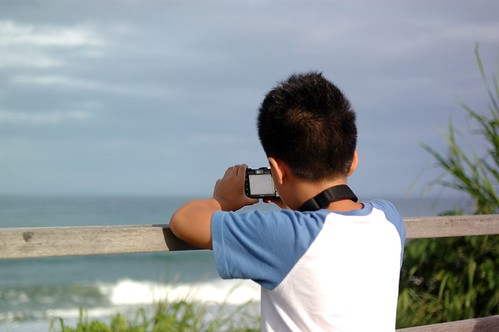 不過 老實講連向來愛山多過愛水的我也完全沒抵抗力的被這片大海給吸引了 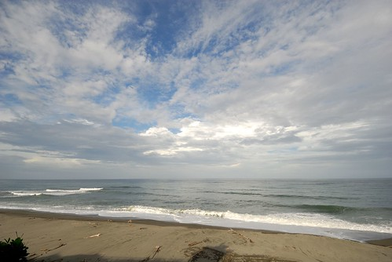 我第一次有這樣的體認: 夏天果然就該有這樣的海味 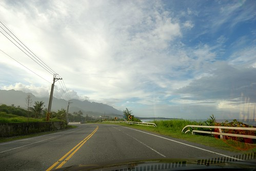 海都還沒看過癮 我們便抵達當日住的長濱 加走灣旅店 辦裡好手續 放好行李 我們馬上衝到旅店後方的沙灘 雖然下午五點時分沒了大海該佐的藍天白雲 但卻涼爽怡人  不同於大白日的熱情奔放 傍晚時分的海岸山線 太平洋顯得靜謐溫柔 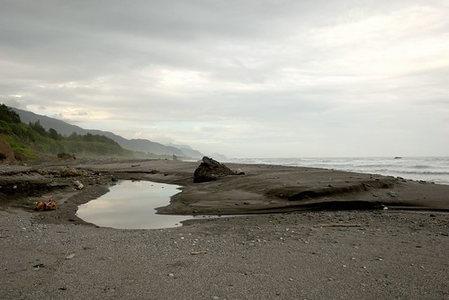 同樣的一片沙灘 隔日上午十點時分再來  所感受又完全不同了 就像是幅重新被調整色調的畫 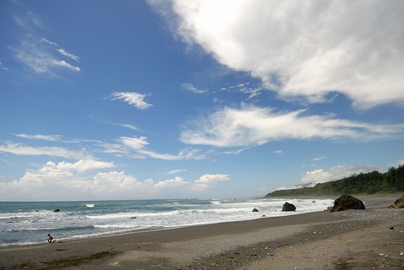 我們的風箏輕而易舉的飛上太平洋的天空  就跟我們一樣縱情的倘佯在這太平洋的風與陽光裡 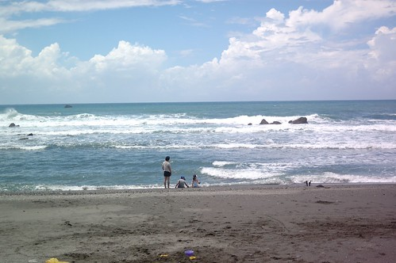 離開長濱準備北上時 我們轉進年初住過的真柄老舍那 雖然真柄的稻田不如預期的豐盈 但那延伸到太平洋的視野很棒  正中午時分的台11果然很熱 尤其坐在車子裡的時候  因為沒有風 但很奇怪 跑在台11上的遊覽車卻好像比在台9的還多 載著一團團的觀光客穿梭於台11上的各景點 三仙台 八仙洞 石梯坪...  年初時未在八仙洞停留 蓋章 徹爸略有遺憾  因此這回我們刻意轉進八仙洞 只是四週此起彼落的鄉音加上愛愛因覓不著思樂冰的拗脾氣 再加上整修中的遊客中心 最終我們只有短暫停留且空手而回  其實我本來便不是太喜歡八仙洞 總覺得宗教味太重 而現在更是加上商業味 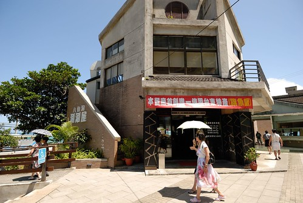 雖然自己一直很肯定台灣整體觀光軟硬體的進步 但也常很感嘆為什麼觀光的發展卻也常局限於大同小異的商業建設  

離開八仙洞也算是此行離開了台東  我們繼續看著太平洋北上直到長紅橋 這裡是秀姑巒溪泛舟的終點  從出海口看出去的太平洋 顯得有點遙遠 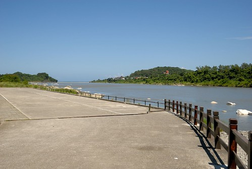 我們的車又一直繼續的開 直到過石梯坪 過石門後的大彎遊憩區 這裡的海漂亮的讓人不得不停車 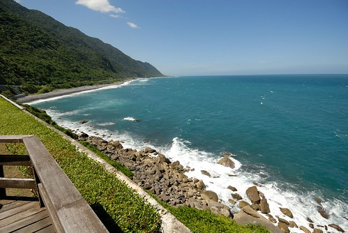 烈陽下 不若其他車子的派代表下車照相 我們四個人理所當然的全下車看海  海翠綠閃耀的絕對令人難忘  連徹愛都忍不住拿出相機拍下 錄下 海的顏色 海的聲音  愛愛鏡頭下的海 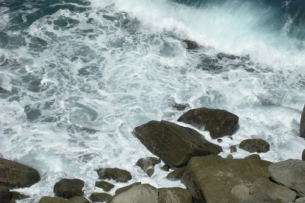 以及爸爸媽媽 (這藍真是太勻 太讚了 好像照相館裡的背景布幕) 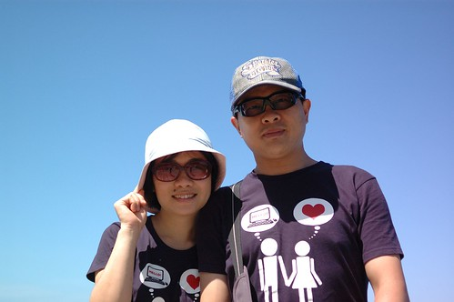 接下來的路 徹愛睡著了 我們便直驅往花蓮市 不過在芭崎瞭望台還是忍不住下車拍這花東山海經典的一幕 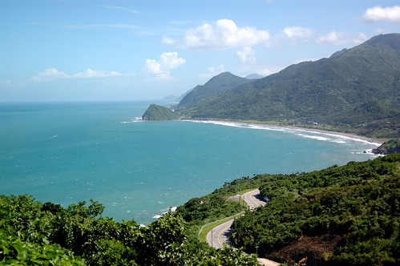 這次兜風在台11 真是完全顛覆我原本對夏天大海的恐懼 雖然花東的太陽跟台北一樣毒辣  但花東的風是舒服的 所以就算怎麼曬 夏天到花東旅行也還是避暑的行為 回來後 我再聽胡德夫的"太平洋的風" 也似乎益加能感受歌裡所唱的溫柔與平和~

補充: 那天在台11我們不只沿路看著海 也努力的找著小7買思樂冰 早上熱情的玩沙過後 答應了徹愛在長濱吃過中餐後買思樂冰讓他們消暑 不只是他們期待 連我都可以想像這思樂冰即將帶給他們的慰勞 滿足與歡愉 結果沒想到長濱唯一的一家小7竟然沒有賣思樂冰 阿徹失望的直呼怎麼會有沒賣思樂冰的小7 他一整個難以理解與接受 店員不好意思的要我們到成功(南下)或豐濱的店買 於是沿路在徹愛的哀嚎 碎念下 我們等待著下一次與小7的再見 只是在台北以5分鐘步程內分佈的小7 在這卻是車程一小時的密度 總算好不容易到豐濱有小7了  我們懷抱著"有了喔"的更是高漲的心情進店去 只是.........一看到思樂冰機器 阿徹傻眼了 怎麼是西瓜跟雪碧口味 沒有他最愛的且台北每家店必有的可樂口味 徹愛好掙扎 可是他們真的只愛可樂口味的思樂冰 幾番痛苦 最後徹愛還是決定等下一家小7 只是沒想到這一等就等到進花蓮市裡去了 天都快黑了 都過了喝思樂冰最痛快的timing了 那一天 我們第一次體會到小7的這麼可貴....
