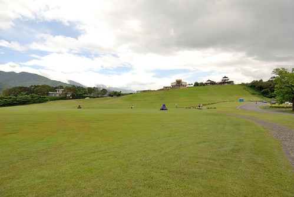
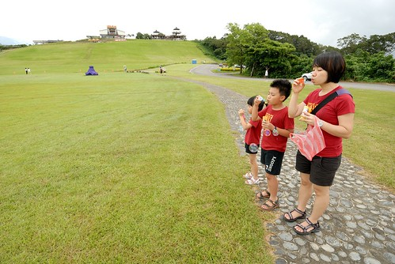
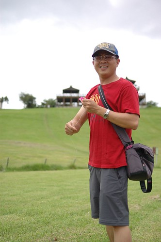
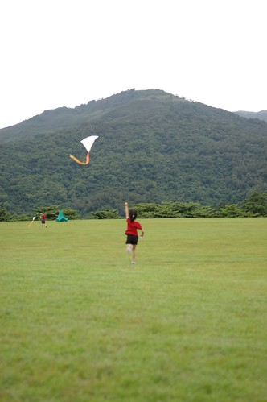
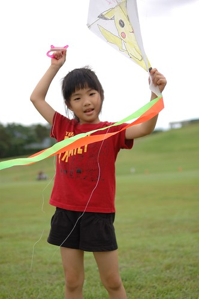
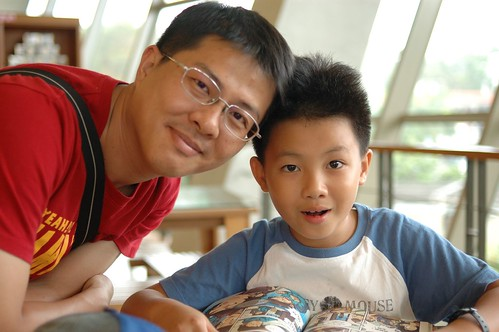
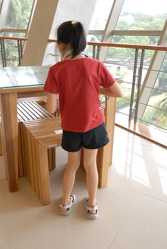
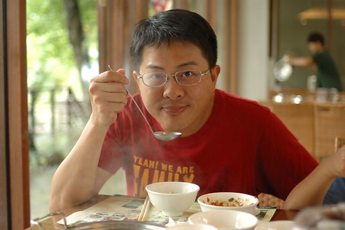
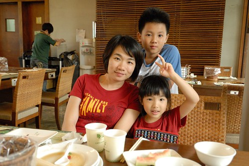
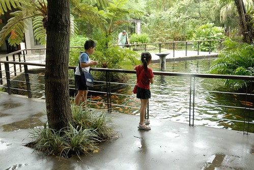

本來最初的行程安排是沒有鹿野的 但後來看到熱氣球嘉年華的相關新聞後 實在很好奇鹿野高台懸著幾棵大氣球的壯闊樣 加上活動的起始日剛好就是我們在北台東的那一天 這真是太巧了 沒專程去鹿野看熱氣球怎麼說得過去ㄋ... 行前我還特別跟喜歡看湯姆歷險記的愛愛說 "我們會去看熱氣球喔 就是湯姆的姊姊的男朋友駕駛的那種熱氣球喔" 愛愛睜大眼 不可思議但又興奮的問"那個會飛的大氣球喔" 只是怎麼嘉年華的第一天 我們卻沒能在鹿野高台看到熱氣球?!

繞了大半個高台確定一顆都沒有後 我直嘀咕著"熱氣球ㄋ? 活動不是今天開始嗎" 趁著帶愛愛去高台商店上廁所時 我順道問起年輕老闆娘 老闆娘說"明天下午才會升 不過今天在台東縣立體育館有電音音樂會有熱氣球喔 還會隨音樂擺動很漂亮喔" 老闆娘極力聳恿我們可以晚上去台東縣立體育館看燈光聲效十足的熱氣球 那當下我失望的好想客訴.......... 一來我們想看的是藍天白雲下的 飄在大草原上的熱氣球 再者怎麼嘉年華的主場地(應該也是唯一的場地)怎麼在活動的第一天卻是這樣的空蕩蕩 而且行前我上活動官網查看時 只看到每天熱氣球升空的時間 每天的定義不是從活動的第一天到最後一天嗎?  結果怎麼是這樣ㄋ... 徹爸看出我的極度失望 提議要不要隔天再從長濱殺過來看熱氣球 但考量隔天下午四點才有熱氣球升空加上當日預訂的住宿地在花蓮市  我完全沒動力這樣拼 不過回台北後 看到朋友分享的熱氣球照片 我忍不住發下豪語"我們明年去看熱氣球"!

雖然沒看到熱氣球很失望 但還是不能浪費高台的好草好山好景 尤其這裡是一個讓眼睛舒展 讓小孩跑跳的好地方 我們吹泡泡  玩阿徹的小紙球  雖然天空偶而飄來一陣陣細雨 但我們貪戀地想盡量待著 (還沒放的風箏被愛愛拿來當雨遮了)  而雖然沒風 但徹愛還是直嚷著"要放風箏"  父子倆努力的讓風箏"可以"飛上去  倆人一直跑 一直跑 就為了不要讓風箏掉下來 跑到徹爸都"落褲"了 還是不放棄  雖然風箏飛不高 但父子越跑越High  看的愛愛也忍不住抓起風箏 放風去  愛愛開心的嚷著"我的風箏飛起來了"  然後便心滿意足的收起風箏  坐在一旁納涼

  拿著風箏搞笑  小妮子散發快樂的能力不容小覷  就在我跟愛愛玩耍的同時  徹爸的風箏也不知不覺間飛的這樣高了 不過徹爸說這根本不是飛 只是飄 所以徹爸努力地一直跑著 好讓風箏不墜... 直到甘願  沒有熱氣球的鹿野我們還是可以玩的很開心 真好! (當然還是有小失望啦)  既然都決定去到鹿野 當然就要順道再去到初鹿的原生植物園吃野菜鍋 原以為非假日應該可以隨到隨吃 沒想到遊覽車不少 所以得等候40分鐘至一點才能用餐 因為下雨 我們只好躲進園內的伴手館等待 我們把可以吃的 可以喝的都試了  購買慾又被熊熊的撩起 (最後不小心又在這花了好些銀子) 最後索性坐在館內的2樓打發時間 此時 阿徹的都蘭書包發揮了作用  阿徹拿出他的書悠哉的看著  而愛愛則只能跟我們乾瞪眼  我們OS著: 肚子好餓阿 什麼時候可以大吃一頓阿  無聊的愛愛索性拿起相機東拍西拍  還偷偷拍她的阿徹哥哥  不小心發現 阿徹哥哥邊看書邊挖鼻屎 很enjoy喔  進到餐廳用餐後 我們一家子除了愛愛外 果然又是火力全開 已經完全自己拿取東西 煮一鍋的阿徹 竟然吃的比媽媽還多了 他拿的東西沒我少 嘴動的也沒我少 但當我飽到投降時 阿徹還在津津有味的奮戰著 年輕人果然好樣!  徹爸依舊享受且滿意於充滿野菜精華的湯 一樣吃了好多阿~  一家子這麼喜歡  我想下回路過我們還是會再來這涮野菜吧!  飯後再給小人們來個餵魚小餘興   是這個半天的完美ending~ 
