我們又再次來池上了 季節不同但一樣地錯過些什麼 這回我們錯過荷花盛開的大坡池也錯過金黃色的萬安 要收集池上的四季風采還真不是件簡單的事 尤其家有小學生... 會再努力的! 

旅行第一晚安排安通的住宿為的就是大清早拖著一家子到池上看荷花 結果從午夜到清早的大雨加上徹爸的夜難眠 我最終還是不敢如此造肆 因此我們還是照著平常起床時間 吃完飯店早餐後才出發南下 到達大坡池後 我急忙著問人與尋找荷花  一心想看花的我完全無視徹愛一旁的唉叫"有蚊子" "有臭臭的味道"  不過有發現到大雨過後的大坡池清新如畫  來過幾回大坡池 還沒這樣好好走路環池 從池的這頭望向山的那一邊 這是另一幅池上的美麗畫作 日據時代的大坡池有53公頃遠比現今的4公頃要大上許多 而當中生態之豐富也絕非今日所能想像 只是經過天然淤塞加上人為因素的介入破壞 現在的大坡池就像是個小濕地 我們繞了1/4個池 總算見著荷田  只是花ㄋ? 我殷殷期盼的花ㄋ? 自從兩年前看過人家拍的大坡池荷花照片 我便一直想親眼目睹大坡池的荷花 總算在今年等到阿徹考完試 我們連暑假還沒鳴槍開始前便偷跑來花東 結果想不到原來我竟然搞錯大坡池荷花開的時間了 赤炎炎的七月天果然不是花開的時後... 徹爸笑說"幸好今天早上下雨" 言下之意是幸好因為下雨讓我們晚出門要不然我應該更噢吧 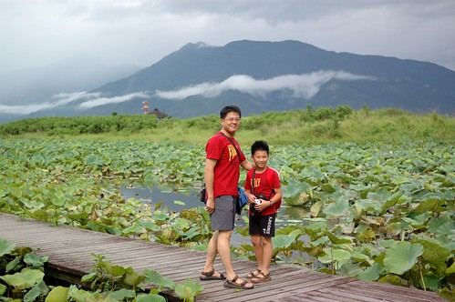 我失望之餘 徹愛還直呼著"媽媽 都沒有荷花阿?" 我真是無語對他們 幸好徹爸發現荷葉上的小露珠煞是可愛  於是我們的賞花變成賞露珠 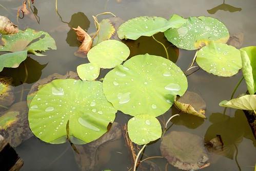 沿著木棧道 我們認真尋找每一片有露珠的葉子  發現後 把露珠滾到葉子的凹槽處 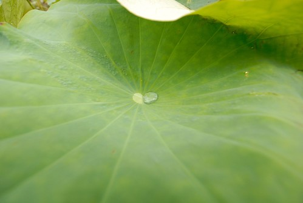 然後把露珠滾阿滾地再甩出去... 徹愛玩的不亦樂乎 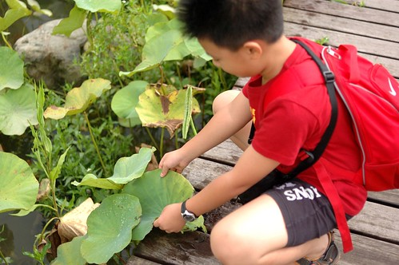 這樣的天然小遊戲或彌補了小人們沒見著荷花的遺憾 媽媽的遺憾就太大洞太難補了 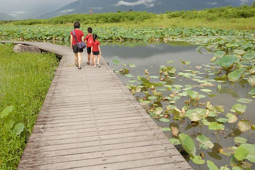 不過我還是肯定這裡是個美麗的濕地! 值得這樣早晨散步走一遭! 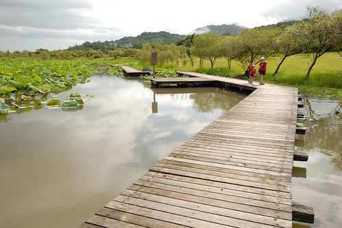 賞完荷田 我們沿著環池自行車道漫步回停車場  兩旁的樹木光影很漂亮也讓人更加的放鬆 一家子說說笑笑  看到樹上美麗的小黃花 徹爸教阿徹如何用他的相機拍的美麗  越來越愛照相的愛愛也向我這機童拿了相機要拍照 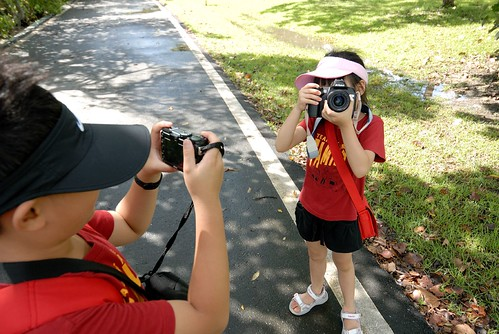 媽媽跟爸爸  媽媽跟哥哥  走回停車場後 徹爸突然問要不要喝咖啡 他說來買杯咖啡當作對地方的支持吧 更出乎我意外的是原以為咖啡是要買到車上喝的 但徹爸卻坐了下來喝起咖啡 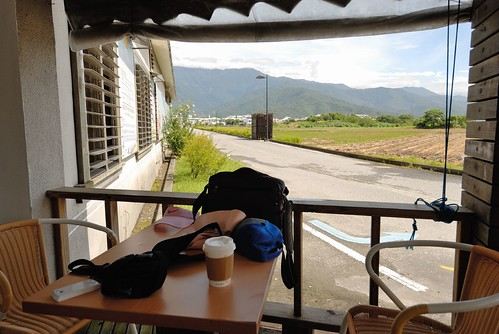 如果不是徹爸這突然的建議(旅行中徹爸真的很少有建議) 我也不會放下腳步坐在大坡池的田野邊 看著藍天 吹著微風  一大早9點多 一家子就坐在這喝飲料 小憩  我們還開心的玩起全家福自拍  Yeah! We are family的再次出巡~  然後父子們又玩起鬥雞眼遊戲 (三人真的很愛比這個) 徹爸版 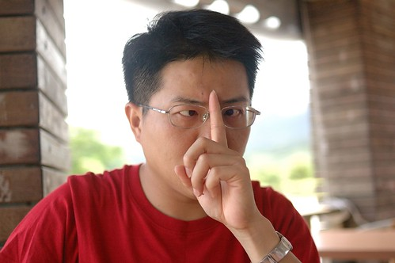 愛愛版 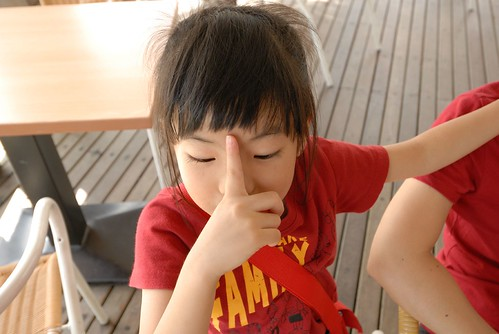 阿徹版 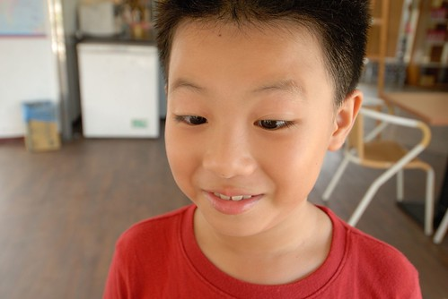 都很醜 但是一家子開心的哈哈大笑!  其實來到花東就是該這樣的隨心所欲  早上見著大坡池旁的稻田幾乎都收割後 我也沒想能見到結穗的萬安 因此離開大坡池後便直接南下往鹿野 下午回程北上時 因為我跟徹爸太好奇197的路況於是又繞進了池上 當我意識到197的起點就在池上的萬安時 我高興的忍不住小歡呼 這回 我終究還是又來到萬安的稻米原鄉館了  只是稻田真的收割了 我終究無緣在稻米原鄉館收集到金黃色  我自己不好意思如觀光客般的上二樓拍照 只敢小聲的拜託徹爸幫我上去照相(話說我去照也沒用 拍不出個所以然) 不過我壓根不認為徹爸會願意做這種事 當我看到徹爸出現在二樓 那個之前我們坐過幾回的窗台 我忍不住大呼"我就知道爸爸是愛我的" 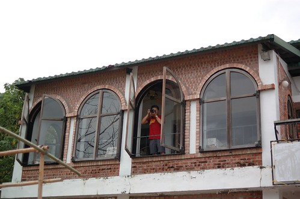 這是另一種風情的萬安!  雖然沒有金黃色 但是我有一家子對我滿滿的愛! 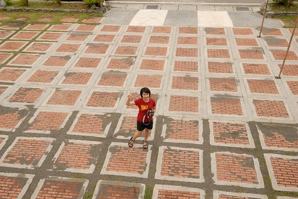 既然來到萬安 那當然得繞進伯朗大道晃一晃 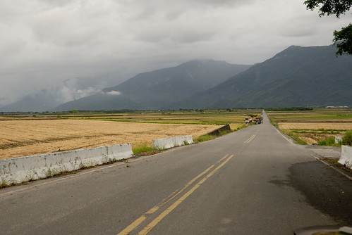 一樣見著了忙於收割的農人們!  辛苦了~ 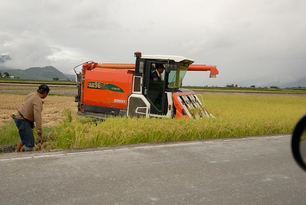 我很喜歡玉里跟池上這兩個小鎮 有倚著中央山脈下的安穩 有恰恰好的偏遠與安靜 慢漫其中會讓人一次次上癮的愛上這裡! 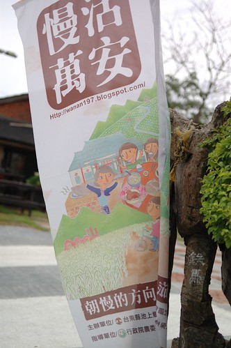
