話說年初住長濱的那一晚 當我們晚上六點鐘來到長濱100卻被告知售罄時 我們是有多麼的震驚 而我們在震驚之後 取而代之的是滿滿的好奇與非得嚐他一次的決心 想不到相隔半年 我們便又再次來到長濱而且吃到了讓我們唸了大半年的長濱100(因為真的太難想像與接受六點就沒餐了) 長濱100比我想像中的"小家碧玉" 但或許就因為如此而帶給大家如回家般的放鬆與滿足 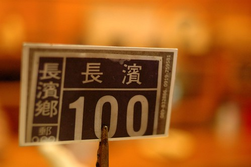

雖然這回抱著非吃到長濱100不可的心情來到長濱 我們甚至有著"5點來去吃晚餐 總一定可以吃到吧"的決心 而那天到達長濱時也正剛好五點初 是個我們絕對可以吃到長濱100的時間 但我們那下午兩點多才嗑完的野菜鍋卻還飽飽的在我們肚子裡消化ing 我們幾經掙扎猶豫 最後我下出了這樣決定 "先過去長濱100詢問是否可以預訂7點的餐(還很心機的不是打電話問喔 畢竟見面三分情) 如果不行那今晚的晚餐就小7簡單解決 明日中午再來長濱100圓夢" 開心的是當我進入店內詢問正準備營業的老闆與老闆娘 他們熱烈地一口就答應 只需留下"陳小姐四位"這樣的訊息 不用電話也不用預付預點  老闆娘笑咪咪的直說"我會留飯 我會留飯.." 果然當我們晚上七點來到店裡時 我們仿若座上嘉賓似的點了任何我們想吃的餐點 而期間看著幾組的客人被老闆的兒子告知"沒有飯了"而吃閉門羹 雖然有客人在被拒絕幾分鐘後會再次入店詢問"那飯以外的麵或是什麼..." 但還是都被老闆娘以"也沒什麼菜了"而被堅決拒絕 我總算能體會老闆娘跟我說的"留飯" 那個飯指的不只是一碗白米飯而是一張晚餐的門票阿!

等候餐點上桌前 我們一家子照列用聊天 拍照打發時間 這是傍晚 在沙灘撿的白玉石 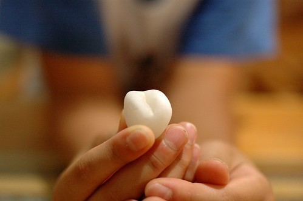 阿徹說這個愛心形狀的美麗石頭要送給老師 祝福她有愛情 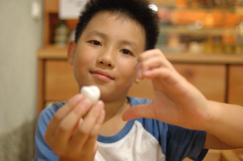 愛愛越來越習慣拍照這回事了 無聊的時候就跟我討相機拍 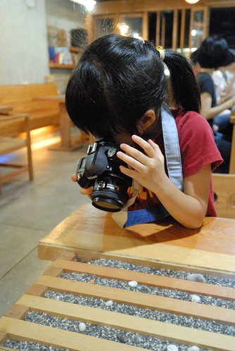 桌子墊下的小石頭 延續著我們玩沙過後的情緒 我笑說等我們家哪天做了新桌子也來長濱扛些沙子回家... 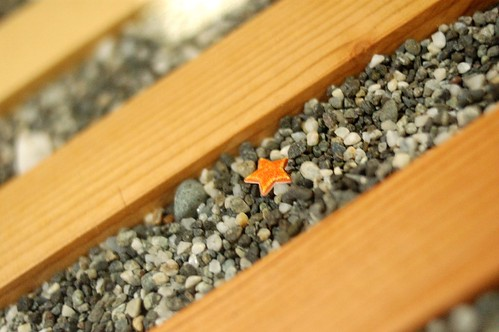 餐點上桌後 愛愛繼續練拍ing 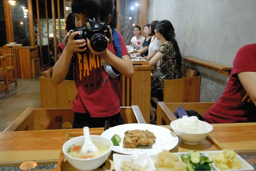 我點的香煎曙魚 這是我們第一次吃曙魚 口感彈Q且香嫩  口口海的鮮味 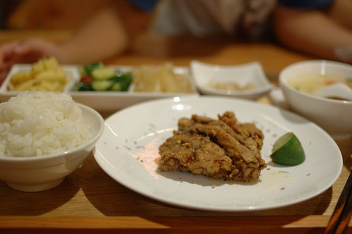 阿徹的肉絲蛋炒飯 飯炒的香鬆又美味可口 只是黑胡椒讓阿徹吃到後頭直喊辣 這時如果有冰開水或冰紅茶 肯定大快阿徹心阿 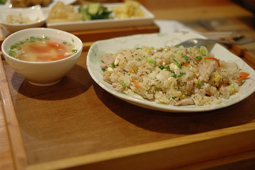 徹爸的茄汁蛋炒飯 很久沒吃小時候最常吃的媽媽牌茄汁蛋炒飯 徹爸直呼"小時候張媽的炒飯就是這味" 我跟阿徹也忍不住一口接一口的分吃 不過吃到後頭還是有點不適合習慣清淡口味的我們 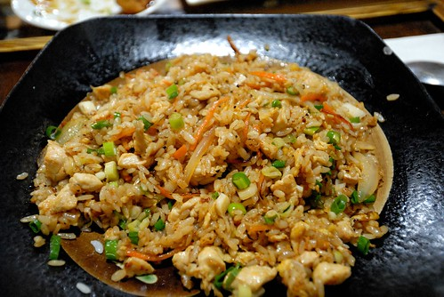 我們一家子果然是湯肚 除了喝完每個餐的附湯外 還喝光光這一大碗的紫菜蛋花湯 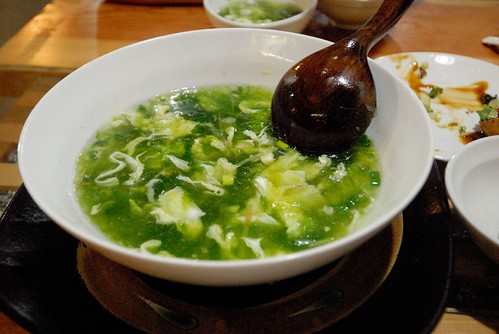 三個套餐加上一盤青菜 一盤炸豆腐以及一碗公湯 全部500元有找 這裡果真是美味又親民 難怪我們上回六點就吃了閉門羹 我們是店裡最後的兩組客人 十來分鐘的時間就所有碗盤見底 老闆娘忙完從廚房裡出來還驚訝的問"吃這麼快" 我們不好意思的笑答"我們家吃東西很快" 不過我們有好好品嚐每口飯也謝謝老闆與老闆娘們給了我們這張晚餐門票! 真的很好吃!!! 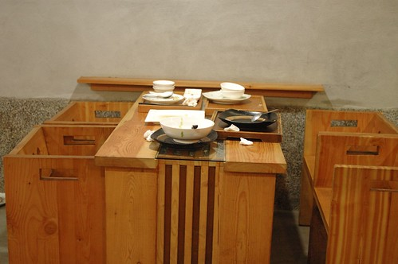 而沒想到第二天中午 老闆鐵門都還半掩著 玩完沙 沖過澡的我們神清氣爽的又來找老闆吃飯了 今日不用再麻煩老闆留飯 今兒個我們是老闆開店後的第一組客人 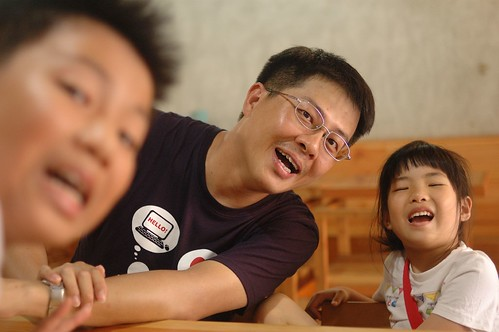 我們挑了個喜歡的位置 如在家般放鬆的等著吃飯 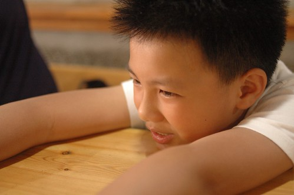 雖然外頭有那麼點熱 但店內的自然光與風卻讓人感覺清爽 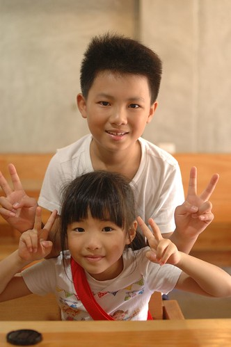 同前一晚 愛愛又討相機打發時間兼練功 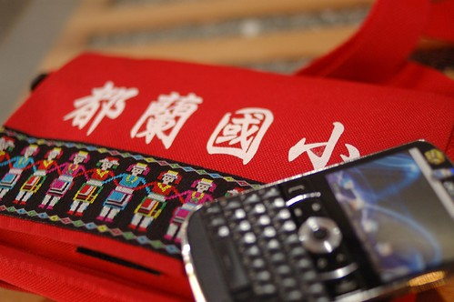 我是愛愛的model No.1  阿徹哥哥是model No.2 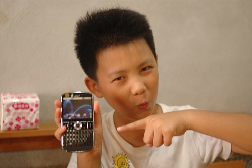 徹爸則是model No.3 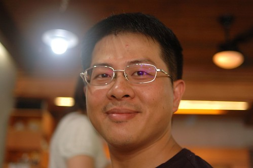 趁著店內四下沒啥人 我們更索性到處坐到處拍 (這是我很喜歡的長椅區 而且超乎我想像的好坐) 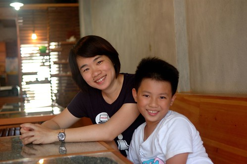 直到12點過後 客人越來越多 我們乖乖的回到我們的位置繼續等候 (媽媽說家教很重要)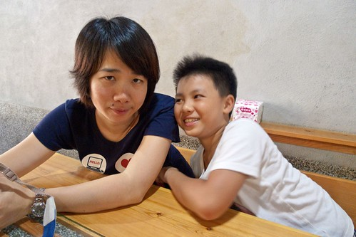 我覺得長濱100吸引人的不止在於那平價的美味 最大的關鍵在於那異於長濱其他店的佈置與氛圍 但在地食材卻又讓人充分感受到長濱味道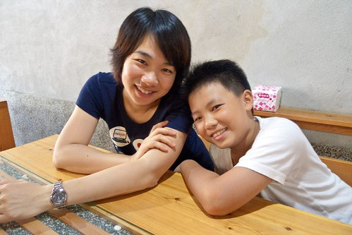 這是今日阿徹點的椒麻雞 一樣主菜+四樣配菜還有一碗冬瓜湯 只要100元 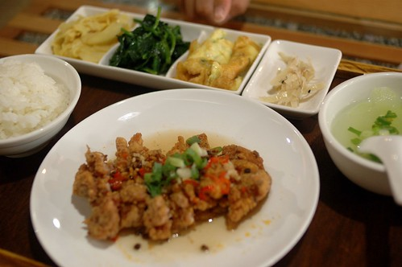 徹爸的海鮮麵 海鮮料幾乎比麵還多 想吃麵還得努力的挑出 也難怪麵是這樣的入味 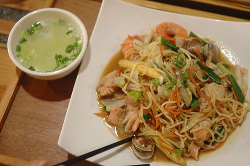 我跟愛愛的海鮮粥 如果用我所能想到的形容詞來形容他 似乎都會讓這碗粥受委屈了 不過還是容我很詞窮的說"真的超級好吃" 是我最最最喜歡的一碗!  除此之外 我們一樣又加點了一盤青菜以及一大碗公的蛤蠣湯 也當然我們又是清光光 吃完美味的一餐  留著海的味道 我們離開長濱 繼續我們旅行的下一站~
