年初在長濱 每次進出市區都會忍不住多看幾眼加走灣旅店 因為只要路過台11就很難不注意到那突如其來且又大辣辣的黃色建物 我們很是好奇這樣外觀與名字的店到底是家什麼樣的店 回家後上網估了一下才發現原來是家經營多年的在地旅店 不過卻是在年輕人這兩三年的回鄉經營南義風味料理後才開始吸引格友們的注意 因此旅店有關美食的推薦文不少 但住宿的分享文卻少之又少... 這回因著PAYEASY關係 認真爬文研究時又意外地發現旅店的後方有著如秘境般的沙灘 於是衝著沙灘以及美味的異國料理 半年後的夏天我們踏進這黃色建物一探究竟 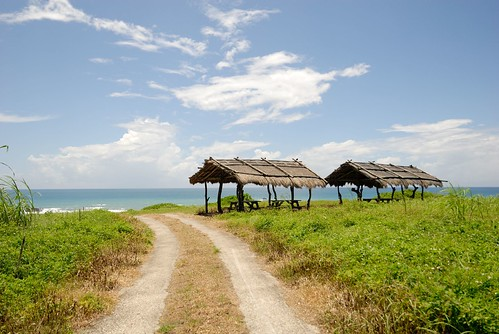

很沒有什麼的長濱 最熱鬧的地方就在一條路上的一兩百公尺內 出了那有的就是一條空蕩蕩的台11公路 而加走灣旅店就位在這邊緣  HOTEL的字眼加上好像汽車旅館的入口很引我們遐想(實際上好像真登記為汽車旅館) 而黃色外牆的似餐廳空間卻又溫馨的讓我們想一探究竟 我們對加走灣旅店的第一印象就是這樣的矛盾與好奇  沒住過汽車旅館的我們抵達後 完全沒想要大剌剌的把車開進去 就像住民宿那樣把車停在大門口 走入內辦理住房 然後再依老闆指示去停車 隨著車子穿過通道後 位於主建物的後方是三棟前後排列的標榜獨棟客房(主建物內亦有客房) 每間房的一樓即為汽車停放處 但我們還是習慣把車停在戶外空曠處 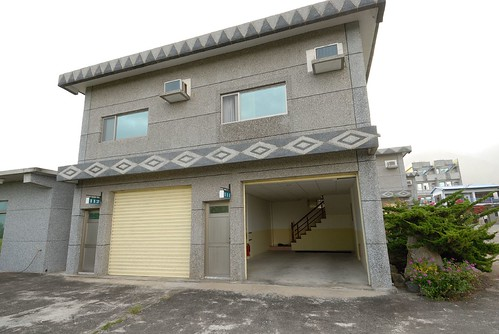  四人套房 簡單但寬敞乾淨 而且有著面向太平洋的好視野 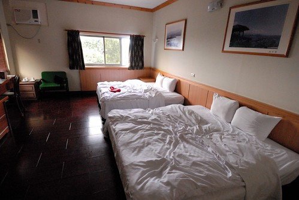徹爸停好車準備進房時 在一樓發現了隻蜥蜴 似乎昂首歡迎著我們阿 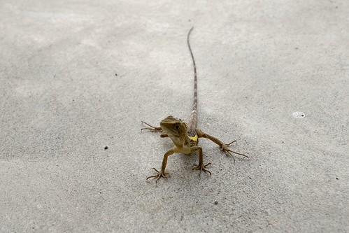 放好行李後 我們趕緊把握天黑前的時間去玩沙 往沙灘的路就在旅店內 我們住的房子旁 大約10分鐘的路程 雖然老闆說可以開車下去到某個程度 但謹慎的我們還是選擇步行 而且這樣散步去沙灘更有旅行的FU 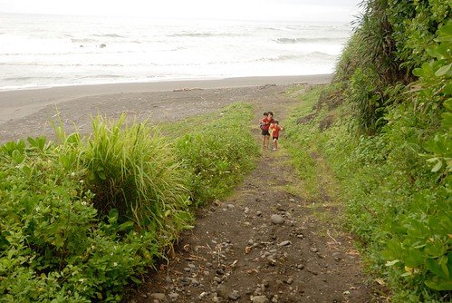 踏上沙地後 徹愛馬上拿出家私頭 準備大玩一番 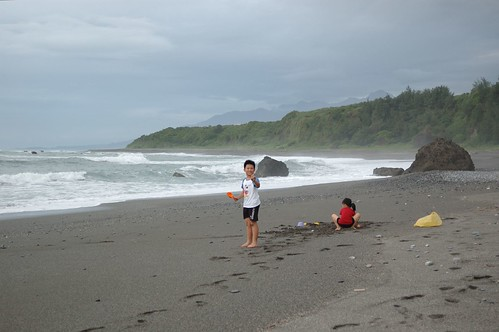 可是因為約了七點的晚餐 沒有時間梳洗 所以徹愛只能不沾衣的乾玩  雖然不能把自己埋進沙裡 泡進海裡 但堆堆沙雕 蓋蓋沙堡也夠令徹愛開心了 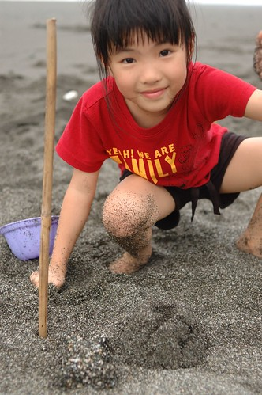 做了兔子蛋糕的愛愛好是得意  我們一家子獨享這片寧靜的沙灘 小人盡情的玩 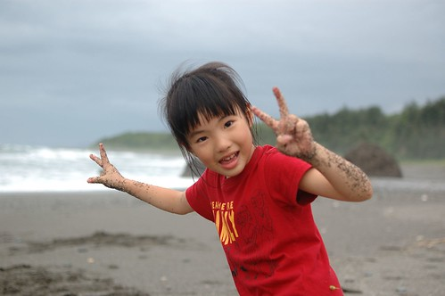 而大人則盡享這些美麗的畫面 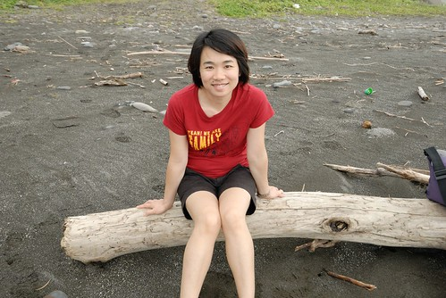 我忍不住在沙上寫下這屬於我們的回憶!  只有螃蟹知道的回憶.... 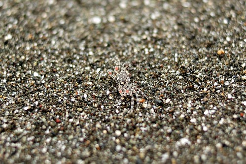 快到七點的吃飯時間 我們依依不捨的離開這片沙..  看不到夕陽的東邊 此時天空卻依然美麗 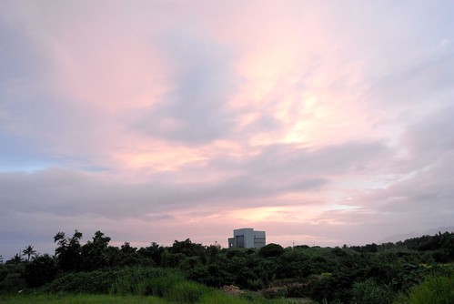 我一直很嚮往看著太陽從海平面升起的畫面 這一回都住到海岸線了 離太平洋這麼的近 不管怎樣累都該早起看日出 只是手機鬧鐘設定的4點40分響起時 外頭天空的雲一層疊一層 沒經驗的我以為日出時間到 太陽必然會從這雲層裡蹦的跳出來 一心想走去昨日的沙灘看日出 可是徹爸說"雲層這麼厚不會有日出" 他還問"你有沒有看過失敗的日出.." 看日出經驗太少的我聽的只能歐 歐 歐 也只好放棄走到沙灘看日出的雄心壯志 不過我還是不死心的打開房間大窗戶看天空的變化 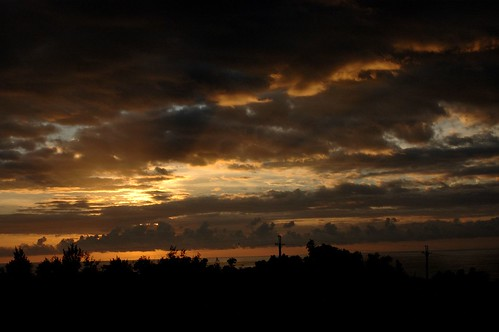 預測的日出時間到 太陽慢慢的出現了 不過不是從海平面升起的出現 而只是突然從雲隙間透露出他的光芒 這或許就是徹爸說的那種失敗的日出吧! 泣~  看完日出 我們又窩回床上睡回頭覺 直到八點起床準備吃九點的早餐 往餐廳的路上 我們仔細的駐足觀賞汽車通道牆面上的彩繪 很有當地色彩  前一晚只有兩組客人入住 但今早倘大的餐廳只有我們用早餐 我們彷若包廳似的獨享主廚的款待 這是前菜 寒天  綠扁豆湯 可惜徹愛的台式口味很難接受這樣歐式湯品  包含吐司 蛋 薯泥與X豆的主食(特別問了這豆子的名稱 我還是給忘了) 主廚說因為這邊很多單車環島的旅人住宿 所以早餐吃豆子特別有營養 而果然我在吃掉自己的一份早餐再加上阿徹那碗湯後 肚子飽足的快爆表(跟吃很多東西的撐不一樣)  這是份簡單但看的出功力與用心的早餐 可惜我們家小人們不習慣 不過徹愛還是有努力的把不喜歡以外的東西吃完 尤其張小愛清了四盤的果醬  期間我看到正吃著早餐的愛愛 桌底下的一雙腳交叉著晃阿晃 悠閒的很是有趣 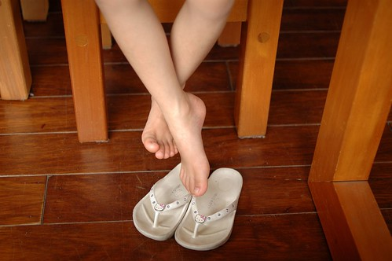 吃完早餐後 我們好好的在餐廳內東走西看 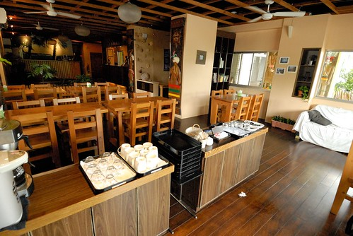 簡單的裝置擺設與原木桌椅很清爽 尤其光是穿透的 風是流通的 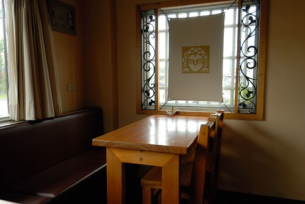 而我們的早餐就被安排在這最棒的位子  坐在外頭緊臨著台11的長椅上  用著自然光看著有趣的書是種享受  而同時間 吵著要再去沙灘玩沙的愛愛則賴在沙發上 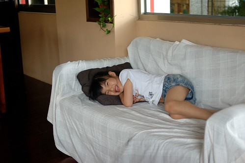 敖不過愛愛的要求 加上我自己也很想再一次近距離看太平洋 我們母女倆頂著上午十點的烈日 勇氣可嘉的往沙灘前進  結果原本打算待在餐廳愜意看書的父子倆 不到10分鐘時間便也改變心意跟著我們來了 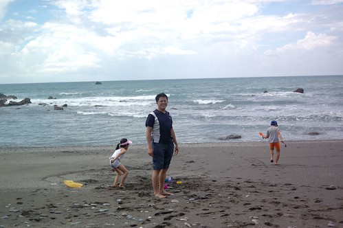 除了不准太走進海裡外 徹愛今日沒有上限 可以盡情的玩  而我則撐著徹爸貼心拿來的大傘 延續前一日的看海 其實我喜歡看小孩子玩沙遠勝過自己玩沙 也或許該說我是享受能讓小人們這樣開心玩沙的幸福吧  前一日風箏放的不夠盡興的徹爸 今兒個輕而易舉的就把風箏放的高高  風箏直挺挺的飄在太平洋上方的藍天白雲裡 多了個風箏的沙灘更是詩情畫意了 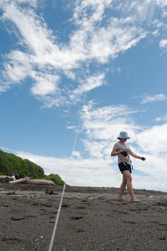 雖然太陽看起來很大但風是涼爽的 出乎意料不覺得熱的我們更是不顧忌的 盡情遊戲著 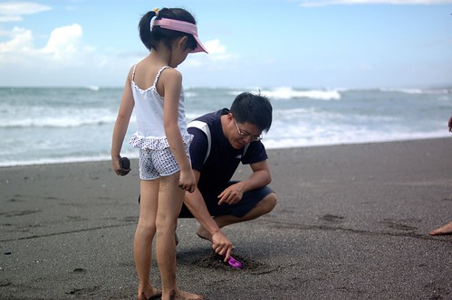 父子三人玩著藏寶遊戲  東挖西藏原來還真不好找 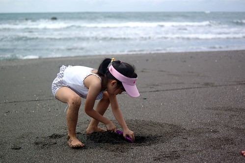 父子倆玩丟石頭遊戲 徹爸拿手的小時後遊戲讓阿徹輸的哇哇笑 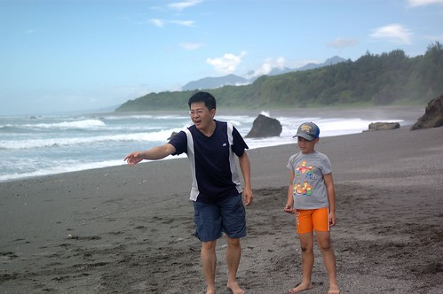 我們開心的完全不顧太陽的毒手  放肆的曝曬(結果平常懶得敷臉的我 回家第一天就敷臉)  有過這一次的經驗 我以後再也不怕夏天的旅行了 以後以後一定要在夏天再來花東玩沙看海  我們玩到11點的退房時間都過了 卻還是捨不得離開 明明是要去洗掉手腳的沙子 我們卻又在岸邊享受那一次次淺淺的浪潮  徹愛還把自己的腳埋進熱熱的沙子裡 然後等著浪過後的滔盡 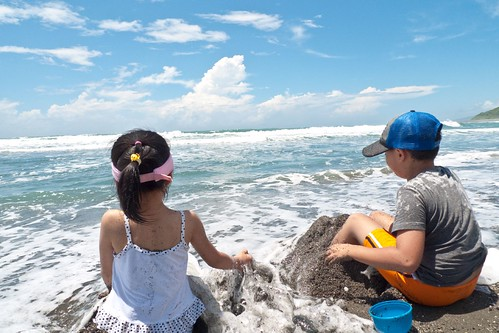 徹愛隨著一波波的浪花 吱吱叫 呼呼笑  突然 在後頭的徹爸喚我們 要我們一起舉手比向右前方 哇～搞sense哩 不過我喜歡這Fu  夠了 夠了...再不退房 民宿主人可能要報警處理了 頂著接近12點的太陽 我們要從太平洋的秘境沙灘告退了 縱使依依不捨~~~ 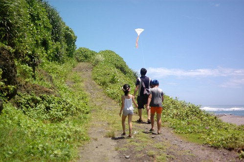 

補充: 六月初訂好房間後我便一直盤算著屆時要留晚餐還是隔日中餐在加走灣吃廣受好評的Nick主廚料理 想說等到快出發前再決定再訂餐即可 結果等到出發前兩天打電話去加走灣訂餐時 得到的消息竟是因為主廚夫婦七月起要開始進行半年的修業 因此不再提供供餐 啥咪...................... 讓人好失望阿... 不過換個角度想 起碼這回我們還有吃到主廚精心料理的早餐 再晚個兩天就真是什麼都沒有了.... 話說Nick主廚真的一看就是很有想法 個性的年輕帥主廚 而且連徹爸都稱讚是難得看見的彬彬有禮廚師 希望以後能有機會再嚐到Nick主廚那聲名遠播的好廚藝~
