去年中看到公路局書籍"相邀來去台9：山海相隨的475公里" 的相關出版消息 才知道原來每次我們去花東最愛走的台九有這麼長... 北起台北市中山南路 南抵屏東楓港 全長共479公里 貫穿大半個台灣 往宜花東必經的北宜公路 蘇花公路以及南迴公路全是它的範圍  難以想像的大 而沿途居住著各族群的不同生活文化呈現以及變化多端的天然景致讓台九也是全台最美的一條公路 每次在花東的旅行 徹愛總偶會哀嚎著"坐好久的車" 而原先一開始熱切欣賞的海景或稻景也總會因為看了太久而嘀咕著"都是一樣的風景" 雖然我總笑他們"小孩子不懂得欣賞"甚至還會叨念一番 但我可以理解他們這樣的年紀 這樣的"城市"小孩 對於"沒什麼"風景的沒耐性 只是我跟徹爸還是好喜歡開車走在台九線上的悠閒 尤其在出蘇花公路的那一刻起.. 所以孩子們~ 我想直到你們長大獨立前 應該躲不掉每年陪著我們來台九兜風的這"責任" 也或許好些年後 我們可以一起騎著單車在台九上 從花蓮的頭到台東的尾 相信到時後你們必然更能體會台九的豐富樂趣與多變美麗的~ 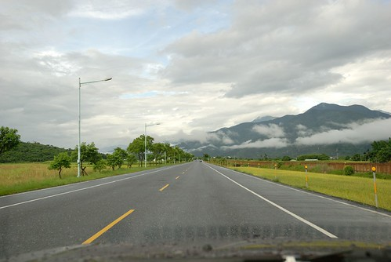

很多人想到花東玩但想到蘇花就怯步 雖然我們也常很擔心蘇花的落石但照我家司機老張的謹慎"慢駛" 老張說"其實也還好啦" 尤其在國道五號通了後 省了北宜公路這一段 只剩下1.5小時的蘇花山路 台北到花蓮的距離已經被大大拉近許多  只是我們家愛愛的易暈車體質 讓他總是被蘇花折騰的憔悴 那天上路後 愛愛照樣要發揮她上車就睡的本事 但被我們阻擋著要到宜蘭後才能睡 以免太早睡太早醒 最終難逃山路折磨 結果不小心暈車藥吃晚了 精神也亢奮的過頭了  清醒的愛愛一進蘇花不到三分鐘就臉色慘白 十分鐘後抓兔子 每次山路上 看著愛愛白著臉 拿著塑膠袋  努力的讓自己睡著的模樣 就覺得這小妮子真是堅毅  趁我們都睡著後 老張才能不用顧忌 盡情的甩尾趕路 通常我們一覺醒來都已經過了和平快到太魯閣了  精神飽滿也活跳跳了  今天的太平洋很美麗 不論是海水還是天空  我們忍不住停在匯德隧道前看清水斷崖  真的很難想像前人到底是怎樣鑿出這條路的 讓人們山裡來山裡去  大中午的太陽很曬 但恢復元氣的愛愛還是開心的跟我們一起下車看海 拍照 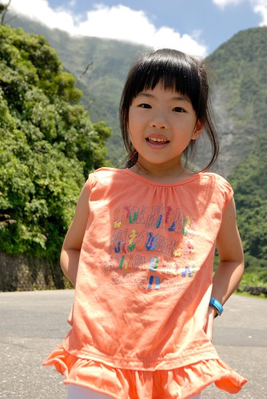 愛愛幫我們拍的合照 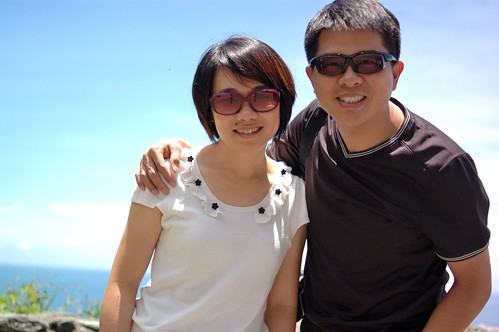 拍完還好好檢視一番 而且還會用小手遮光一下 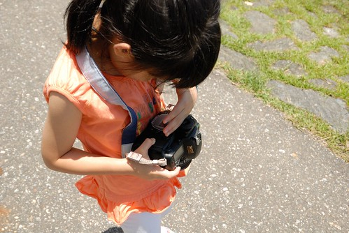 每次車子出蘇花後 速度就會開始變緩 緩到我總忍不住問徹爸"速限是多少阿" 或許這是徹爸從蘇花出來後的休憩 喘口氣吧! 也同時是我們旅行正式開始前的情緒醞釀  台九縱貫東部的33個鄉鎮市  每個鄉鎮各具特色 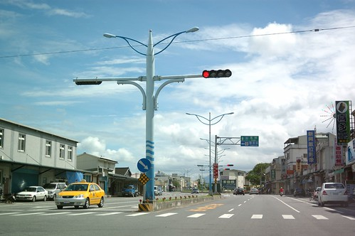 我喜歡離開花蓮市後 越往南越開闊的視野 也許真的就如阿徹說的沒有什麼 但映入眼裡的每個山景 每朵雲 時刻都在改變阿 而為了讓更多的人可以愉快又安全的騎著單車倘佯花東 一段段的單車自行道正漸漸串連起  不過台九雖美 縱橫花東縱谷間的縣道/鄉道卻又更勝一籌 例如193 197 花75... 行駛在這些縣道上 我跟徹爸總忍不住沿途讚嘆著"這騎車一定更棒" 但偶來的起伏山路卻又讓人不得不打退堂鼓 不得不承認"騎台九才是正道"!

既然最初的目的是要看稻穗 那當然不能錯過193的瑞穗玉里段 因此在瑞穗 我們從台九切走縣193 順道繞進吉蒸牧場買牛奶糖  牛奶糖是旅行中的誘餌與補充丸 尤其是新的薄荷綠茶口味 總能讓疲憊的徹愛頓時活力回升 愛愛笑說這是口香糖 後來在初鹿 愛愛也有買牛奶糖回去請同學吃 結果初鹿牛奶糖被愛愛批評了一番 小妮子的嘴真是也越來越挑了...  坐那麼久的車 徹愛也剛好在這短暫跑跳 舒展一下  看到牧場旁的稻田 徹爸笑說"看到稻穗了 可以收工了" 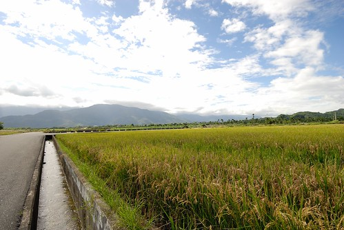 當然不滿意只有這樣田的我只好努力的巴結徹爸 幫他拍照跟他說"爸爸好帥 人最好了"  真是難為一家子這樣陪著我一趟趟的來花東 你們是最棒的遊伴! 

原本擔心的颱風沒來 反倒讓今日的天空特別美麗 比起萬里無雲 有雲的天空更顯豐富美麗  一家子來過幾回的193瑞穗到玉里段  不陌生到哪的稻田最美麗都知道  只是沒想到新聞上聽了好一陣子的嘉南伏稻 想不到在花東也這樣嚴重 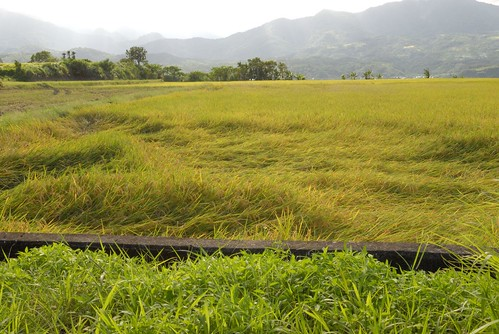 東一塊 西一塊的採收後的稻田 感受的出農人急於搶割伏稻的焦急 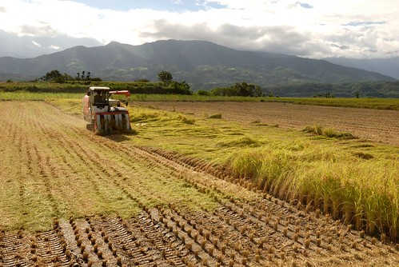 趁著稻穗長芽前收割起碼還能賣個價錢  以免大半年的辛苦都付之流水了 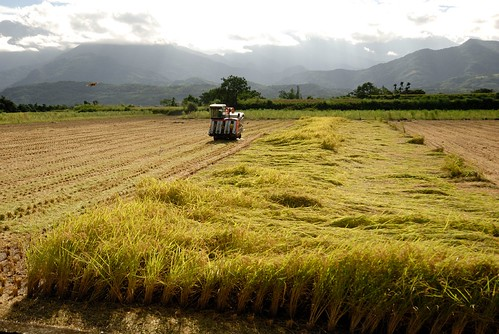 農人們辛苦了 我們能做的就是珍惜餐桌上的每一口飯菜 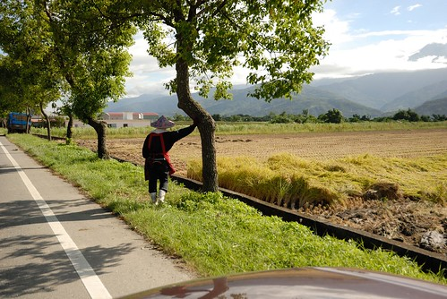 這是難得的沒有東缺西補的一片田  很美麗的景像吧! 我跟阿徹說"你看 不同時節的稻子有著不同的美麗"  阿徹有體會到 但應該還是很難理解為什麼每次媽媽來花東都說是來看稻田 不懂沒關係 有好心情陪著媽媽就好~ (其實是牛奶糖讓徹愛接著的旅行有好心情) 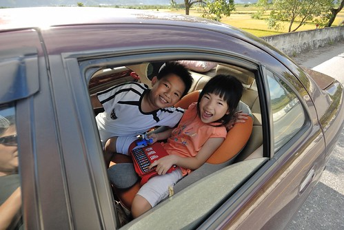

193到玉里後 我們接著台九繼續來到聽說也是賞稻絕佳點的東里車站  我們走上月台 期待一片大景  可惜放眼所見 八九成都已收割  我難掩失望 (不過雲還是很漂亮)  但是接近傍晚時分的風 吹的人好舒服  沒有汽車熱氣 從山裡吹來的風是這樣的怡人  人被風吹的茫酥酥 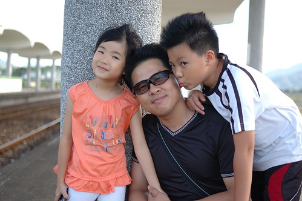 愛愛開心的忍不住手舞足蹈 來個她最拿手的朝天凳  在台九上 拜訪這樣的小車站總能讓人有意外的收穫 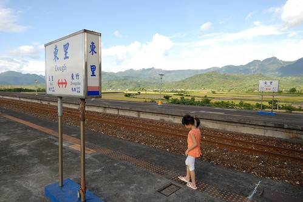 車站也可以是旅行的景點!  離開東里車站 也總算結束我們今日的趕路(平心而論 要一天從台北到玉里是真的很衝) 回到我們今晚下榻的安通溫泉飯店 泡個好湯舒緩一家子的疲憊 

第二天早上八點 當我們從玉長公路上的安通溫泉切回台九時 立馬被遠方的山景 雲景給振攝了  這裡的雲感覺好低 好連綿 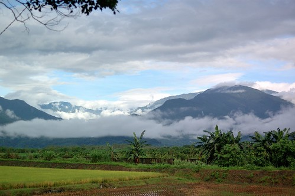 雲好像住在山裡... 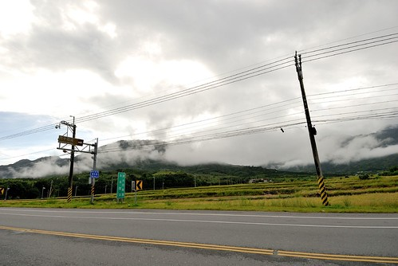 一大早就能開在這樣的公路上 愛睡蟲絕對跑光光 因為要睜大眼仔細看著沿途的一草一雲一景  台九除了有最險惡的蘇花公路 還有台灣最直的公路 從關山的德高至鹿野的武陵  共14.5公里沒有彎曲  如果看空照圖 就像是一條筆直的尺  天氣不好加上我的手拙 沒能照出這段路最美的視野 下次再經過這裡 我們肯定會更做好準備 拍下最直最美的畫面  這回我們的台九就只走到鹿野  接下來的路當然一樣豐富美麗 真的! 放慢速度開一趟花東縱谷 絕對會讓人愛上台九的 愛上那個沒有什麼的花東
