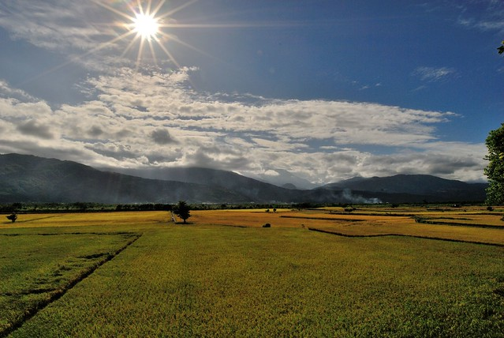

對我來說這是一次多出來的旅行 一來徹家一年一次的大旅行coda早已在一月使用了 再者每次夏天旅行曬暈的我總會惡狠狠的說"再也不要大熱天出遠門" 但因為花東今年第一期稻作的收割時間較晚(原先應是七月初才割的) 讓想看稻穗的我還是決定頂著熱浪 冒著颱風風險 去花東兜風~ 結果沒想到花東的夏天比台北的宜人許多 尤其早晚的徐風讓人身心好舒服 而夏天的太平洋也翠綠閃耀的令人難以忘懷 那是只有這時節才有的美景 只是心心念念的稻穗卻因之前的豪大雨而亂倒一通 我跟徹愛說"這回沒看到漂亮的稻穗 你們以後勢必得再陪我來了"  徹愛哀嚎著... 而這時徹爸悠悠地說"就算看到 你媽還是會再來的" 我聽的哈哈大笑 無視無奈的徹愛早已昏倒在後座... 

這半年來我三不五時念著可以帶愛愛去台東來段池上關山的小而美單車旅行 沒想到等徹爸終於被我嚕的鬆口時 卻因為訂不到想住的民宿而只能作罷 我轉念想那來個墾丁之旅好了 國民旅遊勝地的國境之南 徹家成軍十年都沒去過實在有點說不過去 可是認真研究墾丁的房假後 嘖嘖嘖~ 三天就可以把徹爸公司一年的旅遊補助給用光了 這時候我們家的一家之主總算說話了"花不下去...我寧可去花東玩" 聽到徹爸這樣說可說是正中我的下懷阿 於是"那就開車去花東玩四天"拍板定案 旅行的初步規畫是到玉里看點稻穗 到長濱玩點沙 最後到花蓮散個小步 鎖定大致的下榻鄉鎮後 趕緊上PAYEASY訂房查詢(這回目標住宿完全透過PAYEASY 節省住宿成本) 前兩晚的房間一來非假日再者偏僻 所以雖然都是唯一指定的旅店但都沒問題 可第三晚剛好是暑假的第一個週末加上是大熱門的花蓮市 煞費我一番苦心才好不容易找著環境與價錢都適合的 等到一切查詢完成 我再請工作忙碌的徹爸做最後的PAYEASY訂房 徹爸訂好房時跟我說"你讚 你真的有行 竟然都有房" 哇哈哈~ 徹爸難道不知道這是我這幾年發展出的第二專長嗎 (這兩年常有人問我花蓮台東哪好玩或是幫忙規畫行程 其實這些問題都非常難回答 因為花東真的很大 點很多 而且旅遊的型態很多樣 加上徹家喜歡的路線不見得真的適合不常去花東的人(點跟點間的穿連對我們來說就是在玩) 所以我會建議大家先有個初步構想 想看什麼? 想去哪些鄉鎮? 再來安排行程而我們也才好推薦民宿或是好吃好玩的)

最後的行程如下: 第一天(四) 台北 -> 清水斷崖 -> 新城檸檬汁 -> 花蓮一碗小麵食 -> 壽豐豐春冰果店 -> 瑞穗吉蒸牧場牛奶糖 -> 193縣道 -> 東里新站 -> 玉里藍色小山&橋頭臭豆腐 -> 宿安通溫泉 第二天(五) 玉里 -> 池上大坡池 -> 鹿野高台 -> 初鹿原生植物園 -> 玉長公路 -> 長濱 沙灘 -> 長濱100 -> 宿加走灣旅店 第三天(六) 戲沙\-> 長濱100 -> 真柄部落梯田 -> 八仙洞 -> 尋找思樂冰 -> 芭崎瞭望台 -> 花蓮時光二手書店 -> 小一點洋行 -> 自強夜市 -> 宿漂亮生活會館 第四天(日) 花蓮拜訪老師家 -> 石雕博物館 ->蓮香麵店 ->廟口紅茶 ->七星柴魚博物館 -> 新城檸檬汁 -> 台北

雖然因為想去露野高台看熱氣球 以及去原生植物園吃個野菜鍋 比一開始計劃的多開很多車 前兩天的天氣也因為可能的颱風而稍微攪和了 但這樣的"兜風"行程讓我們看到多變的山景與海景 也沿途亂七八糟吃了一大堆當地小吃美食 雖然有時後有些小失望 或是小感嘆 但也有很多意外的驚喜與歡樂 每一次的旅行 我們都做足準備 不論是背包或心情 每一次的旅行 我們都滿載而歸 不論是車廂與內心~  最難忘在長濱的情人沙灘上 徹愛玩著沙 踏著浪的模樣 看到阿徹怡然的模樣 愛愛開心吱吱叫的模樣 這就是百分百夏的滋味阿 我想我愛上夏天的小旅行了~ \[youtube https://www.youtube.com/watch?v=9oHI\_\_7Ne\_Y&w=560&h=315\]
