這回行程賞了稻也看了海 剩下的就是在花蓮的小散步 小休息 講真的來過花蓮上十回 實在有點不知該如何打發在花蓮的一大日了 雖然花蓮市很繁榮很人文 但總覺得她的風采就像嘉義市 這樣的城市 少了吸引我們的那份清閒 尤其在搶搶滾的暑假旺季時 不過鬧中總有取靜的地方 也總有意外的小發現 小驚喜... 

下午四點到達花蓮市後 我們先去今晚住宿的旅店check-in小憩 這回下榻的是應該算是商旅的"漂亮生活"  老實講這是個讓我下意識不會想住的名字 但當我查遍PAYEASY上所有商家後 這裡是少數還可以訂到房的商家中 價位上 房間佈置上剛好可以適合我們的  於是我們來漂亮了!  漂亮的所在挺奇特的 就在一棟類住家大樓的一~二樓 如果不是倘大的招牌 外觀一點都看不出這裡是飯店(也許商旅都這樣 是我們大驚小怪) 不過從踏進大門起 不論是空間 服務與房間竟出乎我們意外的讓人心情很漂亮 果然是漂亮阿! 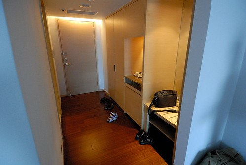 乾淨的木地板 舒服的兩張大床 讓徹愛一進門就開心得哇哇大叫 直問"這裡是五顆星的嗎"  雖然真的不是有星的 但這樣的簡單與舒適對我們來講是很剛好的 我們舒服的睡了個覺(當然是我跟徹爸) 看了個卡通(小人嚕) 然後神清氣爽的開始我們在花蓮的小散步  這回的散步 走的是很潮流的人文路線 第一站是時光二手書店  轉個小巷後的好個鬧中取靜  尤其老房子的氣質很迷人  店內的前端為一些人文雜貨的販售  主要則為分門別類的二手書販售 徹爸認真的找尋二手CD 看到好多我們學生時代的歌 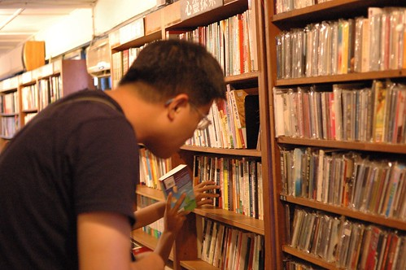 小學生阿徹也認真的尋找美勞書 童話書 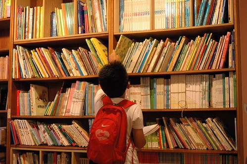 愛愛則若平日逛書店般的找童書東翻西看  一家子各自認真的找書著 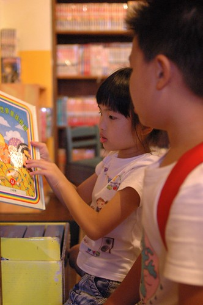 這裡的書都經過好好的整修清理  所以雖然舊但看起來還是很討喜 如果有喜歡的書 能以原價五折甚至更低的價錢買到 真的就有如尋到寶一樣 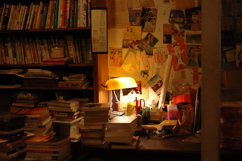 店內的童書區以及最裡面的閱讀區都有座位與茶水的提供 但行前看到網友寫說每個位子都有最低的飲料消費 作為對店家的支持與贊助 因此我叮嚀著徹愛不可以坐椅子喔 因為我們真是抱著逛書店心態來 而不是去咖啡店享受氣氛而已  最後我們用著令人超開心的價錢總共買了六本書  而當中折扣最少的是這N久年前版的老夫子 當我看到這印象中的老夫子時 開心的喚只看過現代版但喜歡老夫子的阿徹來 阿徹開心的巴望著能把所有(五本)的老夫子買回家 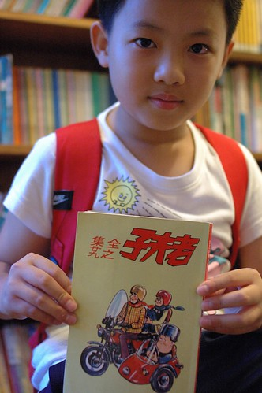 雖然最後只給了他一本的CODA 但阿徹也是夠心滿意足 接下來的一天以及回家後常可見他拿著這老老的老夫子猛看猛笑 而且特喜歡的 還會要我一起看以分享他的歡笑 後來一陣子阿徹又被有的沒的書嚇的不敢睡覺時 徹爸笑說"阿徹果然是看老夫子的 打電話去給老闆 把所有老夫子都買了" 下回再去花蓮 我會好好考慮這件事的! 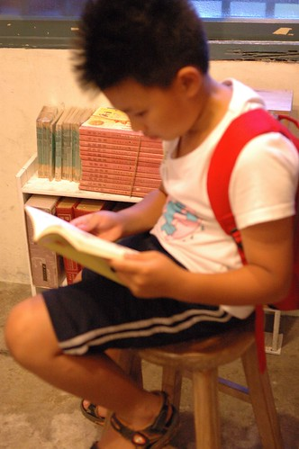 不過就算不買老夫子 這裡也真是個會讓人再想光顧的好書局! 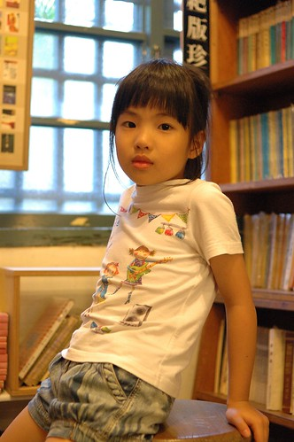 在時光待了一小時後 接著我們來到璞石咖啡館對面的小一點洋行 這是在O'rip上看到的店家 販售著當地或各方用心製作的好物 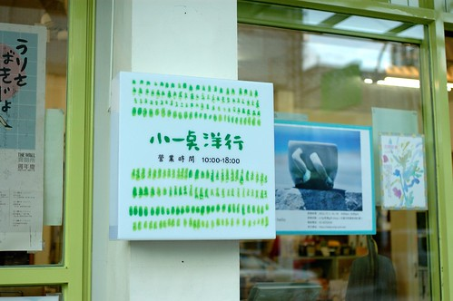 不過與其說是販售雜貨 我覺得更像是一種生活態度的傳遞 而在這我買到了喜願的台灣麵粉 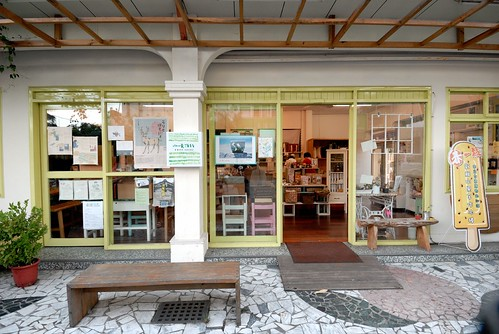 離開小洋行 緊接著我們又去了格友推薦的一家生活雜貨鋪  只是我們小失望的匆匆離去 這幾年 隨著許多的新移民以及一種說是風潮但也可以說是喚醒的氛圍 花蓮市內越來越多類似這樣的販售小物的雜貨店 生活店 但老實說 有些店給我的感覺有點薄弱 或是超俗的似乎是叛逆 不過我還是期許與肯定這樣氛圍所帶來的社會溫暖與改變

下午六點半 月亮已高掛夏日天空 但天還是亮著的  此時我們來到自強夜市繼續散步著 講其實我跟徹爸是很怕夜市人潮 也向來吃不太慣夜市的重口味 但來了這麼多次花蓮沒來過自強夜市實在有點對不起花蓮 所以帶著花蓮旅人誌的自強夜市攻略圖 我們來勇闖自強夜市  夜市的人真的好多 規模與食物美味性也比想像小很多 但兩個小時闖蕩下來竟也肚子飽 心也滿  尤其等待烤肉時 意外玩夾娃娃夾到小雞的阿徹更是開心的不得了 更是加深了他對於夜市向來的好印象 "逛夜市真是太好玩了"  逛完夜市回到旅店 邊看棒球邊吃烤肉 結束好個觀光味的花蓮夜晚  而徹愛都入睡後 徹爸泡了杯茶看起在時光買的書 更是愜意到最高點 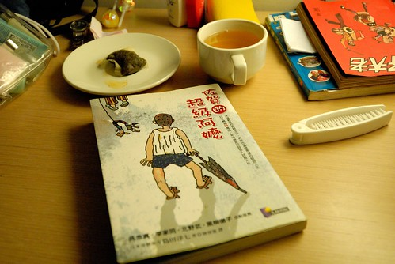 旅行的最後一天 沒有必須的行程安排 我們更是睡到自然醒 醒來後拉開窗簾 窗外又是好個藍天白雲大熱天 讓我們更是慢動作的享受在漂亮的停留  直到等到徹爸欲罷不能的看完書後才離開 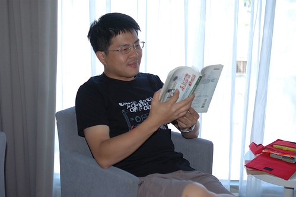 原本安排的花蓮行程在前一天幾乎都走光了  所以今天幾乎快是漫無目的在花蓮晃蕩  所幸天真的阿徹堅持要打電話找放暑假而應該回到花蓮的班導 於是我們一家子意外的散步到老師家去了 而且還跟老師的爸媽相談甚歡 這意外的插曲更替我們這次旅行留下特別的回憶 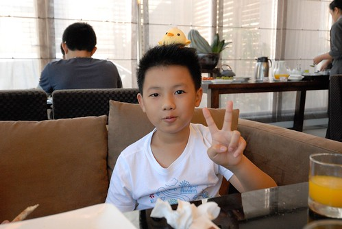 在老師家時 老師爸媽推薦了我們好多個花蓮的景點 而我們的回答幾乎都是"去過了" 想想我們似乎真有那麼點誇張... 不過每次的往返南花台東之間 總是會忍不住想在第一天或最後一天在花蓮休息一下 那是旅行情緒的準備或蕩漾  為了打發至午餐過後返北 我們的散步來到石雕博物館 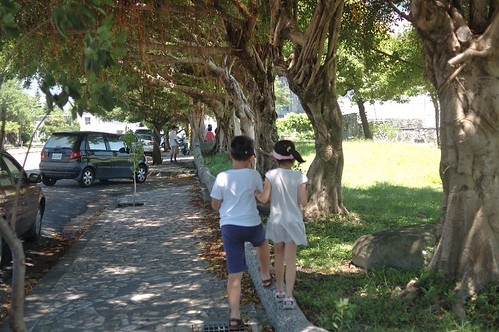 雖然博物館又讓我們有種雷聲大雨點小的小錯愕 但裡頭的石頭真的有漂亮 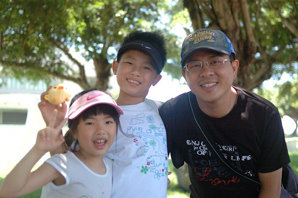 只是我們呆在館外公園的時間比館內還多  公園裡 徹愛盡情的陽光著 這才是我們家最擅長的事  把握最後的時間 好好大口大口呼吸花蓮的空氣 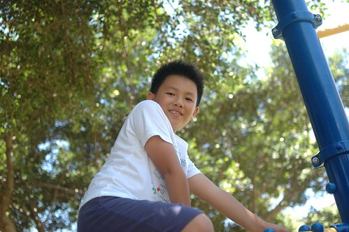 享受後山的徐徐微風~ 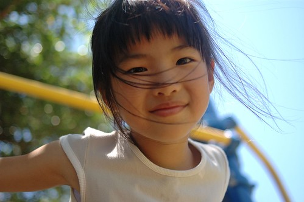 散步到中午12點 訪了兩家名氣不算小的店 吃完中餐 我們的旅行就只剩最後進蘇花前的七星柴魚博物館 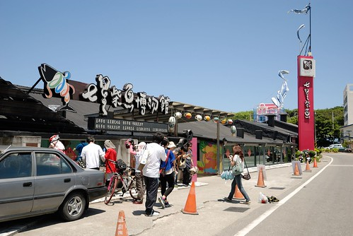 好多年沒來這了 這裡果然如聽說的變了很多 遊覽車好多 遊客如熾 而門口正前方大剌剌的快速道路工程更是顯得那樣格格不入  只是沒想到這裏竟還是有鬧中取靜的地方  就在三樓的影片區 只有我們一家子靜靜的獨享這柴魚的介紹  買了包為他專程而來的柴魚後 也結束了我們的小散步 這回的兜風旅行! 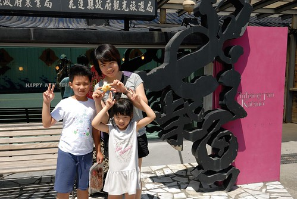 算是PS. 吧: 我最後還是忍不住想分享在長濱100時看到的這張海報 發展越多 開發也越多 好的事物越來越多 不好的東西也一直跑出來 台北只有一個 誰也追不上 花蓮台東也只有一個 誰也沒法比他還獨一無二 就讓他依最適性 最自然的方式發展吧 總會有懂得她的美 她的好的人 而且勢必會越來越多... 
