這週訂了一箱花蓮柚子 而今年的第一波東北季風也到來 夏天好像真的快結束了~ 這個夏天似乎挺忙碌但又好像很平淡 唯一能確定的是這個夏天玩很少 沒有熱氣球 沒有單車 沒有溪邊烤肉戲水 沒有外澳沙灘... 讓人心裡總有那麼點期待與遺憾 然後 最後 期待明年的夏天~ 這是一篇其實很沒點的流水文但棄之又可惜 卻總算在今兒個下雨天 適合寫上一筆 作為這個夏天的結束~

自從去年嚐過新城的檸檬汁後 炎炎夏日來到花蓮怎能錯過這酸酸甜甜的好滋味 冰菓店鋪一樣的小舊 但人氣更是鼎沸了(店內可是滿滿人潮) 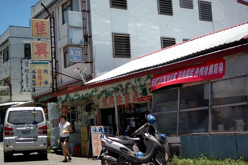 兩杯檸檬喝下肚 讓人扎實的感受自己來到花蓮了 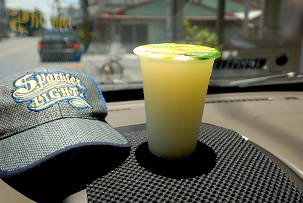 

行前上網作了些功課 找了幾家麵食館作為停留花蓮的用餐選擇 第一餐來到專賣牛肉 羊肉麵的"一碗小" 來嚐嚐這一碗到底有多小 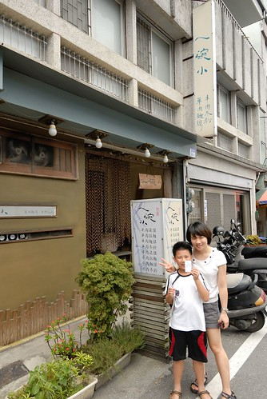 麵還沒上桌 但小菜就已讓人感受到店家的精緻與堅持(第一次吃到排列整齊的豆干) 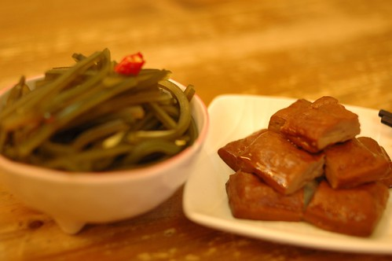 徹爸擔心一碗真的太小 於是點了個大的紅燒牛麵肉 吃到最後才明白那一碗"小"其實真的比較恰恰好 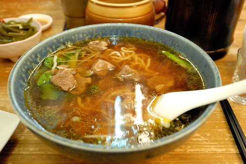 阿徹的正常尺寸紅燒羊肉麵 一碗其實不小阿 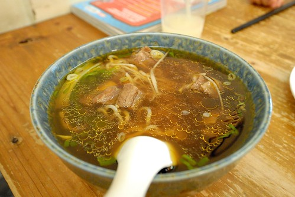 難得且第一次吃到羊肉版紅燒麵的阿徹 吃的不亦樂乎 整碗吃光光 喝光光 喜歡到最後一天來到花蓮還嚷著要再去吃羊肉麵 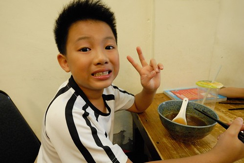 我的正常版清燉牛肉麵線 湯清爽甘甜的令人難忘 同時也讓人意猶未竟的覺得這一碗好像太小了 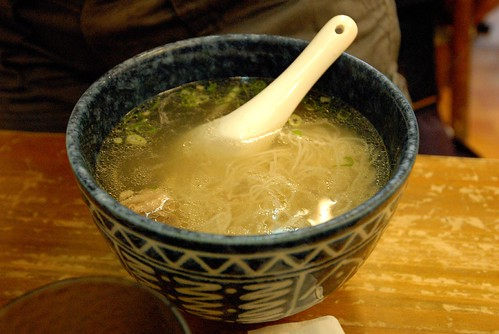 飯後共享的古早味粉圓 沒有冰塊 沒有透涼 但是小時後那甜甜軟軟 滑溜順口的粉圓湯沒錯 O.E.C. 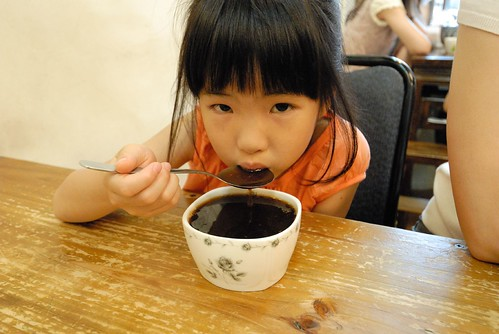

離開花蓮市區往南行 雖然肚子是飽的 經過壽豐時還是忍不住繞進火車站前的豐春冰菓店吃碗甘蔗冰  真材實在的配料實在超值 但那底下的甘蔗冰才最是迷人 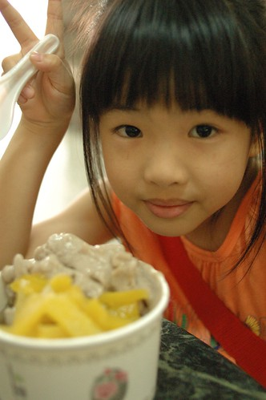 真的~ 一生一定要吃過一次的一碗冰阿 (正常的話吃過一次應該就也會愛上了) 

在玉里的那一晚 我們來到火車站前一家經營多年 在地的西餐廳 在地網友形容的"在小鎮 超乎想像與水準的西式料理" 我們還沒吃到食物 但光是看到門口的店招牌就滿是好奇與期待 "藍色小山" 好美但好是貼切南花蓮的名字阿 (那個店徽更是簡單卻明白阿)  一走進店內 很快就可以感受到店的時代與歷史性 就像徹爸說的小時後(國中老師請的)第一次吃牛排的嘉義故鄉牛排店  旅行在外 我們難得這樣正經的吃一頓飯 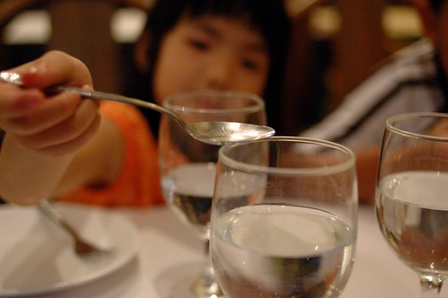 雖然似乎得有那麼點裝模作樣  但寧靜的氛圍加上黃燈的催化 一家子卻很是自在與放鬆  不知道為什麼 我一直特別喜歡玉里這個小鎮 或許因為寧靜 或許因為無聲(名) 或許因為平凡但卻不簡單... 而今晚坐在2-30年歷史(我們推估的)的藍色小山裡  我更深陷於這小鎮裡了  菜陸續的上桌... 組合出乎我們意料的前菜沙拉 簡單但有個性(蕃茄濃湯略) 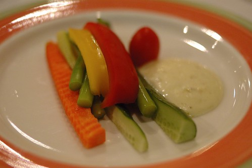 今晚身處於這樣西餐店 徹爸不管怎樣都想來一客的排餐  阿徹的焗烤麵 滿滿的鮮美與香濃  果真如網路好評的好味道 我們滿是驚喜與滿足的呼嚕呼嚕下肚 (忘了照我那超讚的蛤蠣麵)  吃飽飯足 走出店家後 我跟徹爸兩人忍不住再次讚嘆這(裡)怎麼會有這樣一家店 尤其還取了這樣(棒的)的一個名字...

我們想了一整年的玉里橋頭臭豆腐總算又吃到了 臭豆腐一樣的香酥好吃 但看到店門口擺了台取號機很是訝異 或許橋頭臭豆腐也如玉里麵般吸引了許多遊客來這吃碗麵 吃盤臭豆腐  這回我們大心肝的一次點了兩盤豆腐 果然那晚牛肉跟豆腐在徹爸的肚子裡搶地盤 但除了徹爸外 我們三個人依然覺得這裡的臭豆腐是No.1 

最後在花蓮的那一晚我們來到自強夜市 深愔我們家是很不擅長也很不容易融入夜市的 因此行前上網做足了功課 然後當日帶著印下的"花蓮旅人誌"的自強夜市攻略地圖前進夜市 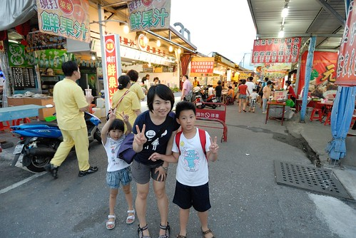 鎖定幾個推薦的攤也排好大致次序 我們有計畫的一家吃過ㄧ家 首先是棺材板  雖然搞了半天才了解有正宗與法式兩家之分 但真的好吃哩  外酥內軟的吐司加上熱呼呼的陷料 讓我們一開始就對自強夜市有好印象  接著第二攤是關東煮與創意香腸 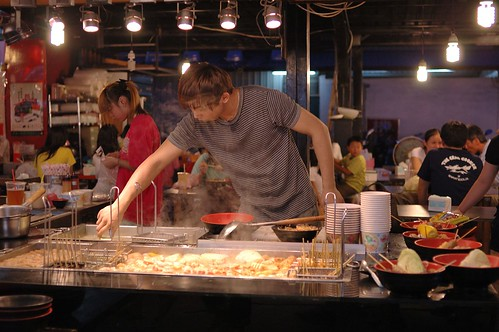 老實講排了很久又等了很久的關東煮  平常的讓我們很是失望 同時間人也被熱的逼出滿身汗 開始感覺逛夜市的艱辛  然後我們四個人兵分二路 徹跟爸爸去買烤肉而我跟愛愛去買現打果汁與糖葫蘆 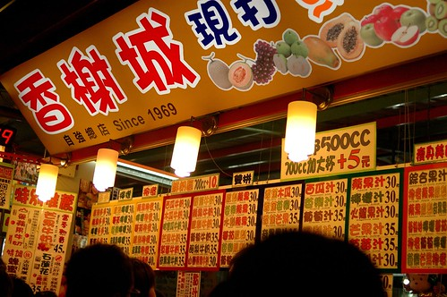 夜市內的幾家果汁店都大排長龍 果汁是真的比一般夜市好很多 但還是過甜且比不上家裡牌果汁  但糖葫蘆挺不賴 尤其賣像超佳 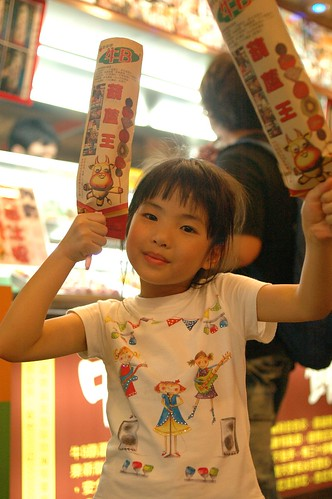 先不管味道 小孩光是能拿著這樣一支重沉沉的糖葫蘆 心裡肯定已是甜蜜蜜 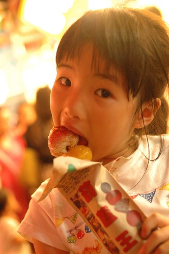 而再大口大口 想盡辦法吃著大顆大顆的草莓與番茄 吼~ 愛愛站在人來人往的夜市裡吃的說不出話 也不想說任何一句話 因為嘴巴要用來好好享受這讓她停不下來的糖葫蘆 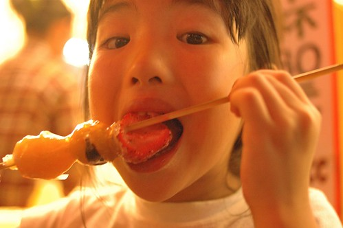 愛愛吃的滿手滿嘴黏呼呼 想必她今晚的回憶也已甜蜜 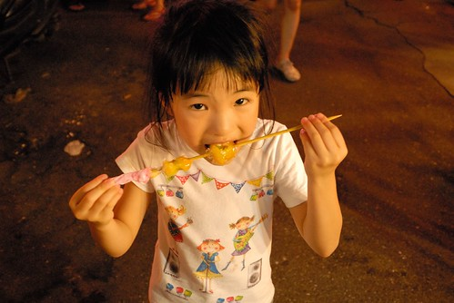 話說同時間徹爸那頭也正在為烤肉串努力著 最夯的那店得等候60分鐘 誇張的讓徹爸立馬就放棄  所幸另一邊略顯冷清的店也很是好吃  尤其在徹爸點完後老闆也開始喊著等候30分鐘 看來下次如果再來自強夜市 第一要務是要先去買烤肉阿  最後吃了盤蚵子煎後 拎著烤肉 我們離開了夜市 雖然兩小時的奮戰實在累人也實在沒吃到些什麼 但逛夜市其實好玩 只是我想我們家依然不擅長逛夜市 所以下次會再來自強夜市嗎 我猜機率應該很小吧...

離開花蓮回台北前的最後一頓飯 徹爸心念著上回好印象的禾禾飽滿餃子店 但到底還是被我指引到旅人誌推薦的蓮香麵店  滷菜不錯 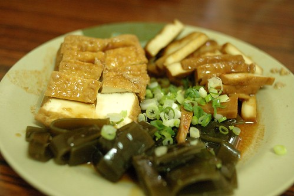 湯頭也OK 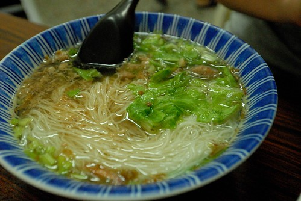 只是很像陳嬤店裡就能吃到的口味 讓我們有點遺憾沒去禾禾飽滿  尤其最後再去買了廟口紅茶那讓我們一家子都覺得有點怪的紅茶後 我們又更是愕腕沒去禾禾飽滿  想念那飽滿的餃以及透冰涼的好喝紅茶阿~~~  其實我慕名這鋼管很久了 只是也一直沒什麼強烈動機來就是了 不過今日一嚐後 我只能說可能我們家的喜好異於大眾吧 

最後離開花蓮前也總算讓徹愛喝到欠了他們24小時的思樂冰 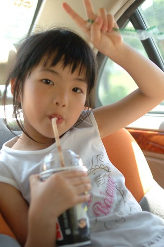 徹愛旅行的最後用思樂冰來ending  多麼幸福也多麼美好~  而我跟徹爸也在進蘇花前再來杯新城檸檬汁 一起完美畫下旅行句點~~~
