在台東第二晚下榻的地方是都蘭的來吹涼風民宿 兩三年前在網路上看到新聞的介紹後 我便一直記得這家民宿 期望有天能來吹涼風 後來在林黛玲的蓋綠色的房子一書 看到這房子建構的理念與故事後 我上民宿的BLOG瀏覽 然後幾乎從第一篇看到最後一篇 我喜歡民宿主人透過這房子所傳達的簡單生活哲學! 這是一個像涼風一樣 很節能但自然又怡人的民宿! 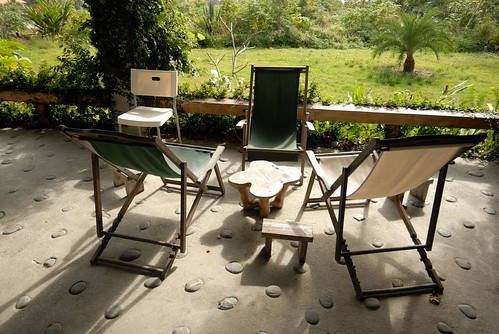

民宿有一館的來吹涼風與二館的再吹涼風 雖然巡民宿BLOG田水蠻久的了 但我卻一直搞不清楚一館與二館的差別 因此電話訂房時 當主人問我要一館還二館時 我很阿沙力的說"都可以 看怎樣安排方便" 可能考量二館的獨立性 民宿主人幫我們安排在二館 後來我好奇的上網仔細研究一二館的差別 也與曾經住過的玟姿了解後 我總算確認我想體驗的是更具原創風格與故事性的一館 過來人的玟姿還特別叮嚀我 那的廚房很棒 一定得自己下廚體驗體驗 於是在都蘭轉進民宿小路前 我們特別去了也是玟姿告知的山下唯一生鮮超市買晚餐的材料 (雖說是超市 但其實蠻像以前小時候在阿嬤家那的雜貨行啦) 往民宿的路就如前一晚在長濱那樣不是很大 阿徹跟愛愛頻頻問"民宿跟昨天一樣偏僻嗎" 其實那離山腳下的Seven 約莫5分鐘的車程距離 我真的覺得一點都不偏僻 只是房子果然也是像真柄老舍那樣 隱藏在荒煙蔓草中(其實那草也不是亂長的啦) 徹愛與徹爸三人一致結論"媽媽找的民宿都好偏僻 好奇怪 好有...特色阿!" 開玩笑! 阿母我可是平常就有在做功課的哩 而且難得這回開車到台東當然要上山下海 想辦法去我所想去的地方!

到達民宿後 我打電話告訴民宿主人郭先生我們到了 郭先生說門都沒鎖 我們可以直接進房子內休息 他晚些到 後來聽郭先生講起才知道原來這房子平日便都完全不上鎖的 他還說這裡的治安真的很好 我們可以體會一下晚上夜不閉戶 感覺很棒的 雖然那天晚上我們也真的沒有鎖上進出房子的落地門 但房間門我們還是不安心的帶上了鎖! 郭先生來與我們簡單的交待與聊天過後 便返回他台東市的家 把這裡完全的交給我們 這裡就如前一晚的真柄老舍 沒有電視 沒有吵雜 唯有靜懿 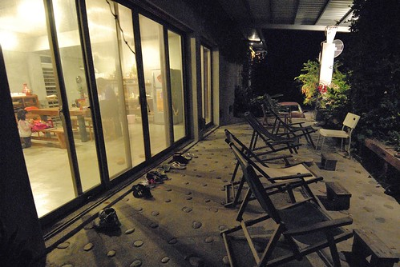 房子的配置為左右兩邊對稱 透過一個既是串連也是分隔的小走廊區分 每一組客人各自擁有一個包含有多功能客餐廳 廁所與房間的小天地 這是我們的那半邊 從中間走廊看過去 廚房旁邊依序是廁所與房間 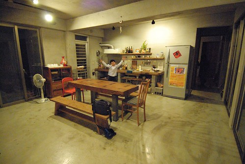 這是從廚房後門往正門看過去 我喜歡像這樣以一張大桌子為重心的活動空間配置 (阿徹正窩在中間走廊上尋寶) 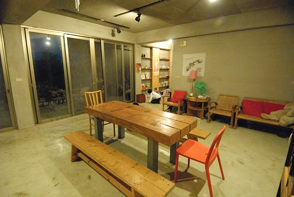 而左右邊客餐廳的一側也都有一排復古味的椅子排列著 是閱讀與小憩的好角落 (這是郭先生來之前 我們搞錯地在已經有人住的另外半邊溜達) 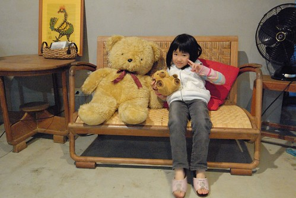 (阿徹尋寶發現像是都蘭書包的小冊子很是興奮 信誓旦旦的說他明日一早也要買個書包當都蘭國小小朋友) 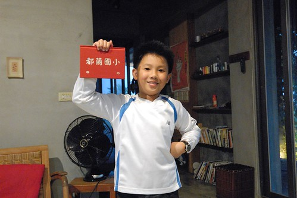 很棒的一個夜晚 有種回到家的感覺 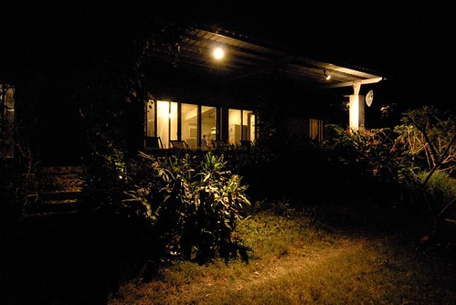 明明我們一小時多前才在東河吃了包子 徹愛看天黑便開始問著"要煮飯沒 好餓喔" 我深深懷疑他們可能是覺得這樣很像真人版的家家酒遊戲 所以特別的期待 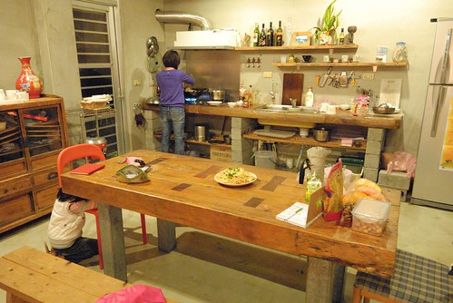 二館的廚房相對簡單 而我就是被一館的原木流理臺與大餐桌給吸引來的 雖然不是自己的廚房加上材料有限 很難大發揮 但旅行中能夠像這樣為一家子烹煮一餐的感覺很棒! 果然聽玟姿的話 "非得自己煮一餐 否則就可惜了"是對的 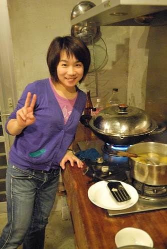 醬油拌炒的關廟麵 炒高麗菜 以及用東河包子的貢丸湯做湯底的玉米湯是我們今日的晚餐 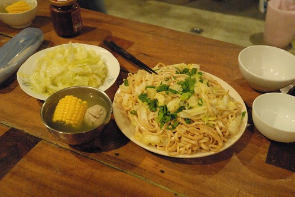 雖然簡單但我們吃的津津有味 (桌子旁還有一堆我們自備的水果與點心) 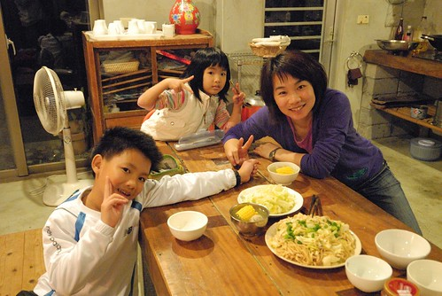 而吃飽飯後 再給徹愛玩點iPod小遊戲 小人們更是大大滿意! 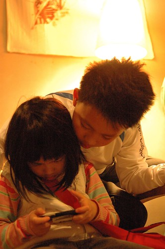 前一晚我們是用玩牌打發夜晚 今晚則是來盤大富翁的背包客自由行 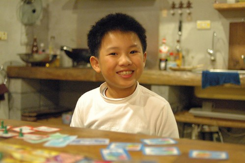 趁著我還在洗澡 愛愛代母出征 獨當一面玩一角 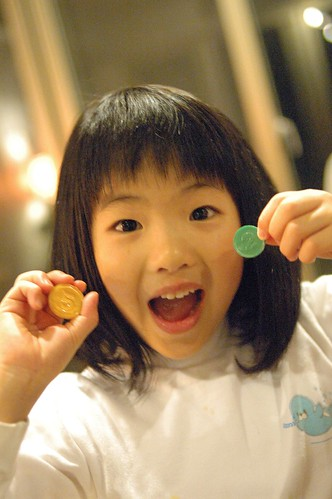 阿徹則好運氣的 在我才參與沒多久就達到一開始設立的獲勝分數 是今晚第一名 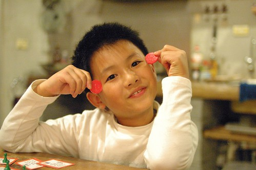 結束大富翁後 我們跟阿徹又來了幾輪前一晚另我們驚艷好玩的99 然後跟前一晚一樣 我們一家子又早早10點前就上床睡覺 結果半夜我跟徹爸睡飽醒來抓蝨母 Orz 徹爸說"今晚絕對不能再這麼早睡了" 我說"今晚民宿有電視 應該就不會這麼早了" 不過我們兩老半夜會醒來 最主要的原因乃是徹爸久未發作的氣喘竟然喘了起來 我很訝異在如此好空氣 好天氣的台東 怎麼會發生這樣的意外 但隔天早上看到我的睡褲上沾上許多的超小羽毛屑 我猜羽絨被大概就是徹爸犯氣喘的原因吧 所以如果要說對這民宿有什麼建議 我想用品質好一點的寢具是我唯一的中肯建議 幸好後來徹爸有壓住 有再好好睡一場覺 而隔日一早醒來 屋外陽光普照 我們也神采奕奕 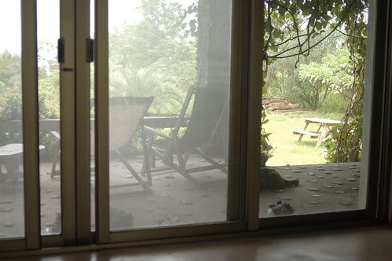 民宿未附早餐 得自己打理 偏偏前一晚買晚餐食材時竟忘了一同準備早餐 只好起床後 麻煩徹爸開車到山腳下的小7買鮮奶以及一些麵包 同時間 我也用鍋子蒸好前一天原本要當宵夜的兩顆半東河包子以及燒鍋熱水好泡茶  一如前一晚的晚餐 當我怡然的準備著食物時 徹愛就在一旁陪伴著 遊戲著 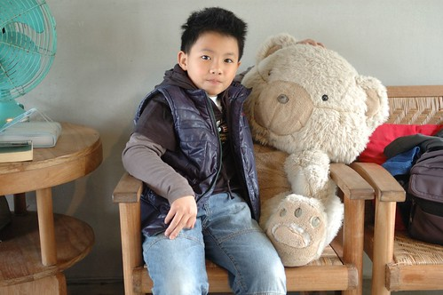 瞧! 睡飽飽的阿徹多有精神阿 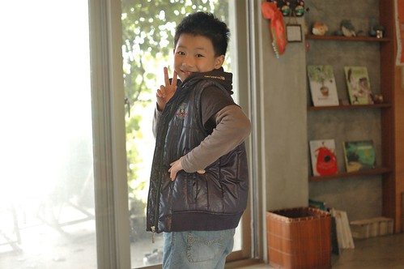 愛愛也是起床後就火力全開的當起他的都蘭國小小朋友 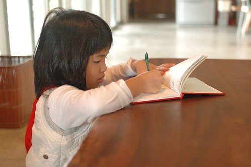 我們四個人圍坐在大餐桌 一人一杯牛奶 邊喝邊討論著今天接下來的行程 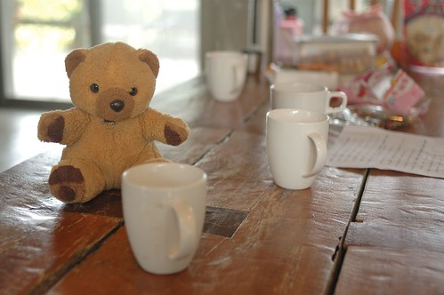 而早餐過後 我與徹爸端著我們自備的阿里山茶 坐在屋簷下愜意的喝茶聊天 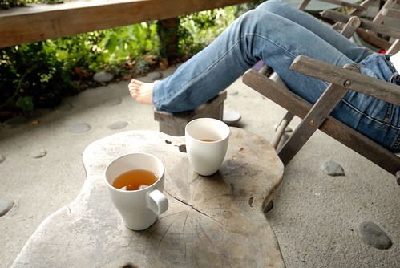 這又是一個適合放空的好地方阿! 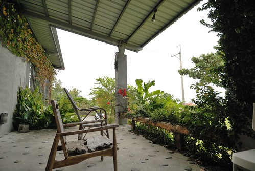 原本在屋內玩耍的徹愛也禁不住誘惑的跑出來跟我們一起空 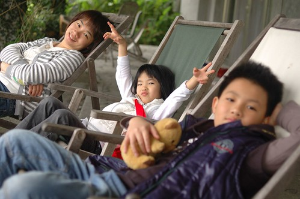 一人一張躺椅 坐著坐著眼神不小心就迷濛起來了 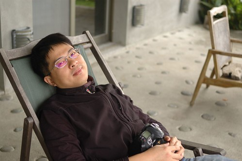 而還沒疲累的腳則神清氣爽又自在的透氣著 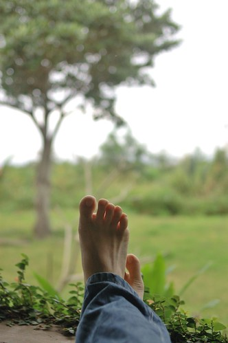 YA! 又是一個好棒的早晨開始我們的第三天 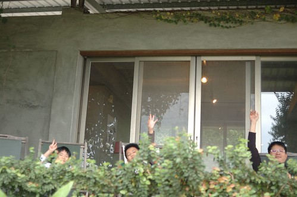 我跑到房子的前院好好駐足觀賞這屋子 這是生意盎然的屋子入口 穿過這綠門來到屋簷然後進去屋內 就如房子主人說的 這裡的陽光好 空氣好 每樣植物都長的好  短短幾年間便綠意爬滿屋 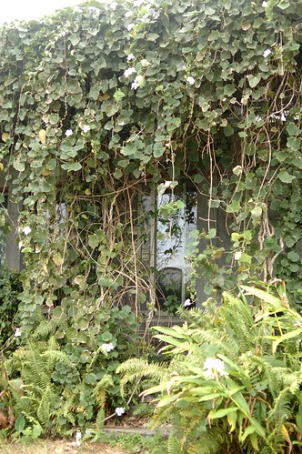 這是徹爸偷拍的前院 院子裡 在我附近的兩條黑狗是我們昨夜的保全員 看到我們搖尾巴而看到外頭路過的閒雜人等則大叫嚇阻 雖然兩隻都是受過傷的三腿狗 但都好勇敢好忠心 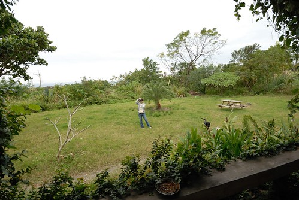 這是房子的屋頂 建築物與屋頂之間的留空是讓這房子冬暖夏涼的重要關鍵 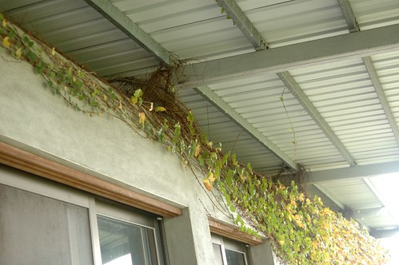

這兩天跟小學生阿徹玩牌玩的很有興致的我們忍不住又拿出樸克牌玩99 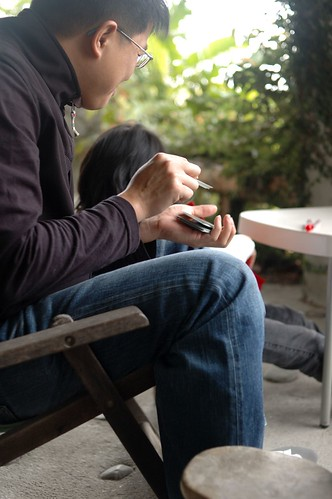 都蘭國小的愛愛小朋友則在一旁畫她的畫 偽小學生有認真! 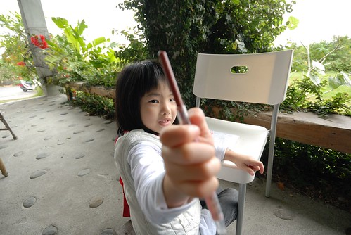 雖然在這樣清新的早晨玩樸克牌實在是墮落 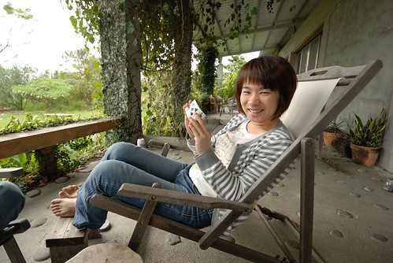 但在這樣的地方 這樣的氛圍玩牌真的很愜意 而且說說笑笑不斷 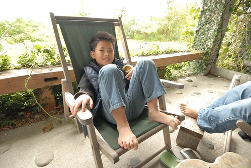 然後我們一不小心又快把整個上午給消磨光了  雖然沒有硬性的退房時間規定 但我們還是在一般規定的11點前整理好一切 帶上房門 把房間鑰匙插回房門上 完成我們的退房 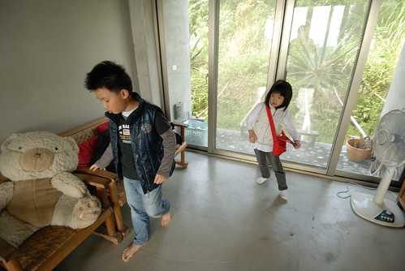 一早上一直揹著小書包的都蘭國小小朋友準備出發繼續我們的旅行  行李都搬到屋外後 徹爸突然提議來張全家福吧 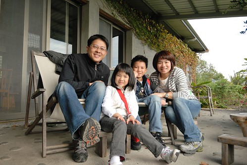 假裝這是我們的家 我們的家門口... 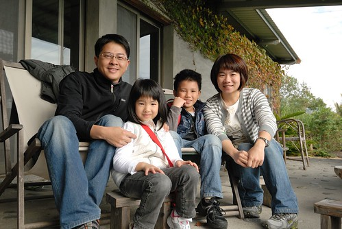 又請阿徹幫我跟徹爸照一張 咦! 媽媽的臉怎麼過曝了 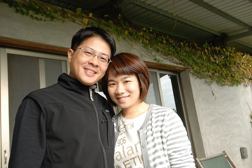 徹爸與阿徹又試了幾張 結論是有徹爸在鏡頭內的話 我的臉就會過曝 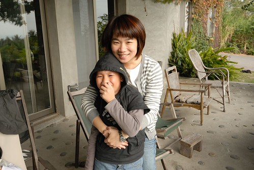 最後離去前 一如在真柄老舍 拍下房子的最後一張外觀照片 也一樣的 希望以後也能有機會再來這體驗房子的夏涼!! 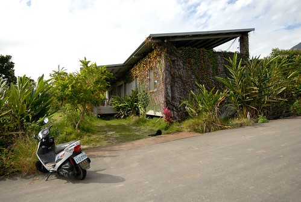 後記: 寫完後才想起完全沒有提及房間 而徹爸也未拍下任何一張房間的照片 只能簡單說明 就是很寬敞的木地板房間 裡頭只有四張床墊 一座立燈台 一張椅子 是個可以冬暖夏涼 足夠一大家子人睡覺的房間
