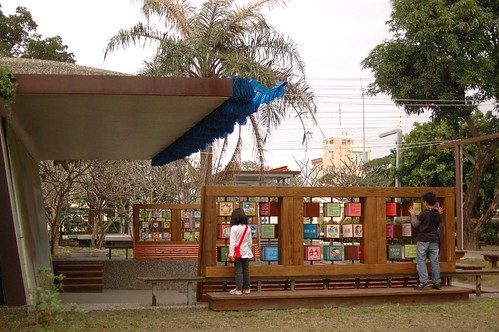

台東故事館是這回在找台東市的民宿時 意外發現的好地方 我跟徹愛本來就蠻喜歡這類兒童故事屋的地方 加上台東的這個兒童故事館是由老房子修復而成 且房子旁有棵好大好大的老榕樹 一整個的很吸引人! 只是沒想到陪著我們東奔西跑的小紅竟然第一次在我們出門在外時出問題 而且還是頗大的問題 於是旅行第三天的下午 徹爸陪著小紅在汽修廠檢修 只有我跟徹愛在故事屋享受這滿屋的故事 事後徹爸看到我所拍照片說"怎麼覺得沒有爸爸在 你們好像玩的比較開心的樣子" ㄟ... 沒這麼明顯吧?! 而且話也不是這樣說 只是說要不是因為車子要花時間修理 我們可能就會如一般景點一樣讓徹愛看個幾本書 感受個氛圍便離去 而沒法像這樣兩三小時的沉浸在故事中 老房子裡 老榕樹下... 或許這就是一種隨遇而安的因禍得福吧  

雖然出門在外遇到汽車故障是很惱人的事 但我們說起碼老天爺很保佑 眷顧我們 讓我們的車是在台東市出問題而不是在像長濱那樣的荒郊野外中 因此當車子真的沒法再開下去的時候 我們還能在最後千鈞一髮之際開到NISSAN原廠 汽修廠適逢過年前的大滿單 但所幸徹爸平日是原廠的忠實顧客 所以服務人員很NICE的讓我們插單 也才沒有讓我們的行程延宕太多 第一次來汽修廠的我說 哇塞 有熱茶喝 有點心吃  還有冰箱裡滿滿的可樂 雪碧 檸檬紅茶隨意喝 還真是不賴 徹爸笑我一付鄉巴佬的樣子 他說汽修場都是這樣的啦 只是台北的沒有可樂跟檸檬紅茶隨意拿啦 可見台東人還是比較熱情的!  等著插單 等著檢查出汽車問題時 我們就當作在這吃下午茶唄  只是屋外藍天白雲好天氣...好可惜哩! 因此最後花了一個多小時的等待與確認車子的問題後 我跟徹愛搭著計程車去兒童故事館 而徹爸則繼續留在汽修廠陪小紅進行兩個多小時的修復工程  兒童故事館應該真的不熱門 連計程車司機都沒聽過 還得靠地址導航 不過我們才一下車 便被這裡的好氣氛給吸引 故事館外圍是兒童公園 地面上是如辦家家酒般的畫著一個家 有客廳 房間 廚房 廁所... 愛愛在彈鋼琴  愛愛在廚房切菜  阿徹在看電視(還有一張阿徹賣力嗯嗯的 可惜徹爸不知道我們的梗 沒選這照片)  公園表演舞台兩側有各種職業的介紹 想做電腦遊戲設計者的阿徹找了老半天 用軟體工程師免強湊合著  至於愛愛則三心二意的想當護士 當警察 又想當歌星... 於是阿徹說那你就把手張大大 表示全部都是你的夢想  公園裡還有一個大磨石子溜滑梯  不過徹愛溜過後說很難滑  老榕樹下則建構了一間間的小樹屋  是小朋友來這玩耍的最佳秘密基地  循著樹屋而下 我跟阿徹研究討論起到底哪根樹幹才是老榕樹的主幹 氣根綜合交錯的實在讓人難以分辨  而結論終究就是好大的一顆樹啦  在故事館外玩耍了這麼久 總算我們要進入故事館裡頭了 兒童故事館的前身是台東菸酒公賣局的閒置宿舍 縣政府後規劃為兒童公園並且修復日式宿舍以及保留百年老榕樹 現由台東縣故事協會管理  進屋後 我們先很快速地瀏覽館內分佈  漫畫區裡的一顆聖誕樹讓人還感受到那未褪盡的聖誕節氣氛  除了漫畫區外 最主要的就是這一間的繪本與兒童小說區 繪本依照出版社分類 排列的很整齊 也很便於找書(我喜歡這樣的分類法)  阿徹跟愛愛各自去尋找自己喜歡看的書  愛愛還拿了本大繪本 逐字練習他大班正在學的拼音 故事屋裏除了工作人員外 未有任何的讀者 因此愛愛自在且明亮的逐字說著故事  因為還要等好久的徹爸  徹愛索性都把書包擱在一旁 以更輕鬆自在方式看故事  我喜歡這個襲窗的位置  尤其窗戶一開後徐徐微風吹入 好棒的一個閱讀雅座 (當工作人員告訴我可以把窗戶打開時 我很訝異 原以為這老窗戶只是裝飾而已 )  看著阿徹專注看書的樣子 我忍不住拿著相機多拍  而愛愛有時自己看圖編故事 有時要我講繪本  而有時則自得其樂的玩手機(不能通話但功能很多的假手機)  我們跟徹爸分開兩小時了 開始想念起小紅修好了沒 徹爸要來找我們了沒...  尤其愛愛更是有點按耐不住  故事屋裡的故事書很多 但我想故事屋的本身就是一個好故事 這裡肯定替一些小朋友提供/創造了許多美好的回憶與夢想!  老房子因著滿屋的故事而賦予新生命 新感動! (陽光灑進走廊書架上 是幅很美的畫)  走出故事屋後 我很想把老房子 老榕樹漂亮的照下來  可惜鏡頭有限加上技術不佳..  等候徹爸的到來前 徹愛又在公園裡玩起職業轉轉盤 總算阿徹找到一個"多媒體工程師" 我想這應該比較貼切他目前的夢想吧  YA! 只有我們母子三人的今日下午出擊成功!!  後記: 隔天要離開台東市前 央求了徹爸再過去故事屋 用他的廣角鏡頭幫我拍下老榕樹下老屋子的那一幕  老樹真的很大 老屋真的好小  一個充滿濃濃歷史與許多人回憶的地方 
