前陣子聽朋友說起 我第一次聽到"小確幸"這個詞 當時只覺得這真是個令人感覺可愛的幸福形容詞 而上週在MOS用早餐時  我總算第一次看到有關"小確幸"的文字描述 MOS的餐墊紙上頭寫著"小確幸: 微小但確切的幸福"   讓人一整個完全明瞭的簡單解釋 一份慢慢享受的早餐 一段上工前在誠品的小閱讀 是我那一天的小確幸~ 那天晚餐 阿徹喝著阿嬤種的黃帝豆湯 滿意的說"阿嬤的豆子真的太好吃了" 後來阿徹打電話給阿嬤說其他事情時 順道問阿嬤"還有黃帝豆嗎? 如果有 可以請阿嬤冰凍起來嗎" 阿嬤當然是會開心的說好 我又聽到阿徹說"皇帝豆湯喝起來好甜 超好吃的...." 我想阿徹的這幾句話絕對是阿公阿嬤那晚的小確幸吧! 而阿嬤那些將採收的黃帝豆大概全會被冰凍保存起來 等著我們下次回嘉義時帶回台北慢慢享受吧! 還可以吃到黃帝豆 阿徹開心高喊"YA!"   黃帝豆是阿徹最近的小確幸~~

原生植物園是我們在台東回鍋率很高的一個餐廳(比較正確的說法是植物園裡的餐廳) 因為向來不太愛青菜 常閃躲青菜的徹爸竟然覺得這的野餐鍋好吃 而且還回味無窮... 於是我們在愛愛兩歲時 四歲時 以及現在的六歲分別來過一次 這一回我跟徹爸依舊滿意於涮野菜 更可喜的是越來越"會吃"的阿徹也跟著一起著迷了 我相信下次再到台東市(希望不用到愛愛的下個偶數年記這麼久) 我們絕對還會再來這嗑鍋的 因為最近每次吃著台北的涮涮鍋 就讓人忍不住想起台東那風味獨特的野菜鍋阿~~ 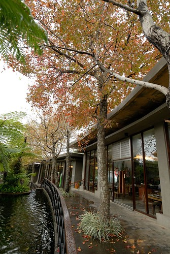

前兩次來 都沒有好好的紀錄過 (話說徹家本來就不是走美食路線的啦) 趁這回把之前的照片翻出來回味一下 第一次來的時後 愛愛還好小 才兩歲多哩 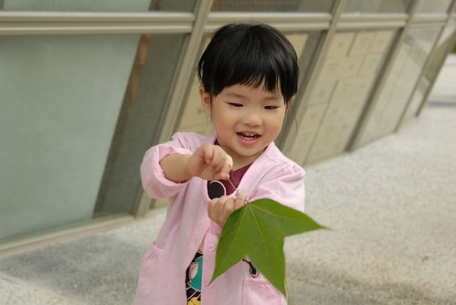 而阿徹也還好嫩阿  那時後愛愛還得坐著兒童椅跟我們一起吃飯 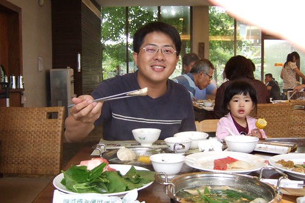 可是愛愛真的是個好旅行咖 總是乖乖的陪玩 陪吃陪睡  那一次還順道去了隔壁的初鹿牧場看牛 喝牛奶 只是發現初鹿變的已不是我們記憶中的初鹿了 所以這些年沒再去過了  第二次去的時後 愛愛已經是連狗都嫌的4歲多了 雖然我們家愛愛從來沒嚕到讓狗嫌過 但已經是超有意見的獨立小女生了 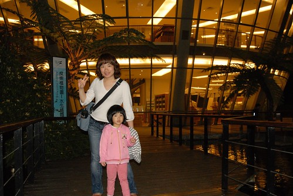 那一次不知道是晚上的關係 我們的戰鬥力頗弱  徹爸還說"果然是老了" 但是我們還是吃的油光滿面 開心又滿足阿 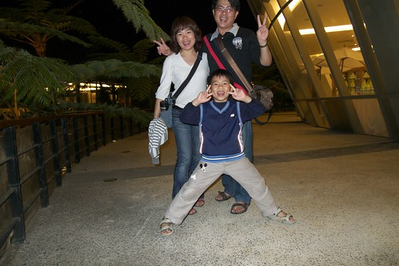 徹爸一直很懷念讓他可以嗯嗯很順的野菜鍋 於是這回在第四天很鬆的行程裡 我們又臨時起意的跑去原生吃野菜嚕 被安排在跟之前差不多的座位區 但這回有外頭的楓樹美景伴著我們用餐  第三次來原生 我們的愛愛已經從奶娃變成亭亭玉立的女生嚕  不過愛愛的肚量倒是沒多大長進  吃一碗飯 幾晚菜跟湯後就進入水果甜點階段了 講真的 這是一個難得變不多的地方  連甜點跟蛋糕都是四年來如一日 且一樣的好吃  徹爸平常常說"我不吃太健康的東西(如五穀飯...) "   所以我真的是很訝異徹爸怎麼會喜歡這裡的野菜 因為大半野菜不是口味怪 就是口感怪  很多人應該是吃的很不習慣的(雖然來原生吃野菜是很熱門的點)  這回徹爸還跟阿徹兩人合作一起體驗野葉 第一輪 兩人把所有野菜都一一品嚐過 然後再針對喜歡的野菜連攻好幾輪  阿徹吃了好多菜 還把自己那鍋湯喝到見底 高呼著"真是太好吃了 真是太滿足了"  我們三個人的湯煮到最後都別具不同的風味 徹爸的喝起來有點苦但是卻回甘的令人驚喜 阿徹的湯有竹筍的香味 而我的湯則有濃濃的芋頭香味 但明明我們沒有煮苦瓜也沒有煮竹筍阿?!  這都是不同野菜在湯裡交雜融合而成的精華阿~ 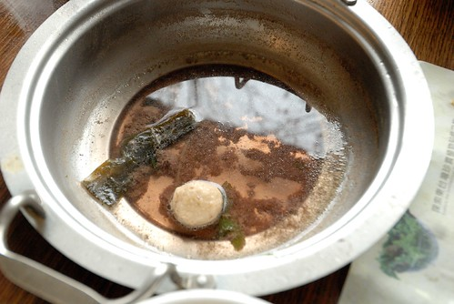 而吃飽後 父子倆竟然還跑到食物區 把好吃的野菜菜名記錄在阿徹的本子上  父子倆 認真又積極的模樣 讓我看的忍不住趕緊拿起相機偷偷拍下這感人的一幕 這真是令人滿意的寓教於"吃"的一餐~  飽到挺著大肚子 把書包款一款要準備離開嚕 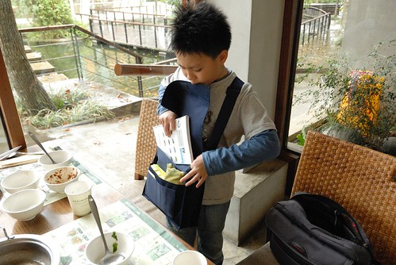 YA! 今日午餐 出擊成功!! (可以感受到那個小三的滿足與氣勢吧) 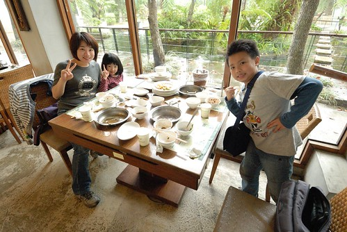 離開餐廳時 看到告示單上寫著假日用餐時間一小時(甜點可以端到園區使用 不在限制內) 因為我們都是在非假日時段來用餐 實在很難想像假日人聲鼎沸的樣子 不過很慶幸 我們每次都是慢慢地享受野菜美味  餐廳旁蓋了一條景觀木棧道 四年前還沒有 兩年前蓋一半 這是園區內四年間唯一有變化的地方  木棧道的盡頭視野還不錯 有點像初鹿牧場 只是這裡養的是鴕鳥  我們愜意的想倚著欄杆逗弄鴕鳥時 才發現欄杆上 鳥糞整齊排列著而且還連綿不絕  有點搞笑 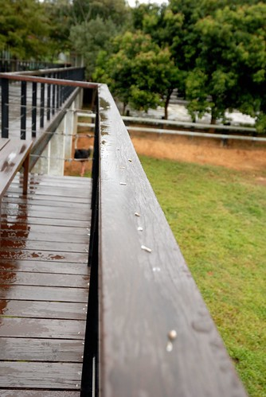 我們用餐的一個多小時內 下了一陣不小的雨 下過雨後的空氣聞起來又更清新了  更是適合吃太飽之後的小散步  我們也第一次好好的逛了園內的野菜展示園區  這紅的葉 白的花煞是美麗 徹愛兄妹倆來個合照一張 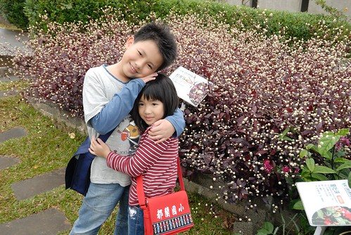 徹爸說 媽媽鏡頭下的這張FU好  逛著野餐園區時 我們此起彼落的喊著"這剛剛有吃到.."   真的! 我們真的吃了不少像草的野菜  (下雨過後 連蜘蛛網也經瑩剔透 美麗了起來) 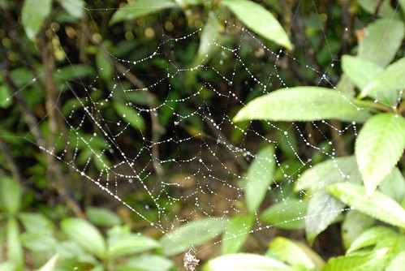 最後當然不免俗的得去商品部補貨一下 話說她們家的雷公膏真的好用 肚子痛 頭痛 筋骨痠痛 精神不佳或是按摩時都可以用上且效果不錯 我跟原本不想逛的徹愛說"我們進去買個雷公膏就好了 真的只有雷公膏 很快" 結果我們又忍不住哩哩叩叩的買了一堆  山藥醬油膏 乳液 香皂 護手膏....  Orz 吃飽也買了滿滿東西後 犒賞徹愛這趟旅行的好表現 賞他們一人一瓶魚飼料  話說小孩子真的好愛餵魚喔 每次看到可以餵的魚都會吵著要餵 可是遊客花錢養老闆的魚 那個邏輯真的有點怪怪的說.. 所以餵魚這種事只能當獎勵品 偶一為之就好 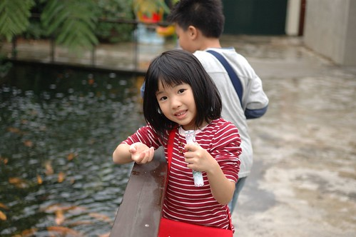 好心情 好小孩 才有好個餵魚樂~  開車離去前 我們的小學生提出要求照個到此一遊照 可見他真的吃的很開心阿~~~ 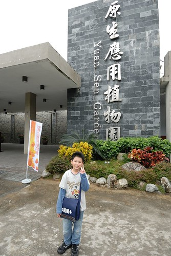 後記: 雖然真的吃很飽 但卑南包子也是來到台東不可不吃的東西之一 所以往太麻里的路上 我們又買了幾顆卑南包子 饅頭以及這回的新嘗試"陳記麻吉" 包子跟麻吉又真的好好吃喔!   下回來台東又多了麻吉這個不可不吃的好物 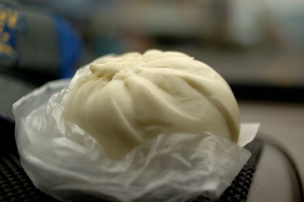
