以往我們幾乎都是走台九線往返花蓮台東間 尤其自從三年前從綠島吐回台東後 還得開四小時的車到花蓮七星潭 那一次讓我們看海看到怕也深覺台11真是條不好行的路 從此我們沒再走過海線 這回因為下榻的長濱與都蘭都在海線上 於是我們只好順理成章的走台11 原本徹爸是有點排斥開海線的 但兩天的海看下來後徹爸驚呼著 "海線的風景果然漂亮又千變萬化 " 雖然冬日的海景打了點折扣 但這回我們總算還台11一個清白了 而且才發現原來很多台11上的美景 竟然連徹爸都沒去過(更別說徹愛了)... 我說五六月烈陽高照但微風徐徐的時節騎著單車在台11上一定很棒！希望有一天有機會... (話說以上就是我在過年前發豪語要在嘉義年假期間打拼的結果... 真是對不住筆電) 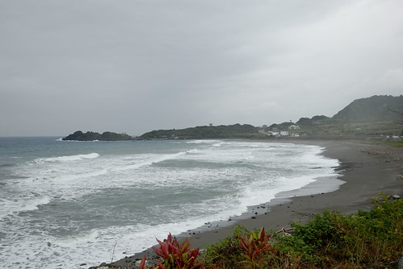 

冬天的海岸線少了夏日的藍天烈日與人潮 但一樣風情萬種迷人 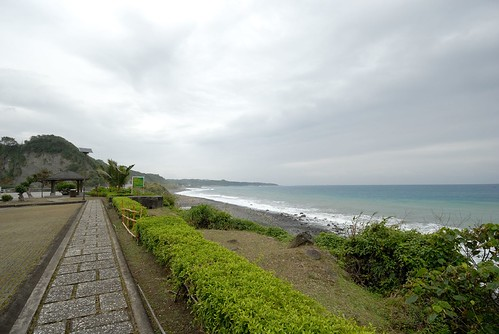 我們離開長濱後 沿著台11線 看著太平洋 慢慢的往南一路開下去 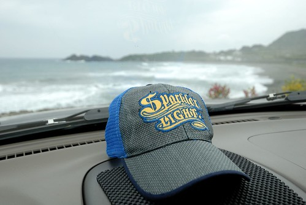 有時候 看到漂亮的 便索性下車好好看個過癮 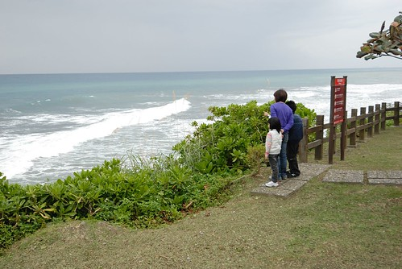 話說徹家當仁者這麼久 偶而也是該當當智者的 仁智具備 才能打遍天下無敵手 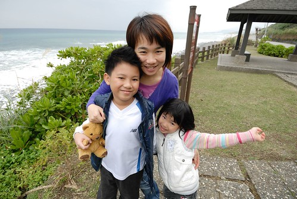 沿途也常見一些漂流木的藝術裝置 我們總忍不住提醒阿徹多體會這些各式各樣的藝術創作 而阿徹也越來越有自己想法 別有一番觀察與體認的樣子! 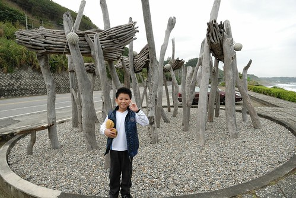 一路走到三仙台時 才發現原來徹爸從沒去過八仙洞 三仙台..這些海線上的著名景點 想想這幾年我們來花東真的都是往台九跑 也難怪徹爸對海線是如此的陌生 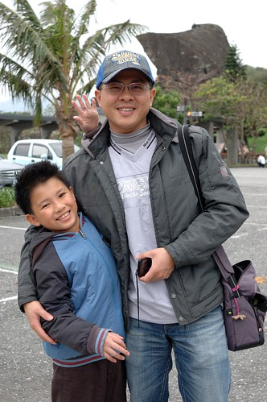 其實我上一次也是唯一一次來三仙台也是我高中畢業旅行的時候了 20年前的事了..嘖嘖嘖 而我對於三仙台也並沒有太深刻的印象了 所以這回算是我們一家子的初次到訪吧! 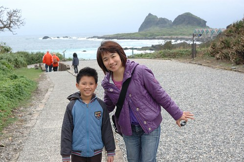 三仙台的景色真的蠻壯麗的  還沒到跨海步橋處便讓我跟徹爸哇聲連連 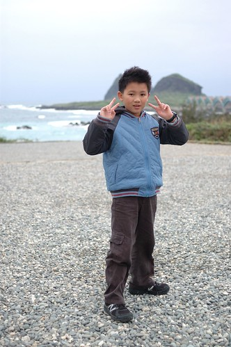 至於徹愛則被沿路的小石頭給吸引著 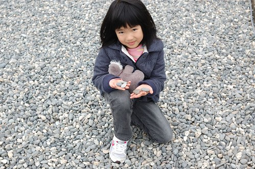 穿過珊瑚礁群 我們準備走過八拱跨海步橋  走到步橋的起點處 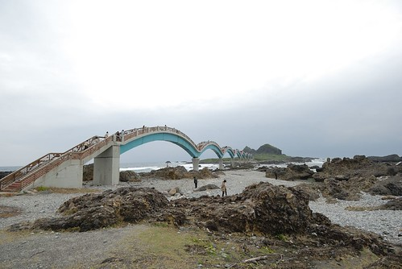 哇! 波浪造型的八拱橋果然造型酷炫 好像巨龍連接著三仙台與本島 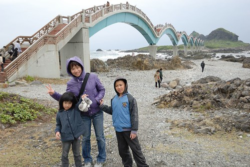 雖然橋上的風實在很大 但阻擋不了我們走他一遭的決心 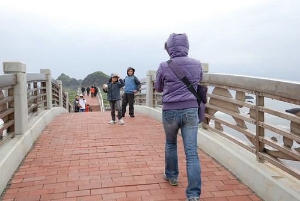 走在步橋上 所見的四面八方感受很不一樣 這是往前所見 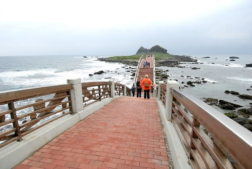 往後所見  往左所見  往右所見 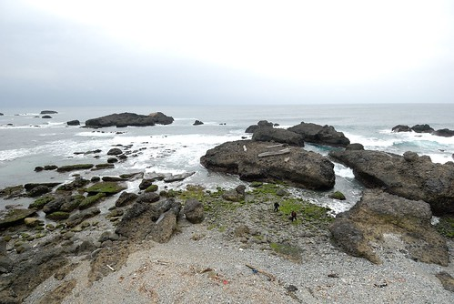 而且站在不同拱上 所見又略有不同 真的很漂亮 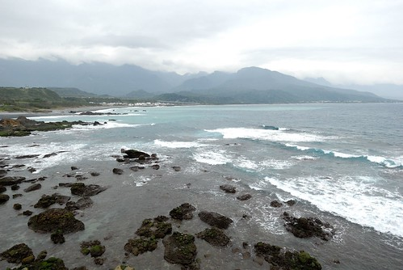 難怪徹爸說想不到他在三仙台竟然照了這麼多的照片 很出乎意外 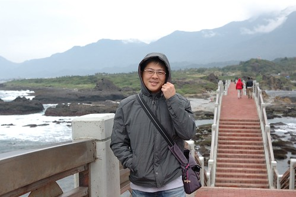 雖然風大又冷(這是五天旅行中最冷的時候) 阿徹頻喊著想回頭 但還是無奈的跟著我們走 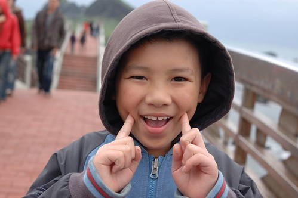 而愛愛則不知道在HIGH什麼的一路衝阿衝! 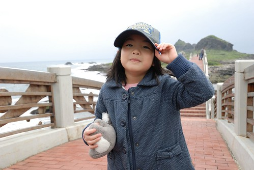 嘴裡還三不五時的念著要數第幾拱 但走阿走的就都忘記已經走到第幾拱 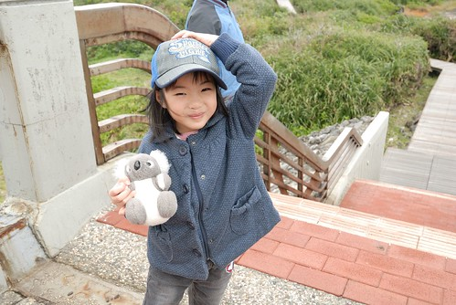 (O~ 七歲的愛愛就是這樣可愛又調皮的有點難搞) 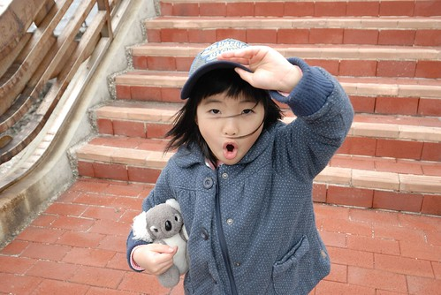 走過跨海步橋到三仙台後 接著的是約莫兩小時路程的環島步道 礙於天候不佳以及時間 我們並未進一步深入 後來在遊客中心看到三仙台的模型時 才發現原來這八拱橋的長度比例只佔整個步道的小小一部分 日後有機會必定再來好好走他一圈! 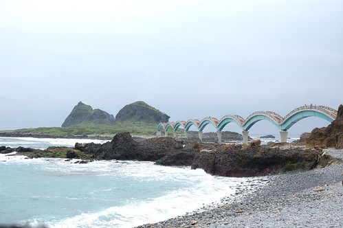 走完八拱橋後 我們在沙(石)灘處休憩 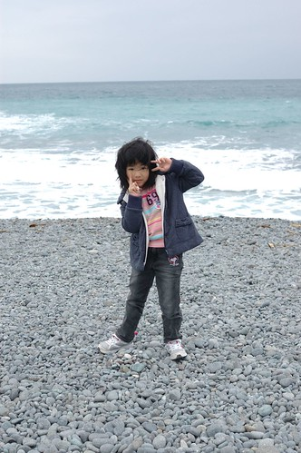 看海 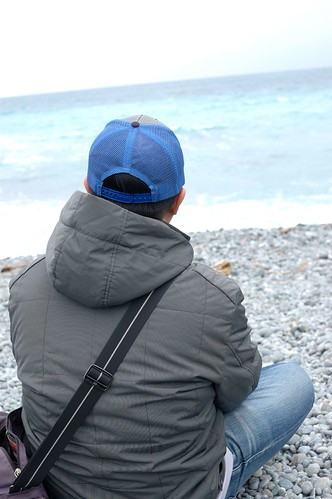 這片美麗的太平洋 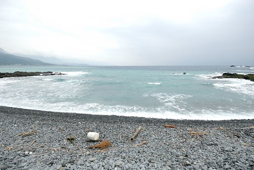 玩石頭 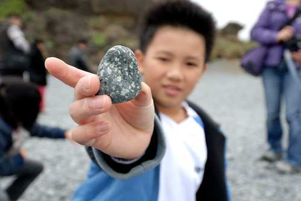 每一個都是獨一無二的石頭 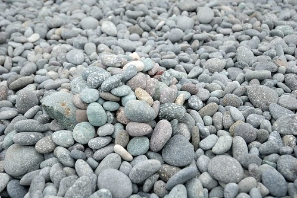 雖然真的覺得冬天的海風很傷人 但我們就是忍不住多呆了好一會 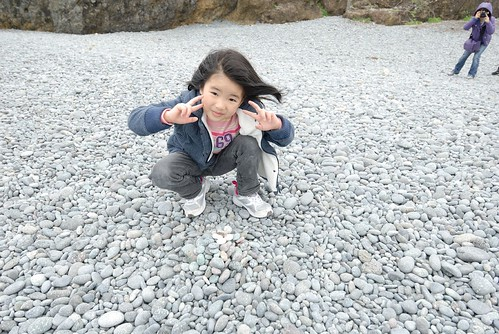 海平線前的人們顯得很渺小但好幸福! 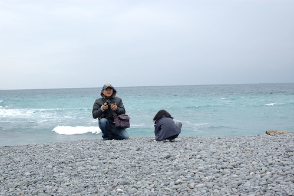 這是三仙台的遊客中心 我蠻喜歡沿途海岸風景區的遊客中心建築風格 簡單又清爽! 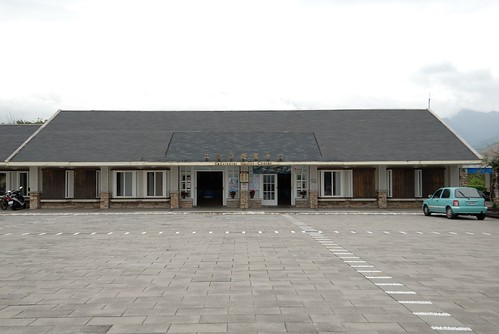 離開三仙台 我們沿著台11繼續我們的行程 去了成功鎮上的小丑魚主題館 然後又經過東海岸風景區管理處 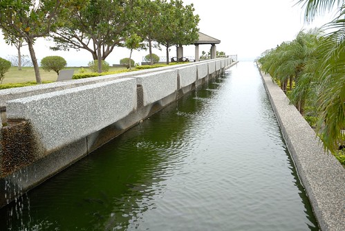 雖說是為了蓋章 我們才來到管理處  但這裡的好視野很令人驚艷 是個意外的收穫! 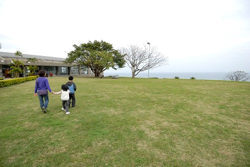 而管理處也有不少的文物展示廳與導覽廳 是個可以當作旅遊景點的好地方 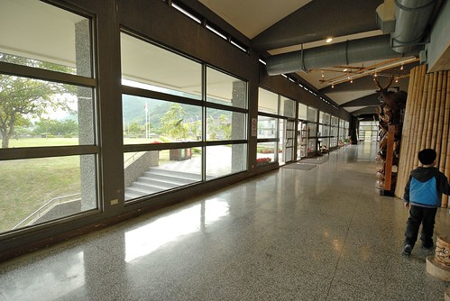 離開海岸管理處 離開成功鎮 沿著台11接著的是東河鄉 經過東河 當來不可不的來顆東河包子! 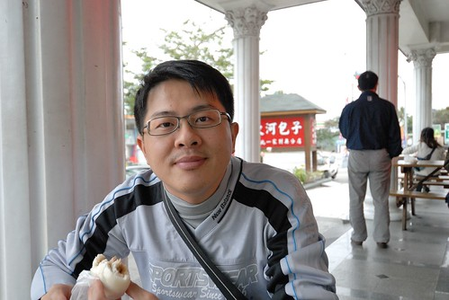 不知道是肚子真的餓了 還是又因為上回綠島吐過之後的包子經驗太對比 覺得今日的東河包子真是好吃! 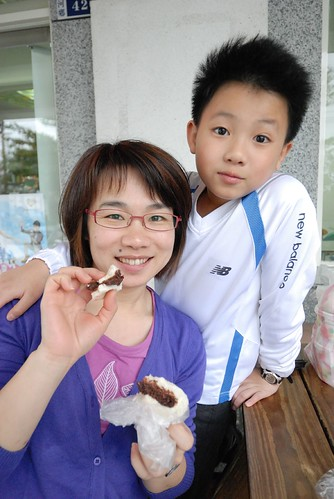 一人一顆包子 是我們今日旅途中的最佳小午茶點心! 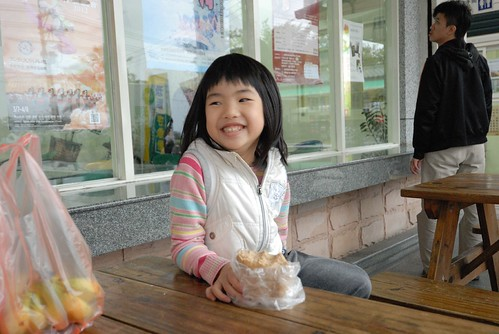 吃完東河包子 我們的台11還沒結束喔... 緊接著要豋場的是一個越來越人文彙聚的"都蘭灣" 我們在都蘭下榻了一晚 一個又不同於往的民宿住宿經驗!

\* To 美賢, 雖然趕不及12點前 但這份"生日禮物"的心意還是要傳遞給你...生日快樂!
