從有阿徹後雖然我們幾乎年年都有到台東 但卻竟有好些年沒有南下到台東市了 沒來的這幾年 聽著看著台東鐵道藝術村的發展與日漸成熟 好想身臨其境... 這回我們好好地停留在台東 感受小鎮的呼吸 隨著小鎮的節奏漫步在其中 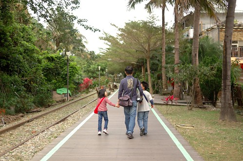 

吃完台東好吃的早餐後 我們把車子開到台東鐵道自行車道的起點 也就是誠品書局處 選個喜歡的位置將車子停好後 我們的散步就開始了 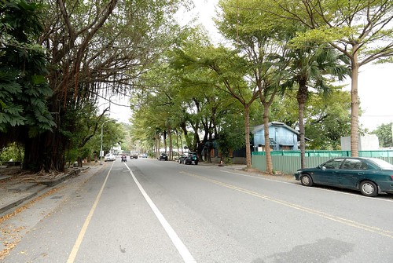 從大馬路走進車道後 我們的目光立即被延伸著的鐵軌給吸引住 徹馬上說"我們來比賽走鐵軌" 我意興闌珊地不想跟他比賽 因為只想放鬆的好好走路.. 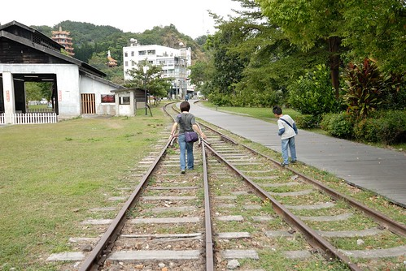 看到動漫公園裡的龍貓巴士 好可愛好想搭阿 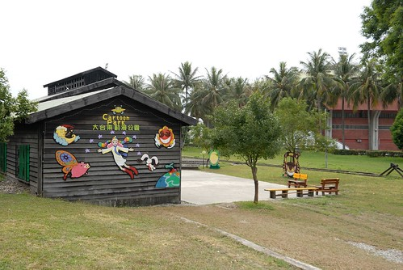 可是阿徹尿急 所以得找廁所為先 謝謝路過的婦人告訴我們 前面的廟宇有廁所可使用 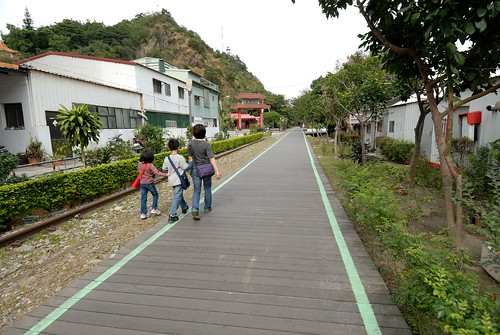 上完廁所後 我們索性順著自行車道的方向繼續走下去  三個人沿途除了賞風景外 或是說說笑笑 或是在鐵軌上競走著 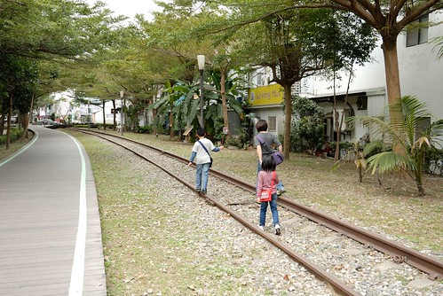 鐵道自行車道的兩側(主要還是右邊側)大多為房子的後牆或後院 每戶人家各憑本事的妝點著自家門面 看到這戶 徹爸問到底是這戶要賣?還是這裡是房屋仲介公司阿? 我想應該是後者吧 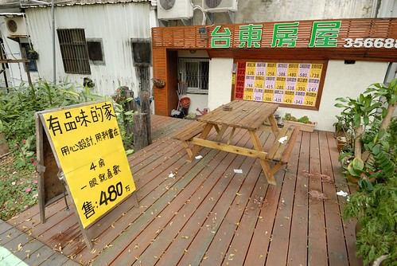 這戶人家沿著牆角冒出的一根根小樹苗 讓我忍不住幻想起當這裡變成森林 真是充滿生機 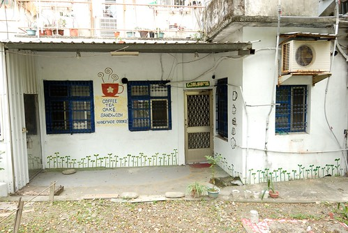 葉脈形狀的椅子 讓我們坐下來休息一下 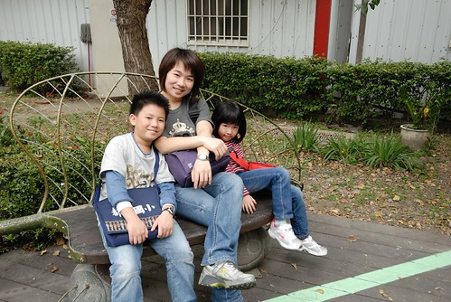 交趾陶拼貼藝術的大怪獸 彷彿是這裡的看守員  下一站到底是去要往關山的車店 還是往台東的民產店ㄋ 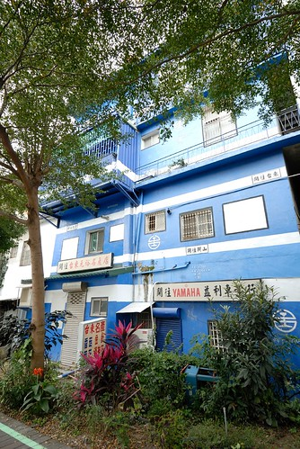 這兩戶人家的後院靈氣又不同了 看的出來應該是咖啡店之流吧! 可惜大門深鎖未能來杯咖啡 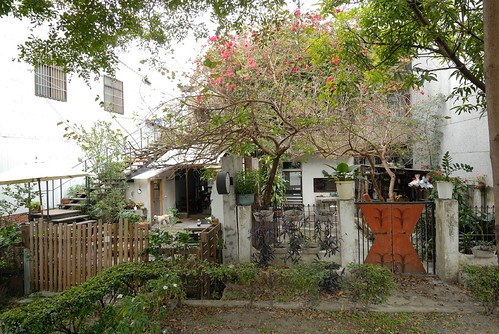 大樹與帶著狗兒散步的女孩 感覺很生活 很台東的一個畫面 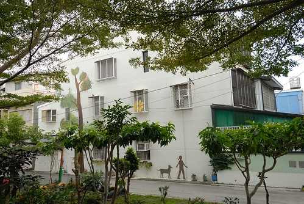 途中還有連载故事可以看 可惜故事的介紹篇已殘破不堪 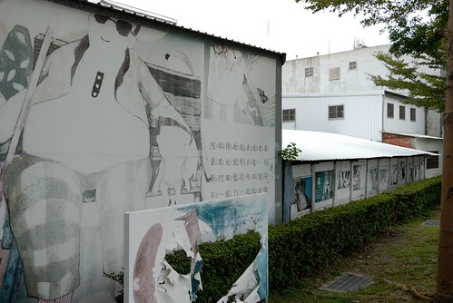 走了一公里 來到我們預設的終點 也就是前一晚用餐的伊亞咖啡 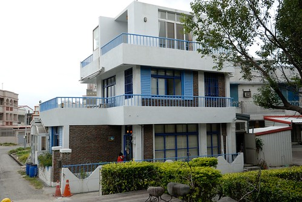 雖然太陽不大 是個適合散步的舒爽天氣 但一公里的路走下來 阿徹還是滿頭大汗 大概因為走鐵道比較耗費查克拉吧 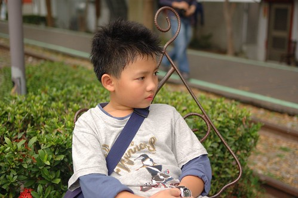 愛愛不是累 但安靜的有點不太像平常的她 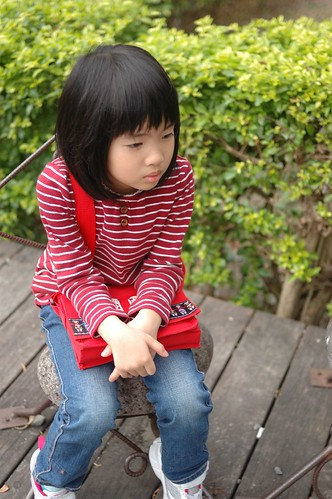 原來今日的愛愛走OL氣質路線啦! 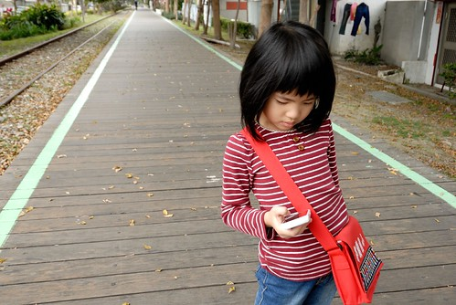 常拿著手機上網查東西 要不然就是跟誰講起電話 聊著天 一整個沉浸在她自己的世界中 (聽她講電話的語氣 內容與時間掌握 會讓人懷疑真的有人在跟她講電話 恐怖哩) 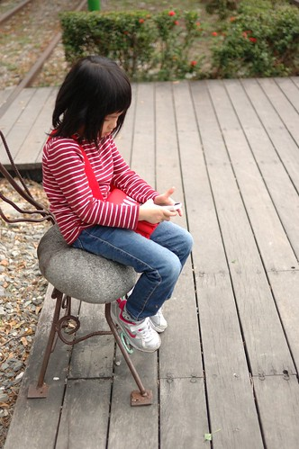 我們跟愛愛說"你好忙喔" 愛愛笑而不答 小女生的世界有時候果然很難懂 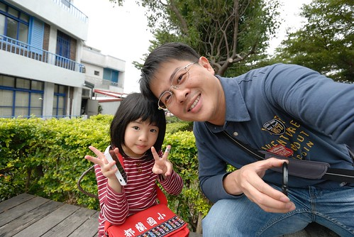 這是在伊亞咖啡附近發現的一戶漂亮人家 而且還是正門就面對著自行車道 真是好有氣魄也好有雅致 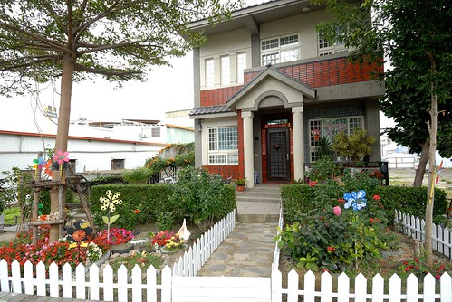 雖然繼續走個2-3公里後可以走到台東糖廠 那也有個藝術村 但我們還是回頭走了  散步這樣的距離剛剛好 再遠 就期待哪一天真的騎著單車走完整個台東單車網吧 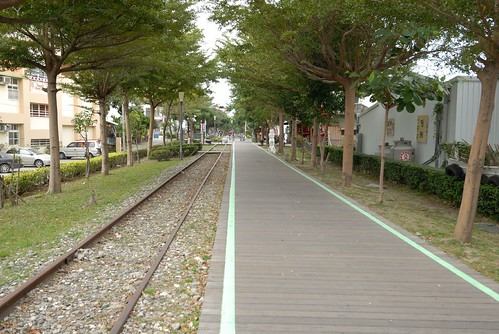 回程的路上 吸引我們注意的東西又不同於去程了 我們發現這樹的新枝幹都是直挺挺的往天空長的ㄋ  就算萬有引力也理當往下長的才是ㄚ 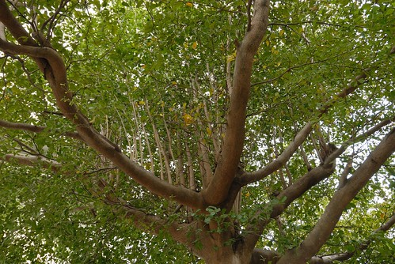 發現不知名店鋪前有兩張盪鞦韆 我們啥都沒多想的就去盪了起來 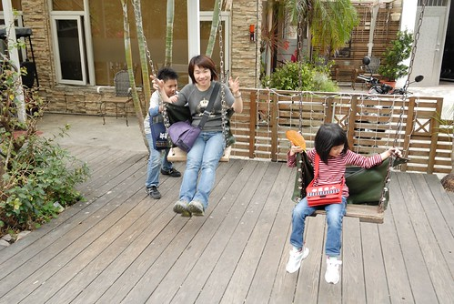 有阿徹的幫忙 讓我盪高高的好開心! 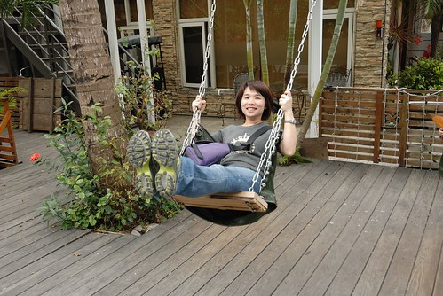 走回到鐵道藝術村 阿徹與徹爸兩個男人間的對決正準備激烈的展開 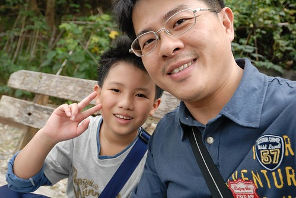 那就是比走鐵道啦! 因為剛散步的路段有一邊鐵道是較高平貼著地面 很難有公平的競賽 所以來到鐵道藝術村這 徹爸說"這裡比賽才公平ㄇㄟ" 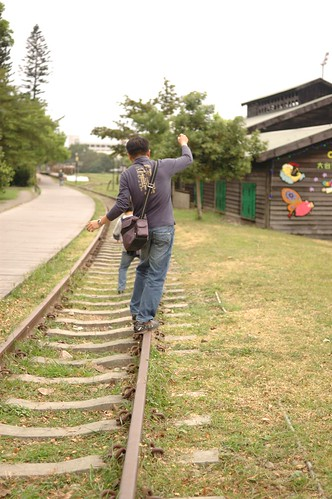 對於不常搭火車的阿徹來講 我想對於鐵路他最大與最直接的聯想絕對就是"走鐵道很好玩"吧 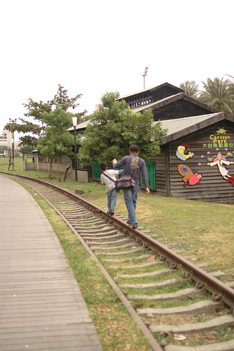 今日的氣質愛繼續在氣質ing 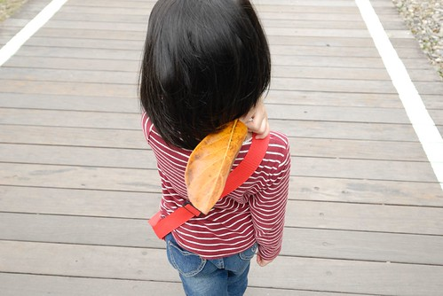 我們來到一開始看到龍貓的動漫公園 甫成立的動漫公園提供台東愛好動漫者一個交流集會地 (今天寫BLOG時 上網估了一下 就看到成立三個月的動漫公園即將夭折的新聞  阿ㄟ阿ㄋㄟ...) 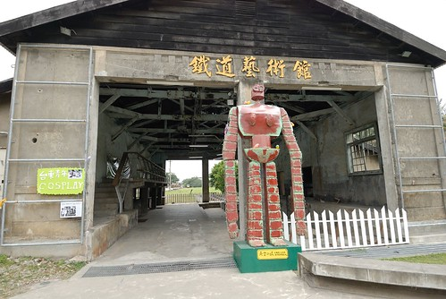 公園裡有我很喜歡的龍貓卡通 一系列主角看板  這是我們家拼圖裡有的姐姐小悅  可愛又愛跟的妹妹小梅(好像我們家愛愛) 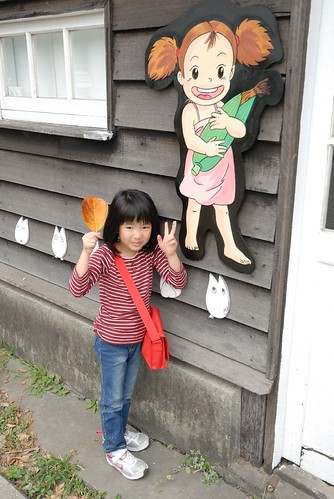 公車站牌 徹爸整理照片時說 如果他排在我跟龍貓的中間 那這階梯的咚咚咚就更流暢了 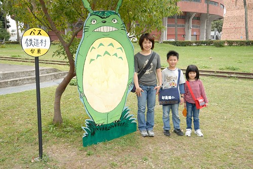 搭上巴士  徹愛要飛往台東嚕 (話說愛愛之所以可以到處在這些立牌留下見證 真的得感念一下那個努力躲在看板後方 讓愛愛得以踏高的媽媽 ) 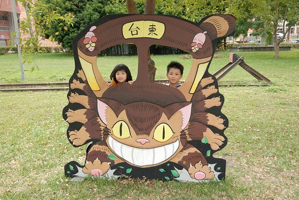 疑! 愛愛怎麼提早在這小貓屋站下車了ㄋ 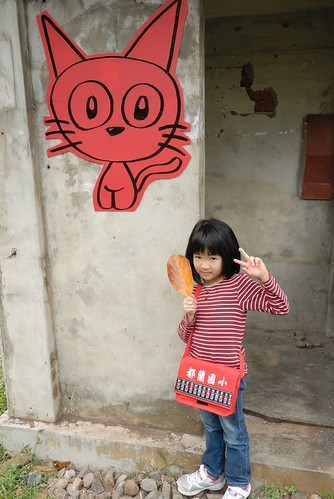 很迷你但是很可愛的動漫公園! 如果它真的不幸夭折了 更是慶幸自己曾經這樣參與過它 離開動漫公園 父子倆又繼續較勁著 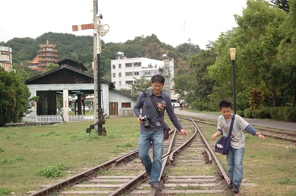 阿徹非得拼出個輸贏的樣子  殊不知爸媽從沒認真與他決鬥過 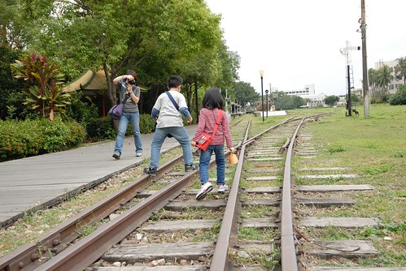 沿著鐵道走這麼久 總算來到台東舊站 我喜歡這種老月台安安靜靜的模樣  人去樓空的舊火車站 舊鐵道 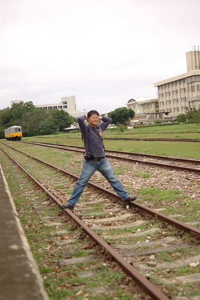 雖然有那麼點悽涼但起碼被完整的保留著 繼續傳頌著屬於這的故事 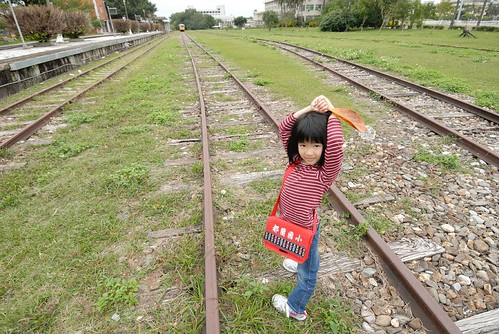 我想要四個人一起坐在鐵道上 來個大合照 可是阿徹發現了莆公音 兄妹倆大玩起莆公音 沒人要理我.. 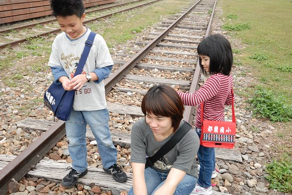 這些是阿徹按襲我的武器 謝謝愛愛女俠相救 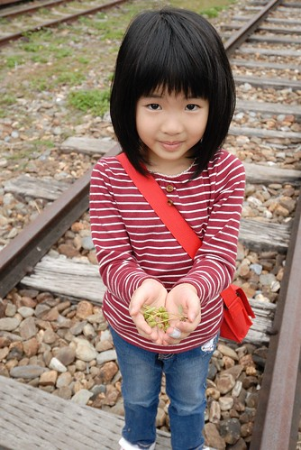 阿徹真的超級愛玩蒲公音  看到蒲公音便熱血急速沸騰_ing_ 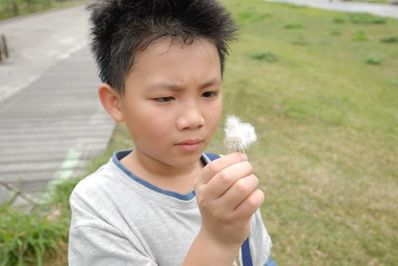 呼的大力一吹  對著他照相的徹爸滿臉是蒲公音  從發現的第一根起 阿徹一直找著蒲公音然後一直吹著蒲公音 這大概是他覺得在每次出門最好玩的一項遊戲了 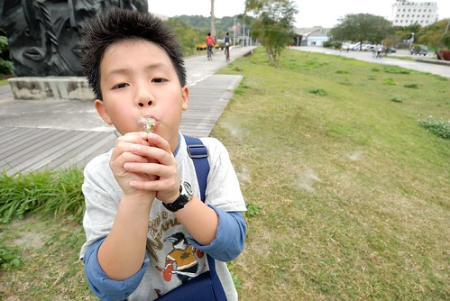 看到鐵道旁有個遊客中心 我們高興著那裏應該可以蓋章 只是明明不在牆上所公告的休息時間 可是卻大門深鎖不得而入  應該又是因為選舉吧... 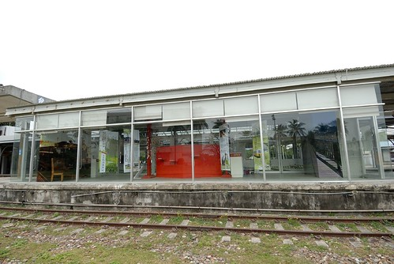 我們接著來到以前的舊車站  剩下的壁柱上有許多的藝術創作 但老實講 我不是很喜歡像這樣的嘻哈(頹廢)風格 覺得與外頭的那些舊鐵道很不搭 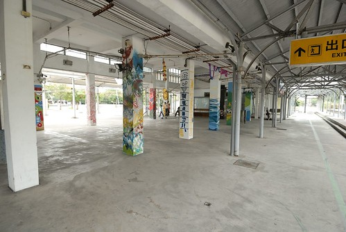 我喜歡舊東西就這樣保留原始的模樣 她靜靜的說著他自己的故事 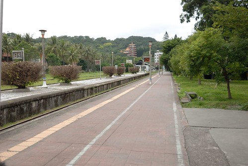 來到鐵道藝術村沒去著名的台東誠品走一遭 實在很說不過去 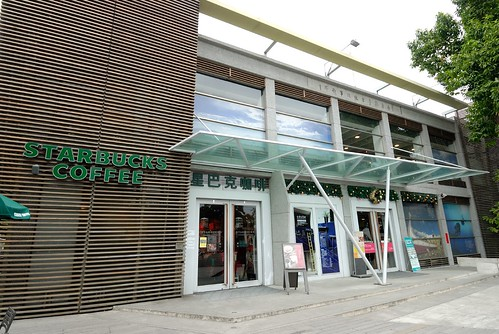 以誠品為中心的這一帶是台東新興藝術集散地 凝集了當地人才也吸引了來自各地的藝術者與背包客  夜晚與週末時的鐵花藝術村 有許多的藝術表演 好不熱鬧! 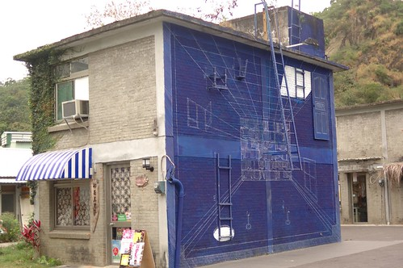 雖然嚮往這樣的氛圍 但來的時間點不對加上帶著小孩也真的很難搞FU 所以我並未多逛誠品或在附近走走 不過我在誠品的櫃檯旁拿了好多花東當地的DM(可以稱為花東限定版) 其中這張小卡 我很喜歡! 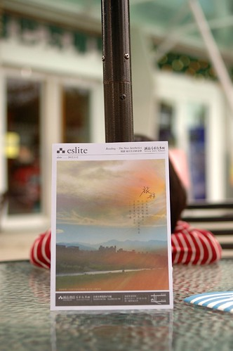 尤其孫大偉這段話 很棒! 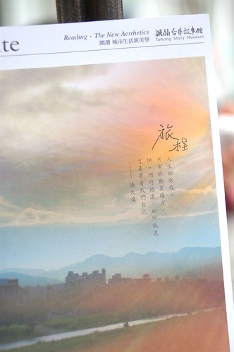 我很高興 我們在似分擾但又寧靜的年前時刻 有這段美麗的台東旅程!
