還記得四年前開始去武陵賞楓 且還在接連著的三個月內也賞了武陵的梅與櫻花 當時, 我在BLOG發下豪語想要看盡武陵各個時節的不同風采 雖然四年來除了年年有去賞楓外 其餘還是都停留在想望階段 但我們一家子真的很喜歡武陵的山與靜 這一個月來 看到新聞上 FB裡爆夯的武陵櫻花 我卻是越看越是悵然 我難過於 我想我這輩子大概很難再賞到武陵的櫻花了吧   因為草坪停滿車的武陵肯定不會是那個我最喜歡的武陵了 雖然放棄了早在去年11月好不容易訂到的櫻花小徑盡頭的房間(還難得的賭對盛開時間) 心裡真是有遺憾 但我說賞花心情最重要(有事情就不要硬上了) 而且我真想要的是愜意漫步其中的賞花阿... 今天看到一篇社論講到"在今日的台灣，喜歡什麼、支持什麼已經變成一種集體行為與心理投射" 我很認同這樣的說法 因為從以前的蛋塔 到現在的網購 美食餐廳 王建民 林書豪 武陵紅粉佳人 愛台灣....真的就是給我這樣的感覺! 或許有人會抗議這不是盲從 這叫"支持"   那麼在支持之餘 大家是不是能多些包容 多些體諒 多些真正的了解與喜歡 不論是對主角本身還是對持不支持立場的人 所以下次請別再攀折武陵的櫻花樹了 別再自己製造櫻花雪了 樹會痛會哭的.... (很碎唸又不對文的序 但這真是我這一個月來最想抒發的一件事)

從長濱開往都蘭的第二天 經過成功鎮時 我們順道去了小丑魚主題館 小丑魚主題館的前身為台東海洋生物展覽館 在委外的BOT經營失敗後  由農委會水產試驗所收回自己經營並更名為小丑魚主題館 館內最主要的展覽即為關於各大洋域的小丑魚生態與種類! 雖然展覽的小丑魚數量跟原先所想有點出入 但看到好多不同種類/形態的小丑魚 我們還是驚奇的哇哇大叫 這裡是我們五天旅行中唯一一個需購票的景點 但我喜歡這樣一個小而巧 小而可愛的小水族館 尤其還是在大海資源如此豐富的台東小鎮上~ 

走台11經過成功鎮上時 很容易的就看到小丑魚主題館的路標指引 主題館就在離台11不遠的 成功漁港旁邊 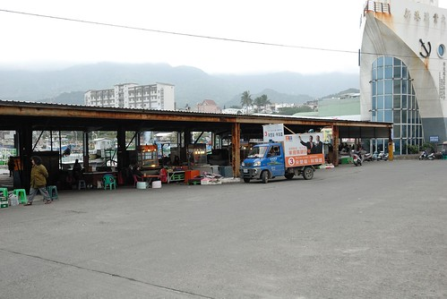 外觀看來又新又大的主題館與一旁的小漁港形成強烈的對比 但卻都是一樣的冷清 因為當我們走到主題館大門口時 原本站在大門口聊天的工作人員才趕忙各自回到售票處與入口處 冷清應該是秋冬時節 台東真正的模樣吧 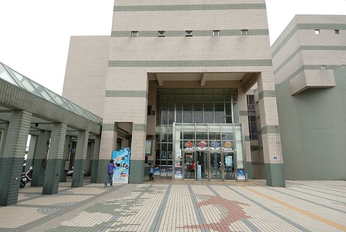 還沒看到真正的小丑魚 徹愛看到假的小丑魚便已開心不已 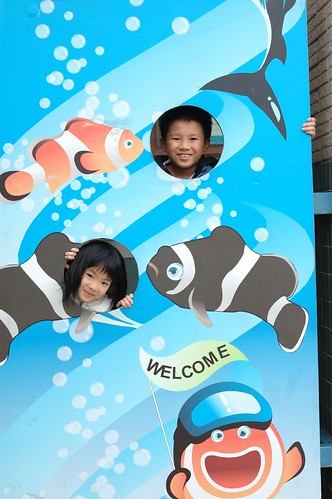 到此一遊照 當然也是免不了的嚕 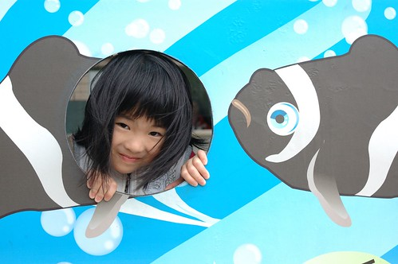 將真的 進入館內後的第一眼有種似乎踩到雷的失望感 因為一樓大廳正在進行年節前的主題展更換 所以大廳裡的水族箱都是空的 除了掛在天花板的假魚看起來有豐富點外 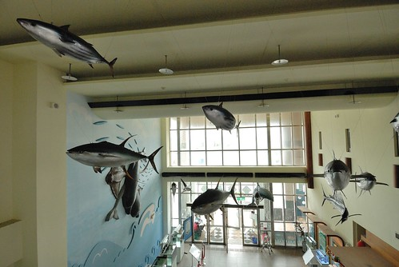 那時後完全不敢期待其他的樓層 但幸好進入二樓 看到了台灣具有的七種小丑魚後 我們開始興奮了起來 雖然早知道電影裡的Nemo住在海葵裡  但真的親眼看見這畫面時 我們還是忍不住大喊"他真的從海葵鑽出來揶" "他躺在海葵上好舒服的樣子喔"... 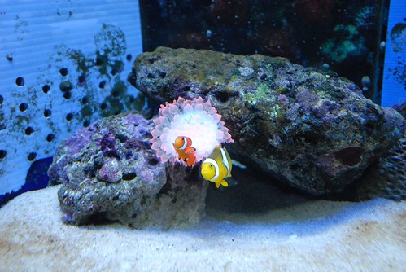 尤其那剛出生1日內 10日內的超級小小baby魚  雖然沒有美麗可愛的外表 但那如綠豆皮大小的小身軀 努立在水面上開合 翻轉的模樣  惹人疼的可愛模樣真是讓人忍不住對著他傻笑...(可惜很難拍下來) 期間我們還在公告的播放時間去看了20多分鐘的影片介紹 雖然我們遲到了 雖然整個館除了我們一家子外沒再有其他遊客 但工作人員還是很熱心幫我們播放 這點 要給那些看起來都好年輕的工作人員拍拍手 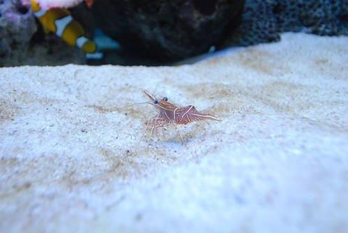 主題館除了小丑魚外 當然還有很多其他海中生物的展示與主題展 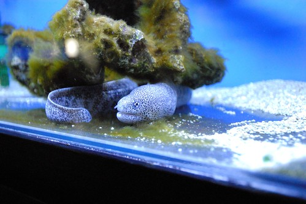 也有游著各式各樣魚的大水族缸(還有大海龜喔) 我一直很喜歡水族館 特別是看著這樣一大缸的魚游來游去 讓不諳水性的我 可以藉此幻想自己彷彿悠游在海中... 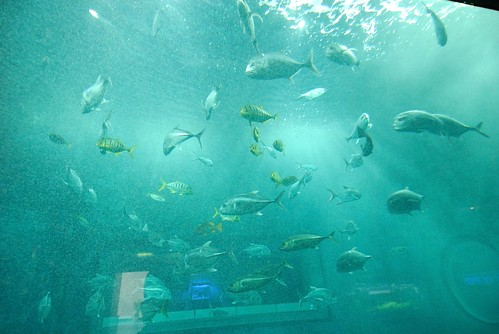 原以為小小的主題館 想不到上上下下走下來後 愛愛腿也是會痠的 尤其我們還為了要回到大廳旁的影音室而在館內迷路 撞牆般的走不出去 超好笑的 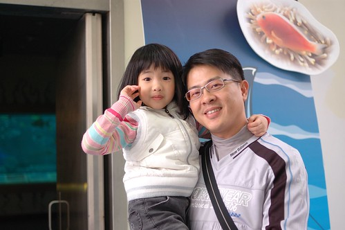 我們花了一個多小時在館內走馬看花 尤其在最後的軟體生物觸摸區 我們在跟一旁的紀念品部小姐聊天的同時(小姐還當起解說員) 也卸下心防地觸摸體驗了各式軟體生物  不論是可愛的還是恐怖的 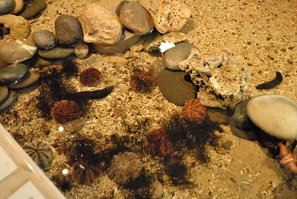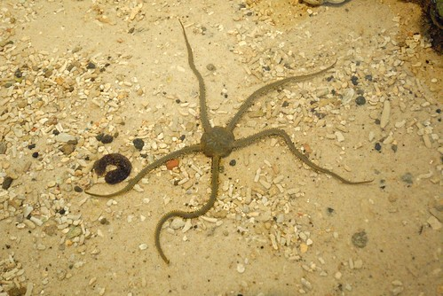 

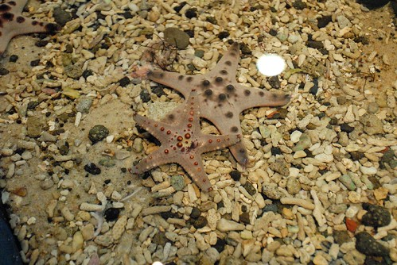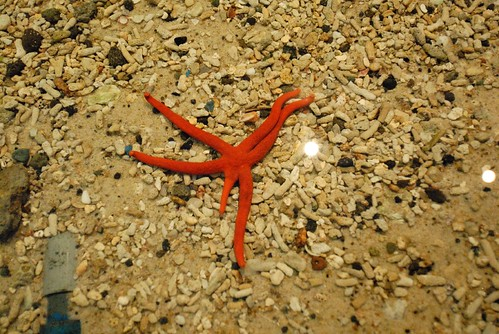 我們的大膽愛果然很有實驗性質的摸了每一樣生物 不意樂乎 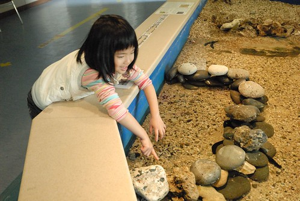 但千萬記得要好輕 好輕的摸喔~ 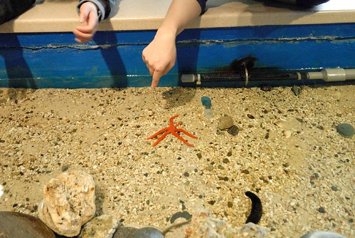 我覺得主題館設立的用意主要在於小丑魚復育觀念的推廣 所以館內的實體展示並不若海生館或海洋公園那樣豐富 但館內有很多的主題教育看板 也難怪當我們在軟體生物體驗區與紀念體部小姐聊天時 她說這裡主要是台東各級學校的戶外教學地 上門的遊客少之又少 尤其在這時節 很難得有人上門 感覺真是有點淒涼又可惜....    這裡真的蠻可愛 蠻用心的說 瞧~ 我們家的小學生阿徹拿著蓋滿紀念章的紙有多麼開心 多麼滿載而歸的模樣阿! 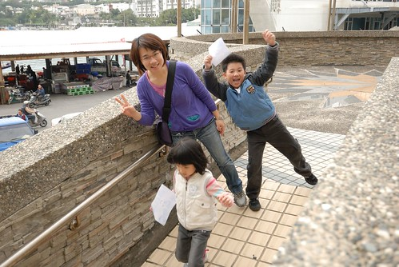
