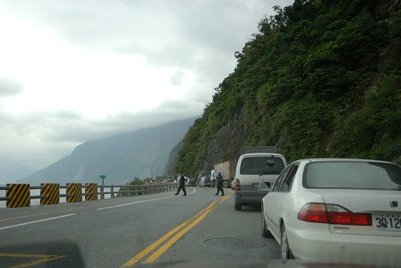
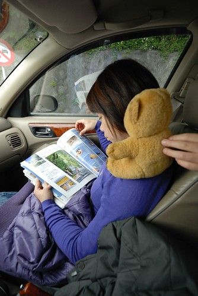
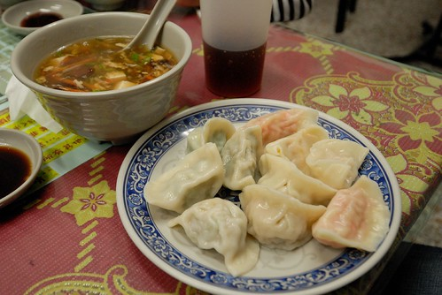
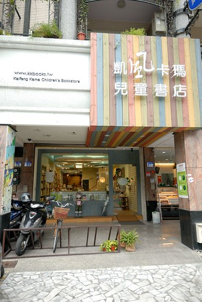
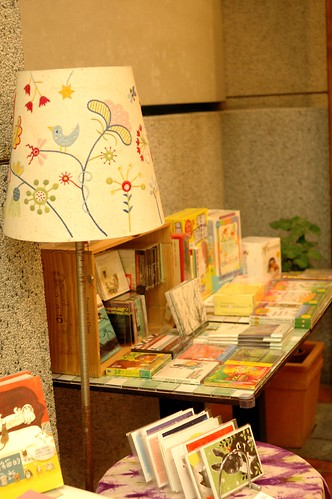

學期剛開始時 阿徹跟媽媽有致一同的感嘆著"好久沒有去玩好久 像五天那種的..." 打那時後起 媽媽便開始盤算著放寒假前來個五天花東旅行(好啦! 我知道很多人會OS著"又去花東") 安知阿徹的期中考實在考的不理想 讓我很是擔心如果阿徹的期末考依舊考不好的話 媽媽我哪有那個臉跟老師說 "我要讓孩子請假出去玩呢..." 我心想 "等一月到了再說吧! 阿徹真通過考試了 再說走就走去旅行吧" 我甚至跟阿徹"烙"話 "你期末考再不認真沒達到家裡規定 就沒有旅行了" 不過等到12月中 我的心底還是掛念起我等待已久的大旅行 且隨著做越多的景點民宿研究 越是迫切的想要把想住的民宿給早點定下來 於是我最終還是在阿徹的期末考前安排好行程且訂好所有的民宿... 而這時候不能威脅阿徹了 只好改以利誘"你如果表現OK 你知道的...出去玩常有買紀念品的機會..." 阿徹大聲抗議著"哪有這樣的...." 可是大家真要能體諒 要讓小學生在學期間請三天的連假是需要多大的勇氣 我還不敢嘗試 但趁著學期末考完試到放寒暑假的期間 請假去旅行 不只是對小學生的慰勞(我們這麼認為啦) 也可以用著較低的價錢卻有較好品質的旅行 我自首 我們真的連著好幾個學期做這種事了 只是一到三天不等... 幸好! 阿徹的期末考試有表現出認真 有達到其實不難達到的家裡標準 所以我們開開心心的出遊去嚕~  最後也開開心心且平平安安的回到家 五天中 兩台單眼總共照了近千張的照片 很嚇人! 但也代表我們的回憶滿滿! 而且這次破天荒的沒一個人說想家  第四天我們驚訝的發現這件事 以前每次的旅行雖然好玩 但我們總會在第三天便開始思念起家裡的床 家裡的熟悉 這回這樣的情緒卻一點都沒發生  是我們長大了嗎? 抑或者是這次的旅行真是棒呆了!

我們這回最終"執行"的行程如下: 雖然一些預訂的點未達到 但80%以上的執行度已是很令人滿意

第一天：台北 -> 花蓮 (秝秝飽滿餃子店, 凱風卡瑪兒童書店) -> 台東長濱鄉 真柄老舍民宿 第二天： 長濱 -> 三仙台 -> 成功鎮小丑魚主題館 -> 東河包子 -> 都蘭 來吹涼風民宿 第三天：月光小棧 -> 都蘭小房子 -> 水往上流 -> 台東 兒童故事館 -> 宿飛碟屋民宿 第四天：台東鐵道藝術村 -> 原生植物園 -> 太麻里 原木工房 -> 宿金崙丹堤溫泉會館 第五天： 大武山自然教育中心 -> 多良車站 -> 南迴公路回台北(雲林 孩沙里花田)

雖然一開始的行程安排時 我實在很想去花蓮富里的羅山村 但因為老舍民宿越看越喜歡 喜歡到非住不可 而偏偏他的訂房是最難的 於是我只好犧牲了羅山 可是最後抵定行程後  我卻是越看越是喜歡且甚至小小驕傲自己在這方面的靈活表現 因為這回從台東的最北走到台東的最南 沒一趟路是回頭路 而且連著四個晚上都住台東 這這..真是太不可思議了 畢竟台東真的很遠 以前去台東總得在第一晚與最後一晚停留在花蓮或嘉義 宜蘭 只不過這樣子就更辛苦開車的徹爸了 第一天就得從台北殺到台東長濱 而最後一天更是得趕500公里的路 從台灣最東南的太麻里經西部回到台北以完成我們的環島一圈 在此向我們家的爸爸致上最崇高的謝意! "你絕對是愛玩老婆背後的那個大支柱"

照片很多 多到徹爸依日期分批整理 而我隨著一天天的照片PO到flicker後 開始貼照片準備寫遊記 天阿! 我想我這回的遊記篇數肯定破10了 雖然我雄心壯志的想要帶NB回嘉義過年時奮戰 但...忠實讀者知道的.... 不過這回的感受真的挺特別的(我好像每次都感受很多又特別 實在有點氾濫) 所以我會加油的!!!! 話說我催徹爸整理照片的說詞是"你老婆這麼積極的洗4個人5天的衣服 你也積極的整理照片吧!"

張媽媽果然是字很多小姐  一個序又漏漏長寫了這麼多 哈哈 遊記就認真的從第一天的花蓮短暫停留寫起吧!  出發前兩天便密切的觀察蘇花的路況 知道有幾處的大工程進行著 有心理準備遇到通行管制是免不了的 幸好只有在東澳段與接近太魯閣處遇到兩次共約半小時的管制 算是幸運的 等候通行的時候 我拿出旅遊雜誌研究  拿出久未帶出門的小7熟悉一下 畢竟從他算是我的這一年中只用過兩次 真的很陌生  而徹愛兄妹則玩著爸爸的手機打發時間  一切平安順利地 我們八點初從台北出發一點抵達花蓮市區 出蘇花後大家的肚子都好餓  於是直駛花蓮市的餃子店  這是前陣子才在花蓮旅人誌的網誌上看到的餃子店 這回剛好來體驗 這是每盤只要20元的好吃小菜(小菜水準很優)  帶有濃郁柴魚香味的青菜豆腐湯(我們三人品嚐後 結論為柴魚湯頭  也不知道對不對)  店裡賣有各式各樣口味的水餃 高達10多種 從一般知道的高麗菜 韭菜 到金瓜起司 芹菜 香菇芋頭 紅羅蔔 九層塔等完全沒見過也想不到的組合 徹爸他們點了基本款的高麗菜 韭菜以及雙蔥(洋蔥+青蔥 也是獨特)口味 而我則點了一盤10顆的綜合水餃 老闆端上桌時還特別叮嚀中上方兩顆綠色的韭菜與九層塔要最後吃 以免他的重口味壓過其他的水餃 桌上也有一張紙說明著建議的食用順序 可是老實講 餃子皮一個樣 實在很難光憑眼睛分辨出每顆餃子的口味 除了知道紅色是紅蘿蔔 黃色是金瓜  (包著紅蘿蔔炒蛋的水餃 真的好甜好好吃)  待我們餃子吃一半時 老闆突然跟我們說"你們是遊客吧 吃慢一些 老闆要免費請你們吃芋頭香菇跟韭黃蝦仁口味的 蝦仁的要煮七分鐘比較久 所以要等一會" 哇! 原來看起來像觀光客也不是太糟的事哩... 就在我們吃完我們點的32顆水餃 已經有點飽的時候(愛愛的水餃戰鬥力只有4顆) 老闆送上了四顆香菇芋頭口味 四顆韭黃蝦仁口味 哇! 老闆 你會不會太慷慨啦 尤其蝦仁口味的水餃一顆要7塊錢哩 不過香菇芋頭的口味真的很特別 而韭黃蝦仁則是我與徹爸共同覺得最好吃的水餃 真是感激老闆與我們分享了這麼特別與這麼好吃的水餃 不過如果老闆可以在我們點菜時就告訴我那就更好了 畢竟要在飽的時候再吃下8顆水餃不是件容易的事 除了老闆對於觀光客的熱情招待外 另一項我們覺得很讚的事 店內提供免費的 可媲美飲料店(甚至還超過)販賣的冰紅茶 而且還是用大大的環保杯讓客人自己裝 不是太習慣水餃餡過於細碎的徹爸 因為這紅茶而大大肯定這家店 我們甚至取消了原本計畫的廟口紅茶行程 雖然來過這麼多次花蓮沒喝過廟口紅茶實在有點遜 但這裡配著水餃的冰紅茶已經滿足我們了....

餃子實在吃的太飽 往長濱的車程前得先消化一下 於是我們去一樣在花蓮市區內(其實在中信飯店那了)的凱風卡瑪兒童書店晃晃 除了之前曾經在網路上看過人家介紹這麼一家特別又溫馨的兒童書店外 去年四月在池上的伯朗大道上與店長相遇的緣分 更是讓我想來的重要因素  走進店裡就發現唯一的值班人員剛好就是那位女生 我的心裡更是高興但我不敢說什麼 徹爸也問"要不要與她相認阿" 我說有機會的話吧 書店裡燈光柔和 播放的音樂輕柔輕快  也沒有其他的客人 徹愛兩人很快的拿了想看的書 坐在小沙發上看起繪本 而我則一座一座的書架掃看過去  店裡有好幾處不同主題的書籍或個人創作商品擺放 佈置的就像一個個美麗的藝術裝置  如果住家附近就有這樣的童書店 可以常流連在書店是多麼棒的一件事  最後 我跟那位女生還是相認了 就在她問起我們是從哪裡來遊玩時  我說我們就是在池上伯朗大道上的那一家人 女生張大嘴 喔了好大一聲~  結束在凱風卡瑪的停留 下午三點鐘我們離開花蓮市驅車趕往我們今晚的下榻地 長濱 這時候 天空下著細雨.... 
