上週看到新聞說 過年期間湧入台東的遊客數比當地居民還多車輛數更高達平日的數幾倍 我想像著台東到處是車 人擠人的樣子... 我有點難以接受這樣的台東還是台東嗎 一直覺得花東最美的地方其實是在於那份清閒  不論是在時間上 地域上或是心態上 多給自己一些時間 好好的在一個村落(地方)感受那的人 那的事 那的物 旅行就是這樣簡單! 都蘭 最近幾年在台東新興的人文彙集的地方 尤其在美青姐揹了都蘭國小書包以及PASA廚房的慢食引人注目之後 月光小棧  新東糖廠 都蘭小房子 好的擺... 都是來到都蘭不可不去的好地方! 

我們的都蘭之旅 就從旅行第二天傍晚都蘭山下超市的採買開始 當我在雜貨店內 努力盤算規劃著如何省事又省錢的讓一家子吃頓像樣的晚餐時 徹爸跟徹愛竟然就在店的另外半邊開心的研究起都蘭書包 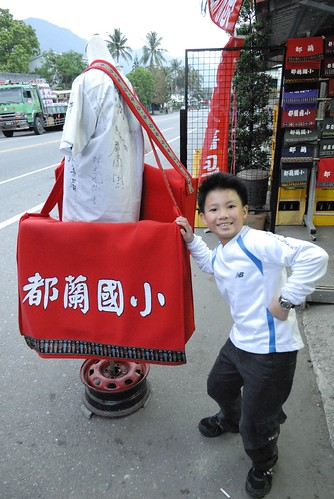 幸好起碼有等我採買食材完畢 與我介紹分享後 才讓愛愛下手買了一個適合她的小書包 雖然阿徹也好愛這都蘭國小書包 但礙於得花自己零用錢購買 阿徹接受我們的建議利用晚上好好想一想對書包的需求 有需要隔天再買不遲 不過樣本書包旁掛了張歡迎揹書包拍照的看板 我們母子三人揹起大中小書包乾過癮 這張照片裡的我們 十足的觀光客阿! 而之後的兩天旅行中 徹愛那不離身的都蘭書包更是無恐人不知似的詔告著大家"我們是觀光客" 沒錯! 我們就是很愛來台東玩的觀光客!! 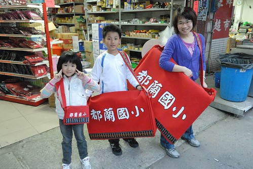 月光小棧 一個因電影而得名 且發展為觀光景點的地方 曾是林場行政中心 亦曾是土銀招待所 現由女藝術家組成的女妖藝廊認養 這裡臨山面海是個遠眺都蘭灣的好地點  而建築物的古樸寧靜更增添許多的意靜 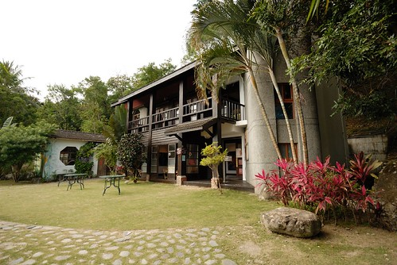 二樓是電影"月光下"的場景 被完整保留著  老實講對我那個年代的電影不是很喜歡也沒有什麼印像 只是單純的喜歡這仿日式房子的氣質 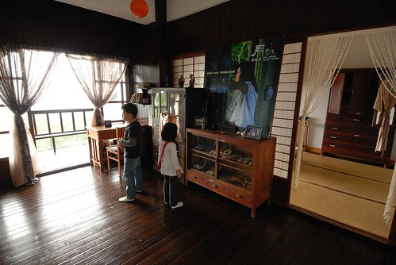 尤其是有榻榻米這間 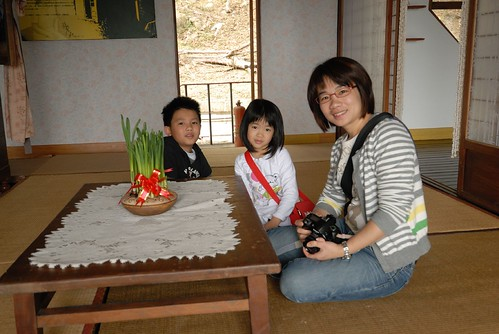 不過老實講 房間裡頭掛著一堆老衣服 擺放著一些老鞋子 雖然乾淨整齊 但那個氛圍感覺有點怪怪的..  尤其又很像誤闖人家的家裡  不過房間外的陽台 很棒 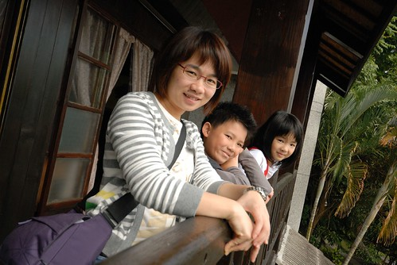 都蘭灣一覽無遺 只可惜天候未佳 大片藍天躲起來了 海也不是那麼清楚 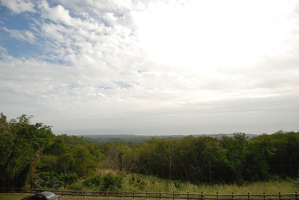 如果這是真實人家的房子 的陽台 哇!!!  我們又來假裝如果這是我們家的陽台...  豈一個棒字可以形容!  "跟著電影看風景" 就如現在的跟著偶像劇拍攝場景旅行 如果因為電影 因為偶像劇可以把台灣觀光產業的量或質都大大提升 那也是美事一樁  看到沒 過年前的非假日人這麼少 車也這麼少.. 我們快樂的享受著包場的寧靜 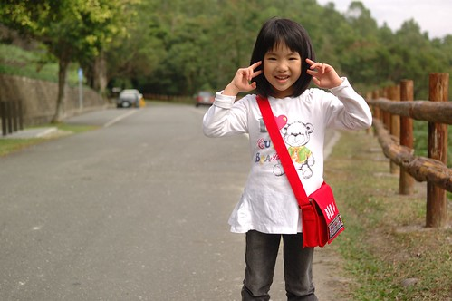 循著下山的小路 接下來要去的是新東糖廠  新東糖廠原本是東部唯一產紅糖的糖廠 但已於1981年走入歷史 現在隨著許多藝術工作者的進駐以及當地居民的熱情參與 這裡漸漸變成台東的藝術搖滾重地 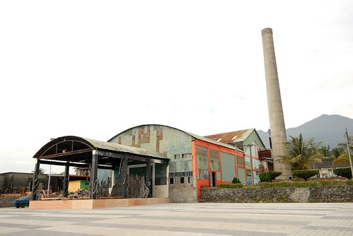 而我們來糖廠的最主要目的乃是為了一嚐網路上很有名的小房子 早午餐 沒錯就是在糖廠門口這麼樣一間簡單且開放的小房子  很明顯的可以看出小房子除了主要的水泥結構外 其餘都是用漂流木或是廢棄的框材 板材拼構成  連鍋具也都是這樣率性的掛在窗戶上的掛勾 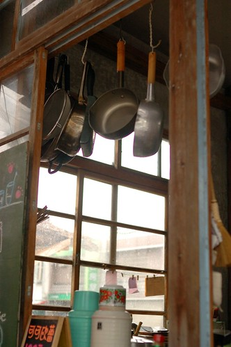 小房子裡兩位廚娘自得的提供客人現點現做的餐點 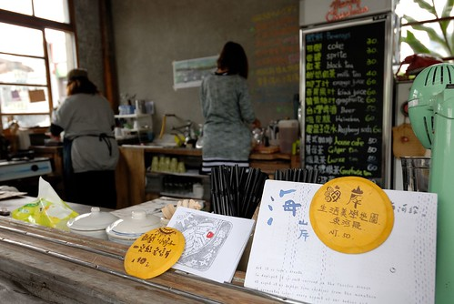 這是小房子的名片 超級的反映真實 ( 連右側的狗都一模一樣) 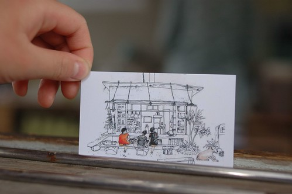 難得我也可以像背包客那樣優閒自在的坐在小房子前  像名片裡坐在吧檯前的旅人 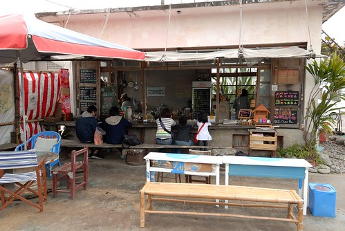 因為現點現做 所以廚娘在牆壁有交代 不能急不能催 就如她們也不會催客人離去一樣 其實這樣拖著腮幫子 苦巴巴等著廚娘上菜 應該也是來小房子用餐的樂趣之一 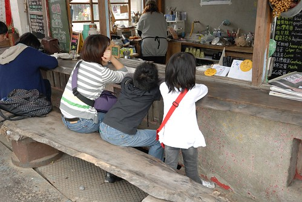 我跟愛愛的墨西哥捲餅套餐  阿徹的X肉漢堡套餐 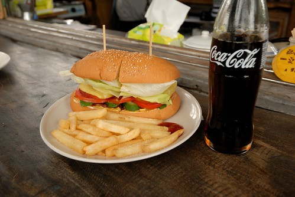 以及徹爸的德國香腸套餐  現榨的薯條與香腸都很好吃 好吃到小房子的狗一直流連在我們腳底下 飯後阿徹拿他的畫本蓋章  很大的店章吧!  一個很能代表都蘭風情的小房子  值得喜歡慢漫旅人的停留  之後 我們去同樣位於糖廠內的好的.擺手創店 店內販售許多當地住家 手創者的作品 是個想要買當地特殊紀念品的好地方  整個店不論外牆或內部擺設也都很有藝術巧思  離開糖廠後 往台東市的路上 我們順道去了"水往上流" 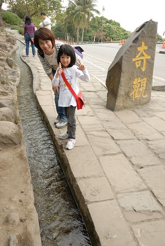 我說家有小學生 這是難得的自然好教材 阿徹也是看的嘖嘖稱奇外加摸不著頭緒 而經過徹爸的激發思考後 阿徹說以後學校有科學實驗展覽的話 他要來做一個水往上流! 小學生加油! 這才不枉行萬里路阿! 
