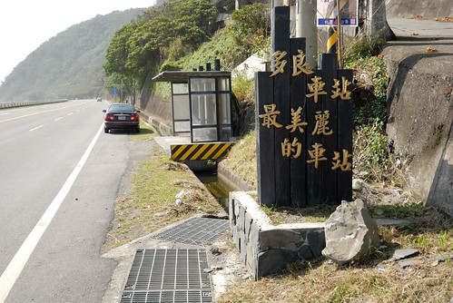

首先 要給自己拍拍手(啪啪啪~)   總算寫到這次旅行的最後一篇啦~ 這回不知道哪裡來的堅持 從第一天到最後一天  從第一個停留到最後一個停留... 洋洋灑灑總共12篇 人好像總是靠著回憶過日子與夢想著未來 寫完遊記 我總算心滿意足的畫下句點 而下回台東行的輪廓也好像出來了...

這一次突然想去台東的最南 金崙 洗個不一樣的溫泉 行程中民宿老闆聽到我們要去金崙洗溫泉 說"金崙的溫泉真的好 雖然設備簡單了些" 那的溫泉果然真的好! 讓我們的身體與頭髮都洗的咕溜咕溜的 而那的藍天與虹橋也壯闊美麗的讓人心情大開 只是兩年前莫拉克颱風重創所留下的痕跡卻也讓人滿是感觸... 

很久沒有往台東最南的方向行駛 才發現這段路竟是這樣的美麗  路上我們順道去同位於太麻里的原愛木工坊 原愛木工坊的設立為前新興國小校長感嘆於學校教育之外 更要讓學生們都有個安穩的家 讓父母可以陪伴在孩子身邊 因此協助設立木工坊以幫助失業的原住民爸爸 讓他們可以留在家鄉學習做木工 且獲得一技在身的尊嚴與滿足  工坊作品為以漂流木與原木製作的桌椅為主 每個作品都還依稀可見木頭的原形線條 非常有原創性且獨一無二 只是像我們住在小空間的台北公寓裡 實在很難有空間擺上像這樣原味的桌椅 所以我們只能純欣賞...  而且因為工作人員們已經在休息準備下班 我們也不好意思看太久 問太多  不過還是很謝謝當日遇到的原住民朋友熱情的招呼我們!  當初在搜尋金崙的溫泉時 網路上的資訊實在少之又少 店家少 來的遊客也少 讓人感覺很神祕 從台九轉進往金崙溫泉方向 行駛一段小路後便會看到金崙溫泉的地標"虹橋" 講真的這虹橋的前跟後的路實在都不大 突然出現這麼座大橋實在有點奇怪 這座虹橋大概是整個金崙溫泉區裡唯一顯眼又很觀光性的地標  我們住在溫泉區裡的丹堤溫泉會館 會選擇這家最主要的就是因為濃濃的原住民風格以及廣受好評的原汁溫泉  雖然稱為會館 但其實建築物很簡單 房間數也不多 但環境清爽又幽靜  大門口旁立著的陶壺與琉璃珠是當地排灣族的三寶 且陶壺口不斷的冒出地底下溫泉蒸氣 除了增添神秘也代表著這裡可是金崙溫泉的源頭  我們的房間是有戶外露天溫泉池的雙人房 一如其他原鄉住宿的簡單但乾淨  這是房間的戶外泡湯區 雖然又真的設備很陽春(不管在北部或中部應該都很難看到這樣的泡湯池吧) 但院子很大 泡湯的池子也大到我們四口人窩一池還綽綽有餘  趁著用晚餐前 我們趕緊去泡大眾SPA池 供使用的兩個泳圈讓阿徹漂的不亦樂乎 愛愛也游的不亦樂乎 而泡完湯後 再來顆台東的陳記麻吉 更是不亦樂乎阿.. (同時間爸媽看著電視上大選開票結果也是不亦樂乎)  大選的關係 會館的廚師放假回家了 會館工作人員介紹的餐館也沒營業 於是工作人員很熱情且好心的介紹我們去且還帶我們去逛夜市 雖然去之前 工作人員就說明就是個只有8-9攤的小夜市 他還能清楚講出賣的攤販 但當我們真的走進這夜市時 還是忍不住嘖嘖稱奇 因為真的好迷你阿  徹愛應該很驚訝於這樣的夜市 但對住在這的人來說這可是每週一次的小期待與小幸福阿  我們買了東山鴨頭 飲料 以及小薯條 當中薯條的包裝實在可愛的很酷  雖然東西比不上西部夜市的好吃 但這意外的小夜市還是讓徹愛很開心  把在夜市買的食物帶回會館 再加上點卑南蠻頭便是我們今晚的晚餐 中午的野菜鍋大餐後 這樣的墮落很剛好  在那一晚 大選結果出來了! 幸好並未讓我們這次的出遊留下遺憾 加上洗了個舒服的溫泉水澡 我們睡了個好覺 隔天一早六點多醒來後急急忙忙的跑去開戶外湯池的溫泉水 想要趁著大清早來個一泡 徹愛跟著噹的很快便清醒 等著泡湯  而睡眼惺忪的徹爸則有點難以理解我們怎麼這麼勤奮的一大早便要泡湯  溫泉水比我想像中的熱很多很多 所以前一晚先盛冷的一丁點溫泉水根本不夠冷卻 於是只好開一般的冷水來中和 我看著冷水大量的注入 心痛阿.... 下回再來 我ㄧ定要在前一晚就裝滿溫泉水 冷卻到大清早後絕對就是溫度剛剛好的100%原汁溫泉阿  不過這2-30%的溫泉水也還是咕溜 咕溜的讓徹愛很滿意  雖然其實戶外湯池的能見度很窄 但我就是想拍下在這藍天白雲下的溫泉感動  泡完湯 打包好行李後 去餐廳用早餐  地瓜粥 多樣的青菜 從高雄運來的豆漿 剛好補充我們前一晚不足的營養  吃完早餐 我們邊散步邊走路去附近的大武山生態教室 才走出會館 我跟徹爸驚呼著"這陽光映著的山頭真美"  這樣的林像跟我大學在南橫健走時所感受到的很像 原始 美麗又神祕  只是會館往虹橋這段路的路況很不好 加上溪旁毀損的房宅與溫泉游泳池  顯見兩年前八八水災的重創  希望以野溪溫泉聞名的金崙 能再開創出屬於他們的一條路!  來當地觀光/消費絕對是幫助當地最簡單與最直接的方式  所以徹家要努力的趴趴造!  本來覺得虹橋在這裡顯得有點突兀 不相搭 但走在虹橋下 抬頭看見藍天白雲 才發現這樣的色彩搭配還真是美  走過虹橋那一頭 隱身於草叢之後的便是我們要去的大武山生態教育館 徹爸跟徹愛又問"這裡真的可以去?" 這次旅行中 我盡帶著他們去偏僻的地方 他們總是忍不住存疑著  大武山是台灣最大的生態保育林 除了研究外一般人是難以進去保育區內的 而這個教育館的設立主要是向民眾推廣/教育生態保育的觀念  我們進到館內後 工作人員便很熱烈的問我們要不要看影片 有生態及人文兩個影片可選擇  雖然我們原本很想一起都看吧 可是一部影片25分鐘 兩部看下去恐會延遲我們回家的時間 於是我們選擇了徹愛比較感興趣的生態影片 講真的 如果不是這回來到這 我真的不知道台灣有這個保護區 也不知道這裡的物種如此之豐富 影片中說 如果台灣還有雲豹 那麼大武山是最有可能出現雲豹的地方 只是目前還一直未見牠的蹤跡 看完影片回到大廳 工作人員又很熱情的問徹愛要不要玩闖關遊戲 阿徹原本很害羞 可是聽到有小禮物可以拿立刻躍躍欲試  愛愛也在徹爸的協助下完成兩個闖關遊戲  透過貼紙的黏貼配對 讓小朋友多認識不同的鳥類與蝴蝶生長的過程 只是好像每每當下的恍然大悟 "哦~原來是這樣阿"  回家後還是都忘光了  不過我想這樣的滋養應該加減有埋進徹愛的心田裡吧 尤其是那個小學生..  阿徹完成闖關遊戲 阿姨很認真的幫他看答案跟他解說不對的地方 然後用著超有活力的聲音與表情頒發禮物給阿徹  拿了貼紙 L夾 鉛筆..好多小禮物的徹愛好開心! (話說二樓生態展示區的這雲豹醜的有點搞笑哩)  我們很快的瀏覽過二樓的生態展示區後 原準備就打道回府了 結果等候我跟愛愛上廁所時 徹爸跟阿徹一起去看一樓的人文展示區(闖關遊戲時我便先看過) 這一看不得了了... 待的時間出乎我們意料外 比看兩部影片還久 因為當地的原住民解說員老師跟我們侃侃談起當地魯凱族與排灣族的文化與異同處  從服裝 屋葬 頭目沿襲...談到台灣九族的由來以及實際原住民部落的畫分方式 很豐富且寶貴的一堂人文課!  當我們開心的走出教育館時 徹爸說"以為來一下而已的 沒想到竟然待了這麼久"  這時後已經快11點了 然後當我們兩人說起那個解說員老師真的好帥時 徹爸說"要不要回去跟老師照張相" 哇! 這更是出乎我的意外! 因為實在很不像徹爸會有的舉動 老師也很可愛 說那他得先去穿上他的衣服(原住民風格的工作背心) 於是我們先跟一直熱情招呼我們的解說員阿姨合照一張  解說員阿姨幫我們全家跟老師的合照 拍照時 阿姨問"西瓜甜不甜" 看來徹愛的瓜笑的很甜  拍完照 老師又去拿了本介紹東部蝴蝶的書籍送給阿徹 阿徹更是笑得合不攏嘴了 他說"這回的旅行真是大豐收 好多禮物阿"  謝謝大武山生態教育館的老師與工作人員! 有機會必定再次拜訪~  離開大武山 離開金崙 我們要啟程往回家的路上了 走到台東的最南 繞過南迴公路 經過屏東 再接上高速公路 500公里路途的趕路是我們旅行的最後半天  不過再怎麼趕路 還是要在台灣最美麗的車站停留一下  還沒看到車站 但卻已看到令人驚艷的海 這裡的海跟花東海岸線上的就像是分屬不同類型的美麗女孩  把車停在台九上 我們用走的去找車站 正中午時分走著陡斜的路 讓徹愛走的汗流浹背 我說這個冬天難得可以這樣曬太陽曬到流汗阿  要開心 要珍惜!  只是好不容易到車站了   阿! 怎麼都被藍色欄杆圈起來了  這樣要怎麼像人家網路上PO的那樣 站在月台 倚著紅色欄杆 看著最美麗的海景ㄋ? 當然 基於火車安全考量 這樣處理停用的車站是合理的 只是這樣子就感受不到招牌上所寫的"最美麗的車站"了  應該就如徹爸說的"真想要進去就會有辦法進去"   但保守的徹家還是乖乖的離開了 下山的路上 迎著的這片海 其實就真的好美了阿~  真的! 我們要告別台東 快馬加鞭的趕路回家了  慢漫台東旅行  真的很放鬆 很愜意 也很開心 五天的時間說長不長 說短不短 但對我們家來說剛剛好 沒有什麼但又很有什麼的行程 對我們來說也是剛剛好的步調 回家後 徹爸說他之前不舒服的眼睛都不痛不紅了 嗯~ 可見這樣的旅行真好~  下次還要像這樣去旅行~~~

最後再給自己一次拍拍手(啪啪啪) The End~

本篇遊記於瘋台灣台東民宿網同步發表 [taitung.fun-taiwan.com/HouseTravelNotes.aspx](http://taitung.fun-taiwan.com/HouseTravelNotes.aspx?hid=003-123)
