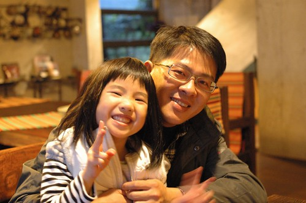
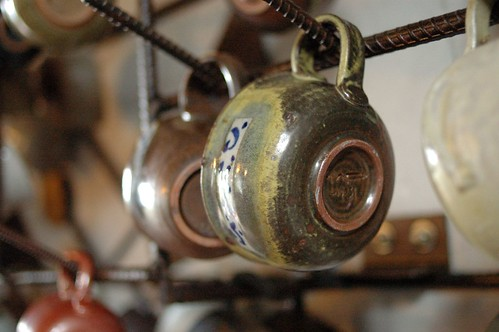

目前的真柄老舍已易主與改名 雖注入了另一"精神"與品味甚且更是美麗的民宿 但已經不是原來沈靜內斂的老舍了...Jan2013

我很喜歡這次行程的最大原因是每天都住民宿 而且還是風格迥異但都很特別的民宿 讓民宿不只是個過夜的地方 更也像是我們旅行中的重要停駐景點 每天我們傍晚時分來到民宿 除了外出用餐外 其餘的時間就是待在民宿裡"休息" 直到隔天早上近中午的退房時間才離去 這樣的安排 讓我們每天的早晨時光過很快 讓我們的旅行很愜意 而當中 第一晚住宿的真柄老舍民宿最是讓我們印象深刻.... 

以前就看過幾篇其他格友所描寫的老舍 每每都留下深刻的印象 而這回仔細的研究一下老舍以及其他長濱的民宿後 更是喜歡長濱這個有點遺世獨立(因為距離花蓮市跟台東市都一樣的遠)的小鄉 真像是個隱身台灣後花園裡的桃花園阿 這裡其實什麼都沒有 沒有景點 沒有名產 沒有熱鬧 沒有人潮... 但這裡真是依山傍海 感覺身在山中但又到處看見海 聽到海 近幾年 長濱漸漸有了一些特色民宿 每一家民宿都很個性 很安靜 很遺世... 讓越來越多的旅人喜歡來這裡沉澱休息 只是當然爾 大半的民宿也因此拒絕12歲以下兒童的入住 畢竟大部分的兒童仿若一顆顆不知道威力的未爆彈 所以為了在長濱住一晚喜歡的民宿 我只好努力的把行程配合少數接兒童客的老舍 而幸好老舍是我最愛的那一家 且住過後也真讓我們好喜歡....  從花蓮往長濱的一路上 雨很細但天很陰 且長濱真的是個小鄉鎮 沒有路名 只有地名(城市的里)加號碼 而且糟糕的是 街道上大部分房子都很老舊 經歷過許多的修繕改建 可以用來辨別的門牌幾乎都不見了 常車子一開就不知道街道號碼跳到哪裡去了 因此我們沒找到想去的天主堂(吳神父腳底按摩) 在往老舍的小路上也不小心被導航系統導到死徑裡 養著幾條狗的農舍 因為小狗旺旺叫 因為路很小又很泥濘 阿徹說他緊張的直發抖著 直到我們發現原來老舍就在不遠處的荒煙蔓草中 阿徹跟愛愛兩人異口同聲的問"這裡有住人嗎 好像廢墟耶" 我笑著說"裡面很棒的 相信我" 果然 當民宿主人打開門讓我們進到屋內後 阿徹驚呼著"好漂亮喔" 而愛愛則說著"好香喔" 民宿主人聽了後有點害羞的說"好香?!" 或許這是溫暖散發的香氣!  民宿主人林先生 正在房內替我們的被子換厚棉被 他說這兩天突然天氣冷需要厚棉被 (這裡到現在才需要厚棉被真好 台北又濕又冷好久了說 ) 於是我們先在客廳等候 溜達  客廳裡厚實的木桌椅 加上溫馨的黃燈   讓我們有別於屋外的濕冷 一整個溫暖了起來  待林先生換好棉被 我們進到一樓唯一的房間 也是民宿唯一的四人房後 阿徹跟愛愛又是哇的好大一聲讚嘆 阿徹一看到榻榻米通鋪就說 他今天晚上要睡這(孩子當然是你們睡這)  通鋪的另一側是風格迥異 牆壁與床被色調感覺就像是爸媽睡的雙人床  有著浴缸的大浴室 (雖然有浴缸 阿徹也嚷說要泡 但我跟徹爸覺得泡湯真的很"花"水)  徹爸去客廳挑了張安立奎的CD 在令人放鬆的拉丁歌曲下 我們四個人在房間內各自放鬆休息著 徹爸躺在床上用手機上網  我看著從客廳拿的女孩  愛愛則在她的畫本畫畫  很安靜閒適的一小時 直到六點鐘出門去吃晚餐  晚餐回到民宿洗完澡 徹愛各自看了點卡通 玩了點小遊戲 然後我們窩在榻榻米上玩樸克牌99與撿紅點 我本來心裡覺得這樣的夜晚 沒一家子在民宿寬大又溫暖的客廳裡活動 實在很可惜(尤其今晚又只有我們這一組客人) 後來轉念想 就這樣子窩在房間裡其實也沒關係 或許這是我們家最自在 自然的方式  九點半徹愛上床沒多久 我跟徹爸也跟著一起睡了 不知道是太早睡的原因 還是太想起來把女孩看完  清早六點我便醒來 於是我躡手躡腳的走到客廳一角的閱讀區 看我的女孩 這時候窗外的天還是黑的 而屋內只有走廊的燈與閱讀區的燈是亮著...

前一天跟主人確認了八點用早餐 趁著用餐前我們到二樓的長廊區晃蕩 民宿一開始最吸引我來的便是這長廊上的長椅  坐在這 人要不空很難...  望著窗外的山 發呆是最好的一件事  小人還太小 應該還不能體會空的幸福  但是阿徹很喜歡這個有著許多A夢漫畫的閱讀區  一早上 大半的時間與最喜歡的就是窩在這裡看漫畫  很棒的2樓發呆與閱讀區 這是老舍最令人難忘的角落  林先生吆喝著我們可以吃早餐嚕 趁著早餐上桌前 我跟阿徹又賣力地K著我們的書  因為看過大半格友的介紹 都是自己DIY廚房內提供的早餐 我很是訝異今日是主人烹調的精美早餐(林先生說是過年期間客人DIY 但我看到不少暑假來的也是DIY)  小人也有兒童版的早餐 香腸+薯餅+起司火腿菇菇蛋(這是我自己取的名字 很好吃的蛋) 愛愛很開心她也有她自己的一盤與刀叉 大口大口吃著...  中間主人又陸續端上 溫牛奶 水果與咖啡  好豐富的一個早餐  我們慢慢的享受我們的早餐 餐畢又各自繼續看著書 我喜歡這樣的一個畫面... (左上角就是早上我看女孩的閱讀區)  因為我說 "女孩沒看完 我不走" 徹爸跟徹愛只好認命的等我看完書 期間徹爸還跑回房間床上躺 然後不小心就睡著了 徹爸說這的床真是好睡!  等到10點鐘 我總算看完我的女孩  一家子就又混到二樓的長廊去了  聊天  看書  瞎玩  還跑上房子頂樓看看前方的海(可惜天候不佳)  後方的山  真是好特別的房子 好棒的長廊  長廊連接著二樓的四間房間 也串連著一樓到二樓  而陽光透過長椅也照射著一樓的走廊  我問林先生 當初怎麼會想到這樣設計房子 親自設計 建立與打點這個房子的林先生 很靦腆的笑了笑 但是聊天中 林先生強調好幾次房子與四周環境融合的重要性 一個不突兀 冬暖夏涼的房子才是真的好房子! 不知道是否因為我們主動請教很多有關的房子事 在我們準備要離去前 林先生主動地跟我們提及(語重心長 特別強調的樣子) "裝潢帶不走 但好的傢俱會增值 要多多利用傢俱來裝置房子 (這才是正道)" 很謝謝林先生與我們分享這麼多他的經驗! (屋內的鐵製品也都是林先生自己做的藝術品喔)  這樣一聊一往中 我們在老舍的時間越呆越長 好像有點捨不得走..  對了! 都忘了去院子走一走ㄋ..  徹愛嘻弄著池子裡的魚 而我跟徹爸則又是研究起房子的建築外觀 (樓上四間房間 與樓下的客廳與房間都有可以看見大海的大開窗)  民宿旁透過一個房間通連的房子是主人的家 這樣似獨立但又有個點連在一起的設計 讓客人與主人各自保有隱私空間但有需要時卻又就在你身旁  不小心就這樣到早上11點了 前一天晚上沒能吃著長濱有名的"長濱100"時(我們晚上六點初頭去竟然就全部空空了) 我們打趣說"隔天早上來呆到中午 好去吃長濱100  " 我們很想知道到底是多麼的好吃 好吃到到晚上六點就沒東西可賣 想不到今天早上我們竟然真的就這樣不知不覺到快要吃中餐的時間才離開老舍   離去時 林先生站在房子門口跟我們鞠躬 揮手說再見 我說一種好有日本達人的FU喔 也好讓人滿懷溫馨 就像房子一樣 車子開出老舍的小徑 徹爸下車回頭再照了一張老舍 就是這樣一間隱於綠意中 完全不突兀的老舍  順著朝著大海方向的產業道路 我們離開第一晚的民宿 開始接下來的行程....  

後記1: 這是為了打發去吃長濱100前的空檔 林先生建議我們可以去看的梯田花海處 雖然沒有看到茂密盛開的花田 但筆直的東13道路很漂亮哩  可以想見當道路兩旁的稻田即將豐收時 那會是幅多美的景色  後記2: 打發時間的同時 也為了一解前一日找不著天主堂的疑惑 我們用導航系統 用google map繞了市區兩圈後(市區非常小)總算找到天主堂 下回我們再來長濱 就不會迷路了  這是天主堂對面一戶人家 老屋綠改造一書裡有介紹過  這曾經是一個荒廢許久的老屋 現在卻是這樣美麗 真棒!  後記3: 就在我們找到天主堂的同時 我也電話確認到長濱100今天中午沒營業啦! 真是超級令人失望! 這下子除了稻田外 又多了個讓我們再來長濱的理由了! 下回一定要吃到長濱100! 但是今天中午就只能靠我們出外的好朋友了  關東煮 國民便當或泡麵 是我們家今日意外的午餐內容!  後記4: 回家後上班的第一天 我忍不住又上網看了格友分享的老舍 而想不到 徹爸也自己上網找來看 徹爸說"怎麼覺得我們的老舍比較蕭條" 蕭條? 我說很難訂房 生意不錯阿! 徹爸說是感覺不像別人拍的那樣生氣盎然! 我說或許因為屋外的稻田現在都休耕的原因吧! 所以說啦! 我們應該在6月稻田結穗時再來感受一次老舍的美與夏涼!

補充: 原來老舍的難訂房是在於主人一般只收2-3組的客人 只有過年期間才會全部房間都開放 我想這是主人衡量自己能力(全部夫妻倆自己打理民宿)與生活品質下的好辦法吧!
