雖然感覺BLOG都快變成旅遊版了 可是我還是要努力地寫 盡力地寫 這樣才能讓我們的回憶儘可能的完整保留 因為我跟徹爸好愛回味BLOG裡的小阿徹  小愛愛 還有那些年我們所經歷的點點滴滴...

台東前兩晚的住宿都是我喜歡且嚮往許久的特別民宿  獨立 寧靜(還都沒有電視 ) 因此第三晚刻意的選擇熱鬧的台東市內的一般民宿  有電視可看算是對徹愛的犒賞 不過民宿還是頂特別的 造型特別 名字更是響噹噹的引人遐想 "飛碟屋" 什麼? 有飛碟降落在台東? 什麼? 我們要去住飛碟屋? 結果搞了半天 原來媽媽訂的是飛碟旁邊的一間小屋子啦! 不過我們一家子還是彷若見到飛碟般超High的 在飛碟前面留下這歷史見證的畫面 我好喜歡這張全家福! 四個人的YA都好奔放 且臉上的笑容更是無價地大大綻放著! 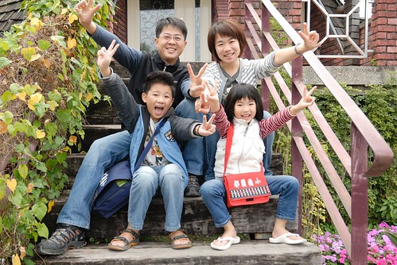

飛碟屋是民宿主人從國外進口 原型組裝而成的全木造建築物 房子外觀遠遠的看就像是一個降落在地球上的飛碟 聽民宿主人說 建築物軸心本來是真的可以轉動的 只是現在固定住了 還真是一顆好厲害的外太空來的飛碟阿!  剛到民宿時 阿徹以為我們要住在這麼酷的房子裡 我"說不是啦 是飛碟後面的一間小屋子"  阿徹直嚷著我要住飛碟裡面 主人說 沒關係!就都先參觀看看 等看過之後再決定 其實當初我是被這飛碟的外觀給吸引而來沒錯 一開始也是很想有住在裡頭的酷體驗 可是後來看到一些網友提及 因為房子結構為木造 所以一樓房間裡可以感受到樓上人們的走動 而偏偏四人房都是在一樓 幸好民宿在飛碟旁有棟獨立的小屋子  是我也很喜歡的簡單小巧樣子 所以我最後還是決定飛碟屋民宿但卻沒住飛碟屋 那天民宿主人帶我們進去飛碟屋參觀也大略介紹建築物的結構 真的是蠻酷的 但是屋內 不知道是地毯的原因 還是沒開窗怎樣的原因 感覺有點潮 所以很重視房子通風性的我跟徹爸最終還是決定住小屋子 (阿徹當然是一陣哀號)

小房子就從飛碟屋右側小徑走進去 (話說民宿整各庭院區還蠻大的 而且整理的乾淨美麗 看的出花很多心思)  黃色的小房子 特別有種溫馨可愛的感覺 而且房子外還有個大陽台(就房子比例來講 我覺得很大) 更讓小房子有種秘密私地的感覺  而房子內鋪有木地板(我最愛住木地板房間了) 而布置算是有那麼點南洋風 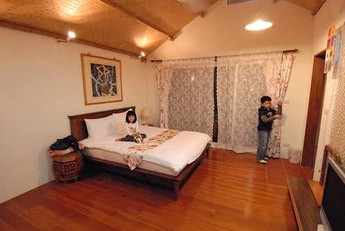 乾淨 簡單又清爽 是我們家喜歡的風格  讓原本嚷著要住飛碟屋的阿徹也很滿意  而且更感心的是 不過是兩千初頭的房價 竟然房內還放了一大盤水果給客人 上頭有兩顆蘋果 三根大香蕉(因為前一天才買了好些香蕉 這三跟香蕉跟著我們旅行回台北 然後最後過熟被我做成香蕉蛋糕了) 以及一大把的小番茄 真的有很超值的感覺! 而等我們外出用完晚餐再回來後 民宿主人也幫我們鋪好加床的雙人床墊 上頭還有兩個枕頭及一條雙人被 讓只有算一個加床費的我又更是揪感心的ㄚ 真的! 慷慨與貼心是好民宿很重要的特質!  那晚有了電視 阿徹跟愛愛還是跟平日(前兩天)一樣時間睡覺 但我跟徹爸總算熬過11點睡覺 然後一覺到天明 早上七點多醒來 拉開窗簾  享受戶外美景 向來很會觀察的愛愛果然了解她媽媽 竟然說"等稻田有水了(她意思是長稻子了) 一定很漂亮 我們再來住" 果然是我的寶貝女兒阿! 我聽的哈哈大笑! 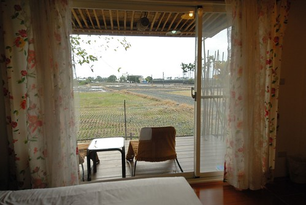 徹愛盥洗換裝完畢後便迫不及待的去外面陽臺 因為要去坐搖搖... 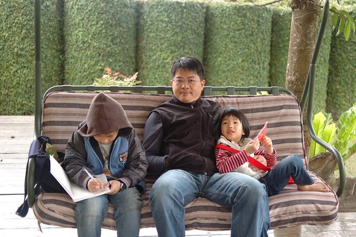 於是當我忙著在屋內整理行李 父子三人便這麼愜意的一直在搖阿搖  愛愛很喜歡這樣的搖椅  一臉幸福的樣子 幾天前我們去B&Q 我陪著她坐搖椅時 她還跟我說"如果我們家有這搖椅 以後我跟我男朋友就可以一起坐著搖了"

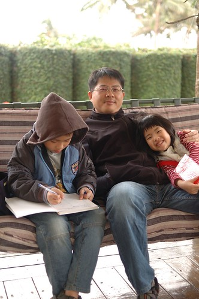 現在年紀小 依偎在爸爸懷中搖阿搖也是粉幸福滴 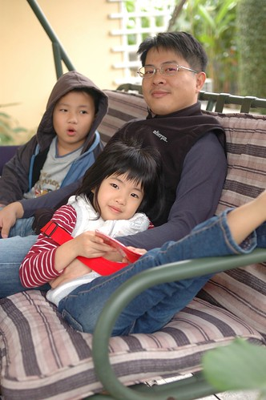 真的 他們父子三人搖的超愜意而且還都沒人要起身換我搖 (那各打開的小櫃子 裡頭放了四雙拖鞋: 爸爸的 媽媽的 老大小孩的 小的小孩的 完全不同尺寸 雖然小孩尺寸不符徹愛 但又明顯感受到主人的小用心)  我說來去跟飛碟屋照張紀念照吧  硬要徹爸幫我照張我ㄧ指撐飛碟的模樣 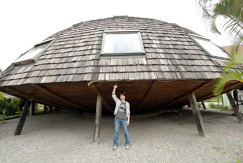 徹爸嗤之以鼻說我那樣照太八股 這樣拖住才酷阿(這是徹爸指導的動作)  然後我們打算去飛碟屋的正面來個全家福大合照 總算可以穿夾腳拖的愛愛好開心 腳步好輕盈  先來個媽媽單人版試鏡一下  徹爸準備中的我們三人 表情都好醜 但愛愛的表情很鮮 完全不同平日甜美形象  總算第一張的全家福 大家有點ㄍㄧㄥ  人有點小 而且徹爸的腳好像不知道該怎麼擺  第二張 開心了 也漂亮了!  然後是好開心 好開心的YA版!  照完全家福 我們也準備要離開民宿嚕 因為民宿的早餐是M的早餐兌換卷 被不愛M的我們用房價扣抵掉了 所以我們得要出門去市區內吃早餐 最後要進去房間拿行李時 徹愛兩人又忍不住在床墊上翻滾 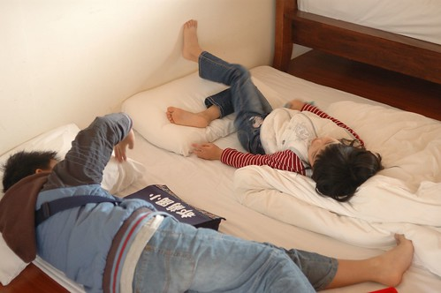 這是旅行中 另一種的方式的愜意早晨 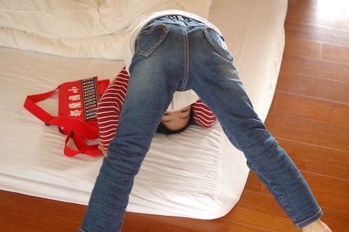 都說要走了 結果秀皮的愛愛又說手受傷要黏起來 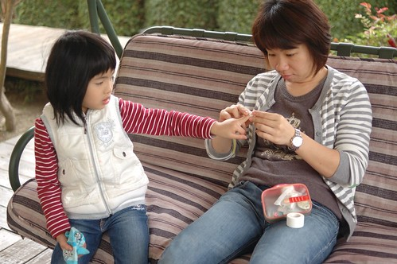 然後 我們又忍不住在這搖椅上搖了起來... 這搖椅果然是這民宿最愜意的角落阿  媽媽當初訂房真是訂對了 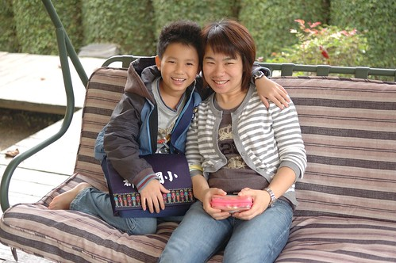 除了搖阿搖 也發現小房子旁開的可愛小紅花 好像洗奶瓶的刷子喔 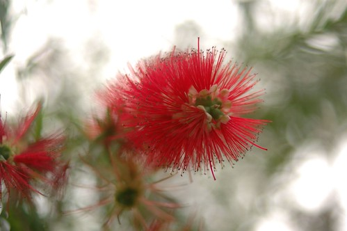 而這是花謝後 留下的花杔 好像一串鈴鐺樣  真是可愛又特別的植物  然後 我們真的要離開民宿 去吃早餐了!
