昨天晚上我寫完BLOG 徹爸即時看完後開口說"該不會接下來早餐又一篇了" 我哈哈大笑 "對阿! 這次你有看出來我的伏筆 我的梗喔" 這次在台東吃的東西都蠻好吃的 加上這次旅行完全的走愜意路線 難怪乎我們那個又懶又愛吃的阿徹這一趟玩的非常開心 還特別跟我交代說"這次的旅行 我真是太滿意了 玩的很開心 吃的也很開心... "

第一發就從徹爸修完車來接我們後開始 從中午在都蘭小房子的輕午餐到下午五點 我們四個人的肚子早已餓的咕嚕咕嚕叫 於是我們去吃了臭阿徹這一年超愛的臭豆腐 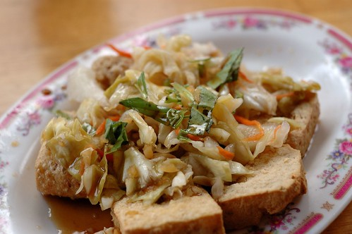 林記臭豆腐 還是一如我印象中的口感與好吃! 不過如果跟去年吃過的玉里橋頭臭豆腐相比 我跟徹爸還是比較喜歡橋頭臭豆腐 可是阿徹卻還是猛吃邊說"都一樣好吃!" 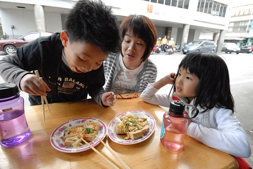 不過林記的豆腐真的比較小也比較酥 連愛愛都可以如吃餅乾般的拿著吃哩 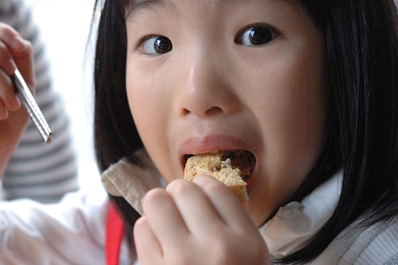 吃完臭豆腐 接著我們去同一條路上沒多遠的寶桑豆花 雖然寶桑湯圓比較有名 不過我們家比較愛吃豆花 尤其是我們母子三人特愛吃豆花 因此我們選擇寶桑豆花當作我們的甜點 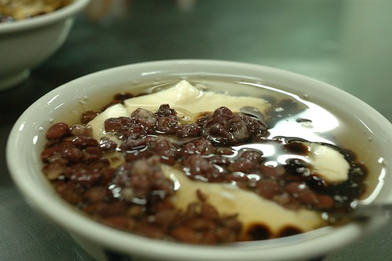 愛愛每次都是吃粉圓豆花  她喜歡嚼著QQ的粉圓 而阿徹則是喜歡紅豆或是綠豆豆花 他說他好喜歡吃紅豆跟綠豆 但是兩個豆子不能混一起喔 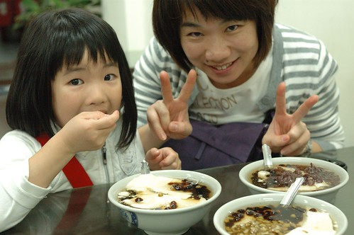 這時候的徹爸看起來有點疲倦 真是辛苦他一下午了!  臭豆腐跟豆花是我們的下午點心 而我們的晚餐則是來到我事前做功課研究出的幾個選擇之一的伊亞咖啡 覺得經過一下午半天的折騰 應該犒賞一家子吃頓像樣點且特別點的晚餐 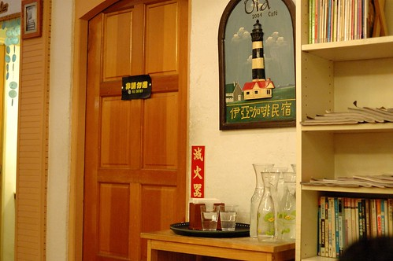 徹爸跟徹愛分別點了一樣主餐 也都升級為有湯有飲料的套餐 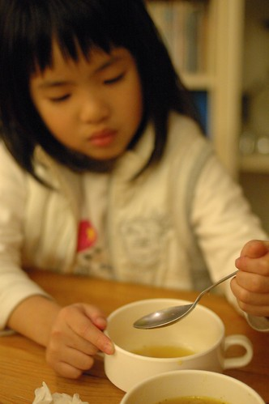 三杯飲料上桌時 我們四個人頓時都清涼了起來 也滿意起這頓晚餐 由左到右分別是徹的水果茶 愛的紅茶 徹爸的檸檬汁 都好漂亮且好好喝喔! 尤其是那兩天直想著"如果可以來杯檸檬冰沙"的徹爸更是滿足的不得了 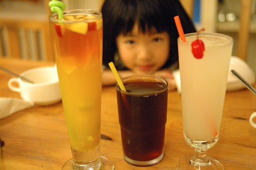 等候參點上桌前 我不太好意思的到吧檯前東張西望 看著吧檯上一桶桶的手工餅乾 以及冰櫃裡有著自製DIY樸素模樣的糕點  好想每樣都來一口喔 我喜歡這樣賣著有家裡味道的小店 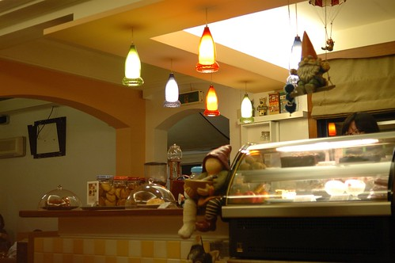 愛的餐首先上桌了 "白酒蛤蠣麵"  這是愛愛最愛的義大利麵口味 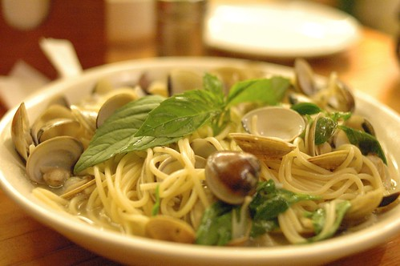 話說那個份量真的好多 蛤蠣更是真的好多阿! 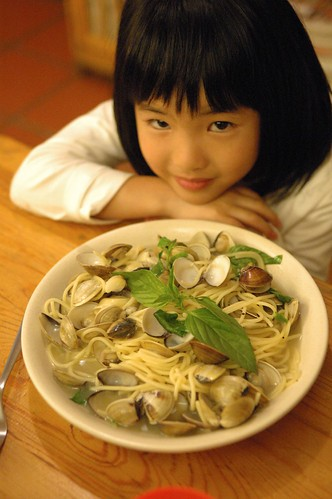 阿徹的肉醬義大利麵  最平民的口味是阿徹最喜歡的義大利麵 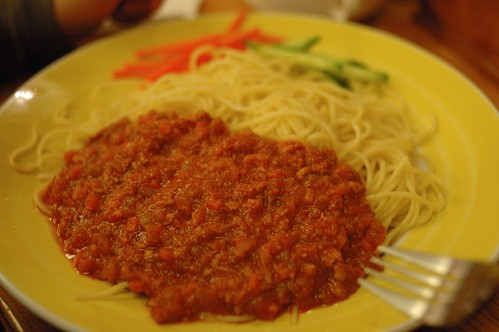 不過這個肉醬真的好吃 是今日三樣中最讓我驚艷的 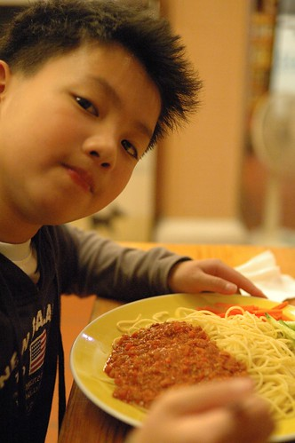 徹爸的奶油雞肉飯 也是好大一盤 口味很特別也很好吃 但是白醬的東西吃久就是容易會膩.. 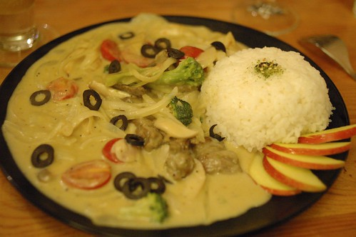 只有三盤主菜 那媽媽ㄋ? 媽媽吃什麼? 我就是拿著一個碗 這一盤吃一點 那一盤吃一點 然後等著最後收拾愛愛吃不下的 不過愛愛真的很愛蛤蠣麵  吃的好認真 好賣力... 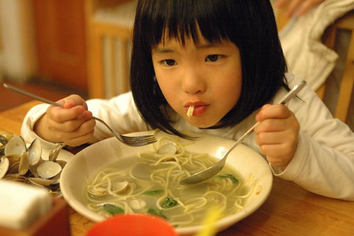 愛的OS: 真的好好吃阿!  愛的義大利麵上桌時 服務員還同時送上一個小盤子 我以為是因為我們四個人 所以他是貼心的要讓沒主菜的那個人使用的 結果小姐說"這個盤子是裝蛤蠣殼的" 而愛愛還真的嗑了滿盤子的蛤蠣.. 難得努力吃東西的她 反倒讓我忍不住提醒她夠了 不要吃太多了... 而當天晚上 愛愛的肚子果然有點小怪須要吃太田 然後她就也明白就算是喜歡的蛤蠣也不能一下子吃太多了 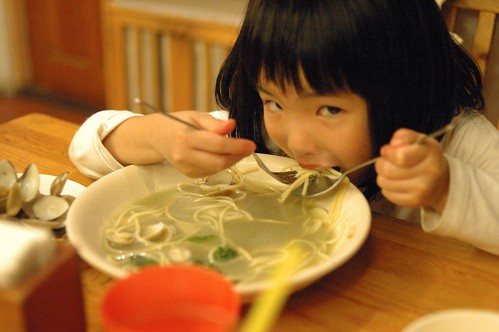 雖然吧檯上的甜點 每樣我都想嚐 但是想到我們四個人的甜點胃都好小 最終我還是只點了一個草莓奶酪 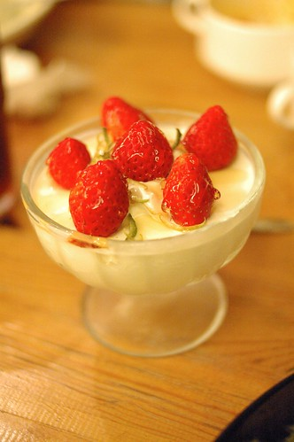 有著新鮮草莓的原味奶酪是徹愛喜歡的甜點 吃玩甜點 喝完飲料 我們滿意地結束我們的晚餐 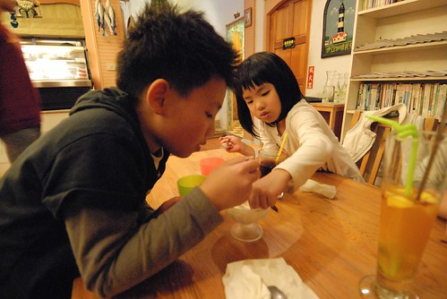 飯後走出店門口 才發現一旁原來是鐵道自行車道 且剛好有著休憩小地方 我們散步了一下下 坐了一下下  感受台東夜晚的美好!  隔天的早餐原本要去網路上頗多人推薦的有時散步 我們依著導航系統好不容易找到 結果竟然沒開... 今天是週六耶 我怎麼都不會想到有餐飲業會在週末休息的(唯一能解釋的就是今天是投票日) 所以並未有準備其他的店家選擇 想要隨便找一家早餐店解決就好 又似乎不是件太容易的事且怕踩到雷 於是乾脆要徹爸把車子停在路邊 用手機上網搜尋 我知道名字的另一家早餐店"藍色日出" 依著導航系統指示 經過這兩天走過好多遍的不是新生路就是更生路 總算快要可以吃到早餐了 (前一晚 因為要找藥局買徹爸的氣喘噴劑 我們繞了好幾圈的台東市區主要幹道) 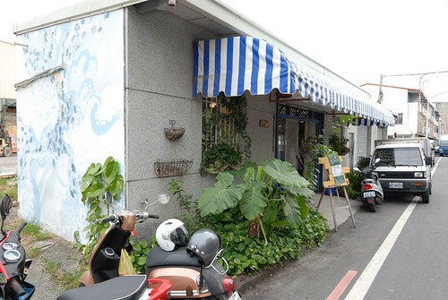 我一看到藍色日出的店門口 就喜歡上這溫馨可愛的感覺 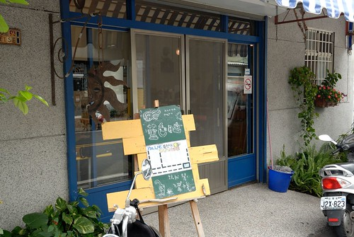 而進屋後 老實講第一眼有點嚇到 因為室內用餐空間還真的蠻小的  實在很不像一般早餐店 不過看到一男一女的老闆(不能確定是不是夫妻檔)好溫柔的表情說著"歡迎光臨" 感覺真好 尤其女老闆在問明我們是第一次來之後 還特意的來到我們座位區跟我們說明不同餐點特色以及人氣餐點 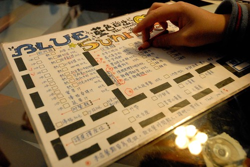 真的是感覺好溫(就是不是超活潑的那種熱情) 好有親切感的一家店 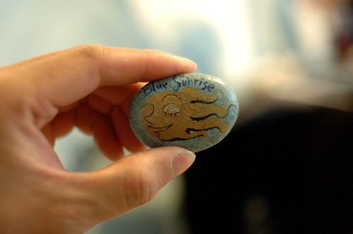 雖然店內空間不大 但是店內的一角卻仍保留為堆放著大量書刊與童書的書區 所以點完餐後 徹愛各自去選了本喜歡的書 坐在我們所坐的沙發區閱讀起來 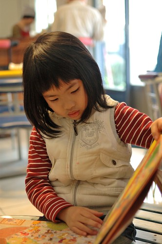 我忍不住要再說 我好喜歡這樣的小店 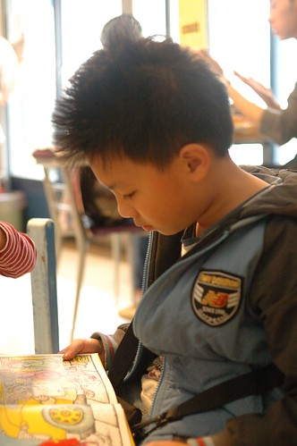 這是我的地瓜餐   地瓜好甜好鬆好好吃 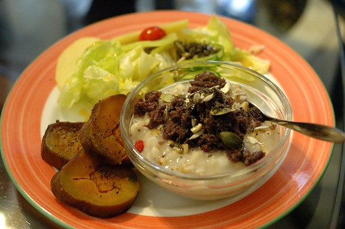 我的沒加糖的豆漿  阿徹的雞肉三明治  帶有咖哩醬的味道 很好吃說 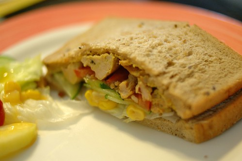 徹爸的夾蔬菜燒餅 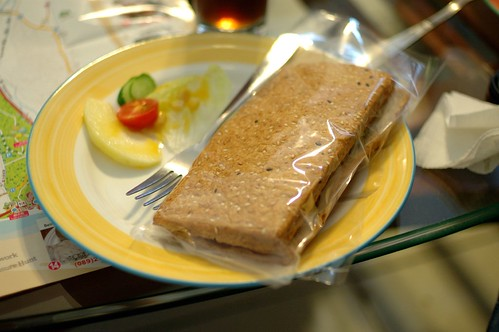 這是不在菜單上的果醬吐司 女老闆推薦給愛愛的 小小一片果醬麵包也擺盤的這樣漂亮 真的! 我真的只能說年輕的男女老闆真是太有心 太認真 太棒了 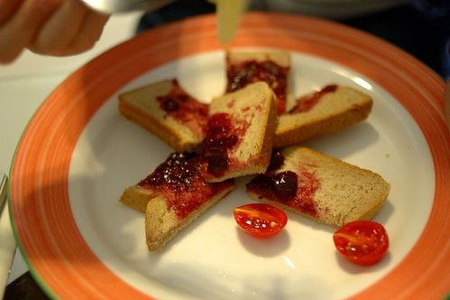 用心的餐點 愛愛大口大口吃的一口也不剩 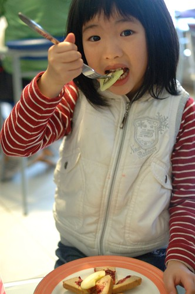 這是店家的背面 真的很簡單建築的一家小店 但裡頭有滿滿的溫暖與用心! 結完帳 我忍不住跟老闆們說'你們的餐點真的好好吃!' 而兩位老闆一樣溫柔地笑著跟我說"謝謝!" 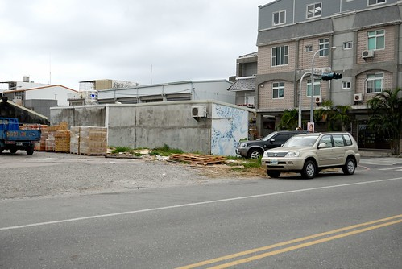 我真的好喜歡這樣的一家店 這樣的經營者!!
