第二天在台東市的傍晚 天氣真的很好 我想如果上高台肯定可以看到熱氣球的吧 但同時我也想如果這樣的傍晚沒留在台東市騎車 明天是很難有動力頂著烈陽"環"台東市的 雖然隔天清早在高台沒看到熱氣球讓人有些失望(果然如意算盤打太好) 但因為這個傍晚太美好 單車道太美麗 我慶幸把這傍晚留給了他...  

去年在mobile看到格友分享的山海鐵馬道後 我跟徹爸便一直很感興趣 尤其這回難得帶著自己的單車到台東市 怎樣都覺得非去騎他一回 只是出發前認真要上網搜尋時 才發現相關資訊實在不完整 而完整騎過(且有分享)的人更是少之又少 我們甚至認真念了台東大學區域政策與發展研究所學生的碩士論文 因為論文中有完整的介紹山海鐵馬道的設置 利用與問題 自行車道的正式名稱是"台東山海鐵馬道" 2009年完工 全長21公里 串聯著舊火車站的鐵道藝術村  馬蘭舊鐵道路廊 卑南大圳水利工園 台東大堤 森林公園 海濱公園 沿途風光有鐵道 公園 河流 稻田 海濱及山林 被譽為全台灣最美麗的平面單車道

我們從民宿附近 新生國中旁的入口開始我們的騎乘 這裡離我們去年從舊火車站走到的伊亞咖啡不遠 (以前遊記[blog.yam.com/hmchen1975/article/47484668](http://blog.yam.com/hmchen1975/article/47484668) ) 一上到車道就遇到兩位傳教士熱心的幫我們一家子照全家福 這是這次唯一的全家福照片  帶著傳教士的祝福以及阿徹的無奈(徹很難接受中午明明已經說收工了 怎麼又要騎) 我們沿著木棧道 努力往前踏  經過馬蘭火車站  這是台東新站與舊站間的小站 現已廢站  馬蘭這段舊鐵道路廊 沿途綠蔭扶疏 是近 5 公里的綠色隧道  而途中也會經過許多人家的後院後門 雖不如鐵道藝術村那邊那樣寫意 但反而更映出當地居民的生活  整個鐵馬道唯一且最令我們詬病的地方是 幾次得冒險穿過沒有紅綠燈號誌的大路口 尤其對於小朋友來講是技術與膽量的一大考驗  車道有時候是舊鐵道改建的木棧道 騎在木棧道上 聽著地板嘎嘎作響煞是有趣 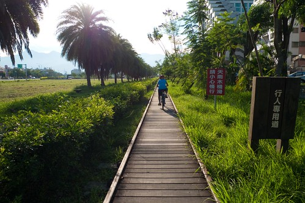 有時候是傍著舊鐵道的柏油小路  微光下 徐風中 騎在台東自行車道上   心 漾不已 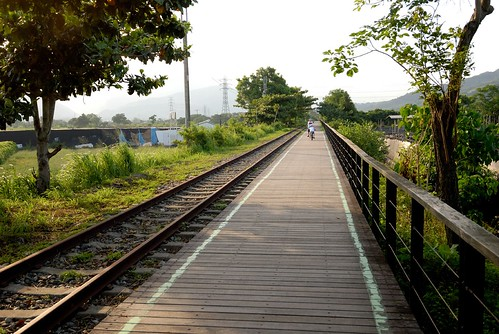 直直的 騎了好一會 來到太平洋溪鐵路橋 這是我們未曾體會過的台東風情  騎過鐵橋 有尋幽訪古的小悸動 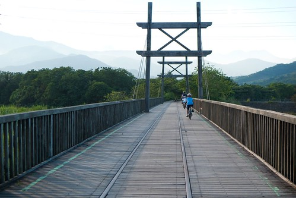 過鐵橋後是鐵路車道的終點 要由這裡離開鐵路軌道 開始沿著卑南大圳前進 在這也是我們唯一看到"山海鐵馬道"告示與介紹的地方 剛剛我們騎的就是下圖紅色路線中左邊直直那段(阿徹哀號還有這麼遠喔 臉也開始臭了) 順道先說 後來右上角尖出去那段 我們因為找不到路而缺了  沿著大圳的路 風景很淡 但卻好舒服  沿著大圳的車道走到底會撞到馬亨亨大道 站在超大的馬亨亨大道上 望著對面的台東市立棒球場 我們找不到接下來的車道 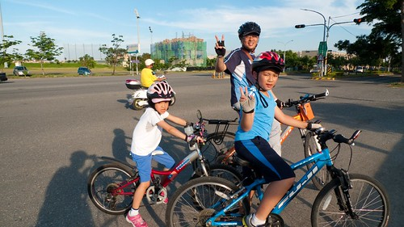 徹爸研究好一會google map後 我們決定走一段馬亨亨大道後再從台東大橋切過去 (後來上網查:  自行車道要由對面的棒球村旁邊進入)  從台東大橋旁 我們開始沿著堤走 只是也不明白到底會不會接回自行車道  騎阿騎 看到一個可以上堤上的小徑 我讓徹愛留在下頭 我一古腦的往上去  只因我想從這裡應該可以看見利吉惡地吧 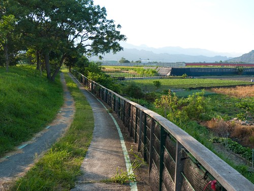 我們迷路了的台東棒球場到台東大橋間的車道 途經卑南大圳水利公園 可以面對面的看見利吉惡地與小黃山 隔天從台東搭火車北上時  第一次見識利吉惡地 更是讓人有些遺憾缺了這段路 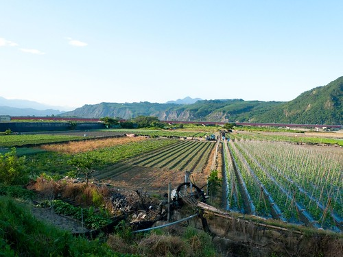 不過在這 我們誤打誤撞的又接上自行車道 看著台東大橋方向 彷彿淹沒在蔓草中的車道 讓我們很懷疑車道真的有通嗎 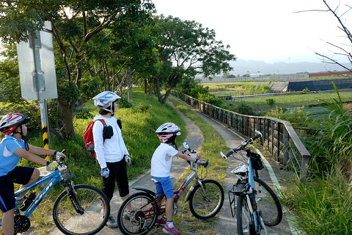 原來這段車道是要騎在堤上阿!  這段路又是另一種風情 但同樣的令人感覺舒服 沿途遇到不少跑步的人(當地人)跟我們打招呼 但沒遇到任何跟我們一樣騎車的觀光客  雖然這張糊掉了 但我們就是這樣迎著藍天往前騎 真的很棒的視覺享受! 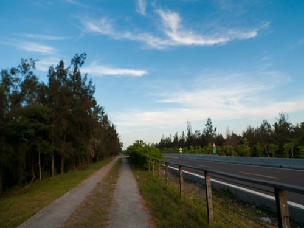 繼續一路騎到中華大橋 得下車牽繞過橋下 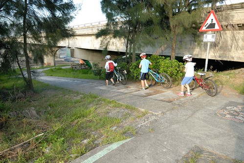 這裡 髒亂了一點 有些可惜 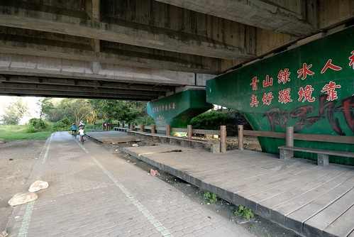 而過了中華大橋後 還得經過一小段施工中的車道 因為砂石車進出及海口的關係 路上小石子頗多 我們騎的有些小緊張 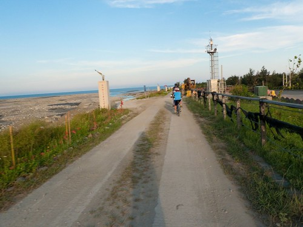 不過接下來剩著的大堤 很漂亮喔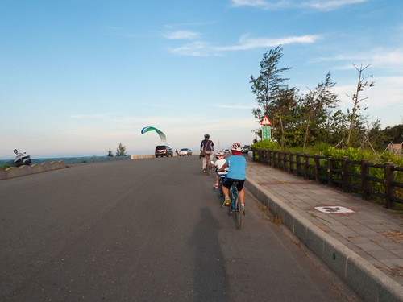 尤其傍晚六點時分的光影 雲彩 豐富又柔和 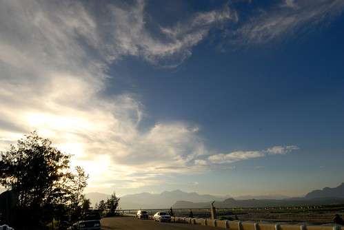 看到有人在玩滑翔傘  我們等著好一會  這裡真的好舒服 但因為得趁天暗前回到市區 我們不敢多迨留  看著左 右 前方的美景 我陶醉不已 突然我一個回頭 哇~後方美景更是美不勝收 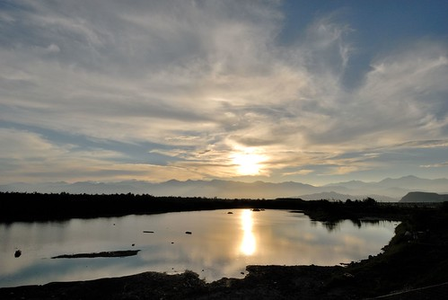 這是我們第一次看到往山裡去的夕陽  內心感動不已 愛愛開心的說"好漂亮的日出喔~" 我說"太陽公公是要下班回家耶" 愛愛不好意思的笑了... 也難怪她 這樣的景象應是她記憶中日出的模樣 愛愛的小腦袋瓜裡應該是二分法的 山裡的太陽是日出 海裡的太陽是夕陽 殊不知中央山脈的這邊與那一邊是不一樣的... 因為這一幕 讓我更是扎實覺得下午的決定是對的! 回家後上網查 才知道這是鷺鷥湖  是其實很少到台東市裡的我們所不知道的景點 不過這裡應是當地人喜愛的地方 因為好多不像遊客的三三兩兩在這乘涼 感覺很棒 台東大堤的最後 我不小心騎過頭 錯過切往活水湖 森林公園的路 還被徹爸笑我 看風景看的太入迷了 ㄏㄏ~ 真的 真的想就這麼一直迎著風 往太平洋的方向一路騎下去...

到這總算有明顯的車道指標 指引我們接下來的路  到森林公園之前 會經過活水湖 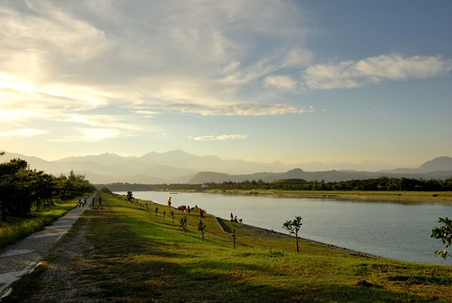 這也是一個我們沒來過的景點 雖然我知道他很多年了 因為看過的都是日頭赤炎炎下的照片 我並沒有太多來這裡的心動 不過傍晚的活水湖 襯著遠方山嵐與夕照 真的很寧靜 很美  我們沒有騎繞一整圈的活水湖 在防風林處切往台東森林公園 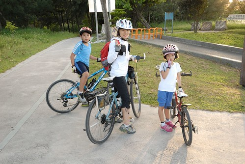 台東森林公園是我們難得很熟悉的台東市內景點 (以前遊記 [blog.yam.com/hmchen1975/article/8103825](http://blog.yam.com/hmchen1975/article/8103825)) 多年沒來 但景物依舊  只是樹更茂密了 而琵琶湖枯竭了些  而同時遊客也多了很多很多...  雖然美景當前 卻少了份愜意  加上已經六點半多天將暗 我們的肚子也快餓扁 我們快馬加鞭往公園出口的方向前進 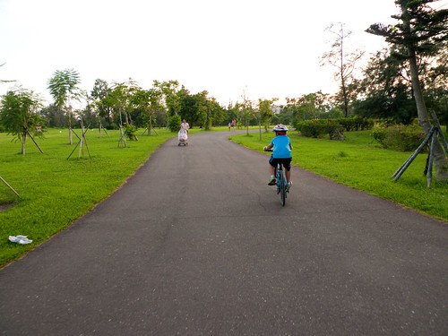 經過公園口對面的原住民文化會館  我們曾住過兩次 停車拍照紀念一下 這裡連同森林公園整個的熱鬧起來  我們一路騎到中正路上的海草輕食館吃晚餐  這裡是林道客棧 剛剛好生活 民宿主人 兩次推薦的地方 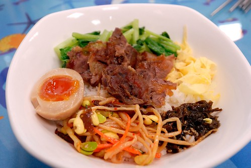 現場發現 人氣還挺旺的..  吃完晚餐後 我們摸黑騎車回民宿 也結束我們的山海自行車道 真的很豐富 很美麗的一條自行車道! 尤其在傍晚時分... 這絕對是其他任何地方複製不了 台東絕無僅有的美景!

我們的山海自行車道路徑圖 [http://ridewithgps.com/trips/1395564/embed](http://ridewithgps.com/trips/1395564/embed)
