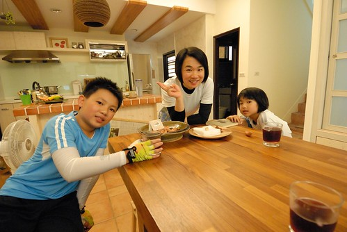
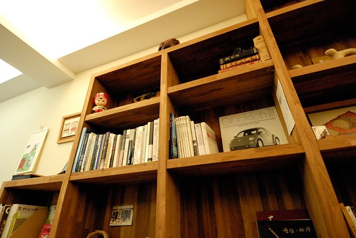
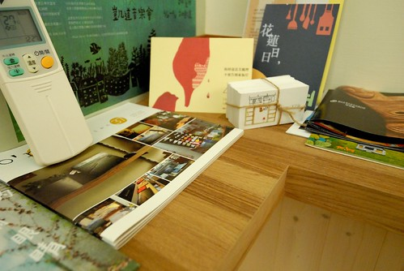
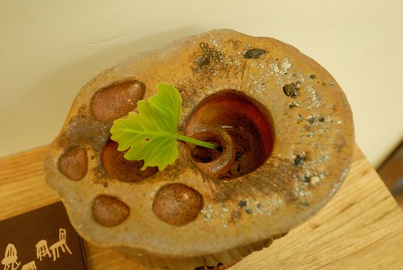
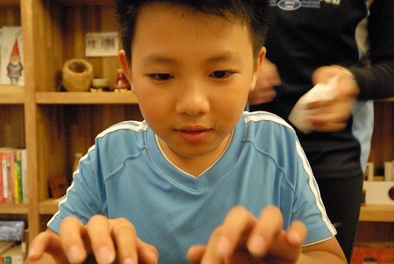
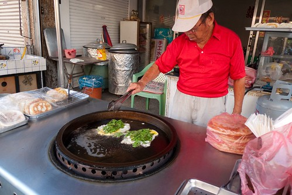
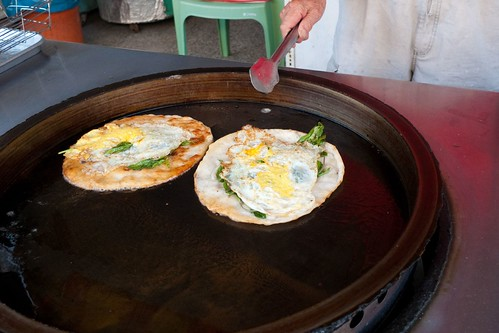
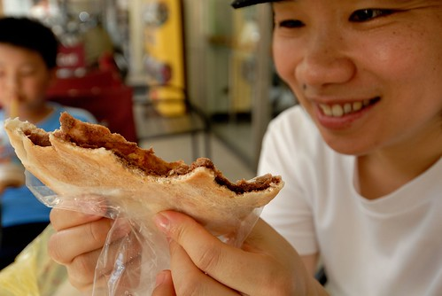

今天下午原打算去圖書館避熱的 卻沒想到暑假的圖書館也熱鬧的像菜市場 阿徹說"果然! 暑假在家 最好!!!" 然後母子三人打道回家 開冷氣自凉... 回家後阿徹用小樂高打造了一個家庭渡假小屋  有小閣樓 烤肉庭園區 還有大露台 愛愛喜歡不得了 高喊"我好想用多啦A夢縮小燈 縮小進去玩喔~" 然後叮嚀哥哥"你趕快摺好1000隻紙鶴啦"  因為徹哥哥正為了多啦A夢 發願摺1000隻紙鶴中... 這個夏天 感覺特別的熱  但也因為小人而特別的有挑戰與有趣 每天入睡前的不開冷氣大作戰 每晚飯後的大老二大決鬥 每週媽媽安親班作業的大驗收...

旅行中 最令人難忘的往往是遇到的人與事 接收到的溫度 如烙印般 在心裡頭 久久不褪~

算是刻意吧!  把第二天落腳的地方一口氣就設定在旅行的終點 台東市 只因心裡 迫不及待的想去林道客棧主人在台東市的新家 (年初林道客棧遊記: [blog.yam.com/hmchen1975/article/59864132](http://blog.yam.com/hmchen1975/article/59864132)) 坐落在台東市區 鐵道附近 鬧中取靜的白色小樓房真的很漂亮 雖然房子如小婦人所說還太缺少生活的痕跡 但溫度卻依然同家出品般的散發著  12點多就抵達的我們 打擾了小婦人的打掃準備時間 但小婦人依然熱情的迎接我們 還端上自家桑甚果醬茶讓我們消暑  小婦人樓上忙著 我們也完全不見外的在一樓客廳休息著  觀察著 把玩著 (一家子臉皮真是越來越厚)  

 (事後看照片 才發現每每吸引徹爸拍照的梗真的都很跟別人不一樣)  進屋子後 大家也沒有動力再冒熱去吃中餐了 索性各自喀兩大顆麻吉作為中餐 難忘又懷念的陳家花生麻吉 每一次的享用都令我們讚賞不已..  吃完麻吉的阿徹 滿嘴的渣 來不及擦 或許該說根本沒想要擦 便又玩起原放在角落裡的老打字機  原先兄妹倆只是偷偷的到角落摸一下 打一下 後來在小婦人阿姨的熱情核准下 索性搬到大餐桌大玩一番  老打字機發出的敲打聲 非常的悅耳迷人 讓我們陶醉在懷舊的氣氛裡  小婦人也忍不住拿出相機拍下這老打字在這房子裡被打的初體驗 並幾天後在FB留下這張圖片與文字(摘自剛剛好生活民宿FB)  "好久好久以前的打字機, 出現在這一天下午, 很快地成為孩子們的新玩具. 每個零件在使用時依然工作的很好, 看著他們好奇又認真探索的樣子, 這樣的畫面在我腦海裡, 不知不覺地就褪色成70年代時期的家庭合照, 圓角褐色的照片喚起了童年印象. 你玩阿公新買的打字機! 孩子回頭心不在焉地聽著爸爸笑談兒時的古意, 媽媽坐在旁邊笑而不語, 我將孩子們的照片拍下來, 結合進行式與曾經, 譜成大家共同的回憶." 謝謝小婦人好美的文字 並留下我們的回憶!

在客廳玩耍好一會後 我們才上2樓回到房間休息 簡單的和室房裡有我喜愛的榻榻米  大太陽的下午 我們便一直躲在房間內休憩  直到4點 太陽開始柔和些了才出門溜搭 先是散步到附近的素素二手書店 濃濃背包氣息讓我們些些難以融入 但貓兒卻令徹愛喜歡不已  接著我們出動腳踏車 覓食與兜風去 因為很想吃蔥油餅 徹爸上網估找到民宿附近的一家蔥油餅 老實說一開始看到攤子的冷清與一旁做好晾著的餅 心裡有些擔心是否踩到雷 直到看到老伯伯老闆 出乎我意料的 灑入一大把九層塔入鍋  因為出乎意料一大把九層塔入鍋的好香氣 我問伯伯可以拍照嗎 然後還跟伯伯聊起了天  "這餅是您家鄉的味道嗎" 伯伯說"都台灣化嚕" 伯伯問"這麼熱的天來台東?!" 一臉的不可置信像是笑我們傻 我又問"伯伯70幾歲了吧!?" 伯伯笑瞇了眼說"我 19年次的" 哇! 80幾歲還這樣硬朗! 我交代伯伯 以後要說 好山 好水 好健康! 不是好無聊喔~ 伯伯笑的好開心 然後堅持送我一個紅豆餡餅!(我要付錢 還生氣說不賣我)  伯伯那不若一般燙麵作法的蔥油餅口感特別又好吃阿! 還有濃濃九層塔香氣...  一樣特別餅皮與口味的韭菜盒跟紅豆餅也都好好吃! 徹爸說 意外遇見以後來台東不可不吃的好物 ~  seven的走廊下 徹愛心滿意足的喝著今夏第一杯思樂冰 我跟徹爸也意猶未境的吃著濃濃人情味的家鄉餅 雖然伯伯說餅早台灣化了 但我們覺得依然有他的獨門之處....  以前其實很少來的台東市 這次才發現他的人 他的事 他的物其實很迷人...
