我覺得徹愛為什麼喜歡去花東騎車 最大的原因是可以坐火車旅行 而其實兩鐵運輸的莒光號 從台北摳到台東 真的要好久 久到讓興奮的徹愛總也耐不住猛問"要到了沒" 只是花東鐵路沿線的風景真的好美 而一家子一起窩在火車上的時光也甜蜜 且幸運的 這回我總算收集金黃色的稻田 從北到南 一路滿! 滿!! 滿!!! 

清早六點鐘 一家子一人一台車的從家裡來到板橋車站 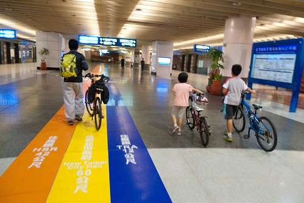 如果不是家裡離車站只有一站捷運站的距離 我想我們是沒那麼大動力這樣涯給的  人車同行的莒光72號 週五早上的班次一樣的讓我們家給包廂了 (周日晚上回程就滿滿滿)  這回 特別的興奮吧  不若上次一路昏睡到花蓮才醒來  才到宜蘭 我們就一路眼睜睜的看著風景下去 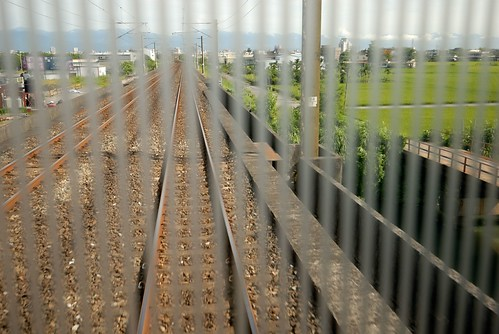 龜山島  冬山火車站 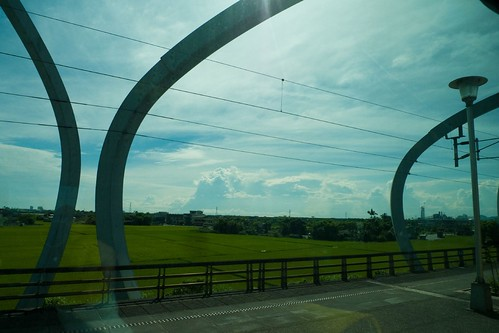 蘭陽平原一片綠油油讓人一整個精神亢奮 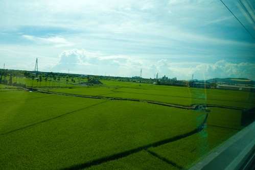 只是距離我們的到站時間還有三個多小時之久   一家子還是得找樂子打發時間 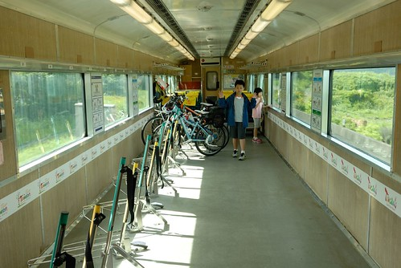 我拿出有備而來的樂天小熊餅乾 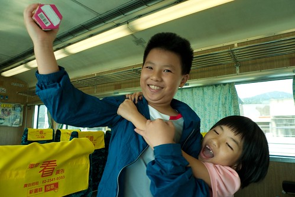 兄妹倆爭先恐後 輪番上陣的shock and shock 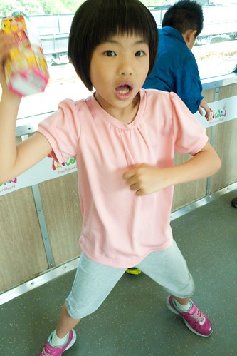 兩人搖的很起勁的樣子.... 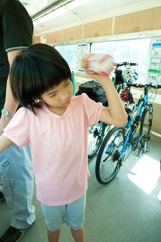 只是10幾分鐘後 等不及成果 就又回到我手上shock 於是我看著窗外蘇花美景的同時 手也不停歇的shock and shock 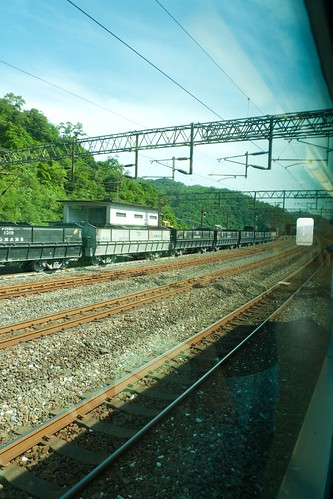 蘇花沿路的風景真的很壯闊 很美麗  尤其坐火車走蘇花 感覺離海那麼近 不若蘇花公路那樣的高高在上  皇天不負苦心人  還沒到花蓮前  小熊餅乾真的讓我shock成球狀了 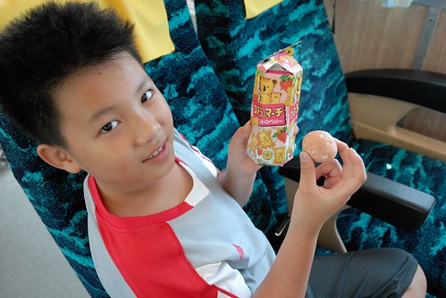 Jack! 這真是太神奇了!!! 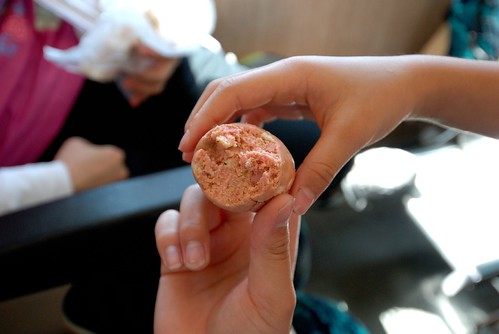 只是揉成球狀的草莓餅乾 高濃縮的讓人不敢領教 除了愛愛喜歡外...  一樣的 火車到花蓮火車站後要進行換機車頭的作業 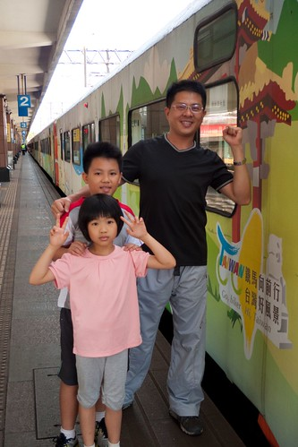 車停的10分鐘  可以到月台溜搭 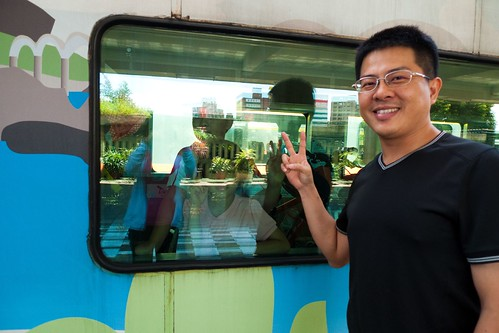 踏在花東的土地上 讓人神清氣爽  火車休息過後 繼續往南開往台東 在吉安 好一段路火車沿著台九行駛 望著窗外 彷彿看見我們家的小紅緩緩經過 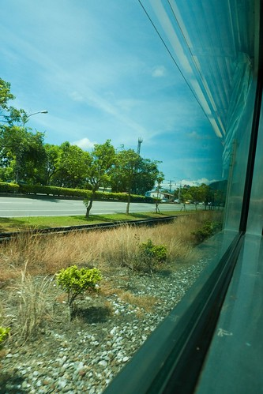 在光復/瑞穗  看見遠遠山頭上的紅色自強外役監獄 想起我們的第一次單車旅行在那吃足苦頭 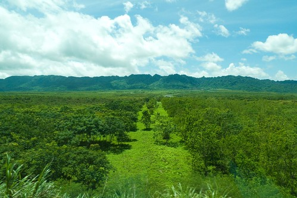 在玉里 黃綠交雜的稻田 一畦畦 一幕幕 接連不斷的映入眼裡  真的好一個美麗寶島 美麗花東 美麗季節! 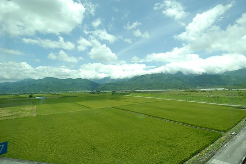 在池上  看見不遠處稻田裡的土地公廟  知道我們就要到站了~  只是怎麼等我們正準備下火車時 才發現我們坐的最後一節車廂停在月台之外... 真是有些搞笑了  

第三天的回程是從台東站搭回板橋 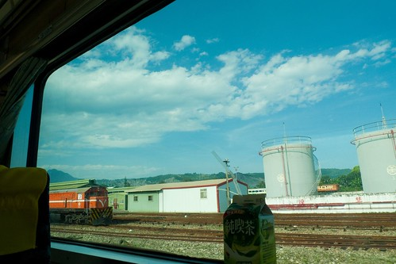 下午3點半坐回到板橋是晚上10點  講真的! 真的會坐到屁股痛 不過我還是意尤未竟的著迷於沿途稻田美景 尤其是從沒搭火車經過的台東到池上段  前一天騎山海鐵馬道 迷路錯過的利吉惡地 真的很有Fu的美麗 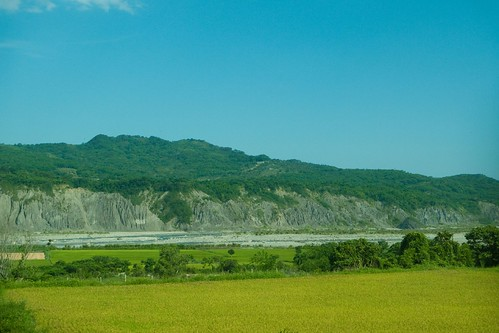 而傍晚時分的光暈也襯出一幕幕不同的稻田景緻 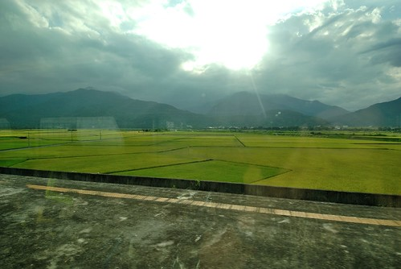

不同於火車上販售的鐵路便當 記得 火車經過池上時一定要下火車到月台買全台唯一許可月台販售的全美行便當 那風味絕對令人永生難忘"那些年 我們一起在火車上吃的池上便當"  才四點半  但愛愛一看到便當就開始嚷著"肚子餓 要吃飯" 可是媽媽說"火車還要坐5個小時 這麼早吃完便當 那接下來的漫漫時間要怎麼過..." 媽媽堅持五點半才能放飯 要其實很累的愛愛先睡個覺 (然後愛愛咻的就睡著了)  沒想到 愛愛竟然很準時的在5點半前就也自動醒來   問媽媽 "可以吃便當了嗎?" 當然! 我們準時放飯~ 便當拿起後 窗檯上 玻璃上 遺留著一珠珠便當的熱氣  除了我們分食些醬菜及1/3的飯外  愛愛大口大口嗑著她獨享的飯包 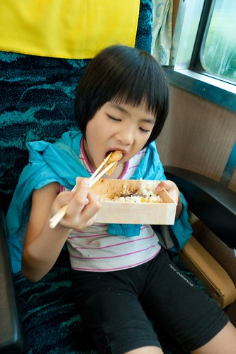 我們從沒看過愛愛這樣大口吃飯 還有吃這樣多的飯量 可見 這個便當真的很好吃!  (這款便當有些冷了後吃 口感更是好) 

火車來到花蓮 宜蘭 台北 陸續有很多的車友上上下下 滿座的車廂其實是很難可以好好休息的  無聊的阿徹提議四個人各來張自拍照PK 阿徹版  愛愛版 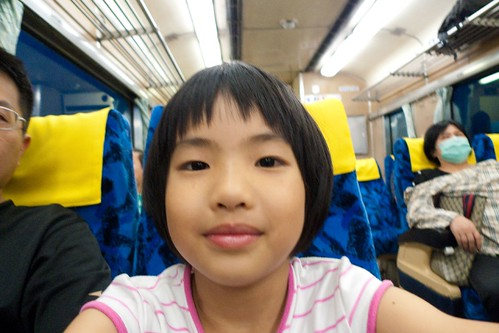 爸爸版  媽媽版  大家一致說媽媽的笑容最棒 哇哈哈~  如果可以 一年一次這樣的兩鐵花東旅行真的很棒 也肯定是四個人一輩子都難忘的家庭回憶~ 才回到家 徹爸就問"下回我們可以去哪騎ㄋ?"   嗯~待徹媽想想.............
