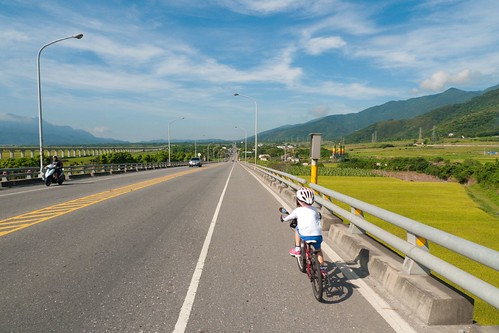
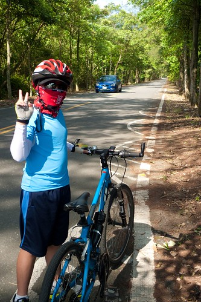
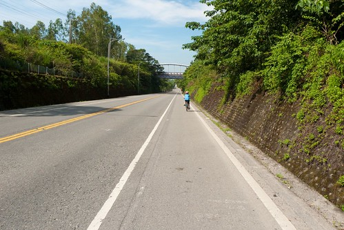
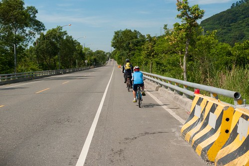
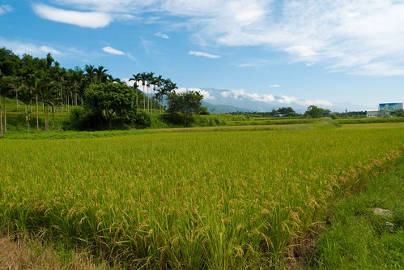
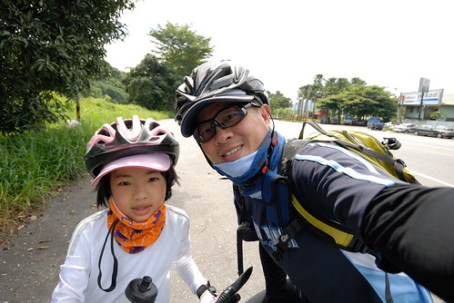
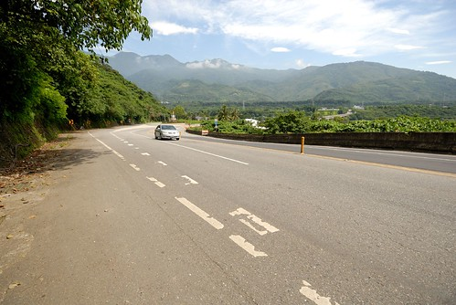
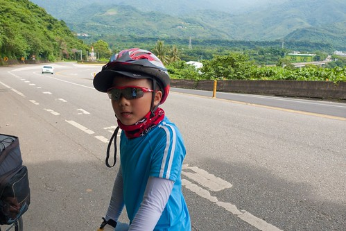
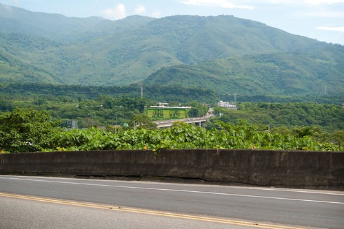
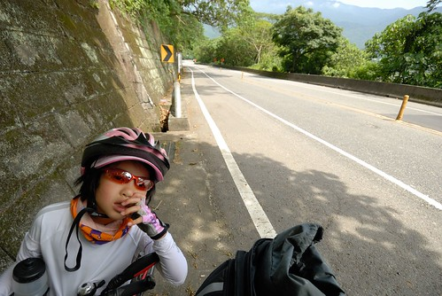

單車行的路線 可以的話我們總是避開大馬路 走少為人知的鄉道或產道 一來車少安全 再者更能接近感受鄉間美景 只是這回關山到台東市的這段路 除了台九  條條都是可能考驗徹愛的險峻山路 我們別無選擇 不過從關山到鹿野這段台九 台灣最直的公路 真的壯闊得讓人感動萬分 而我們用10km的慢速 將這段美景 一點一幕收進我們的回憶裡!  

這一天的天空很美麗 天好藍 雲好白也好野 搭配著又直又長的路 映入眼裡的每一幕都是大景  這段路整體來講是平順的 甚至有點北高南低的下滑趨勢 但夾雜著的上上下下  對於小騎士愛愛來講還是個大挑戰 雖然年初旅行到台東這段時 我們便已告知愛愛這將是他第一次單車旅行要騎的路 也刻意放慢速度讓愛愛感受路的起伏 算是早早就打下一劑預防針 但不只她緊張 父母的我們也同時為不可預測的一切捏冷汗  今天我們改變策略 領騎的我跟阿徹 騎一大段距離後便停車等候愛愛的追上 跟她說說話 給她加油打氣  每一次休息過後 我們總是期待下次見面的互道"再會"~ 而每一次的再會 代表愛愛的一段段通過考驗  另方面 這樣的路段對於阿徹來講卻有些輕鬆平常 所以我跟著阿徹 用他得有點努力的速度領騎著  不知道是阿徹的車子變大的原因 還是因為他真的長大了 這回他完全的可以跟上我的速度了(撇開他騎車的背影真的很像老人不說) 而且完全不顯累 甚至還常上坡的時後衝的比我還快  來道鹿野 武陵綠色隧道口 母子倆自拍一張作為紀念  相較於三年前的第一次單車旅行[blog.yam.com/hmchen1975/article/29396890](http://blog.yam.com/hmchen1975/article/29396890) 我們家的徹小子真的長大了!  

今天有常讓人一路滑的很爽快的路段  但也有不少看似平緩 但騎起來卻頗費勁的時後  不過整的來講是很好騎且風景優美的  只是很奇怪 遇到的車友都是與我們反方向的南往北騎 可能這樣挑戰大一點 相較之下 常常在下坡的我們真是顯得太easy  (等愛愛的時後 搞FU的來張照)  沿途好多人給愛愛說加油 這樣的背影想必讓很多人睜大了眼睛  愛愛不能辜負所有為她打氣的人 只能努力 認真的踩阿踩  爸爸說 一趟旅行下來 愛愛的技術提升許多 父女倆 果然如爸爸常口中自豪的"騎車最佳二人組阿"  今天最硬的坡 是在鹿野過後的這大轉彎  在誰都不示弱的良性競爭下 我跟阿徹一起上來了 只是上來後得休息 喘一下  同時等著愛愛接受完今日最艱辛的一段路 雖然愛愛果然不敵而落馬 但這是愛愛今日唯一牽車的路段 不負我們期望 表現出她的努力與堅持  以前我們常從台東這裡一路滑向鹿野 每每經過這 總想著有一天我們要騎過這 今日 我們總算達陣了!  雖然接下來還是起起伏伏不斷的山路  但我們已能因為目標就在不遠處而更是鬥志高昂 只是愛愛這張的表情 也讓人明白她想要趕快結束這段路阿  我跟阿徹一口氣騎過今日最高點 來到初鹿 而愛愛則在幾次的短暫休息過後 沒落我們很久的之後抵達初鹿  在初鹿小7相聚的一家子 開心不已!  尤其接下來往台東市的10公里路是一路下滑阿~  可以稍微放鬆 放縱了  在小7休息半小時過後 我們頂著近中午的烈陽往我們今日終點邁進  我與阿徹 徹爸與愛愛 經過綠色隧道時 不約而同的都拍下孩子的這一幕  途中經過陳家麻吉 當然 肯定也要去買個10來顆大快朵頤  進到市區 循著導航 我們穿梭在巷弄中 尋找我們今日下榻的民宿  然後12點多 很熱很熱 而民宿主人也還在忙著的時候  我們抵達"剛剛好 生活"民宿 到此 我們這回旅行的目標 成功達陣!!! YAHO~~~  看官說: 啥咪 才不過半天 這家子的單車任務就完成 未免也太輕鬆了 哇哈哈~ 這不也正是我們家的剛剛好哲學 剛剛好的路程 剛剛好的堅持 剛剛好的感動.....

PS. 感謝徹爸整理與提供的今日路徑圖

[http://ridewithgps.com/trips/1395566/embed](http://ridewithgps.com/trips/1395566/embed)
