這兩天金城武新拍的航空廣告引起廣大回響 迷人的帥車 在我喜歡的池上騎著腳踏車 真是令我High阿 尤其前陣子自己才在池上收藏到想望很久的金黃色大地... 延續開心的情緒 插隊先寫這次單車旅行中的池上篇 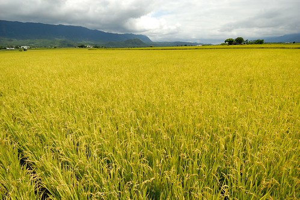

接續上一次的訖點 這次我們的起點在池上  中午時分 在池上下了火車也吃了池上便當後 頂著一點時分的烈日 我們從大坡池自行車道開始我們的此行 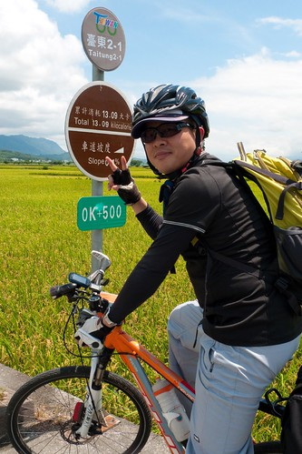 只是沒想到 開始沒多久 我們就因意外遇見的阿勃勒而停車  大坡池畔 遊客中心後方的阿勃勒盛開著  一捧一捧的小黃花 閃耀亮眼 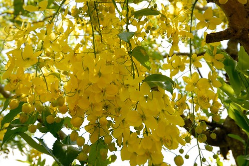 而交雜著的含苞待放 則是另一種的可愛  拾起飄落地下的花朵 我們也才發現阿勃勒花原來這樣落落大方 從沒有過這樣近觀過一朵阿勃勒花...  還沒看到金黃色的稻穗 但我們已先被金黃色的阿勃勒給振奮! 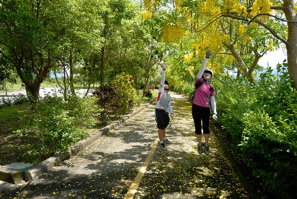 沿著池畔車道 繼續往我們的方向前進 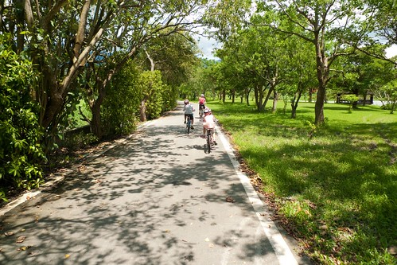 來到南面的池畔 看見盛開的蓮花 才想起六月也是蓮花盛開的時節 而去年的七月我們還來這尋找蓮花蹤跡  停車看蓮花的同時 徹爸剛好檢查愛愛有點怪怪的車子 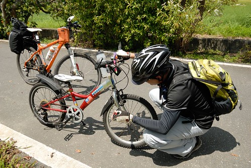 修好車 徹爸猛然抬頭 大喊"好漂亮的蜻蜓阿" 當下其實我們也不確定是蜻蜓還是什麼昆蟲 因為它的翅膀不若蜻蜓那樣擺盪 卻如滑翔翼那樣滑行飛翔 悠然又自在  調整好車子 我繼續領軍往前行  看到稻米達人的小木屋 我堅持要像兩年前 同樣來一張  而大觀亭上也非得再來一張 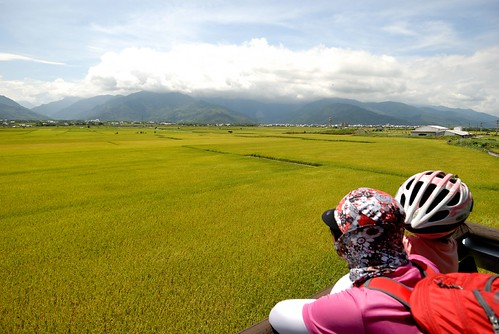 雖然這一刻才發現自己還是喜歡綠油油的稻田多一些 但結穗纍纍的豐盈金黃色 卻耀眼醒目的讓人瞠目結舌且肯定永生難忘  徹爸原本的規劃是從伯朗大道切往關山的路(其實徹爸已經很好心的安排讓我騎來這了) 但我無視兄妹倆在烈陽下的哀號 繼續往稻米原鄉館去 徹愛說"不是都去過了 稻田也看過了 為什麼還要去阿" 我說"沒有在結穗金黃色的時候來過..." 兄妹倆殊不知 對於萬安 媽媽還欠金黃色的那一幕~ 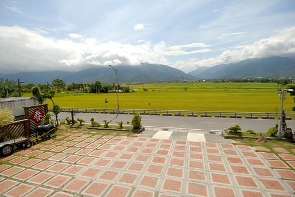 來到原鄉館後 原打算買個涼水慰勞下兄妹 但看到這產地限定的米冰棒  二話不說一人來個一隻  而吃冰棒的時間 我也才更有理由上二樓並且坐上一回 就是這個老位置  這扇窗 一樣但又不一樣的眼前 池上的"耕" "耘" "收" "藏" 我總算都收集到了 雖然不是在秋收 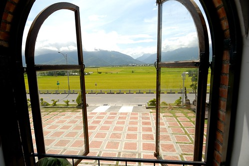 原鄉館的二樓多了個簷下座位區 我們坐在這吃冰棒  雖然兄妹倆的表情看來好像不太好(熱昏) 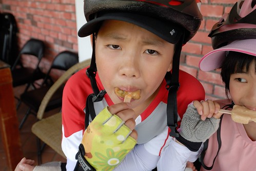 但米冰棒真的很好吃  吃完後滿嘴都是濃郁的米漿香味 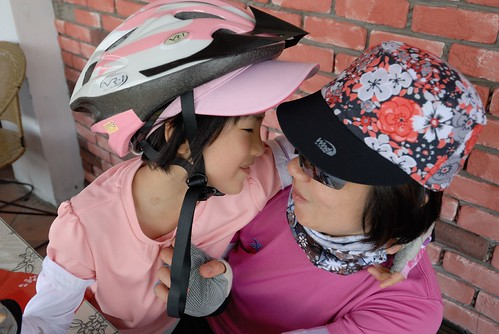 吃完冰 我們回歸正道來到伯朗大道 雖然來過好多回了　但每每還是驚艷於這條天堂之路(眼睛自動略過右邊兩個裝置)  母子三人說好一起往前衝 但得要慢動作的 這樣才能讓後頭的徹爸幫我們留下這裝模作樣但別具意義的畫面 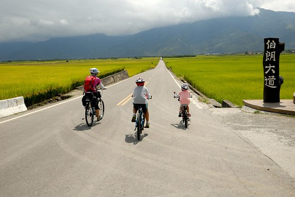 烈陽下 迎著風 騎往山的那頭... 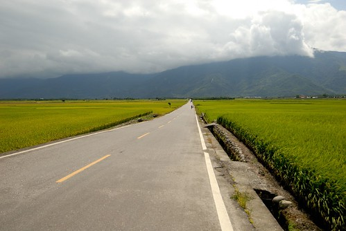 如金城武說的"台東池上最美"  行前 我便交待徹爸記得要幫我拍稻穗纍纍的模樣 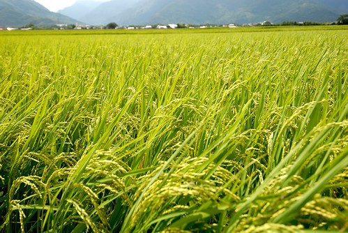 等候的時候 我們母子三人數著一株稻子上有幾顆米 多少的稻穗才能成就我們的一餐飯 徹愛望著我比畫的那一片 一臉的驚訝與大悟 我想她們將更懂得盤中飧粒粒皆辛苦的感恩  而至此 我也總算心滿意足 認真的騎往我們的下一鎮  

後記: 雖然知道自己寫過好幾次的池上了 但沒想到全翻出來還真是不少 不知道萬安社區發展協會有沒有這樣的集點活動 那我應該可以換禮物吧~

2007冬 油菜花 [blog.yam.com/hmchen1975/article/7887891](http://blog.yam.com/hmchen1975/article/7887891) 稻米原鄉館 [blog.yam.com/hmchen1975/article/8104198](http://blog.yam.com/hmchen1975/article/8104198) 2010冬 環圳車道 [blog.yam.com/hmchen1975/article/26881664](http://blog.yam.com/hmchen1975/article/26881664) 2011春  春耕 [blog.yam.com/hmchen1975/article/37799848](http://blog.yam.com/hmchen1975/article/37799848) 2012夏 大坡池 [blog.yam.com/hmchen1975/article/51612430](http://blog.yam.com/hmchen1975/article/51612430) 2013冬 油菜花再開 [blog.yam.com/hmchen1975/article/59669382](http://blog.yam.com/hmchen1975/article/59669382)
