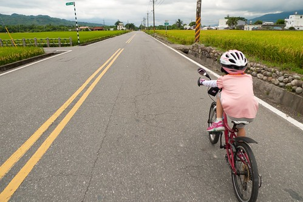
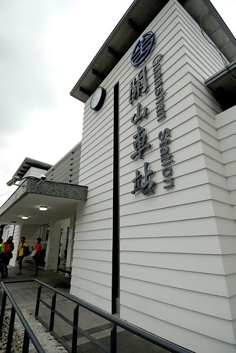

停留關山的第一天 原本是想傍晚時分就近衝上鹿野高台看熱氣球沒想到下午騎抵關山後 天竟開始陰霾了起來我想老天爺大概知道我心裡有另一個聲音 想留在關山來個小散步的!關山是之前徹爸口中 如果移民來台東的好地...

關山到池上這段路是這次移動中 唯一沒有走台九的路段 我們循著方向 走在田間小道間 前往關山   不同於伯朗大道如天堂般美景 往關山沿路所見或許才是真實版的花東縱谷田野風情 少了詩情 卻反而有著台灣農家的鄉土味  騎著騎著一個轉彎 不知不覺我們來到今晚下榻的山水軒度假村 (這段我頓ㄉㄟ很久 剛好徹爸看到 說這張是為了我的BLOG拍的 然後還好心幫我想了上面那段詞)  20公里 不遠但也不算近的距離 剛好作為第一天的暖身  稍微休息過 我們徒步20分鐘來到鎮上覓食及尋找上鹿野的契機  沒想到天卻開始灰了起來 偶而還飄起絲絲細雨 雖然有些小失望小恍神 但也有點慶幸可以多停留鎮上一些 我們先去吃有名氣的關山臭豆腐  然後到曹記豆花吃挫冰 才不過曬一個下午 一家子就需要來碗冰消暑  徹爸對這裡的紅豆牛奶冰讚不絕口 而我們更是因為老板送錯而多送的一碗豆花而飽到晚上只好簡單吃泡麵  吃完冰 雨大了起來 我們坐在店家的簷下等著雨停 看著過往不多的車輛 感受小鎮的簡單與寧靜  走回渡假村的路上 刻意但卻也不小心就來到一直想登門拜訪的"南島秧滿田" 尤其家裡米缸剛好見底 更是不能錯過這樣來產地買米的好機會  年輕的男女主人如印象般那樣靦腆但熱情 而我除了訂購即將收割的第一期稻作 更是拿了一手店家自製的關山小旅行明信片 最後還很厚顏的收下主人家送的兩袋(米)禮 滿手滿心都是滿滿的收穫與感動~  接著我們又散步往火車站的路  首先是舊火車站 老實講 太過富麗與G牌的店門口 讓人怯步 沒好好停駐體會  緊鄰的是關山的新火車站 白色建物反到配合關山的簡單與盎然  我們一樣的走20分鐘回到渡假村  這回雖然沒有騎環鎮自行車道 但反而因為走路而深入關山多一點  

一夜好眠後 第二天我們早早起床吃早餐  渡假村跟我們9年前第一次來時的模樣一點都沒變 沒有更豪華但也沒有折舊的感覺 我們認為實在難能可貴 我跟徹爸一直很喜歡這樣剛好舒適 剛好大小 剛好環境的住宿地 所以徹爸如九年前 如法泡製一張走進餐廳前的照片 只是這次身邊的小孩都這麼大個了  早餐過後 整裝完畢 我們信誓旦旦開始第二天的行程  單車慢慢騎過沒人的街道  騎往我們的下一個目標地 台東市 
