第一次我們的桌曆在12月31日前拿到手了 也難得我們的桌曆封面可以有時間在辦公桌擺上好些天 我很喜歡這次的封面 是我們處在截然不同風景下的背影大集合 背影裡似乎透露著我們的貪玩 我們的執著 我們的勇往直前... 想起徹家這一年一步一腳印走過/累積這麼多回憶 跟往年一樣的感動阿~ 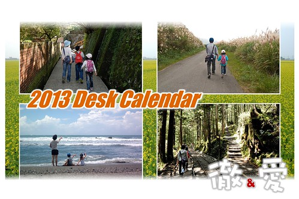

就如以往 徹爸在準備挑選明年桌曆照片前 哀號著今年可以挑的照片好少阿.. 我心想今年沒少玩太多 應該不至於吧 但沒想到當我們各自把2012年第一炮的5天台東旅行照片看過一遍後 阿哩~還真沒什麼可以當桌曆的照片 徹爸碎念著"瓶頸了!" 甚至連"該換新相機"的話都脫口而出... 但仔細推敲思索後 才發現是徹爸現在越來越認真"玩"了 越來越少獨自一人落在我們後頭研究拍照這件事 取而代之的是與我們一起忘情的置身旅行中 大自然裡 (當然有些時後也是因為重遊相同的地方 就"沒什麼好照的"了) 對於徹爸因為這樣的改變而繳不出好照片 我當然不以為意 況且我還是覺得徹爸的照片很棒 細水長流型的風格 總是讓人越看越有味道 越發喜歡... 不過還是很慶幸12月中老天爺許了個大晴天週末 讓我們在金瓜石捕捉到好多美麗的畫面 也讓我們家明年的桌曆因此而更豐富與圓滿!

今年的作業流程依然由徹爸先進行照片的初選 然後我從第一輪照片中的刺激與聯想 再補了些照片進去 最後在上週二(12/18)的晚上 兩人一股作氣的選好12張照片 排定好月份以及封面的排版 那晚 原本就工作疲勞的兩人用的很晚很累 但看到一本桌曆就這麼活跳跳(還非常有效率)的出現 心頭都寬了也滿了~~~ 與大家分享我們的2012這一年 也祝福大家的2013年平安 快樂!

一月 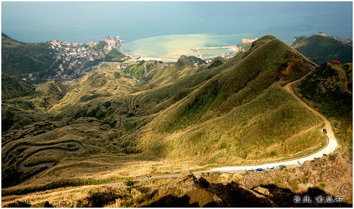 二月 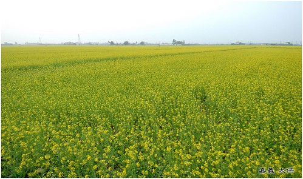 三月 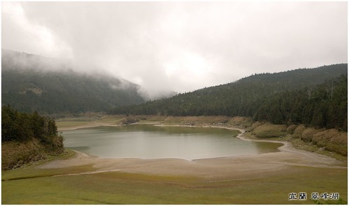 四月 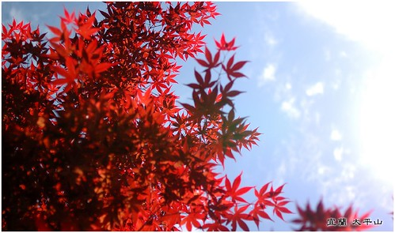 五月 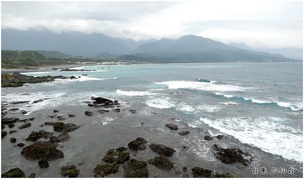 六月 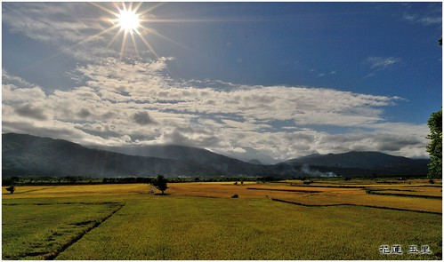 七月 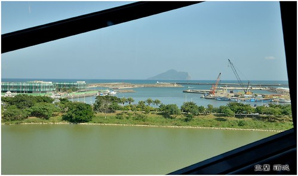 八月 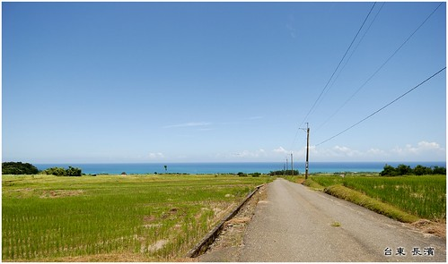 九月 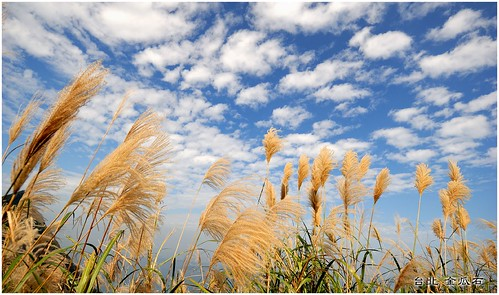 十月 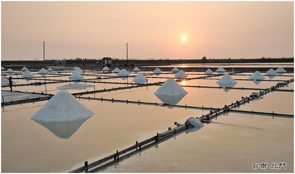 十一月 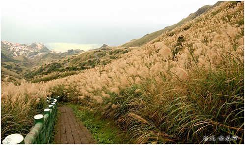 十二月 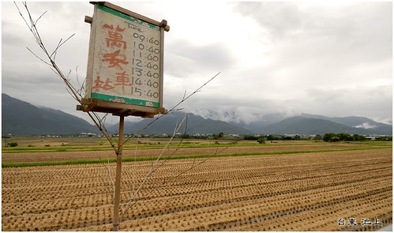
