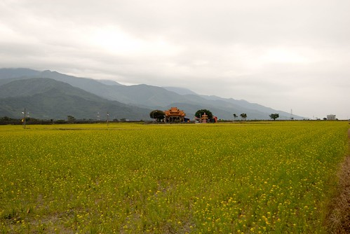
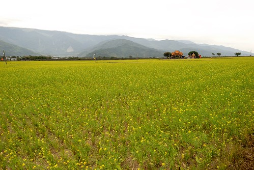
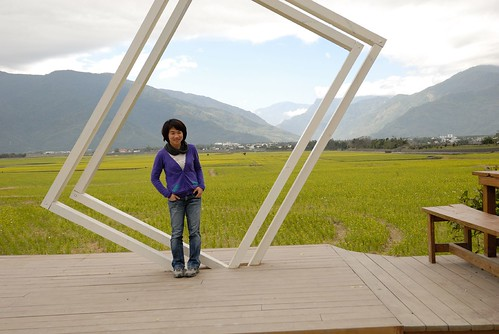
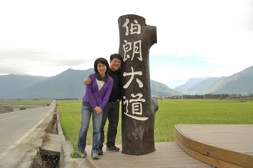
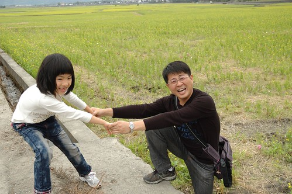
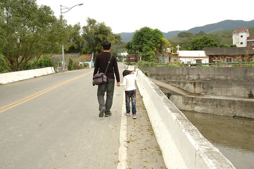

每次在花東南來北往 有機會的話就會想加減繞進池上看一眼 喜歡池上那有一點點寬度的地 有一點點延伸感的山脈 而最喜歡的當然還是那裡的田 以前只知道稻田成長時綠油油的美 結穗時金黃的美 以及油菜花盛開時黃澄澄的美 直到去年看到花蓮旅人誌寫的一篇文章 才發現原來"剛插秧的水田，映著天光山色，可美得很" 好天氣時的水田 映著藍天 白雲 綠山 真的美的很~ 一種很寧靜的美...  

那天從羅山離開後 我便又在車上昏睡起 我沒來得及告訴徹爸我想去池上伯朗大道 沒想到徹爸車一開進池上便搖醒了我 比著窗外要我看 哇~ 池上土地公廟前開滿了一大片油菜花~ 這裡已經好多年沒有油菜花開了....  只是花雖然種的整齊但卻稀稀疏疏完全不若當年盛況 我們心中還是有些感嘆 (嘴邊也很感嘆啦)  不過我只要有油菜花看就會開心  所以還是非要下車照張相  接著我們沒依以往從大坡池的路前往伯朗大道 我們由土地公廟對面的小路轉往縣197 稻米原鄉館的方向過去 沒想到 不過轉個身看見的卻是截然不同美麗的剛插秧水田 水面很平 很靜 就如鏡子般的完全照應出上面天空的模樣 雖然雲有點厚 但更襯著遠方的藍天 我們大呼著"真是好美 就像一幅畫一樣"  尤其田埂間覓食飛翔的白鷺鷥更增添了許多詩情畫意  沒多久 就在我還回味再三的時候 車子開到了轉進伯朗大道的路口 怎...遠遠的就嗅到前頭熱鬧的氣氛 心頭有點怪怪的 走近後才明白原來伯朗大道的起端立了兩個大地標 一個catch滿滿是田是山的相框  以及一個總算可以讓人一目了然這裡就是伯朗大道的立木  雖然這兩樣地標很有觀光價值 也真的很有紀念價值 但我的心頭卻失落了一些什麼... 隨著台灣好基金會這兩年用心的舉辦池上四季活動 池上已漸漸建立自己的"旅遊品牌" 只是吸引越多人注意與喜歡的同時 也因熱鬧而沒了以往的極度清閒 不過我還是樂見台灣好山好水越來越為人所知 (有沒有門道就另回事了) 既然一旁好堆人熱熱鬧鬧 又跳又躺的 我們就也派出咱家甜心愛愛來high一下吧~  小妮子跳的很認真  很投入  也很開心  還一發不可收拾 一跳再跳 跳到我按快門的手都笑到發抖 我ㄠ著徹爸跟愛愛一起跳一下吧!  哈哈~ 果然還是小女生美麗又可愛 (不過爸爸真的很會跳 跳很高)  謝謝愛愛的加分 讓伯朗大道依舊是我記憶中美麗又快樂的伯朗大道  而話說雖然今年伯朗大道兩旁遍植油菜花 密度卻很低 下田一跳時 還真的很訝異花種的這樣稀疏  不過反正醉翁之意不在酒嚕...  (跳完後 心滿意足走回車上的父女倆)  重點是我又在池上看見油菜花開! 這是件令我開心的事! (這是今年在池上看到最密集的一片油菜花 而且遊客很少走到喔...)  PS. 順道回味下以前看過的池上油菜花: (我很像很常翻池上的遊記出來講 哈!) 好多年前的花季會場:  [blog.yam.com/hmchen1975/article/7887891](http://blog.yam.com/hmchen1975/article/7887891) 三年前還默默少人聞的伯朗大道: [blog.yam.com/hmchen1975/article/26881664](http://blog.yam.com/hmchen1975/article/26881664)
