今天早上跟徹爸去了一家令我們嘖嘖稱奇的早餐店 從進去的那一刻起兩人的感觸便源源不絕的跑出 回家後在廚房忙著 我想起了明顯對比的林道客棧  忍不住插隊寫這個這次旅行中最讓我感動與難忘的地方 一個一切剛剛好但有著最美溫度的老房子與小夫妻~ 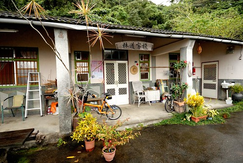 

(得先好好寫下今早的感觸 雖然很多感觸其實累積很久了 ) 今天不用補班的我與徹爸 一起送徹愛上學後散步到附近早餐店來個兩人小約會 店是一兩年前在網路上看到的介紹 因為就在住家走路區域內 所以一直記得 去年底有天我跟徹爸也是送完小孩上學後散步去店家 只是遠遠看到半開的鐵捲門後兩人便離去 今天依然在巷口就看到半開的鐵捲門 只是門口好些排隊的人潮 我們想今日應該有營業吧 只不過可能八點才開門 實在很好奇什麼樣的早餐店可以八點才開始 而且還讓這樣多人願意一大早就排隊  我跟徹爸兩人便也跟著一群明顯看起來比我們年輕的人們排隊等店開 等候到八點門開了 店員在門口讓一組組的客人依依進入與就座 店很不大 2/3空間的用餐區只有快20人的座位 我們四組客人還共用一張大長桌(每組都得面對面坐) 且因為菜單不夠 我們等了快10分鐘拿到菜單後才能點餐 從進店家後 到等菜單 等上餐的時間裡 徹爸那明顯打量與不可思議的表情持續很久  我說很少看到你對一個地方有這表情這樣久 我們首先的大討論是 雖然店不大但內外服務人員高達八位 每位專司其職的負責外場 負責櫃檯點餐收錢  負責飲料 負責煎物 負責抹物 負責最後成品 我們很難想像一家早餐店的服務人員這樣多(而且店真的很不大阿) 除了速食店外還真沒見過 而更讓人注意的是每位工作人員都是那種看起來 很有個性 很有型 帶些文青味的20多歲年輕人.. 幾分鐘後 徹爸又大發現似的說"我知道了! 因為少了杯水" 他覺得起碼應該上杯水給等候的人... 因為共桌我跟徹爸無法盡情說話 後來便各自拿出書 只是環境卻讓兩人都無法靜下心來閱讀 室內空氣對流不佳 加上服務人員們略於精簡的招待方式(飲料要上桌時 服務人員只是從徹爸耳後輕喚聲"哈囉"讓徹爸很是介意 ) 那一刻,我跟徹爸只想趕快等到餐點 用完餐離去... 店家的菜單內容果然很新奇 很有創意 連宜蘭的鴨賞都入列 而餐點上桌後的視覺效果也挺好 只是兩人對於我們餐點的實際感覺卻不太好... 就如現在全台各地越來越多的小咖啡店或雜貨店 經營者或是其內的工作人員 很高的比例是有個性 有創意 有想法 有才華的人 這些看起來像 甚至根本就是文青的人 讓台灣越來越人文 但我卻常在拜訪這些小店後 有一種因為雷聲大雨點小(深度不夠)的小失望 或是更多的因為少了一份人與人間互動溫度的小失落 或許"屌"是種自我表現甚至是種流行  但老人家的我還是喜歡與習慣傳統農業社會裡的那種平凡與親切 人之間 心與心的交流才會產生溫度 那是怎樣都無法速捷與取代的~

會知道林道客棧這家民宿是因為玟姿去年初住過後的真心推薦 她說"你ㄧ定會喜歡這家民宿" "覺得這就像是阿姨如果開民宿會有的樣子" 我上網找到林道客棧的網站 果然,我深深喜歡主人家透過民宿所表達的生活與態度 因此這回抱著想來認識朋友的小貪心想法來到林道客棧  來到客棧時 接近傍晚時分且天空下著細雨 除了對面電線桿工程發出的噪音有點惱人外 其他的一切顯得那樣詩情畫意且溫暖 女主人親切的招呼我們且貼心的把我們原先訂的四人雅房換為更不受人打擾的四人套房 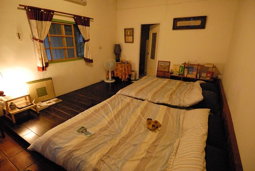 而待我們行李安頓好後 女主人泡了壺友人贈送的鹿野紅茶 與我們在廚房的大餐桌喝熱茶 聊我們旅行的計畫與介紹他們喜歡的好店 (女主人為我們畫的私房路線圖 畫的超認真) 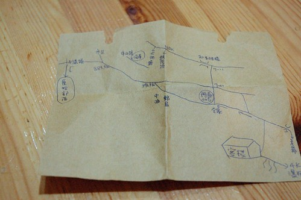 因著女主人的推薦 那晚我們在知本泡了舒服又愉快的溫泉 還有一頓好吃又合宜的晚餐 而隔天早晨 我們更是在女主人像家人般親切的桌邊服務下 享用一頓豐富又美味的早餐(完全忘記照相 懊~~) 女主人陪著我們邊吃邊聊 聊到我們早就吃完早餐 甚至都快到退房時間了 我們從我們的旅行 聊到台東 聊到我們都喜歡的長濱老舍 聊到他們的過去 他們的生活 他們的未來  以及我們的工作  我們的家庭 我們的夢想... 中間亦陸續加入另一位騎車旅行的女房客以及放假睡醒的男主人 很是熱鬧與一發不可收拾 雖然我嘴巴上一直說著"不好意思打擾這麼久" 心裡也真的很不好意思 但卻還是厚著臉皮一直聊下去 (哈哈~ 想想自己肯定可以列入難以打發的客人名單上) 直到恐會耽擱我們往墾丁行程時 我們才依依不捨地結束對主人家的叨擾 真的! 這是一間讓我ㄧ開始到結束都感覺貨真價實的民宿 民宿的最大實踐與感動 我在這看到了! 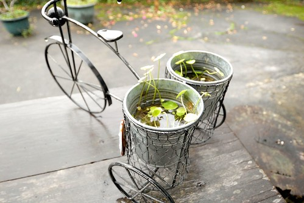 只是回家後才發現 照片拍的太少 我想是我們聊的太開心了 而且太不願意打擾那樣自然又自在的氛圍吧! 所以現在只能就僅有的一些照片回味林道客棧的美好時光: 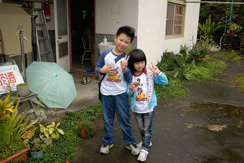 從停車處通往房子的小階梯 聽說是男主人跟房東一起砌起的 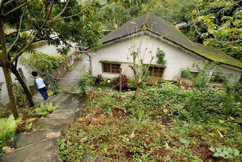 第一個階梯上刻下的日期 想必是男女主人的重要日子 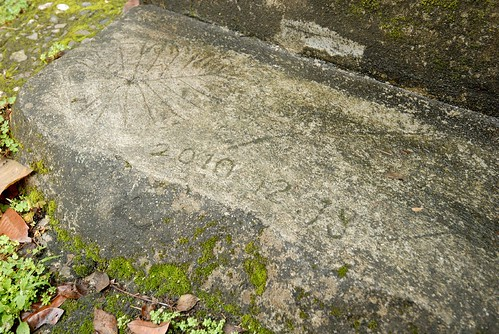 一切植物那樣蔓生卻又整齊的模樣很舒服 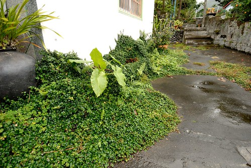 一條龍的閩式建築 從右到左分別是二人雅房 客廳 與二人套房 左右側房再分別是四人套房與廚房 我喜歡民宿仍大量保留房子原樣的心意  用"添加"的方式累積與營造出屬於他們的風格 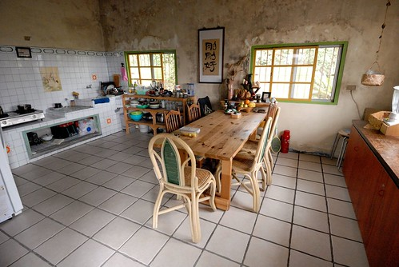 房間內 客廳內 處處可以建著主人的喜好與收藏 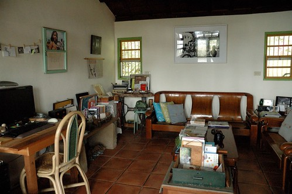 老東西  男主人的攝影作品 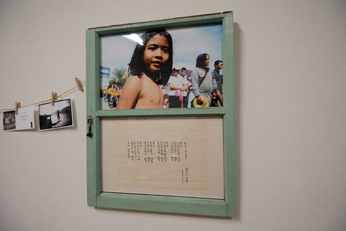 有關旅行 生活 食物的各式好書 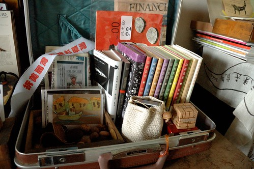 妝點著空間也提供住宿者心靈滋養 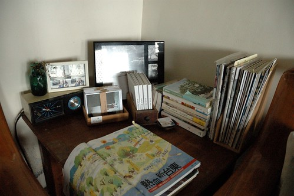 一切就如民宿網站上的形容: 關於,一對年輕夫婦住進一棟近四十歲的老房子 分享生活裡的記憶延伸 讓幸福入鏡 同時,也分享這屋裡屋外的空間 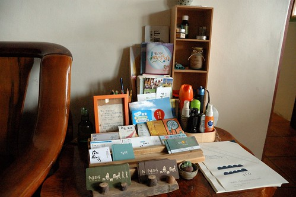

雖然時間緊湊 我們還是在離去前花一個鐘頭去走知本林道 因為林道客棧真的就在林道口 沒去林道散步一下真的太枉了  這是林道的入口 民宿的外圍籬笆 似乎還有功能的郵桶超級的有FU阿 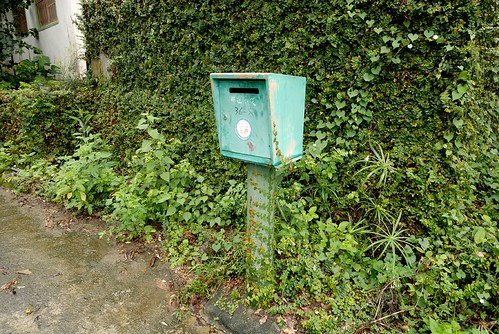 本以為知本林道在知本森林遊樂區內 才發現原來是兩件事的地方阿 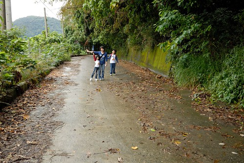 知本林道為以前的越嶺古道 沿途林相完整 自然生態豐富 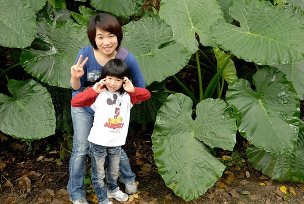 雖然沒遇著男主人說的山羌 但我們看到在樹林間盪著的台灣獼猴 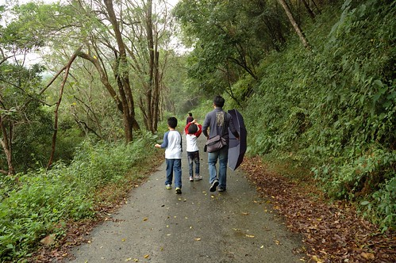 只可惜後來雨勢漸大 讓我們沒能走到預期4公里處的瀑布 (據說只差一點點了) 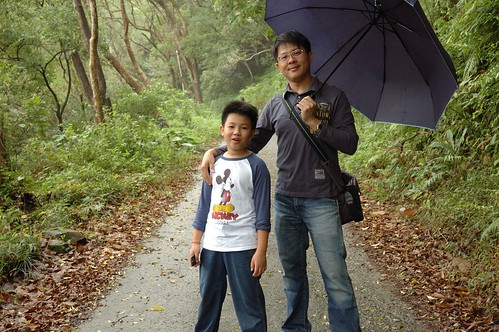 幸好徹家向來醉翁之意不在酒 有努力有經過就是很棒的回憶收穫 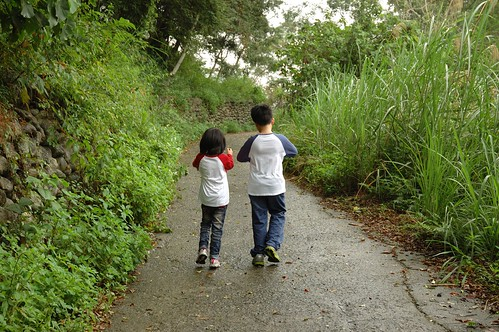 走回到林道入口 看見民宿的老房子 讓人很開心 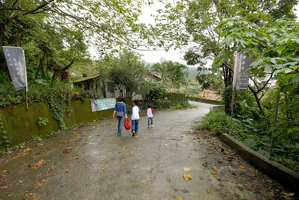 刻意的要徹愛從路的這頭走向房子 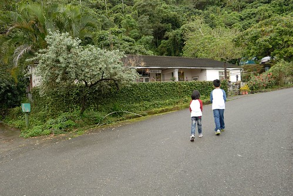 真的很特別的一塊地  一看就知道裏頭很有故事 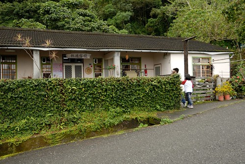 離去前 主人家應我們邀請的一同入鏡 謝謝他們給我們那樣的多的溫度與分享 (還送了徹愛好多小禮物阿)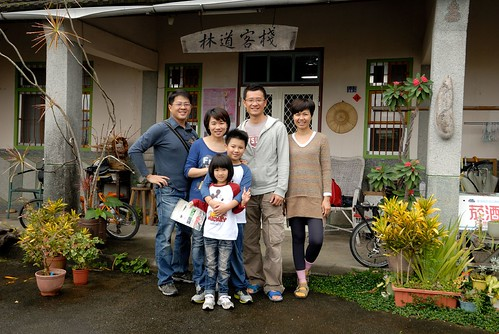 我們一家子肯定一輩子記得 曾經 我們旅行時 住過ㄧ家在知本林道口的老房子~~~ 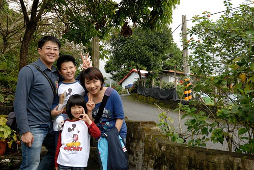

後記: 結束環島回到台北後 我心裡依然悸動不已 在林道客棧的FB留了下面的言: To:芝潔&小剛.. 我們完成六天的旅行回到了台北 但我的心嚴重的留在台東 特別是你們的林道客棧 你們是對很有深度與溫度的夫妻 就如客棧房子本身 相信肯定很辛苦 但你們的幸福那樣令人感動... 想與您們分享兩本書 林黛玲的"蓋自然的家屋"與bubu老師的"廚房之歌" 如前者書上 雖然房子真的很棒但你們的態度與實踐才是房子最重要的表達 而後者是因為看到客棧內好多深夜食堂與日系食物書 而想與芝潔分享的好書 祝福您們~ 也期待您們的下一個階段~

後來女主人回覆: 徹愛的媽媽, 謝謝妳寫信來, 這些文字對小婦人來說, 是很美很有能量的鼓勵. 的確, 每一個階段都是要付出相當的心力, 一步一步去實踐自己的夢想, 高低潮的時候仍保有初衷, 又不能忘記自己, 真不容易. 這棟老房子有他自持的魔力, 似乎會領著許多來自不同地域的大家, 如同你們, 住進客棧, 總能不時地給予我們新的驚喜與想法, 然後讓我們感恩這裡. 黛玲與bubu老師的書, 我們都很喜歡, 房子真的是需要人才會有靈魂, 而生活的態度的確是好重要啊! 新的一年, 春天即將到來, 願溫暖的南風吹向北方, 祝福徹愛的家, 攜手朝著夢想前進, 日日平安健康幸福!

謝謝小婦人這麼溫暖的祝福 這是這次旅行最大的獲得!
