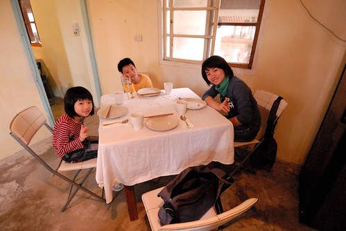
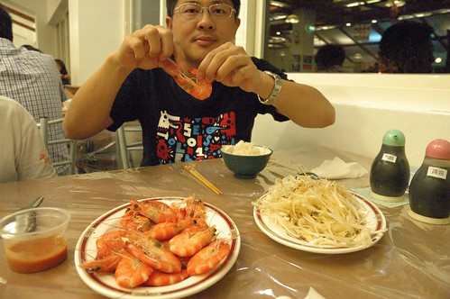

最近食品安全的問題又吵的沸沸揚揚.. 前幾天也赫然發現家裡夏天會煮的波霸珍珠竟也榜上有名 哇~ 其實就像徹爸說的又不常吃 我並不是那樣擔心害怕 只是每次這樣的熱頭上 特別感嘆每次的新聞熱潮過後 政府做了什麼 大環境改變了什麼 而人們自己到底又做了些什麼生活改變... 看見的危害可以避免 而那些以為放心的東西有時候反而才是影響所在 小7成了最大連鎖餐廳 外食是忙碌社會裡解決三餐好像理所當然的方法 不開伙的社會氛圍下  大家不知不覺間吃了多少鹽 糖 油  這些其實才正恐怖的一點一滴啃食著我們的身體 徹家向來不走極端路線 我們一樣會外食  會吃鹹酥雞 喝飲料 但我們也努力的吃自己....

日子都已經快到端午節了 而我還一直記得年初的遊記還沒寫完..   今日來個美食大整理

如一家子所說 這次的旅行真的吃比較好! 雖然大家旅行在外總是這樣吃吃喝喝 但對徹家來講這樣天天吃大餐 真的有些過頭...

住光復糖廠那晚 原先計劃就近在馬太鞍附近吃當地特色餐廳 結果非假日加上近過年 名單中的兩間都休息 於是我們臨時起意的去了我收錄許久的月蘆吃飯  月蘆 是每年我規劃花東旅行時都想安排的地點 但一年年的以不順路 時間搭不上為由而排除 怎樣也沒想到 我們卻是這樣狀況下來到月蘆  榻榻米上 黃燈下  我們滿心期待這兒的美食饗宴  就是"牠"   因為確定可以吃到牠 我們才半小時內摸黑開車上山來到月蘆  色香味俱全的梅子烤雞  一扒開滿滿的香氣 熱氣與振奮....  加上炒高麗菜 涼拌苦瓜  以及唯一的湯品選擇 野菜湯  是今晚我們的大餐 (其他都是青菜才能減低吃這麼一隻雞的罪惡感)  以為好大的一隻雞 我們竟也吃到只剩雞頭 雞腳 還回味無窮... 飯畢 我們才好好的逛逛園內  不知道假日的月蘆有多熱鬧 但我喜歡這樣安靜的月蘆  特別是寒冬中的炊煙裊裊  我們沒有很冷 但就想偎在這取暖  而雖然沒有白天的好視野 但這的夜景也挺不錯的 

旅行的第二晚 我們又去原生植物園吃野菜鍋 兩年內的第三次  超出我們想像的頻繁了  但我們依然是杯盤狼藉 喜歡的不得了  尤其父子倆 儼然吃野菜二人組  只是真的越來越貴 很擔心會不會有一天我們吃不消了  

旅行第三天來到鹿野龍田  一個從外觀完全看不出這裡是餐廳的地方  很受行家好評的"那界海" 無菜單料理  我們依照約定的時間來到 從入口便瞪大眼睛的走入到被安排好的位置 破舊的老房子 其實很簡單但卻因罩著白餐巾而氣質完全不同的餐桌 每件事都讓我們嘖嘖稱奇  徹爸問了好幾次"今天吃什麼" 我總說我也不知道 什麼上桌就吃什麼 第一道 燉得濃郁的蘿蔔湯  很好吃但沒有我們家喜歡的熱度  第二道 涼拌生菜  每每我們總是分裝後才想到忘了照相...  新鮮的當令食材果然簡單調味就好吃  第三道 蔬菜炒松阪豬(這是隔壁桌一群女生要上菜的人得給個菜名的菜名) 真的是讓人齒頰留香 讚不絕口的豬肉料理 好吃到我們直喊 如果這時後有個白飯就太棒了  生菜沙拉以後的每道菜間隔時間都有點久 到這我們已經吃了1個鐘頭 如果一群好友 喝著紅酒 慢慢品嚐這樣的美食一定很美好 但老實講 這樣的"慢"食真的不是我們家的tempo   我們吃到哈欠連連...  只好努力的東聊西扯 找樂子  第四道菜 海鮮義大利麵  細麵的作法與調味真的很特別 也很好吃  第五道 煎旗魚 我總會煎的乾硬硬的旗魚在這卻是這樣鮮嫩  吃完魚 徹爸問還有菜 有甜點嗎 我說隔壁桌吃完魚就走了應該沒了吧 後來離去時沒被拉住 證明我們應該是真的吃完了 整體來說真的每樣菜都料理的很美味  但嘴柴的我還是不懂網路上大家所形容的出神入化.... 只是我真的佩服與喜歡 台灣處處有這樣令人意想不到的人與地方!  

前三天吃太好 我說最後的幾天得縮衣節食些 但在墾丁時 還是捱不住阿徹"來到墾丁 怎麼可以不吃海鮮"的請求  徹爸上網找到大部分網友極力推薦 便宜又好吃的阿利海鮮 我心裡邊記算著總費用 邊點了炸花枝丸  糖醋魚  白蝦  還有涼拌洋蔥 炒青菜 海菜湯  滿滿一桌1000元有找  好吃嗎? 好吃! 滿足嗎? 滿足! 不知不覺間徹家也成了吃吃喝喝團! 不過旅行就是該這樣適度的墮落... 
