行程中原本沒有向陽薪傳工坊的  卻因著林道客棧的大力推薦我們來到這並滿載而歸 雖然這裡的無敵海景真的很美 每樣木作作品也都精巧或獨創的讓人喜歡 但我覺得最棒的是感受到一個部落的重生與營造 衷心希望工坊能夠像向陽一般發光 同時部落文化與技能也一直薪傳下去~ 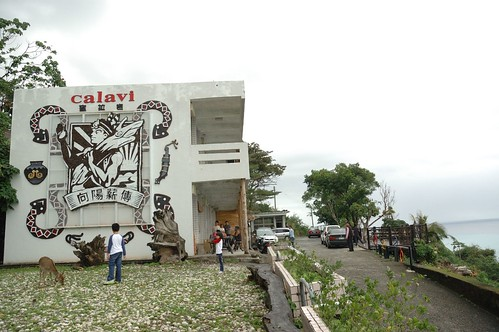 

往太麻里的台九真的很美! 雖然一年前才走過 拍過 看到這一幕我還是忍不住拿出相機捕捉個不停 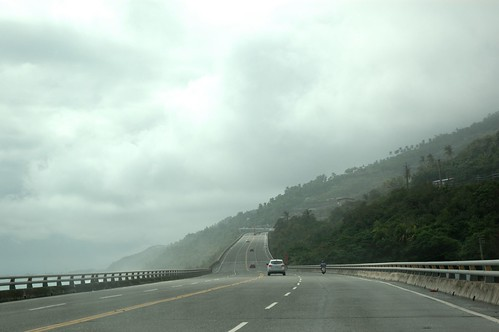 離開知本後 得走一段有點長有點曲的山路才能到太麻里 而工坊就位在太麻里最南的多良部落 也就是同樣去年我們才來過的最美車站的多良火車站上頭(再一個髮夾彎就到 去年我們卻完全不知道) 去年在台九路口或是往車站的爬坡道都還未見任何的指標 不過一年卻已熱鬧許多 立了指示牌 多了停車區規劃 來到的遊客也絡繹不絕 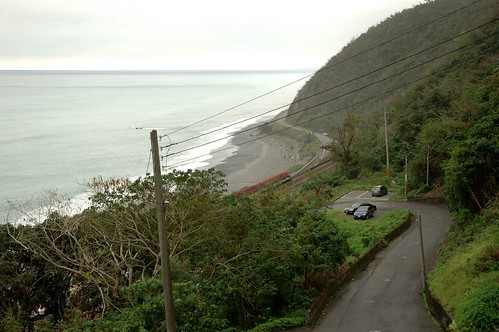 工坊成立於2010年8月 成立的契機是在2008年莫拉克颱風之後 因風災帶來的大量漂流木 讓有心人士藉此機會贊助培養部落的在地工作技能而同時也賦予這些漂流木新的生命 於是在原愛木工坊的輔導下 向陽薪傳工坊於已經廢校的大興國小多良分校成立了 回家才上網仔細了解工坊歷史後  很是訝異不過短短兩三年時間工坊卻已有這樣的規模 且走出自己的風格 甚至可能更勝於原愛(原愛的作品真的都很大而且很原創 不容易帶走與放在小空間中) 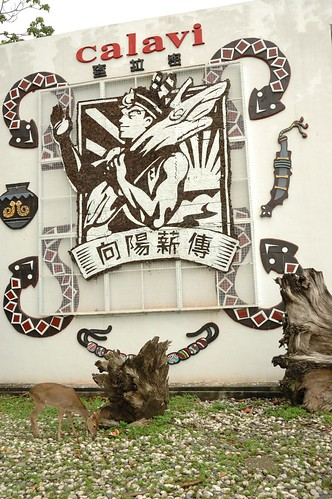 作品展示於兩間教室內 一間放置較大型的傢俱類 一間則有咖啡吧兼小創作品的販售 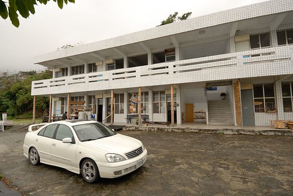 走進擺放有琳瑯滿目的小作品教室時 我跟徹爸眼睛都亮了起來 因為每樣作品都做的好精巧 好漂亮 好有質感 又好藝術阿! 徹爸徵詢服務人員是否可拍照後 才放心的拍下喜歡的創作品 一體成型的木杯子  讓徹爸很是心動 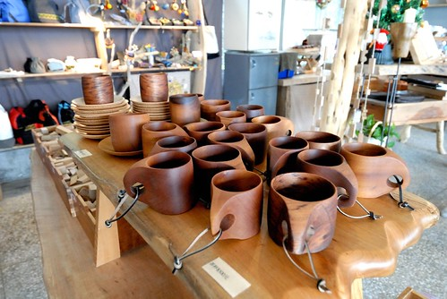 各式各樣可應用於生活中的小物件 小木盒 小杯墊 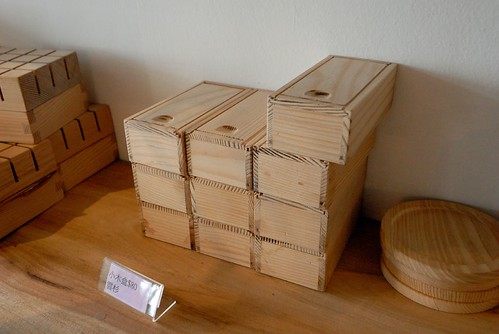 墊杯盒 名片架 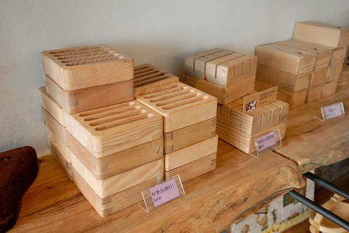 就連簡單的積木 這麼一串也顯得這樣可愛又有個性 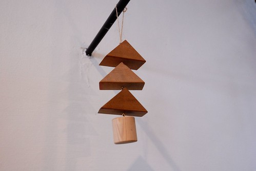 同時也有很多益智型遊戲的小作品 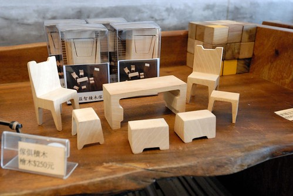 原汁原味的組合積木 (不知道這一盒會不會賣比較貴 還是非賣品) 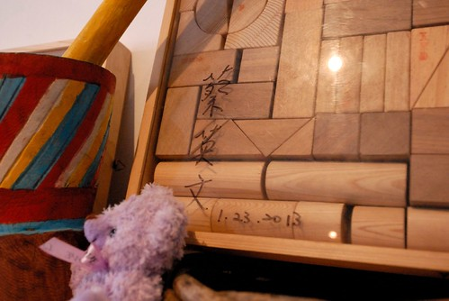 與單位積木的販售 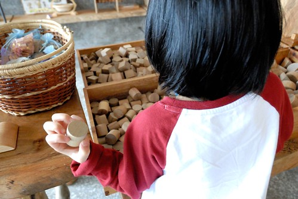 此外還有漂流木的創作品 小板凳 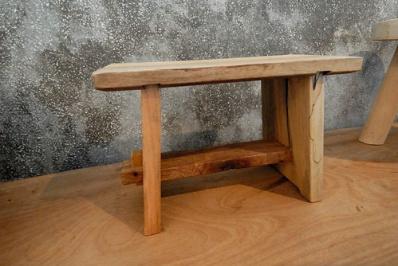 書檔以及中型書架 (那個書架真的很漂亮) 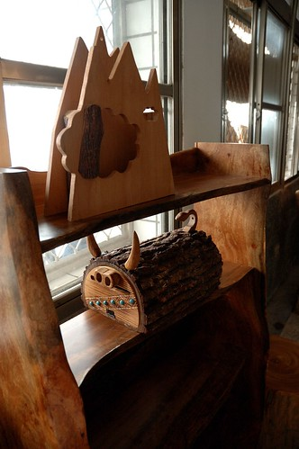 整齊排列的每樣作品都讓人好喜歡 好想通通帶回家阿~~ 而展示區的一角還有大鳥布工坊的編織相關手作品 每個也都獨一無二又漂亮 而且看起來都很耐用  更令人驚訝的是價錢合理到顯低阿 真的! 每樣都是可以帶回家的寶物! 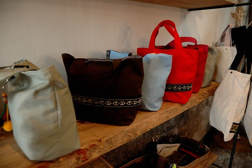 參觀的時候 走廊外有兩位原住民在沙磨益智積木傢俱 很熱情的讓好奇的阿徹試玩一番 果然是要ㄇㄟ角的ㄚ 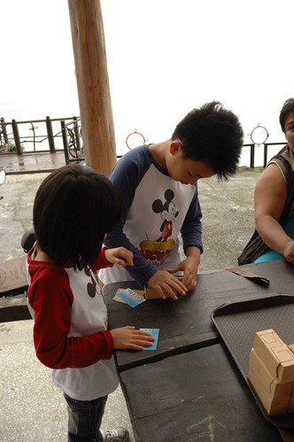 之後我們又到更上頭的工作區 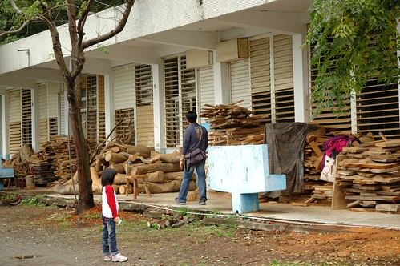 哇~ 一堆堆看似不起眼的木材竟能創造出這麼多又藝術又實用的創作品 真的好厲害! 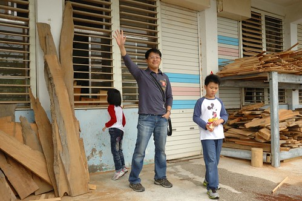 離開知本時 我們有備而來的先去小7買了飯糰當今日的中餐 原本想說沿途找個美麗的地方野餐 後來我們便在工坊2樓走廊吃了起來 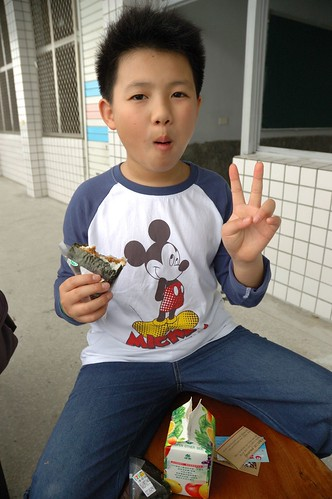 因為這裡是有著超級無敵海景的野餐地阿! 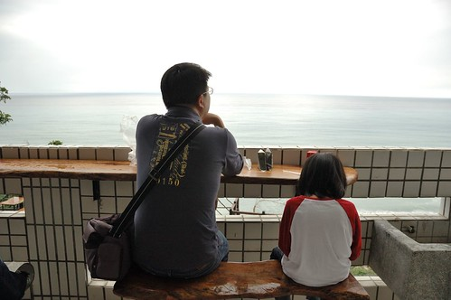 居高臨下望著180度展開的太平洋 心很難沒大開阿~~~ 真的! 以後環島旅行要再來這野餐!!! (只是旅行中越吃越好 大家竟挑剔起小7了) 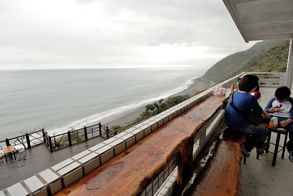 吃完中餐 徹爸忙著他的秘密大事 而我們母子三人則忙著去買可愛的積木傢俱 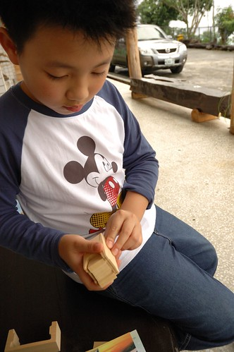 還有一個以後可以當作我可愛便當袋的布袋 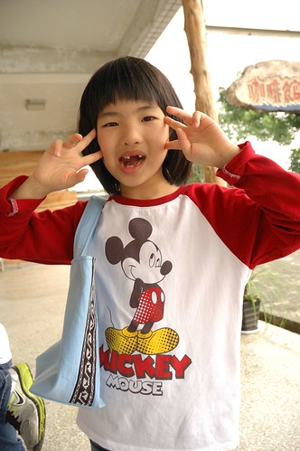 兄妹倆又繼續去看一旁草地上的梅花鹿 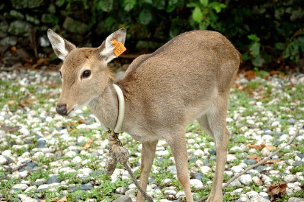 梅花鹿可愛又靈性 徹愛難得可以這樣近距離觀賞 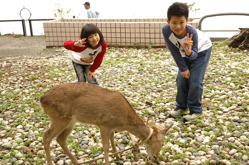 我們不知不覺在這裡停留了兩個多鐘頭 感動於這裡的物 這裡的事 還有這裡的人 會記得離去前 陳班長跟我們說的話"記得以後再來玩" 會的! 我們會記得的!! 這麼一個隱於山的美麗部落!!! 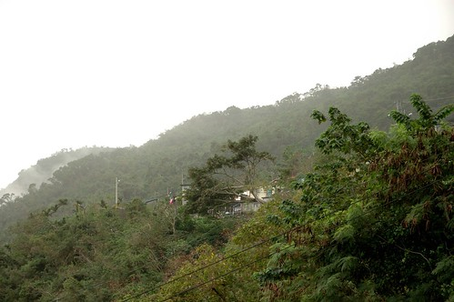
