昨天 我難得的在稍為嗅到夏天味道的4月底就把衣櫃大換季 這不同於往年的積極 或許正反映著自己心裡渴望著工作煎熬的這陣子可以過去的快一點吧! 沒想到今天的天氣卻如氣象局預報的準確 說變就變 又濕又冷的 突然~ 好想念二月初我們在墾丁的天氣晴~ 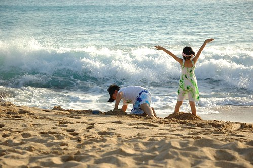 

我們的墾丁之旅是從旅行的第四天下午 民宿入住後的探訪關山夕照開始 不過老實講 初印象不是很好  首先是有點難以理解為什麼國家公園內停車都要收費 而且委外經營的收費價格不便宜 再者如解說牌夕照上的觀景台 大半圈著維修繩而不准進入 而且看來是失修好一陣了  好不容易卡到觀賞的位子後 前方卻是百頭竄動加上樹木叢生  真的看沒有什麼...  不過幸好第二天的台26與恆春老街的漫遊 以及白沙灣的戲沙與夕照讓我們體會到南境之美  傍晚白沙灣玩沙前 我們來到恆春老街上找冰吃  也意外的來個老街小巡禮 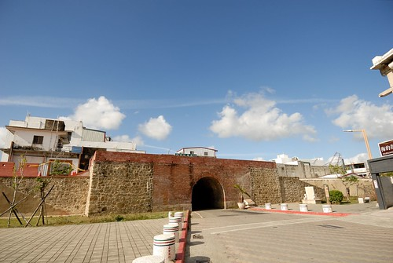 我們走在有百年歷史的城門上  兄妹倆跑上跳下 好是開心  而我看著這一幕幕以紅磚為背景 小人嬉遊的畫面 也看的好是入迷  我喜歡這樣一個靜靜訴說小鎮歷史的恆春一面 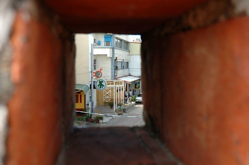 老街有點出乎我們意外的新( 很乾淨很整齊)  但卻又總被房子二樓以上的美麗舊鐵花窗 提醒著老街的歷史 走著走著 我們來到百年歷史老房子的店家吃麻吉 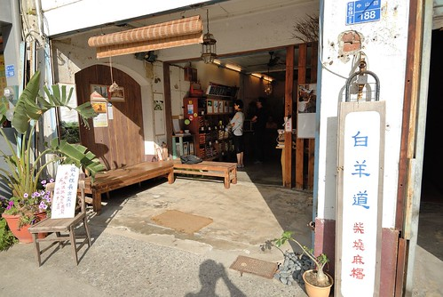 狹長的老房子很拼接 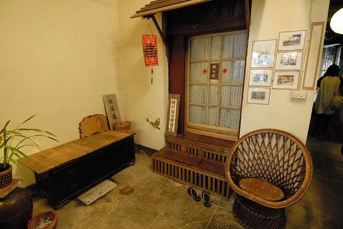 很多不同風格的小空間  我們端著一份小點心 來到房子的最後頭慢慢享用  吃完麻吉 我們繼續穿梭老街尋找徹爸熱騰騰估狗到的清涼綠豆饌 只是怎麼四點不到 老闆就賣完收攤了  我們只好來到不遠處的另一店家享用從沒看過吃過的綠豆饌 有如羹版的綠豆湯 還真是順口好吃 只是小人有點難接受... 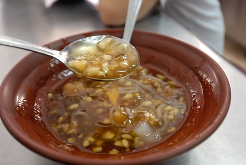 

旅行前答應兄妹倆 讓兄妹倆開心期待許久的墾丁戲沙也總算在這天的傍晚實現 停好車走往沙灘的路上 果然有我們不曾體驗過的南島風情  兄妹倆壓抑著衝動 小心謹慎的走向他們嚮往很久的墾丁沙灘(很怕一個傘失犯錯就不用玩了)  放好傢私 頭也不回的迎向他們的海與沙 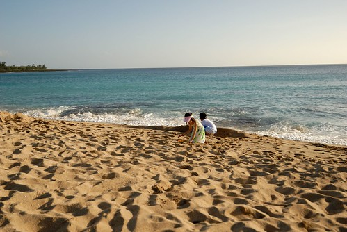 我跟徹爸則好整以暇的坐在有備而來的小椅子上 大傘下 看著海看著小人  我們堅持那是小人自己的遊戲 但我光是遠遠看著他們就也跟著一起開心與陶醉  雖然小人越來越不怕海了 不再容易被突如而來的浪花嚇的花容失色 但小人還是保有著謹慎與小心 不會走入離邊一公尺遠的海裡 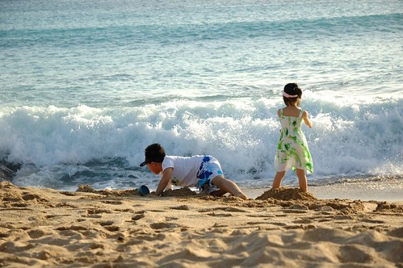 所以我們得以這樣悠閒的遠遠看著她們的愜意 只消拿出相機捕捉回憶 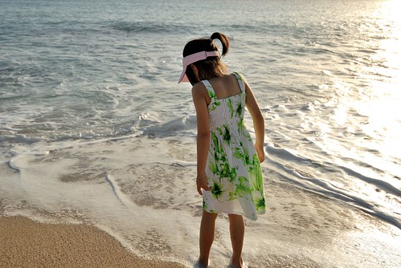 看到愛愛這樣恣意但縱情的背影 我忍不住快門按個不停  愛愛真是認真的在感受墾丁的海 墾丁的陽光 而阿徹則是賣力的在玩墾丁的沙  認真挖出深長的水道 讓徹爸也忍不住湊上前幫一腳  我喜歡這樣的墾丁回憶! 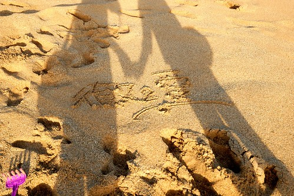 兄妹倆打定主意要玩到太陽下山後 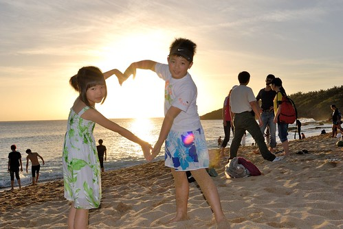 分秒必爭的珍惜著在墾丁沙灘上的每一刻 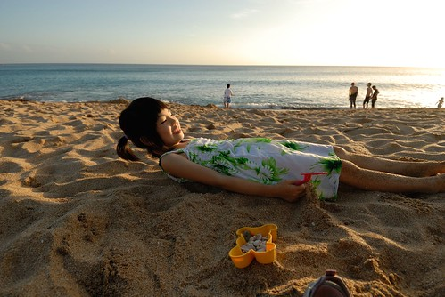 用盡全力似的玩著 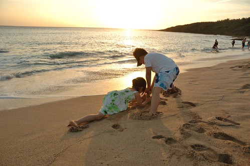 笑著 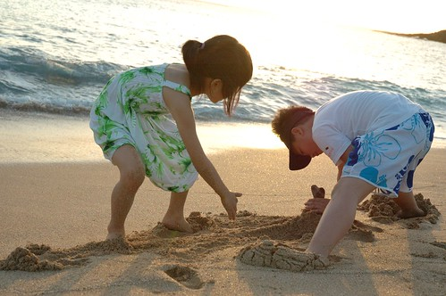 感受著  還有把自己的洋裝浸濕在墾丁的海裡  又是一系列讓媽媽快門按個不停的畫面 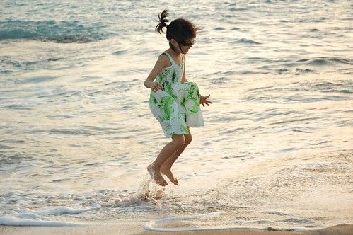

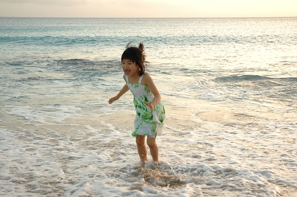 同時 我們也認真看著遠方的落日 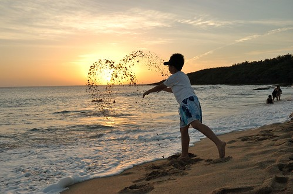 雖然沒有關山夕照上那樣的繽紛與豐富 但這樣的安靜與平淡是適合我們家的方式 

 孩子~ 太陽公公下班回家了 我們也該離去了 縱使依依不捨 但誰說不會再有下一次ㄋ 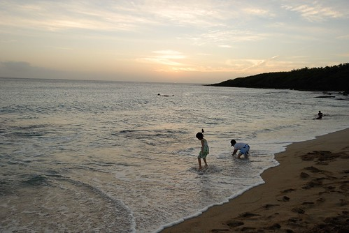 這是個美麗又快樂的恆春之旅! 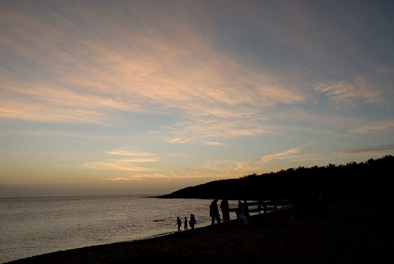 只是孩子阿 請不要三不五時就問我"我們什麼時候要再去墾丁阿?"  .....
