真的要給自己灑花一下~~~ 我竟然又漏漏長寫了12篇的遊記才把我們年初的環島慢漫遊紀錄完畢(觀眾也請掌聲鼓勵) 就如徹爸說的 對於玩 我總是有超強的堅持與行動力 但我想除了是貪玩外 也是自己對生活價值與意義的一種實踐與累積... 最後 就用關山的涼夏作為ending 一個讓我們的墾丁初體驗加分很多的親子民宿!

耳聞墾丁兩家親子民宿很久 樂活木屋與涼夏 幾位朋友住過涼夏後也都給予很高的評價 若是夏天 肯定很難訂到這兩家民宿的房 但在淡旺季差別很大的冬天裡 我們順利的有了涼夏之約(其實更喜歡樂活 但是民宿休長假中)

離開台東的那天 天空很陰還不時有絲絲細雨 沒想到繞過南迴來到墾丁 迎接我們的卻是藍天白雲的好天氣 尤其車子抵達民宿 我們甫下車 就看見遠方天空掛著的一道彩虹 心想 真棒! 一到墾丁就收到這樣令人開心的見面禮 而果然這是個好兆頭 接下來的兩日兩夜 我們在墾丁玩的很開心!  而除了彩虹的迎接外 我們接近4點時分的來到 正是柔和與舒適的陽光 襯得民宿更顯美好  獨立門戶進出的四人房 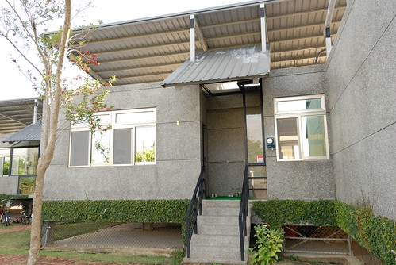 裡頭有最讓網友讚不絕口的 客餐廳與中島檯  簡單寬敞的臥房  以及可以烤肉 可以乘風納涼的陽台 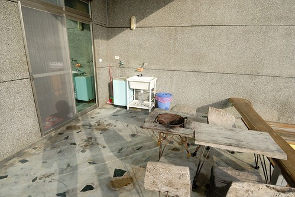 看到這樣功能齊備又美麗的"房間" 徹愛開心的不得了 兩人像小鳥一樣 開心的又跳又飛  不過縱使房子讓人很開心 兄妹倆還是要先看個電視解饞下(前兩晚民宿都沒電視) 

接下來的兩天 我們很當真的把這裡當成一個家那樣使用  白天玩完後的夜晚 以大中島為中心活動著 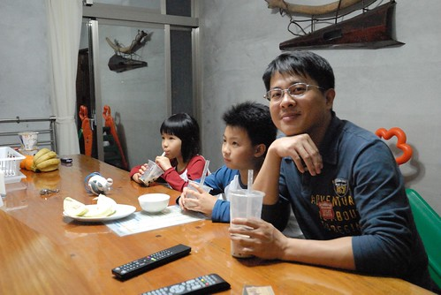 如在家似的吃水果 看電視 談天與遊戲 (話說南門旁小萍飲料店的珍奶真的好好喝) 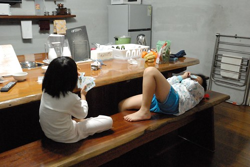 也難得的一家子都徹底放鬆 一夜好眠 (我跟徹爸出門很認床阿)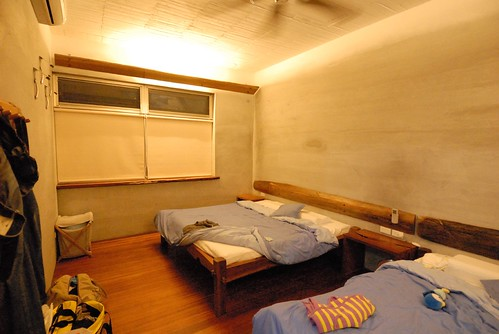 而早晨 則像在嘉義一樣煮粥吃  母子三人好像在玩真人版的家家酒  我說在民宿煮飯 真的很像辦家家酒 因為為了煮這兩天的早餐 出發前的行李打包要多包一袋米還有肉鬆 而第一晚在墾丁超市買高麗菜時 想起沒有蒜頭 也只好買了一袋一斤裝的蒜頭(幸好家裡蒜頭剛好用玩) 然後我還很會"ㄅㄧㄥˋ"的找出人家收好好的大同電鍋來煮粥(電鍋的新度讓我很懷疑使用次數沒超過5根指頭) 然後在10樣缺5樣 不熟悉又很怕弄髒的廚房裡煮其實應該簡單的一頓早餐 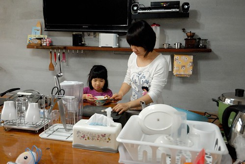 雖然熱呼呼的粥讓一家子吃的開心又飽足 但中島的置物空間真的很小 而且吃合菜很不方便(我們不小心撞破一個玻璃杯 也踢痛好幾次腳) 我想我大概是來住過涼夏的客人裡極少數不會嚮往這樣中島廚房的客人吧  吃完早餐後 一家子繼續如在家時的圍著餐桌休息醒腦 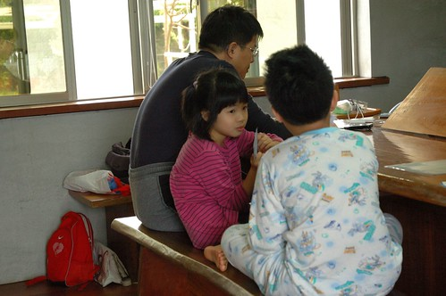 旅行中喜歡上玩99的愛愛 一有時間就抓著人陪她練技術 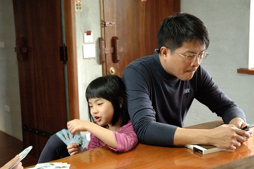 兄妹倆用著在林道客棧收到的牌玩著 遊戲顯得更好玩的樣子 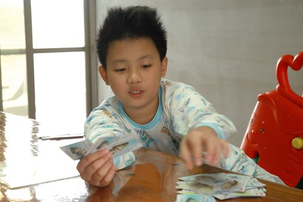 而除了玩牌 兄妹倆很多時像在家一樣的東晃西玩 我們真的就像"租"了一個家一樣 活動在家的空間裡 這是旅行裡難得的經驗! 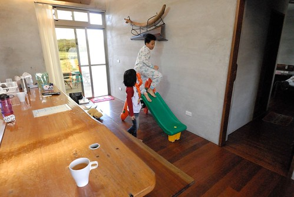

行前 我除了準備來這煮粥的米外 我還準備了來這洗衣服的洗衣粉 民宿網站上說明的洗衣機 讓我很是期待在這把我們出門四天累積的衣服洗個乾淨 結果沒想到竟然只是脫水機 Orz 我只好把兄妹倆的衣服挑出來用手洗 好讓他們接下來可以帶著乾淨的換洗衣服去阿嬤家 很久 沒有用雙手洗這樣一大盆的衣服了... 晾完 怪有成就感的... 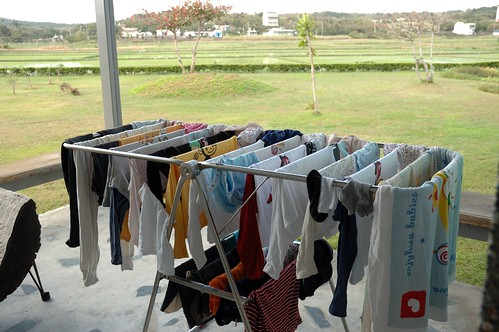 在墾丁的兩天晚上我們都有去超市晃一晃 貼用品 兄妹倆總念著"我們來烤肉好不好" 烤肉?! 四個人的烤肉?! 立馬想到要買好多東西 結束後要收拾好久... 我當然是沒有這樣的傻勁與熱誠 而想不到 "沒有烤肉"竟成了愛愛在寫墾丁遊記時最令她難過的一件事 如果再有下回 媽媽會行前先準備些烤肉用具的....  因為沒有烤肉 加上晚上戶外的蟲蚊比較多 我們在陽台的時間很少 最後一天準備北返前 依依不捨的坐在陽台享受最後一刻的愜意  雖然民宿吸引人的親子設施 小沙坑 小戲水池 小滑梯 我們都不適用了 專業化的管家接待 也讓沒見著主人的我們有些小遺憾 但我喜歡民宿讓人如回家般自在與放鬆的氛圍 這是不同於往的另一種民宿體驗!  好風景 好民宿 好天氣 好心情...讓我們的墾丁初體驗如此愉悅 而我們的環島慢漫行也在墾丁畫下完美句點! 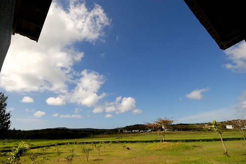
