其實會來鵝鑾鼻 純粹是因為媽媽很觀光客心態的想"來墾丁沒來過鵝鑾鼻實在太遜了" 因此我們才會除了停車費 還忍痛買門票進來(雖說要維護費 但國家公園內到處得收錢真的挺難接受的) 幸好本以為不過是座燈塔 卻出乎意外的是腹地很大的公園 而我們當然就要很物超所值的 除了看燈塔還走遍公園內的主要步道 倘佯其中兩個小時 我們也才更感受與體會墾丁的驚奇與美麗!  

公園入口處進來後 映入眼簾的便是一片整齊平坦的大草坪 來墾丁有如劉姥姥進大觀園的我們 納悶的直喊"燈塔ㄋ? 怎麼沒看到燈塔" 呆了半响 才發現原來燈塔在有點距離的彼方阿!  既然看燈塔不是件太容易的事 我們當然索性走最完整的路線一探究竟 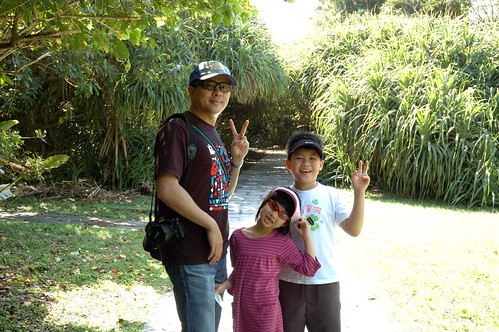 才開始走步道 我便喜歡這裡 因為這裡有我去年才看的"我在墾丁 天氣晴"戲中 會令我心動想來墾丁的原始林相 而且難得的 步道中還有著人煙罕至的清閒與幽靜  我們對照著入門票背面的園區圖 探訪每個標示的地方 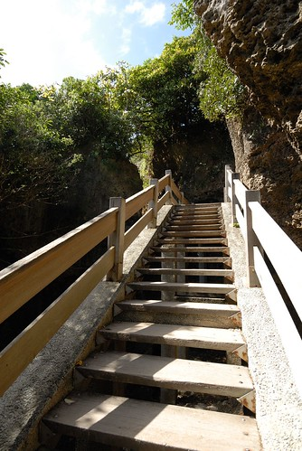 親吻石  我開心的要徹愛跟我來親吻一下吧! 平日不見扭捏的兄妹倆竟害羞起 兩老只好不害臊的親自上陣  過親吻石後  我們繼續循著木棧道  等著與下一個標示地的相遇  想不到轉個彎後 迎接的是這樣美麗的海景 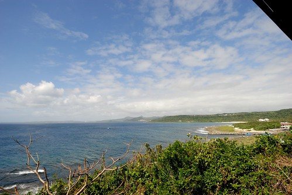 站在"滄海亭"  看著海 吹著風 忍不住想滄海一聲笑阿~  這裡的風真的好凉  好舒服 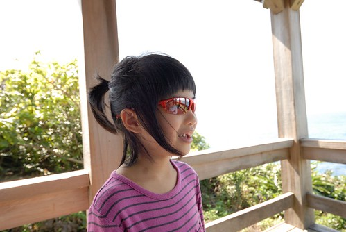 讓人吹的忙酥酥...  一家子真想就這麼一直坐下去  我們還忍不住懊惱 如果有帶食物來野餐該有多棒ㄚ 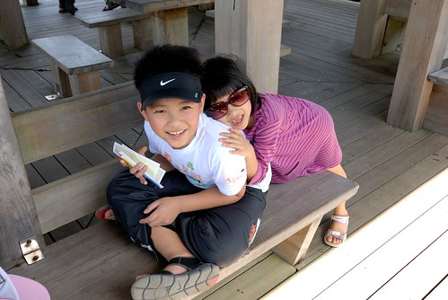 真的很棒的一個"滄海亭" 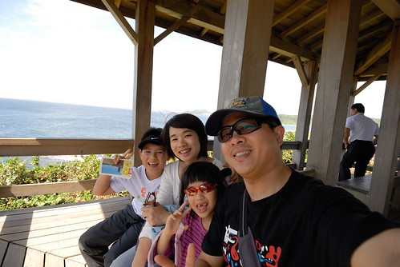 趁著鬥志流走的僅剩一些些 我們趕緊起身再上路  再經過親吻石  徹愛兄妹倆竟就願意獻出他們的小嘴給阿母 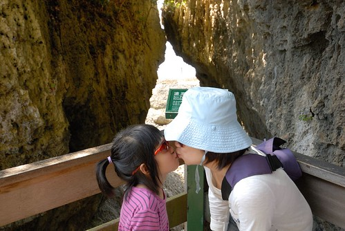 果然 剛舒服的風把徹愛吹茫了 ㄏㄏ~  接下來 我們把路線權交給兄妹倆 讓兩人看著地形圖  決定左轉還右彎 尋找下一個地標點 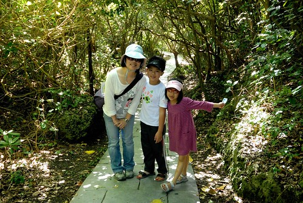 我們如探險般的走在全然陌生的林樹間 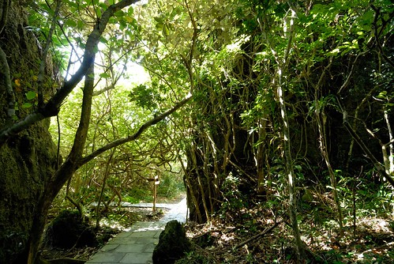 但走的很隨意而安 很愜意 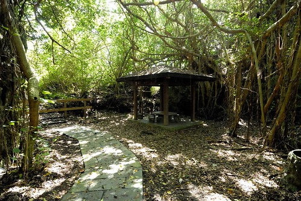 看到指標上寫的"冤家路"  起先很不明就裡 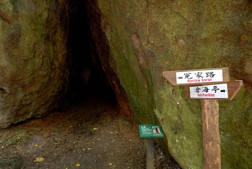 走進後 才恍然大悟原來是冤家路窄的冤家路阿  真的不要在這裡遇到冤家 想躲都沒地方躲阿  小徑裡  抬頭看見滿天綠蔭及透亮ˇ點綴的陽光  我忍不住又驚呼了 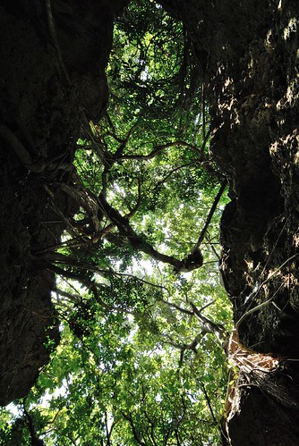 沒多久 進入了"非非洞"  又黑又小的洞裡 真的容易讓人想入非非阿 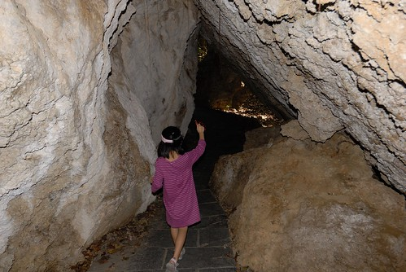 這一連串的不同地形與林相 對我們來說真是個驚呼連連的探險之旅  走完大部分的主要步道後 總算我們來到燈塔前 見到了台灣最南端的白色燈塔 阿徹出乎我們意外的 突然大剌剌的躺在草坪上 似乎有種見著你真好的感動與開心! 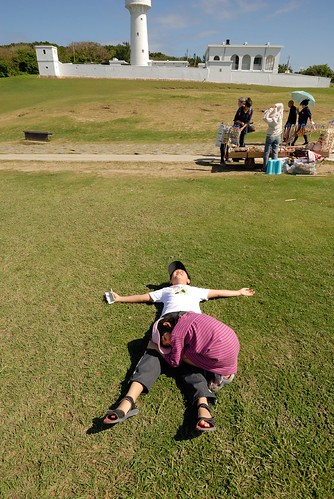 這回旅行很愛跳的我們 當然得在這好不容易來到的台灣南邊之境 High一下 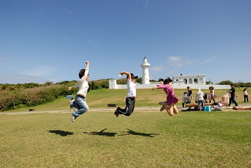 無視於一旁絡繹不絕的同胞們 我們一家子跳的不亦樂呼  總算捕捉到timing真棒的這一幕!  開心又感動的我們決定去買汽水慶祝一番 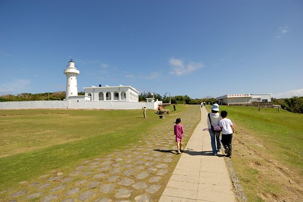 也順便近距離的觀賞燈塔一番 好藍的天 好白的建築物 加上那如羽毛般的雲彩  真的好慶幸我們沒有小氣的沒來鵝鑾鼻公園阿!  縱情於墾丁風情裡的兄妹倆 顯得活力四射  真的好陽光!  很棒 很美的一個國境之南  也總算我們也有"我在墾丁 天氣晴"的美好回憶! 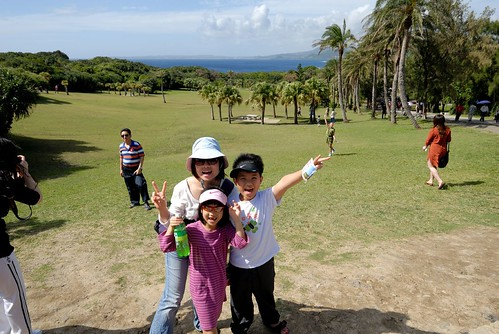 只是就如愛愛回家後說的 墾丁真的好好玩 只是大陸客如果不要那麼多會更好 ㄏㄏ~ 鵝鑾鼻燈塔的祖國同胞真的很多 不過幸好還有許多能讓我們愜意的小角落! 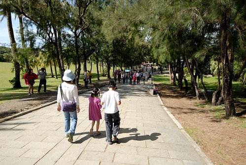
