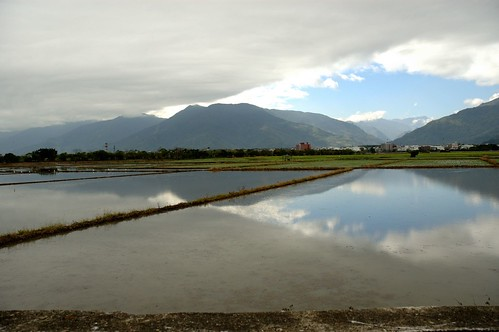
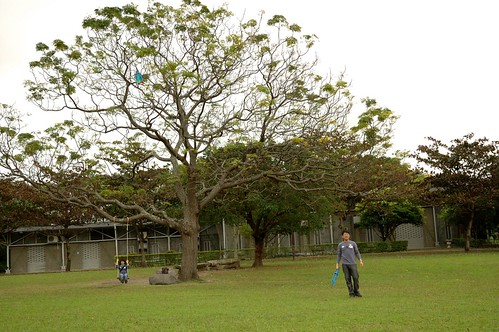
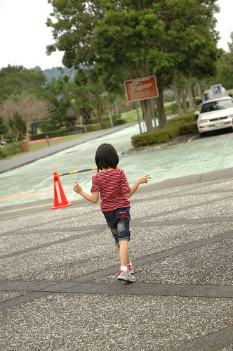

是滴~ 我又盧徹爸帶我們去台東玩了 而且還破記錄的安排了六天 甚至順道的去了墾丁... 糟糕的是出發前我忙到沒有時間好好做功課 而且還累到前兩天上車就昏睡 下車就恍神 讓徹爸跟徹愛三人常嘀咕著媽媽是怎麼了 媽媽這次太反常了... 幸好台東不是走假的 東走西晃總還是有門道 只是"漫"到阿徹忍不住說這次怎麼感覺沒有玩什麼... 而那個從沒去過很是陌生的墾丁 更是一無所知的在邊吃邊玩的同時 靠著徹爸小手機即時上網查詢才完成我們的墾丁初體驗 所以我說這回真的是"漫"遊阿 很漫山遍野 很漫漫長路 很漫步 很漫衍 但卻也漫不經心...

這次的最後行程如下: 1/31(四) 台北-> 新城 柴魚博物館 檸檬汁 -> 花蓮 禾禾飽滿餃子店 時光書局 -> 鳳林 三立冰淇淋 -> 鳳林 月蘆晚餐-> 宿光復 花糖 2/1 (五) -> 富里 羅山村 -> 池上 伯朗大道 -> 縣197尋找忘憂谷地 -> 原生植物園晚餐 -> 宿台東 有時回家 2/2 (六) -> 史前博物館 -> 卑南文化公園 -> 鹿野 那界海午餐 -> 陳家麻吉 兒童故事館 寶桑湯圓 七里香水煎包-> 知本溫泉 -> 宿知本 林道客棧 2/3 (日) 知本林道 -> 太麻里 向陽薪傳木工坊-> 屏東 關山日落 -> 宿關山 涼夏 2/4 (一) -> 墾丁國家公園 帆船石 鵝鑾鼻燈塔 風吹砂 (台26+縣200) -> 白沙灣 -> 阿利海鮮晚餐 -> 宿關山 涼夏 2/5 (二) -> 嘉義 -> 台北

行程是早在12月中訂房的時後就大抵安排好 但是到出發前幾晚才抽空花一些時間仔細安排台東的行程 參考著"緩慢.台東.旅"一書 我安排了好些很是令我期待的祕密景點 沒想到在台東的天氣不佳 加上祕密景點真的不好尋 以致最後大部分都是舊地重遊 其實置身在花東縱谷裡 放眼所見是山是雲 就是最棒的風景與享受了  只是對於年輕氣盛的徹愛來講 是真的少了許多新鮮感與趣味 也因此兩人沒事就鬥嘴當有趣 偶而還嘟嚷的很討罵 得老實承認 前兩天自己的腦袋與心情還塞了不少工作的事 加上未如意的走完事先安排好的祕密景點 心情有些煩躁 幸好一家子第二天吃完野菜鍋後都正常不少 就像徹爸說的"莫非這個野菜鍋有療癒心靈的功能" 或許真的有! 我慶幸自己有及時回神 明白旅行就該放下一切的聽天意 順自然 而腦袋開了 心也就鬆了...  或許真的如徹愛常說的"咦~這裡不是來過" 但愛愛1歲時 3歲時 5歲時 7歲時的身影 層層堆疊出那麼一樣但又不同的回憶  我喜歡看到旅行中徹愛那樣開心 那樣自在的模樣  也很欣慰徹愛樂於這樣沒什麼的旅行中  雖然有爭吵 有不順心 但一家子能一起旅行就是最幸福的當下~~~
