墾丁是怕熱鬧的我與徹爸最不會想去的旅遊地點之一 但偏偏卻是徹愛最夢想去的地方 因為他們常耳聞老師或同學去墾丁有多麼的熱鬧與好玩! 看到徹愛這樣的渴望以及明白自己是怎樣都無法突破心房在最熱鬧的夏季來墾丁 趁著這回冬季旅行 於是我們順道來去墾丁! 墾丁果然跟我們想像中的一樣熱鬧 也如徹愛幻想般的熱情好玩 不過出乎我意外的卻是原來墾丁這樣多風情與美麗! 所以當徹愛偶而再嚷起好想去墾丁的時候 我不再像以往那樣拒絕 我會語帶保留的說"以後的寒假 有機會的話..." 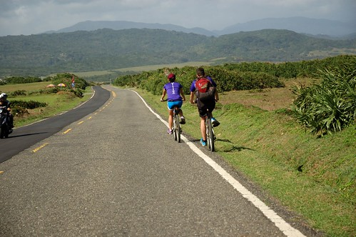 

出發前 我忙到完全沒時間做功課 僅有上墾丁國家公園網站大抵瞭有哪些景點可以去走走看看 而打的如意算盤是屆時就請民宿老闆推薦就好 (我們心裡對於墾丁有多麼不放心上也由此可見) 只是沒想到民宿老闆是專業老闆完全沒出面 而接待我們的管家姐姐也可愛憨直的說"我們當地人實在不知道墾丁有什麼好玩"(她很難以理解的表情 哈) 於是我們只好自己拿著民宿內的旅遊DM認真研究起 幸好 好像車子只要沿著唯一一條的台26道路開 來墾丁該看的景點就都會看到 於是旅行的第五天 在墾丁的一整天 我們從墾丁國家公園遊客中心開始我們的墾丁初體驗 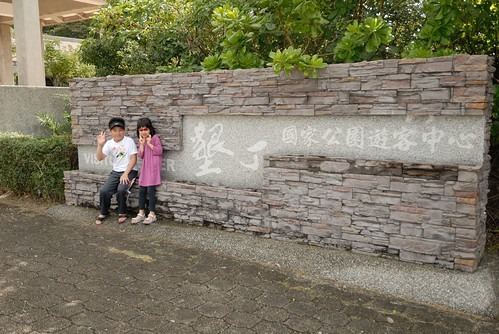 到遊客中心的時候 我們自嘲大概只有像我們這樣的親子團才會來遊客中心 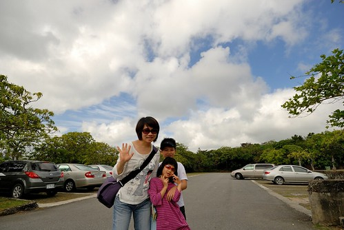 但我們衷心期待能在這裡獲得些墾丁的旅遊資訊 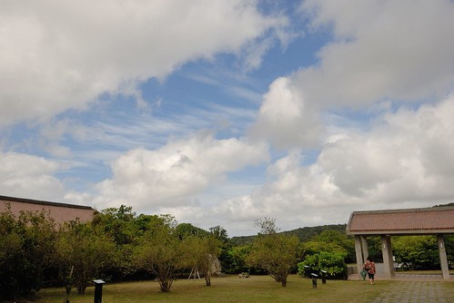 而且遊客中心真的是適合小孩的地方 有小遊戲可以玩 有生態 環境相關影片可以看 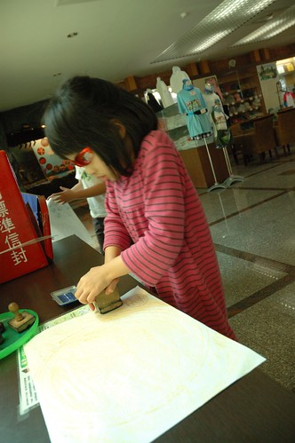 是小學生很棒的自然教室  透過影片/圖像及文字介紹 我們也才第一次知道墾丁的地形是這樣獨特與多樣 而半島上孕育的物種也是如此多元豐富 難怪這樣商業的大環境下 台灣的第一座國家公園卻設立於此  真的值得多做些什麼的好好保護!  有點可惜的是遊客中心周圍綠意盎然 自由生長的大樹阻擋了看海好視野 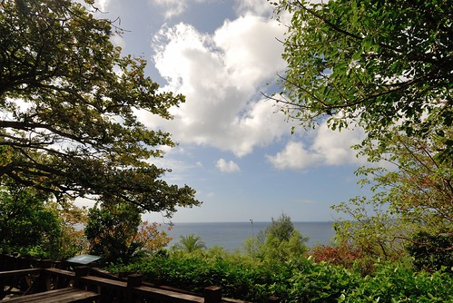 離開遊客中心 過墾丁大街不入(正確說法是我們根本不知道是哪裡也沒打算) 我們慢速開著車 對照著旅遊DM 逐一探訪每個不該錯過的景點 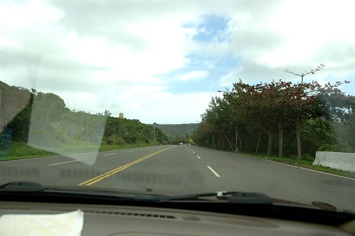 首先是帆船石 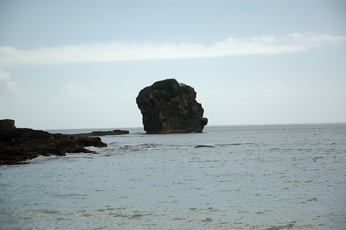 雖然我覺得比較像是一頂安全帽 而且遊客真的比在花東旅行時多很多 少了點清閒 但晴空高照的好天氣 加上徹愛總算踏上墾丁沙的興奮 還是讓我們直呼好漂亮阿!  滿足兄妹倆的期待與渴望 讓他們可以在這裡踩沙踏浪 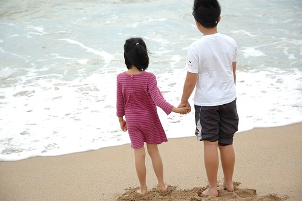 第一次踩上墾丁沙灘上的兄妹倆 好像興奮的都快說不出話來 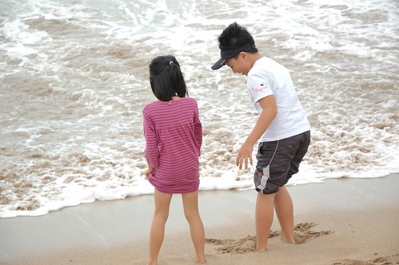 兩人只是猛笑  然後很虔誠似的感受墾丁的陽光 沙灘與海水 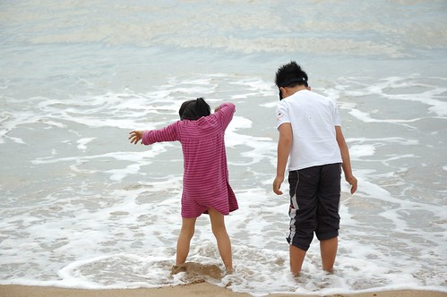 看到小孩圓夢後的幸福樣 是這回旅行的最大收穫  一旁等候的我們也更是用心感受墾丁的美  墾丁 真的比我想像中美很多! 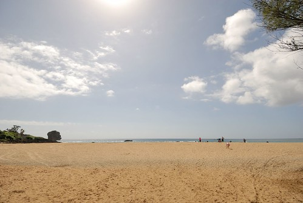 只是一路上的商店林立  飯店也一家比一家大 其實心裡感覺真的很衝突  或許就是因為墾丁這樣美 所以遊客這樣多 然後飯店這樣夯吧! 我很慶幸我們是選擇冬天來到墾丁 這樣的淡季才能讓我們有個美好初體驗 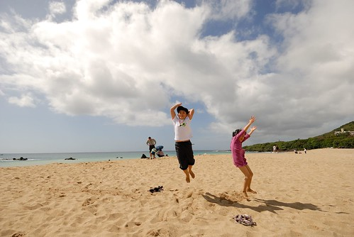 今天 徹愛要放縱在墾丁風情裡~  

繼續沿著台26來到台灣的最南端  但到處都要收停車場費用 讓我很是碎念 因此我們選擇往下一個熱門景點 鵝鑾鼻 雖然一樣要收停車費 而且還得再付每人的入園費  但來墾丁沒去鵝鑾鼻實在太枉 也幸好我們有掏出腰包 才能在鵝鑾鼻公園內親身感受到墾丁地形之美(另敘)  離開鵝鑾鼻後 我們繼續沿著路 往北方開在台灣的東部 我心中有種很奇妙 很親切的感覺  因為這裡跟台東一樣是東部耶... 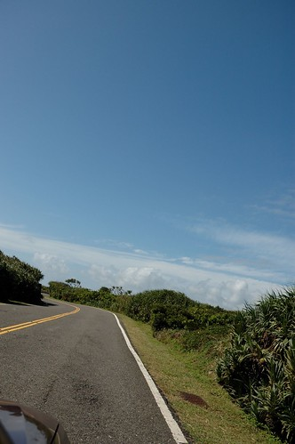 台26的東部段真的很美麗 右邊是翠綠藍閃的太平洋 左邊是綠意盎然的草原與山 再搭上像今天這樣的28度溫度 徐徐微風吹著的大晴天  真的是條很棒的單車路徑 (沿途我們跟這對單車情侶交會好幾次 忍不住偷拍人家好幾次)  沿路上 我們看到明顯是景點的地方便停車看看走走  難得遇到請我們幫忙拍照的情侶便也請人家也幫我們全家合照一張 這是我們這次旅行中唯一的一張全家福  而在鵝鑾鼻分別買了海灘褲及南洋小洋裝的徹愛 變身後的心情更是high到最高點 他們總算穿上他們認為來墾丁玩的必需(標準)裝扮 

龍坑公園的海 就如藍寶石那樣湛藍閃爍 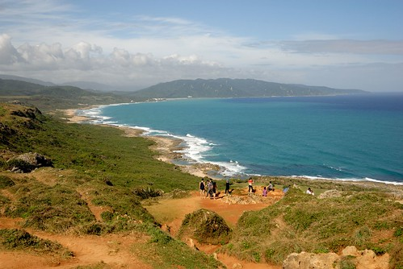 無敵大海景阿~ 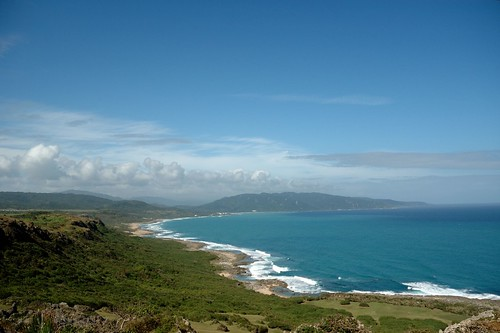 再偷偷把單車情侶一起給入鏡 真的是很美的一幕阿 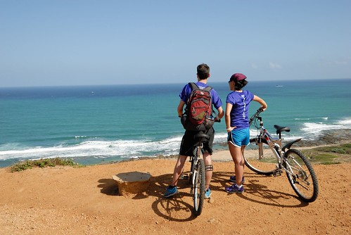 接著繼續來到的是風吹沙 到達之前徹爸說"聽說很漂亮喔~" 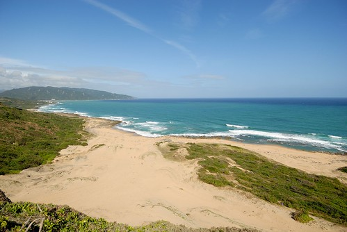 又是另一種構圖的無敵大海景阿!!  最後我們一路開到台26尾的港口 啥咪! 港口吊橋上去要收10元門票?! 不是我們小氣 只是又餓又熱的我們已經沒有動力想再花這錢了  草草在港口的小麵店吃了些東西墊墊胃 以及再到佳樂水的入口處看到不便宜的門票收費後 我們接著走縣道200回到恆春鎮上 縣道200上 雖沒有任何的景點 但卻有著靜謐的農村景色 也讓我們讚聲連連 而今日的台26+縣200也剛好讓我們把墾丁的精華全都盡覽了 墾丁美嗎?! 真的是很美! 而這次初體驗 也讓我動念日後再訪墾丁 再走許多此行沒走的公園與步道! 只是真的得在這樣的淡季來..
