羅山村 台灣第一個有機農村 想來很久了 尤其在看過買買氏"棄業日記"書上生動描寫的羅山生活後 只是礙於種種理由 最後每每都會從最初的行程安排中踢除 這回我總算有始有終的如願一訪那個一直以為有點偏僻 有點神秘 甚至有點高品味的羅山村~ 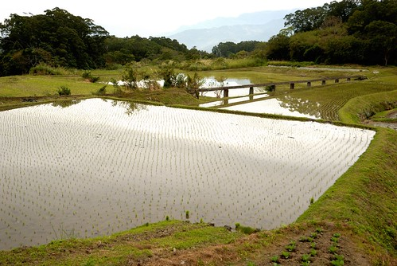 

我ㄧ直錯以為羅山跟六十石山一樣 位於縣193上 這回才明白羅山的入口就在台九上 而且是轉個彎就到那樣近的距離 而轉進往羅山的路後 在還搞不方向時就先被入口的遊客中心給嚇到 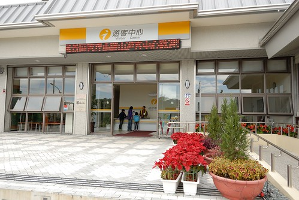 很有"新"味的遊客中心真的非常之大且氣勢非凡 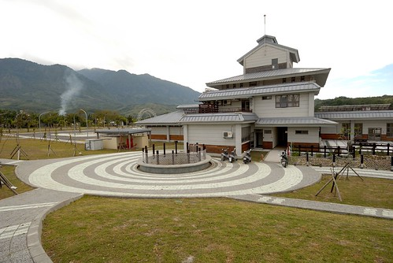 加上整個園區百樹待長 百草待生的光禿禿模樣  老實講 我心有點涼涼的... 因為太"有模有樣"的遊客中心跟我想像中的純樸與遵照自然農法村莊模樣 相差太遠 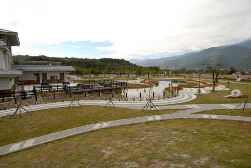 雖然園區旁有幾處美麗的花海造景吸引遊客駐足 但我卻只覺得大樹才襯的住這環繞的遠山與稻田 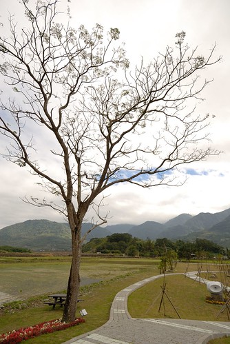 我們還是當作親近大自然般的散步其間 呼吸新鮮空氣 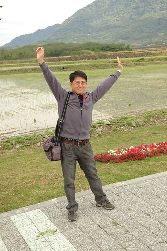 幸好徹愛還是很愛這樣能跑能跳 又沒人的大空間  兩兄妹還開心玩起猜拳遊戲 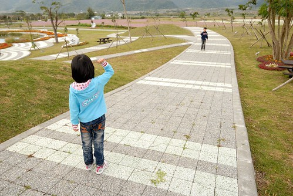 又跑又跳的 完全倘佯在花蓮的好山好水好空氣中 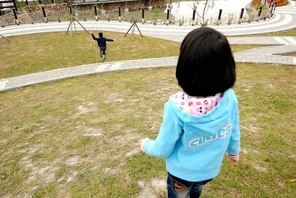 我們聽從遊客中心裡志工阿伯的建議 (阿伯說:帶些吃的到裡頭走走 多停留些 很不錯的) 到富里農會遊客中心買便當 準備帶到村里散步野餐 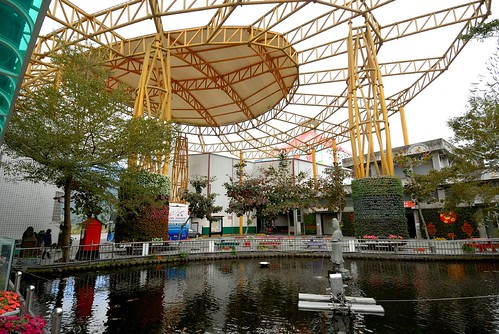 農會遊客中心2F的田媽媽餐坊有販售木片盒裝的當地富里米便當 我們看到裝便當的阿嬤豪氣的盛了九分滿的飯 心情high了起來 開心的嘖嘖大叫 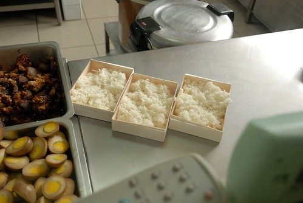 富里便當真的一點都不輸池上便當 清淡的口味與每樣都好吃的配菜 特別是那超入味的滷蛋 很是讓我們家喜歡 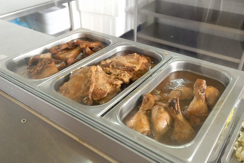 於是我們提著在農會遊客中心買的三顆便當 三罐飲料以及羅山產的芋頭酥直驅羅山瀑布 我們順著不低於30度的產業道路走 沿途看著兩旁的景物也才似乎正式踏進了羅山村

 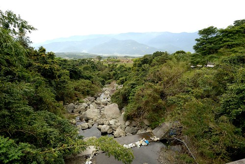 我們一路駛到村道盡頭的羅山瀑布步道口(其實也不過10分鐘左右的慢速車程) 提著便當 雄心壯志的打算走到瀑布下野餐 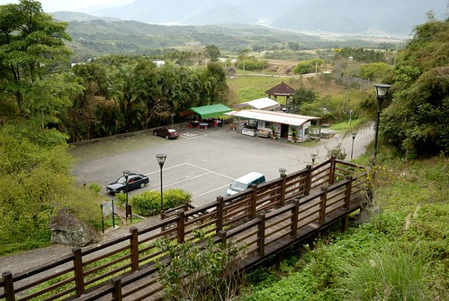 走在步道木階梯上 回頭往山下看 真的~ 我相信這裡是個什麼都產的出 什麼都產的好自然又好吃的台灣第一村莊 因為真的是好山好水 好自然的環境阿~ 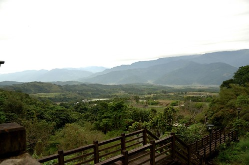 只是怎麼我們目標的羅山瀑布看起來是如此之遙遠阿... 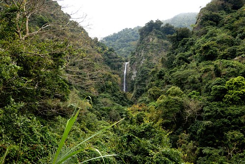 連續上坡階梯走沒20分鐘  徹愛便開始嚷著肚子好餓 還要走多久阿... ㄣ ㄟ ㄚ...  短時間內肯定走不到瀑布 而鏡頭拉近看瀑布倒也挺清楚的 好像是沒有非得走到瀑布才能放飯啦 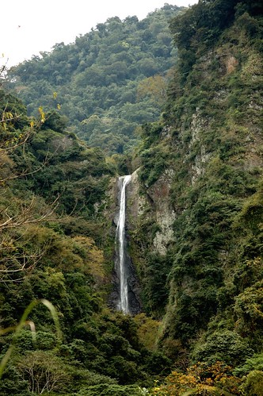 於是趁著爸爸回頭到車上拿匙筷 我們母子三人決定就在觀景亭上吃便當 (徹爸都還能走回停車場拿東西就知道真的走不遠) 也幸好我們忘了拿筷子讓徹爸折返回停車場 他才得以上網查羅山瀑布步道 ㄏㄏ... 媽媽這回果然功課沒做好 往瀑布的步道早就坍毀 目前是沒有任何正常的路可以到瀑布下的 所以像這樣遠距離的遙望羅山瀑布是正確無誤的觀賞方式 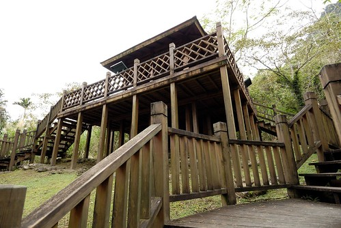 可以吃便當的兄妹倆好開心 但開動前愛愛硬要求得先扮演便當小姐 "客人 今天我們吃的是南花蓮有名的富麗便當" 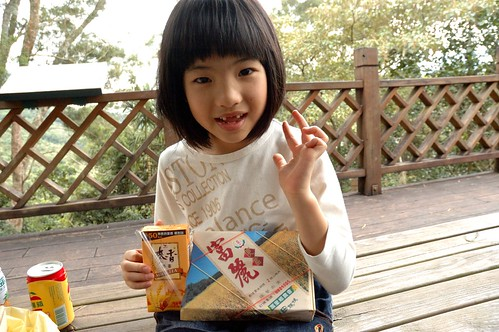 "瞧 菜色多麼的豐富 俗俗賣50元的招牌便當裡 有高麗菜 滷蛋 豆乾 筍乾 芝麻柴魚 還有厚厚好幾片的肉片" 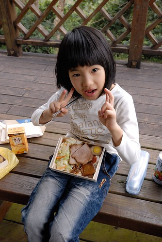 真的很好吃 我們一家子把便當吃的一粒米都不剩 (話說這種便當在放到有些冷的時候 米飯口感是最好的) 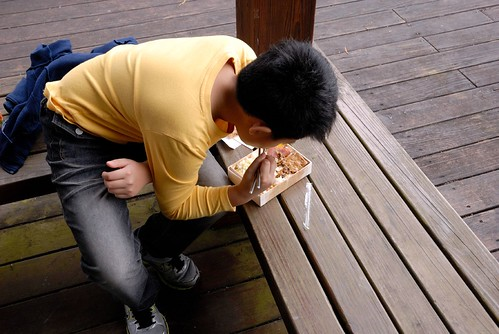 吃完便當 再喝個飲料 啃著一樣在農會買的羅山農產小點心 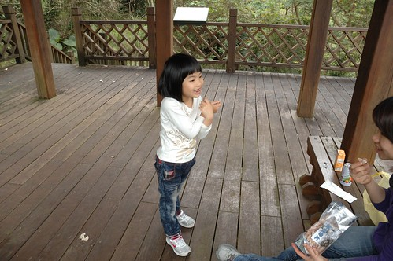 好不愜意的野餐阿~ 果然聽阿伯的話是對的! 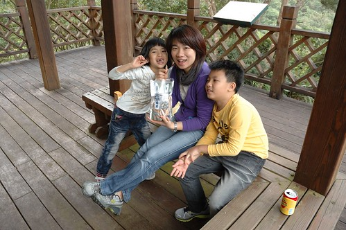 而吃飽飽又不用再繼續走步道的兄妹倆 開心的哩 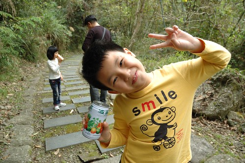 雖然剛吃完便當有飽 但來到羅山怎能沒去品嚐全台唯一 只有羅山有的火山豆腐 尤其看到格友寫的"像泥一樣但又不泥 還超好吃的"形容  我們更是好奇火山豆腐到底如何之神奇 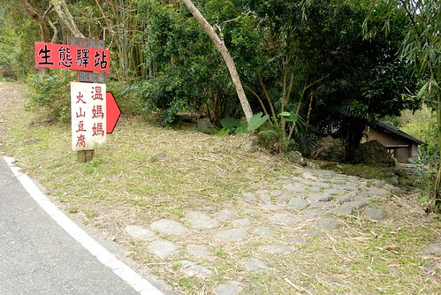 傳統農舍的店家 入眼就是美麗又舒服 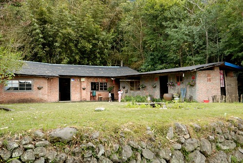 而房子前一畦畦的稻田景觀又更是迷人 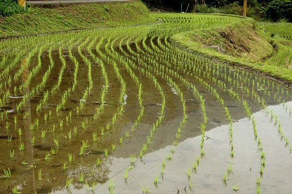 我跟徹爸異口同聲的說 這如果在結穗的時候一定很美 恩~ 光用想的就覺得肯定會很美 ... 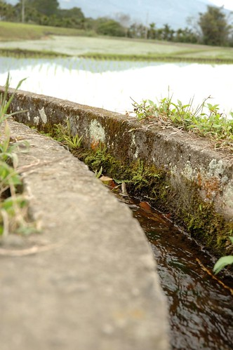 灌溉稻田的水是如此之清澈 難怪可以產出外銷日本的好米 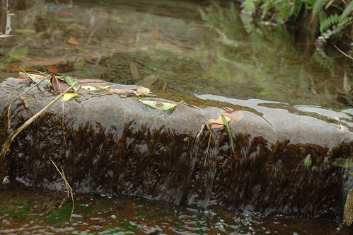 我們散步在田邊 消化肚子也感受羅山農村之美 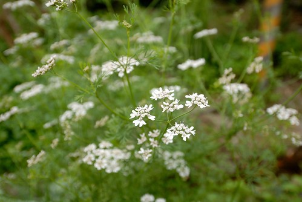 雖然沒看見羅山最美的時刻 但卻替日後的再訪留下好開始 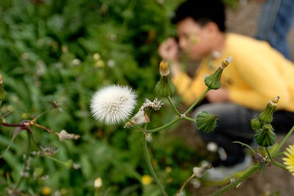 東扯西晃的  總算我們真的要去吃火山豆腐了 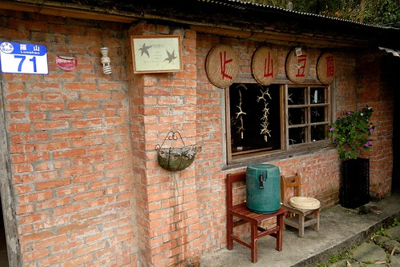 一入門 我們就被貼滿牆的留言卡給嚇到  "火山豆腐真的有夯喔~" 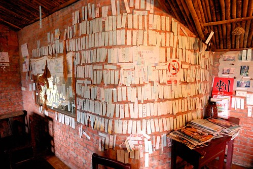 我們聽從服務妹妹的建議點了一份最能吃原味的涼拌豆腐 一份香氣最棒的煎豆腐以及一杯豆漿 趁著豆腐上桌前 先趕緊各自找雙筷子 因為筷子是純手工做的竹筷 每隻都獨一無二 所以得費點心配成雙 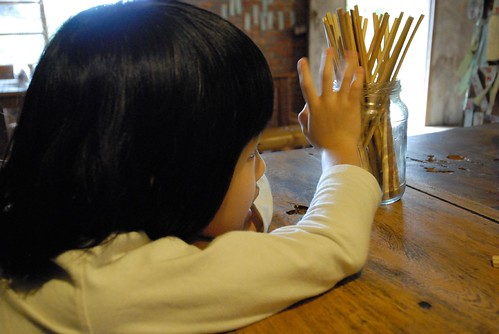 很快的 涼拌豆腐排隊整齊上桌了 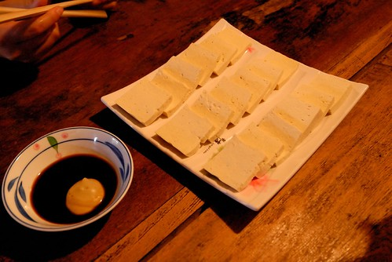 然後是用當地黃豆煮的豆漿 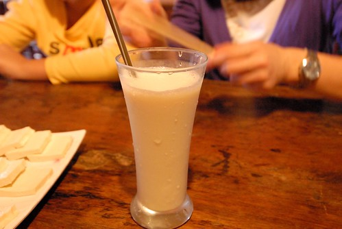 再來是香煎豆腐 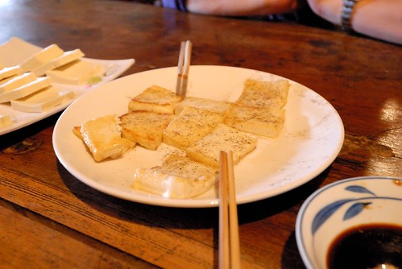 豆腐的口感真的很不一樣  說扎實也不是 比較像是軟中帶硬 硬中帶軟 而味道 老實講沒什麼味道 但我跟阿徹很喜歡 利用當地泥火山滷水做為凝結劑製作的豆腐 果然有三倍黃豆量的獨到之處 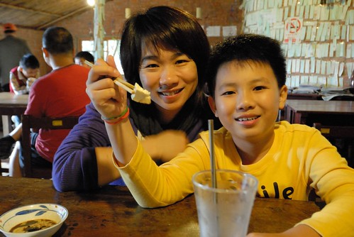 吃完豆腐 徹愛也分別寫張留言卡 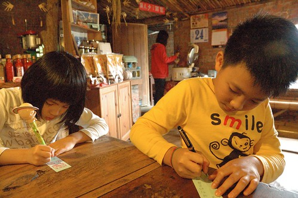 找個喜歡的牆面貼上去 算是我們的到此一遊 (話說阿徹的錯別字太嚴重 簡單幾個字就錯一半 阿母只好幫他代筆重寫)  臨去前 徹愛又再分別幫我們合照 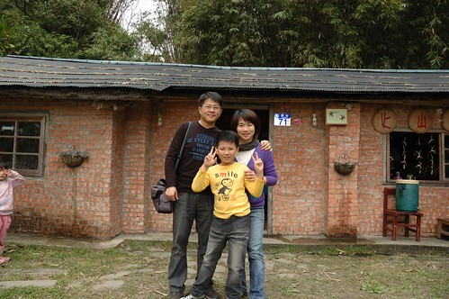 兄妹倆誰拍的好 永遠是兄妹倆爭論不休沒有結論的話題 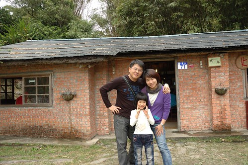 吃完豆腐 我們便開心的開車下山 路到一半才想到還沒去看大魚池還有泥火山ㄋ 趕緊回頭找池去 細雨紛飛的讓大魚池更顯矇矓 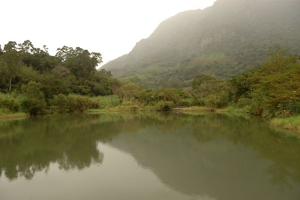 下雨也讓徹愛偷懶不想走 索幸坐在入口看老伯伯釣魚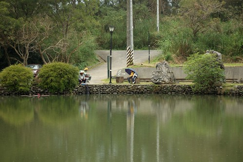 我跟徹爸兩人繞著魚池找泥火山 火山口果然就像那個傳說中那樣是灘爛泥 但真的有氣泡ㄅㄡ ㄅㄡ ㄅㄡ哩.... 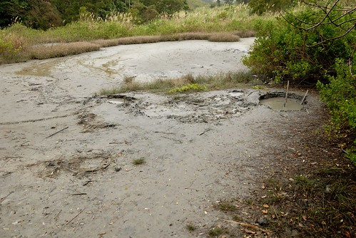 獨一無二的泥火山  獨一無二的火山豆腐  就在獨一無二的羅山村! 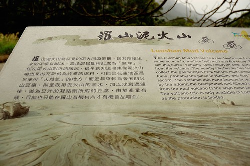 很舒服的小村落 就像緯來日本台看到的"來去鄉下住一晚"節目中那樣遺世卻又高手暗藏的美麗小農村 以後 肯定要在美麗的季節來這住一晚 肯定更能體會羅山的農村之美~
