幾年前到花蓮光復糖廠時 看到整修中的舊宿舍便很是期待其日後的模樣 而直到去年看到網友的住宿分享 我才又想起這麼一回事 很喜歡這樣日式木屋的氛圍 因此這次不管怎樣都想來住一晚 不同於以往來去匆匆的只為吃冰 這回在花糖我們好好感受美好的舊時光  

花蓮糖廠以前的宿舍區有28連棟 當中部份被保留並改建成日式木屋旅館 感覺上是由原本花糖的員工繼續任職與經營 雖然不若飯店般的專業 但糖場內遇到的每位員工都非常的熱情與親切 加上倘大又完善的木屋空間以及很親民的房價 這裡是值得推薦的住宿點 尤其更是適合一家子的慢旅行 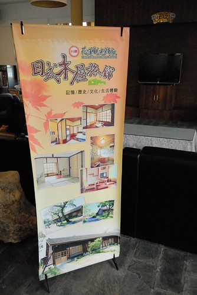 住宿區非常的乾淨舒服 而且光看房子外觀難以想像房子內將是如此之舒適  一進門是玄關處 入內的小階梯用來坐著穿鞋很剛好 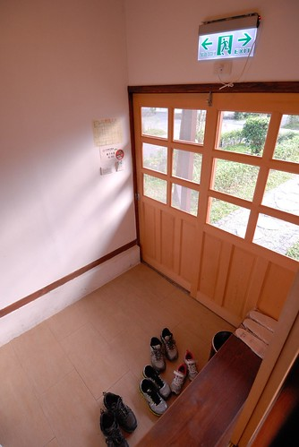 上去後是起居室  然後榻榻米和室 (睡覺時再鋪床)  看到榻榻米 我立刻就大剌剌的躺成大字型 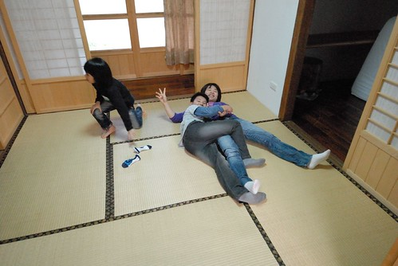 而愛愛則是看到多啦A夢睡覺的壁櫥 就高興的爬上去直說她晚上要睡這裡  和室的另一側還有一間兼做小書房功能的小房間   此時正放著三張床墊  和室旁的長廊盡頭是浴室 這又是另一個令人超驚艷的地方 雖然新穎的設計與風格實在與老木屋本身很衝突 但功能完善的馬桶 盥洗與洗澡三區域(還有檜木泡澡桶跟可坐著刷背的小椅子)真的很令人滿意 (不小心照到少爺解放的模樣 羞羞) 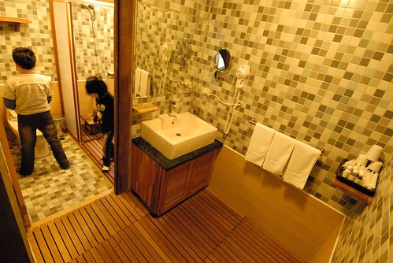 在這屋子裡 我說了好幾遍"其實這樣大小的房子真的很夠住" 一家子一起窩在起居室活動 一起擠在和室裡排排睡 一家子親密又堅強的共同生活著  而房子前的小院子也是與鄰居互動的好地方 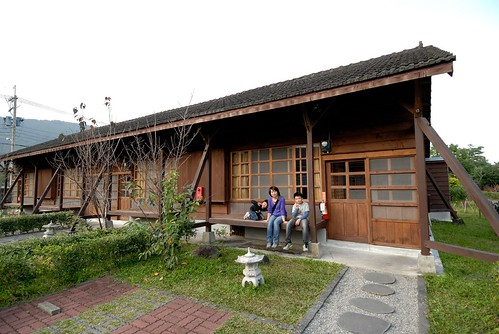 我坐在延廊下 想望這樣的以人為本的住居與生活  

天黑前 我們在園區內隨意溜搭 這是剛好在我們房間對面的派出所 濃濃歷史感的建築物很是漂亮 尤其鐵花窗  徹愛在街道上競逐起來 雖然打破寧靜但卻很應景的熱鬧 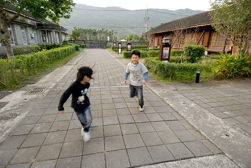 拿著住房提供的單車卷 我們去換了兩台單車作為停留花糖期間的代步工具  我們亂亂騎在沒什麼人的園區內 雖然車子真的很難騎但很愜意  遊客中心旁也有一區漂亮的舊木屋 為"創意工坊"

 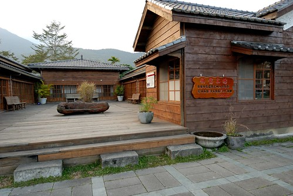 內部為花糖提供免費的展示空間予當地藝術/手作者展示與販售作品  一系列植物染布做成的手作煞是美麗  特別是橄欖樹綠的龍貓一家子很吸睛 真的是很美麗的大自然顏色  一窩窩的貓頭鷹寶寶也煞是可愛 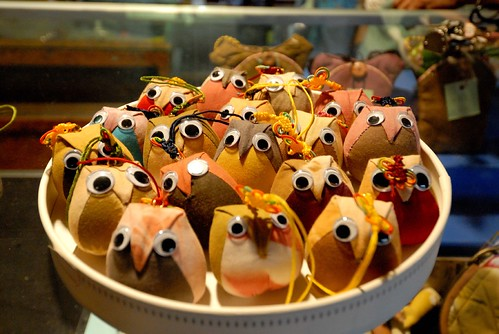 負責經營的花糖員工熱情的與我們介紹各項作品與述說其中故事 之後另一側輔導的當地弱勢家庭成員也熱情的介紹美麗的手作 還與我們分享美麗的含笑花 在這 我們感受到濃濃人的溫度~  

外出晚餐回來後 愛愛洗完澡便嚷著要換上提供的浴衣 雖然美其名為浴衣但其實比較像是小孩子的家居服 可是愛愛還是穿的很開心  同時阿徹也嚷著要穿 可是小孩衣服他已經穿不下 於是躍躍欲試媽媽的浴衣 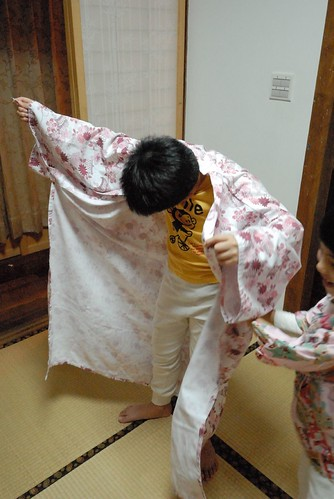 噹~ 像不像煙花美男子  日式木屋的體驗真的很特別 尤其是那還會嘎嘎作響的廁所木門更增添許多神秘 只是一家子一起擠在和室睡讓睡單獨睡習慣的我們睡的有點不好(應該分一床在小房間睡) 果然要過老生活還是要多練練的...

早上吃完早餐我們繼續在園區內隨意逛逛 四年前我們曾經追星而來的阿嬤照相館 外觀依然完整的被保留著而內部則被善用的作為餐廳空間  簡單的服務中心 襯在花蓮的好山好天氣下  一戶木屋家門口的櫻花盛開著 吸引許多人的目光  愛愛說住這戶人家好幸福阿 打開窗戶就看到櫻花了 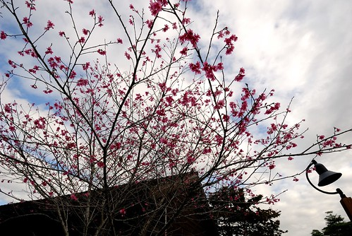 趁著單車歸還前 我們繼續騎著車晃晃 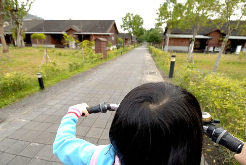 來到花糖文物館 第一次仔細的看花糖的歷史文物介紹  糖廠區內感受曾經的鼎盛  這是很難忘的一次住宿體驗!  花糖 很美的一個地方... 
