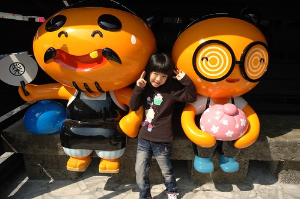

這幾次去花東前 徹爸都會問"還有什麼地方好去的嗎"  我總說還很多地方沒去過ㄋ... 這是真的 口袋名單還不少！只是礙於適合性以及喜好 其實很多地方我們是一訪再訪 就如我們這回在花蓮的一天幾乎都是舊地重訪/重吃 從蘇花公路後 一路從新城的檸檬冰 柴魚博物館 又吃又買的到花蓮的禾禾餃子以及時光二手書店 短短一兩小間就把我們身為觀光客的使命發揮到極致 雖然舊地重遊少了新鮮感但卻讓我們益加享受回味帶來的滿足與甜蜜～ 

對於花東觀光的進步 我們家很是有體會 但卻也同時對於很多美好事物的消逝 很是感嘆 柴魚博物館販售的柴魚讓我們這半年的餐桌上了不少好喝的湯與粥 但看到博物館前很奇怪矗立的快速道路工程 以及因為顧客反應而加強的商品包裝與漁獲量減少而日漸攀高的售價 心很痛阿... 但我們還是忍不住為我們的廚房進了不少貨 帶回當地食材是另一種保存與回味旅行美好的方法 吃完餃子 我們再去半年前留下美好戰力的時光二手書局 阿徹忘情的研究皮卡丘漫畫 愛愛則怡然的拿了本書坐在陽光灑進的小角落閱讀 我與徹爸則努力的尋找喜歡的書 一本推理小說 一本教室佈置美勞書是我們這回戰力品!  花蓮市沒再多停留 我們便驅車往鳳林與光復 好天氣更該去鳳林的三立冰淇淋店來一球  我們坐在戶外 倚著窗吃著冰淇淋 看著好天氣以及舒服的街道氛圍 好不舒爽  每球25或30元的冰淇淋真的很美味 特別是那個脆皮 深得我們母子三人喜愛  我們享受著各自喜歡的冰淇淋口味 也正式開始我們的吃吃喝喝之旅~  

PS.過年前 我又很雄心壯志的貼了好些篇遊記的照片 想要趁過年在嘉義好好的寫... 希望這樣短而小的寫法 可以讓我更有動力的完成我們所有的旅行紀錄 我自己 拭目以待~
