行程規劃中原本很是期待的"台東(市)"  卻意外地"走'的有點悶悶的 一家子忍不住懷疑起 是不是太常來台東而少了新鮮感與興奮感的緣故 但我堅信一切肯定都是因為壞天氣的緣故 讓我們沒去可以360度俯瞰的四格山以及很漂亮但卻多年沒去的琵琶湖 加上祕境"忘憂谷地"實在太難覓 讓我們留連迷失在縣197上 以及那與期望有落差 激不起內心感動的民宿所造成 果然! 旅行是需要天時 地利 與人和! 但我依然確信台東還是那個讓我ㄧ年到頭都想著什麼時候要再去的地方! 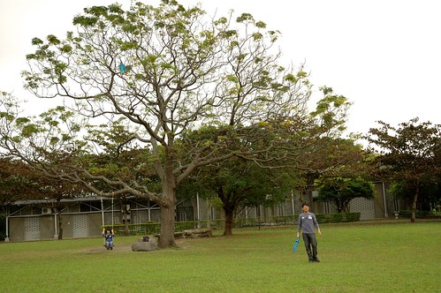 

第二晚住在台東市的"有時回家"民宿 之前看到網友的介紹 鄉村風擺設與廚房以及親切溫馨讓人如回家般的接待 讓我很是期待入住 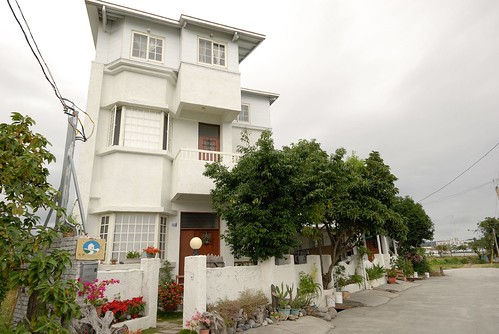 民宿就座落在離市中心偏遠些的稻田間  白色的小洋房真的很可愛 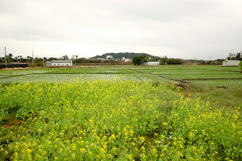 屋內的擺設也如網友們所說的那樣鄉村與漂亮 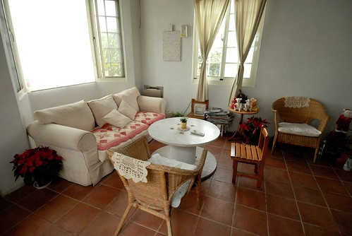 而房間設備也乾淨清爽 且確切落實環保 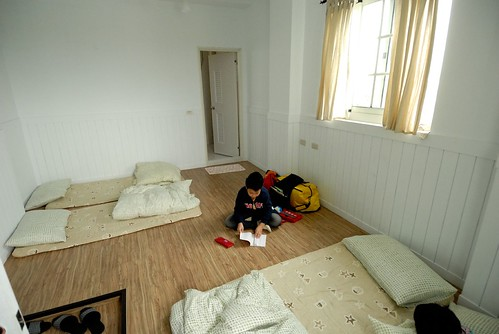 可是卻少了民宿最重要的"溫度" (起碼原先吸引我來也最是期待的是這部份) 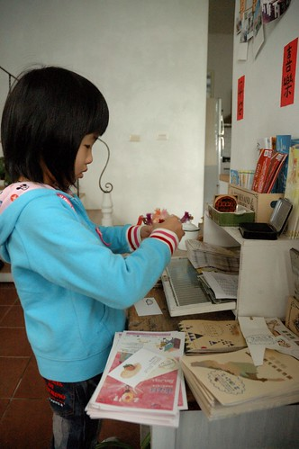 從入住哪一刻 我的心情由期待轉疑惑 再到隔天早餐時的失望 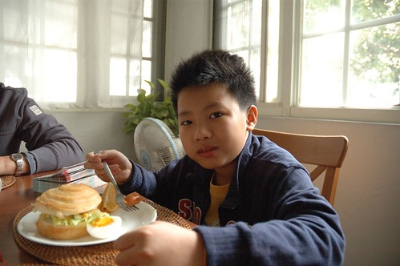 幸好最終離去時 遇到老闆爸的熱情問候以及解惑 我才明白也釋懷一切 原來本來的打理者就是老闆(好像是6尾還7年級的女生) 跑去澳洲遊學了 目前是老闆的朋友擔任管家打理一切 難怪我看不見很多網友特別形容的"主人一家子的熱情款待" 因為缺了重要的一角 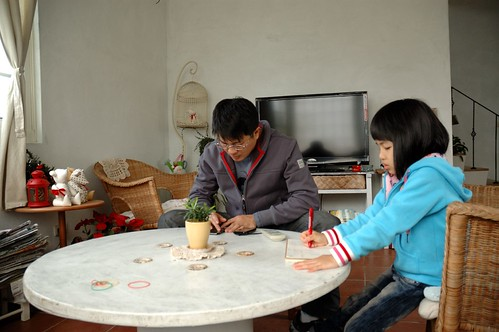 它真的提供了好的住宿環境 只是少了溫度的民宿真的就不過是個小旅館

第一天出發時候的好天氣讓我們以為天氣會一天比一天熱 恐會爆曬在台東的大太陽底 卻沒想到在台東的那天 天灰灰的 霧濛濛的 偶而還飄絲絲雨 需要能見度 需要大廣角的地方都不能去 只好拿出唯一的雨天備案"史前博物館" 想第一次來這也是阿徹一歲多的事了 那時候我們也是因為颱風天而來到這 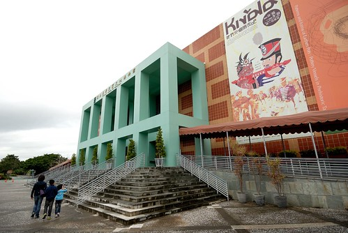 有人曾經這麼形容 史博館是最被低估的一座博物館 我想最主要的原因是遊客們大老遠從台灣北 台灣西來到台東 最喜歡的還是沐浴在花東縱谷的好山好水中 因此即使史博館的館藏豐富  台灣土地 人類演進 史前文化的資訊介紹詳盡  卻顯被遊客所知 再不就是像我們這樣 雨天的時候才會想起他... 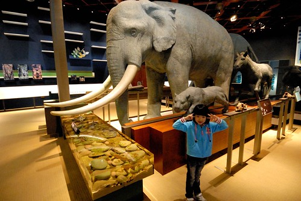 史博館的緣起與最主要展示乃是卑南遺址文物的保留 館內設有許多互動小遊戲讓人體會與瞭解考古工作 看展看的有些疲倦的徹愛玩著小遊戲 精神全都上來了 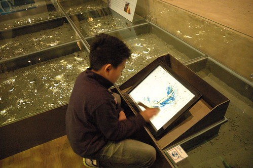 拿著刷子刷開土 看看挖掘到什麼考古器物 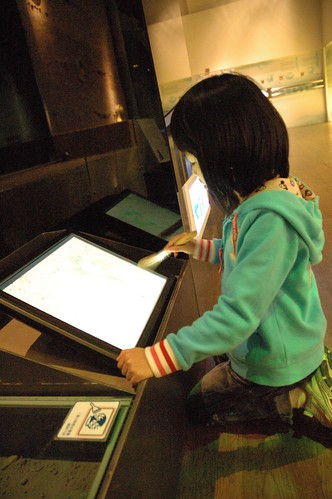 幫器物蓋上美麗的花紋 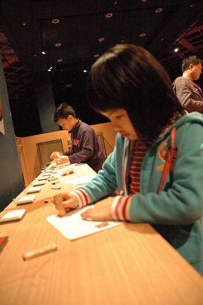 拼湊出器物完整的模樣 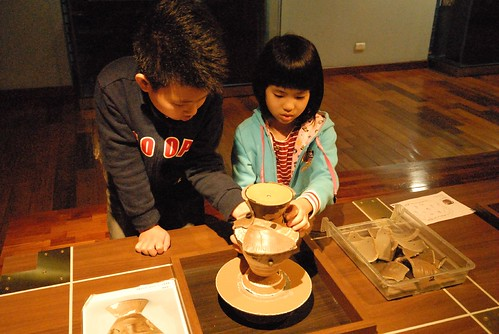 本以為沒幾片的立體拼圖 想不到要拼完整卻真的很難 母子三人拼了好一會總是失敗 最後徹爸出手總算完成 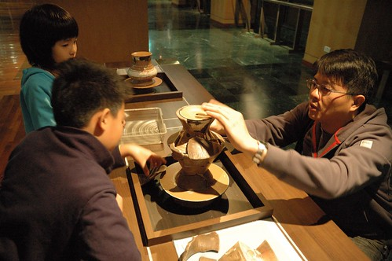 這一關讓徹愛更是明白考古學家的不易ㄚ  如何在殘片破瓦中拼出一件件考古器物並能想像推論遠古生活 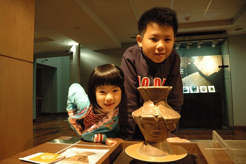 這個半日 徹愛也是小小考古學家 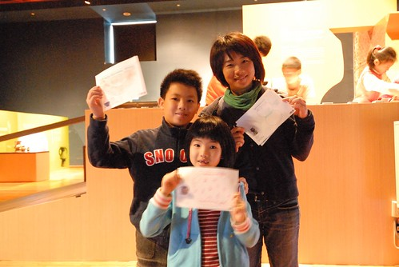 只是館藏真的太豐富 我們走了2個多小時也只能概略的看過 而且看到後來好累喔... 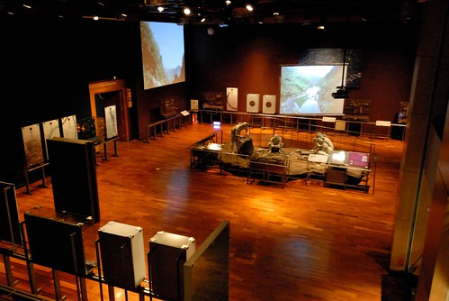 這意外的人文之旅提供我們另一種旅行的滋養 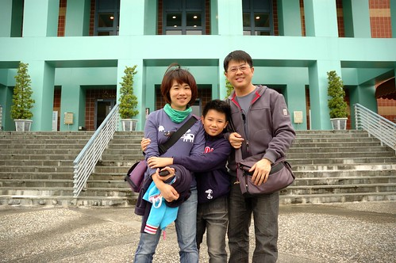 而對於小學生來講 這也真是一個很好的了解台灣史 原住民文化的戶外教學阿 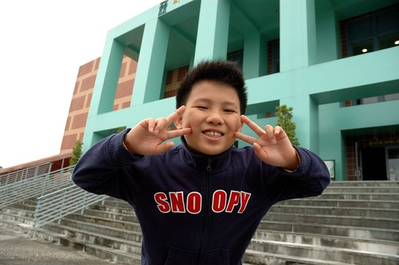

離開史博館後 我們接著來到卑南遺址公園 我ㄧ直記得曾經徹愛小的時候我們在這放風箏放的好開心 ([blog.yam.com/hmchen1975/article/8103990](http://blog.yam.com/hmchen1975/article/8103990)) 今天不放風箏 我們在這盪鞦韆 玩球 還有放鬆 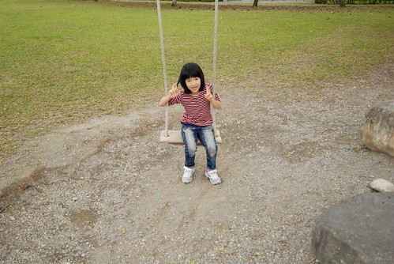 大樹下的鞦韆依然健在 真好! 一家子輪番盪著 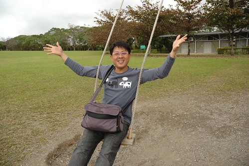 然後阿徹跟爸爸玩起旋風球 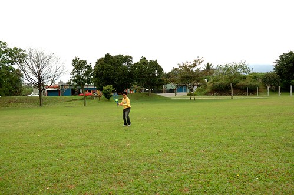 這兒空曠的大草坪實在很適合 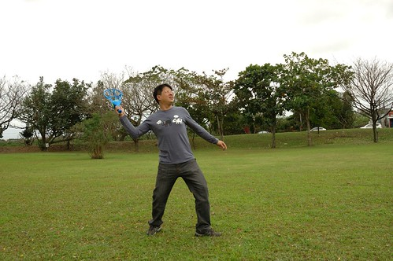 同時間 媽媽沉浸在自己的"空"中  而愛愛則拿著相機四處拍我們 捕捉哥哥接球的剎那 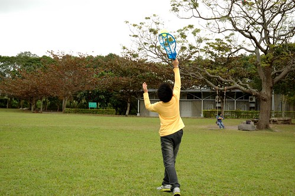 偷拍媽媽頹廢的模樣 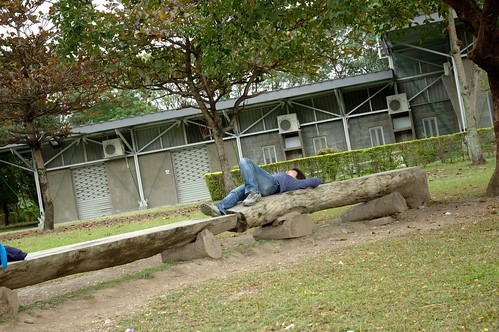 還有哥哥的NG鏡頭 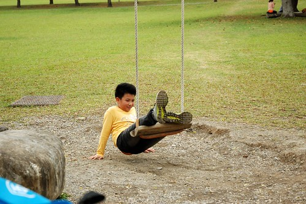 雖然受限於約定的午餐時間而沒辦法去找據說隱藏在樹林中的遊客中心 讓我們有些小遺憾 但也許這是讓我們下一次來台東再來這的好動機(就不會隔這麼多年了)... 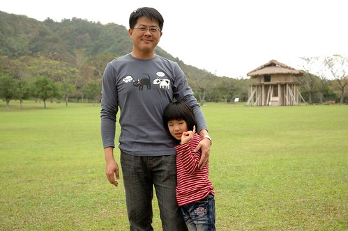 

那天中午我們去鹿野的"那界海" 享受一頓無菜單料理的慢食中餐 兩小時吃完飯離開餐廳時  除了去買麻吉外 我們突然不知道接著該去哪了 我說"好想吃冰喔"  阿徹說"好想再去故事館喔" 愛愛則說"想去民宿了" 於是我們紛紛滿足一家子的期望 去兒童故事館 吃寶桑湯圓(冰) 最後提早去民宿 再訪故事館 阿徹已經熟門熟路的找書看書 很快的沉浸在自己的樂趣中(雖然又是看漫畫類的書) 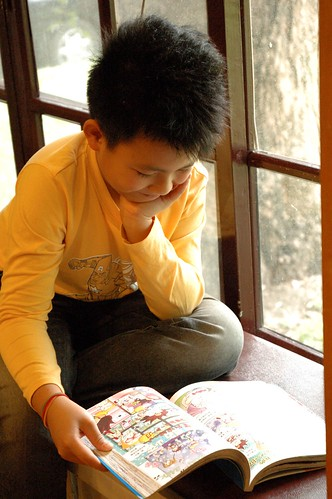 但心中直想著早早去民宿的愛愛卻靜不下心來聽我念故事 更別說是自己閱讀了 所幸後來她找到排遣的事情可做 認真的在一堆書前面研究起  原來是同一套書的裝訂邊外圖案是由一幅圖畫分割的 愛愛超專注的忙了10多分鐘 徹爸忍不住好奇的過去也一起幫忙 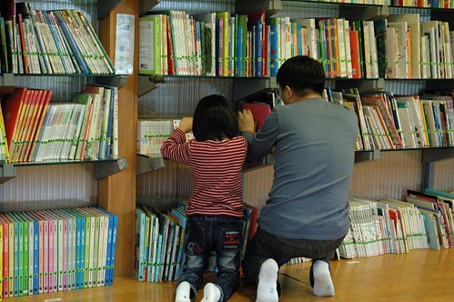 噹~ 最後愛愛整理 拼圖完成的書籍  不知道管理員會不會發現這裡的書被人動手腳過了ㄋ... 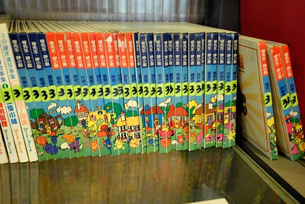 看完書 兄妹倆一樣在外頭的大滑梯上跑一跑 溜一溜 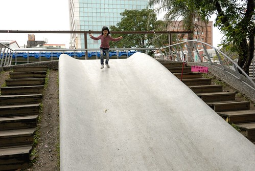 到此 我們也算是完成此行在台東市內的停留 其實今天大家的心情都很平淡 沒大落但也沒大起 就旅行狀態來講 這樣的平淡的確會讓人小失望 但很高興我們有討論 有共識 有度過這樣的考驗 而台東當然依舊是我們最愛的地方嚕~~~

後記: 話說我們第一次去買名列百大小吃的台東七里香水煎包 這哪是水煎包阿 根本就是"大"包子阿! 大的真的太誇張了!!!! 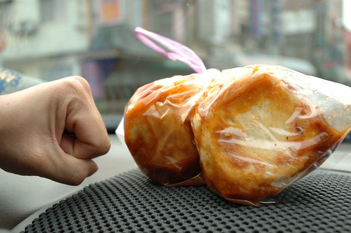
