最近是家裡二位小學生的瓶頸期 徹面臨一定要從心改變的挑戰 愛則正努力適應完全不同類型的新老師 雖然一直覺得家庭是教育中最重要的一環 但還是希望孩子能在好氛圍的學園裡學習! 中秋假期在嘉義時 有玩伴的徹愛完全不要爸媽的情形下 我與徹爸開車散步到鄰近的台南後壁 來到一個意外美麗的小學校園 這裡沒有會被稱台灣最美麗小學的地中海風或森林 但這裡是落實生活與自然的幸福學園~ 

原先我與徹爸只是單純的想去白河或後壁晃晃 探勘一下那的自行車道  上網查自行車道時 徹爸看到有人說國小很漂亮 也因此才會在認真找車道路線的同時 意外但也因為多留意了才發現的永安國小 [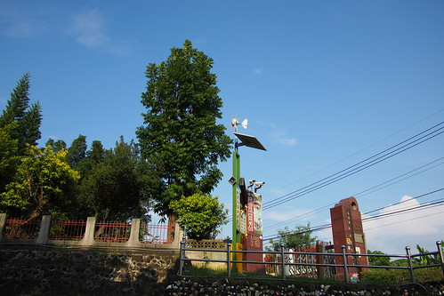](http://flickr.com/photos/33703965@N00/15068107790) 我們從校門口旁的訪客停車區進入校園 甫進入 一旁牆上妝點著的小朋友黏土作品就讓立馬對這學校有好印象  好奇的我們 沿著PC跑道開始探索校園  操場旁一排的大樹與如野球看台的階梯 讓人可以想見運動會時的盛況  走到操場中段 右轉銜接階梯後 沒想到映入眼簾的校園更是讓我們忍不住驚呼"好漂亮的校園阿" 俐落 明亮又可愛的綠建築 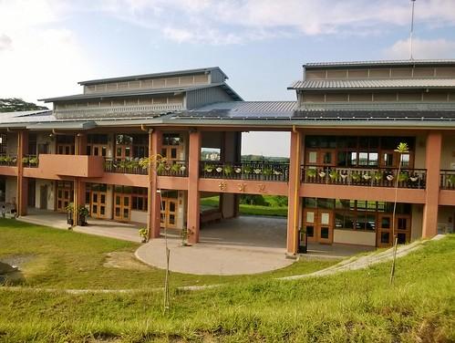 以綠建築為背景 草坪為舞台 小山坡為觀眾席的廣場 肯定是學生們的最佳表演舞台  這個溜滑梯也肯定很受小朋友喜愛(我最後有偷溜 讚!) [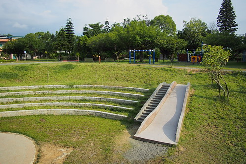](http://flickr.com/photos/33703965@N00/15068177108) 我迫不及待去找學生們的教室 [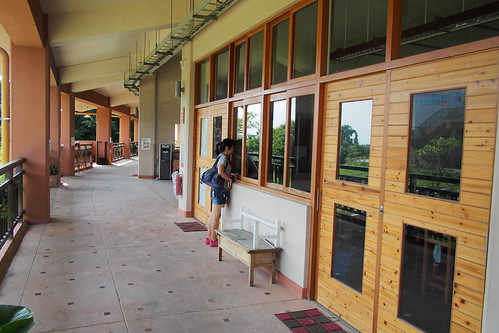](http://flickr.com/photos/33703965@N00/15254316542) 原木窗框已經夠美 沒想到每間教室內竟還有一片不小的榻榻米區 這可以遊戲 可以閱讀 可以看著窗外稻田發呆 甚至午睡的榻榻米 真的讓我羨慕的下巴要掉下來 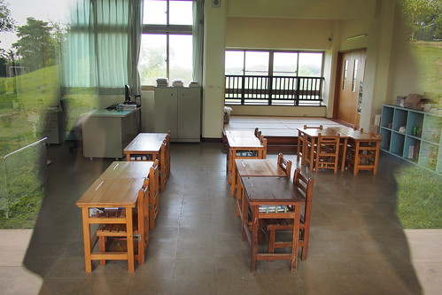 令人驚奇與喜歡的還不只這 繼續走阿走來到了穿堂 哇~這view也太好! 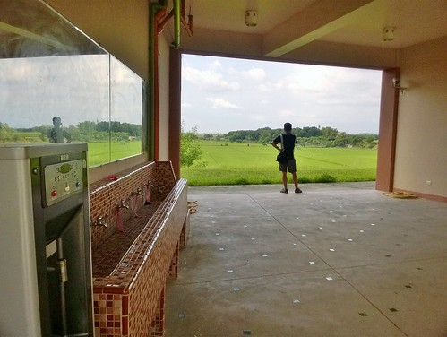 站在這有種煩惱全開 豁然開朗的舒暢感!!! [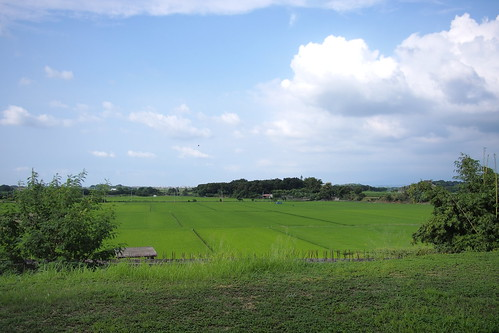](http://flickr.com/photos/33703965@N00/15231631816)接連的幾個空間或角落 每處都讓我們好喜歡    [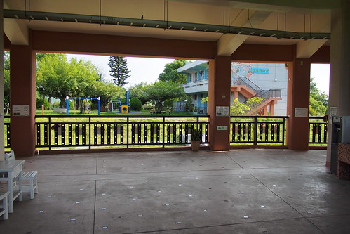](http://flickr.com/photos/33703965@N00/15068025620) [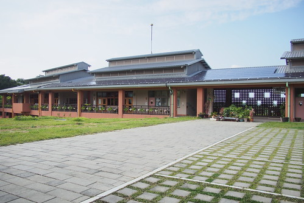](http://flickr.com/photos/33703965@N00/15067904819)  [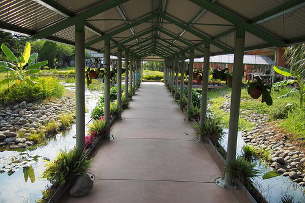](http://flickr.com/photos/33703965@N00/15254688635) [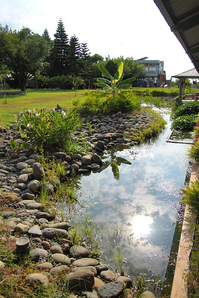](http://flickr.com/photos/33703965@N00/15251589121) 可以感受到學校以土地為出發點 用心設計與維護的美好環境 [ 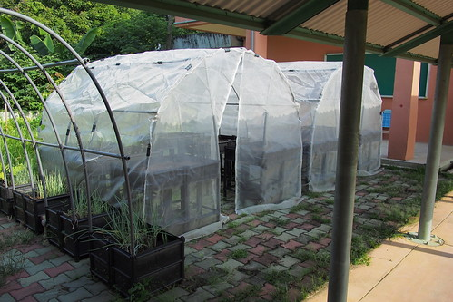](http://flickr.com/photos/33703965@N00/15231674516)尤其看到走廊上張貼的活動或教學公告/海報  更加覺得這裡不單單只是個美麗校園 [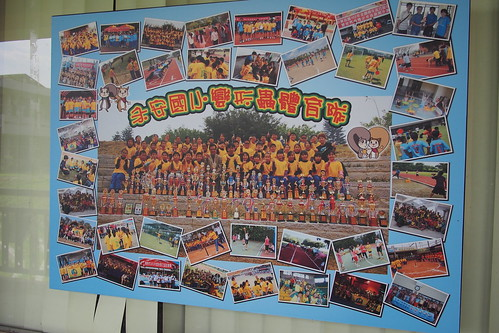](http://flickr.com/photos/33703965@N00/15251611981) 更是努力落實土地教育 環境教育 讓孩子樂在學習的幸福學園  我想阿徹肯定喜歡這國小 果然回家後讓阿徹看照片 阿徹看的哇哇叫 大嚷好羨慕阿! 還說他們台北國小大概就只有電腦比較快吧! 或許這也是一種城鄉差距吧! 一種城市人不知道或不以為重要但卻是小孩最受用的養份 [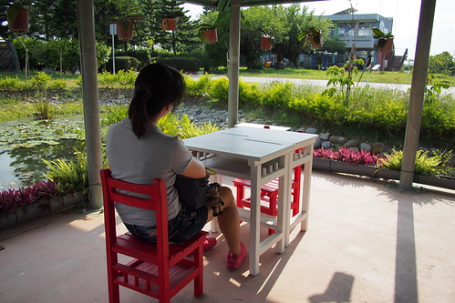](http://flickr.com/photos/33703965@N00/15068142618) 要離去時 看到校方人員在除操場上的草 這一幕讓我內心莫名悸動  想起國中念女校時 好喜歡每次除草過後的青青草味 好久沒聞到這懷念的味道 心裡頭溫暖又開心 [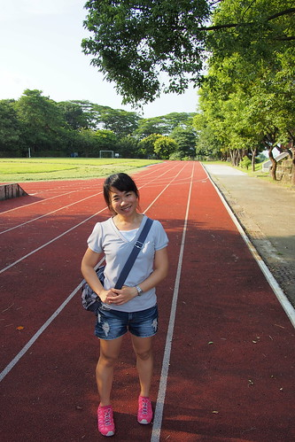](http://flickr.com/photos/33703965@N00/15254779525) 謝謝徹爸許了我一個這樣美好的午後小散步~ 不懶惰 總是能有意外小發現 小收穫... [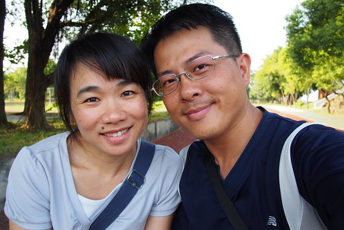](http://flickr.com/photos/33703965@N00/15251698871) 這篇原本前天晚上就該完成, 但在辛苦一個小時完成後半段送出後竟然一切化為了烏有 當下好噢!  隔天再想或許老天爺是要我多收拾點近日對於學校事情的負面情緒吧 所以今午 少了很多文字 再次完成
