這個月家裡的半邊整修如火如荼進行著 幸好沒動到的廚房跟餐廳還能讓我們維持生活基本 這一年食安風暴一發不可收拾的連環爆 也幸好我們本來的堅持與選擇讓我們仍可以不受影響如常生活著 安定與安心 或許就是在努力實踐日常生活中一點一滴累積而來~

中秋假期的那個下午 在離開很令人喜歡的永安國小後 我與徹爸意猶未盡的來到同樣在後壁 耳聞許久卻一直沒去過的無米樂故鄉 崑濱伯家的菁寮老街 菁寮老街因著崑濱伯聲名大噪也帶動觀光資源的注挹 但是個還有濃濃農村氣息的地方 我跟徹爸一樣很是喜歡 喜歡到一連二次回嘉義都來這裡走走...

我們follow導航系統指示 走著鄉間道路從永安國小到菁寮老街   我們第一次這樣深入嘉南平原裡 也才發現嘉南平原的稻田景色也別有一番 完全不輸花東的美麗 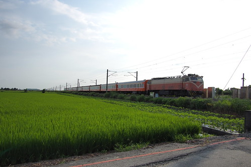  鐵道旁 稻田邊 畸零地利用的種植農人日常所需的蔬菜田  親切又溫馨 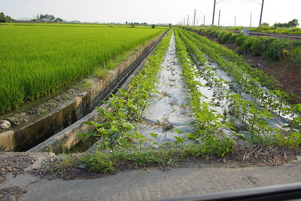 覺得台灣最美的風景就在這些的不經意間  來到菁寮老街區域  乾淨的街道與藍天 搭配的非常舒服  我們從社區活動中心開始老街巡禮 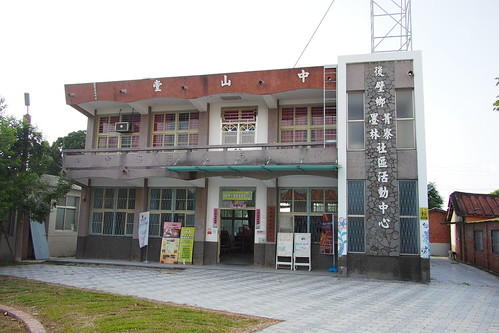 我超喜歡以前這樣簡單但絕對採光與通風的公共建物築  穿過活動中心 來到老街的另一邊 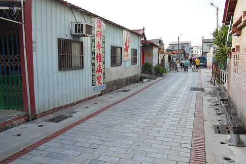 遠遠看見的熱鬧人潮 原來這裡有一口老古井  附近也有提供農家生活體驗的民宿 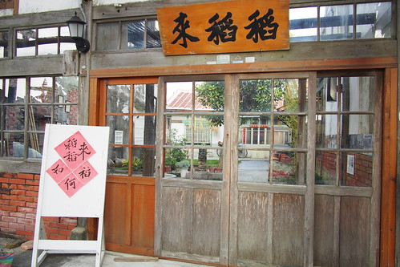 老街上還有不少店家營業著 雖然街道因著建設資源的注入而有新地磚或裝置 但一家家店鋪還是散發著原有的純樸與歷史感  老房子裡談著天 做著事的居民 構成一幅幅美麗的老街景像 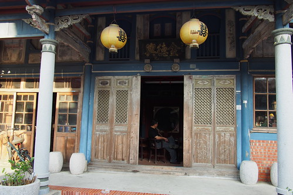 我們從窗外窺看老中藥鋪裡的老藥櫃 瞠目結舌 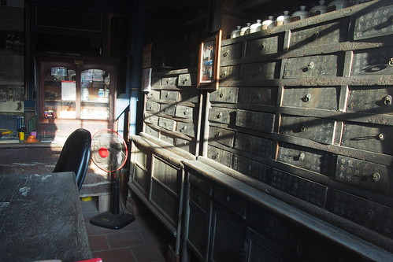 街上也有些居民販售著自家產的農作物 少少的 醜醜的  但就是讓人看著安心(尤其台北人我們)  我跟老婦買了一串芭蕉 一袋吃了二頓的秋葵 竟然50元還找一元 我開心的手掛著收穫 更恣意漫步在老街上  在地的萬味香醬園店 一開始我們因著房子看來真的好老而好奇的走入 [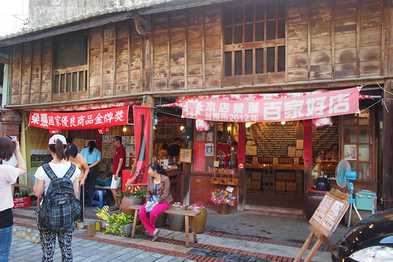](http://flickr.com/photos/33703965@N00/15068093849) 然後應主人盛情的試嚐一口沾著蔭油膏的豆腐後 沒想到就'ㄉ一ㄠˊ'了 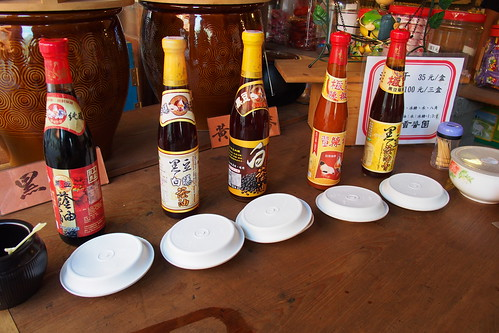 傳承五代 遵循古法製作的每樣醬油 醬料都很吸引我們 不小心就提了一手回家... 而且回家使用後 每樣都深得廚娘歡心 時隔三週便又再次來光臨  踏出醬園行時 買到好醬料的我們好開心 就像電線上的麻雀那樣的雀躍!  我們把提滿雙手的收穫拿回車上放後 繼續尋往老街的另一頭 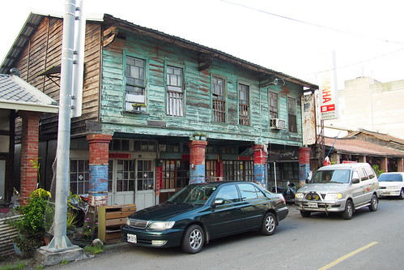 來到原醫生館捐獻成立的墨林文物館  鐵窗 花布 [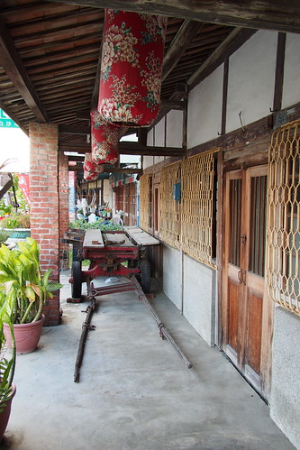](http://flickr.com/photos/33703965@N00/15231874006) 四合院 不需解說就能深深體會的曾經風華與歷史 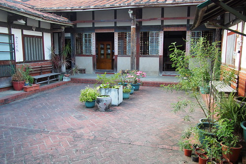 雖然有些斑駁 但這就是老房子最迷人的自然味道  回頭的路上 我們刻意在崑濱伯的家門口停留 往房子裡探望 [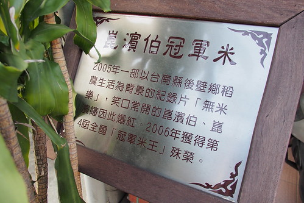](http://flickr.com/photos/33703965@N00/15068121749) 崑濱伯的家很好認  因為不只有立著的解說牌 家門口地上也有大大的崑濱伯無米樂六個字  就算眼殘如我 不論地上或立著的告示都沒看到  崑濱伯家的熱鬧度也絕對讓人一眼就明白 認出  我們沒有買冠軍米 畢竟家裡有吃習慣的關山米 但離去前買了一罐居民自做的蘆筍汁  平淡厚實的味道讓我們的菁寮老街巡禮畫下美好句點 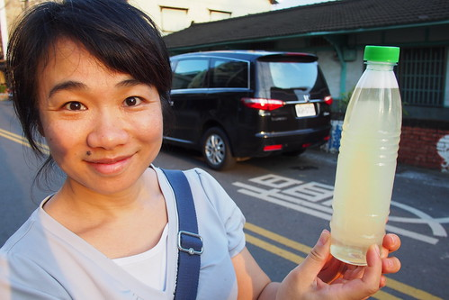 開車回嘉的路上 我們順道尋菁寮天主堂  沒想到教堂的對外開放的參觀時間只有少少的固定時段 [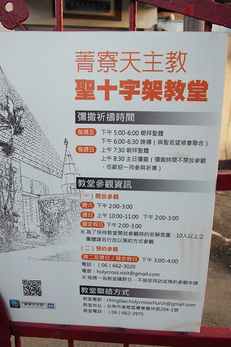](http://flickr.com/photos/33703965@N00/15254894705) 我們無緣入內參觀 但抬頭可見的教堂建築上半段便宏偉且別具特色的讓我們很是好奇 且不知有心還刻意的在三週後真的來參觀!  要離開菁寮時 剛好是傍晚六點時分  黃昏光影很美麗 家門口前聊著天 準備著中秋烤肉的人們很溫暖  這是一個美麗又溫暖的嘉南平原小農庄!     後記: 話說不知是為了要買醬油還是要來參觀聖十字架教堂 我們在三週後再回嘉義時竟然在週日早上又來菁寮了 雖然說是要買醬油 但當然是刻意在教堂開放參觀的時間來到  教堂果然有在時段開放參觀  但入內請遵守安靜 不照相 不用手機的規定  不是教徒的我們也沉浸在教堂的寧靜祥和氛圍中 當然也近距離好好觀賞半世紀前由德國建築師所設計的教堂建築  我們很難想像在這樣的農村小鎮上 尤其還在台灣還沒發達的半世紀前 竟然就在這樣的鄉村稻田中建了這麼一座極具設計感的天主教堂 而當初設計的建築師也在30年後獲得建築最高榮譽的普立茲克建築槳 從此這個大師唯三在德國以外的建築更別具價值與意義 參觀完天主堂 我跟徹爸繼續到鄰近的菁寮國小走走 [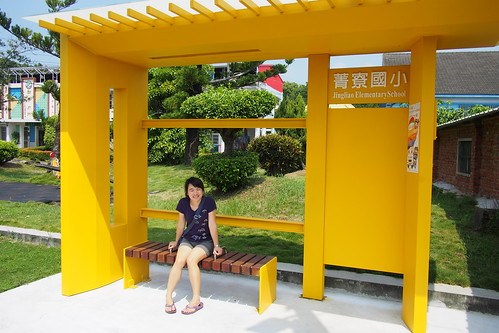](http://flickr.com/photos/33703965@N00/15453482680)這裡有個百年歷史的活動禮堂 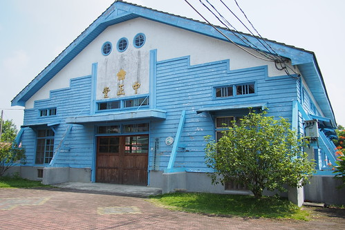 校園內有許多在台北學校不見的國父雕像 孔子雕像 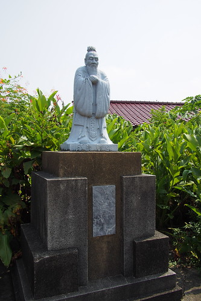 老蔣題字的禮義廉恥校訓 [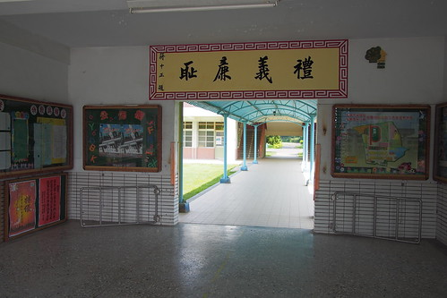](http://flickr.com/photos/33703965@N00/15639917252) 遠古時代的教育口號  讓我看的備感有趣但親切 [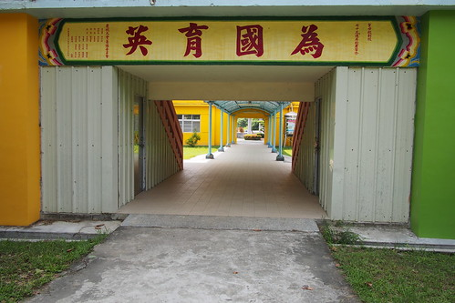](http://flickr.com/photos/33703965@N00/15452440819) 我最喜歡這個校訓: 憑良心做人 抱決心做事 多麼白話易懂且重要阿! 尤其在現今時代 我跟徹爸說要照回去給徹哥看 感謝徹爸在整理照片時有跟兒子說起這二句話 [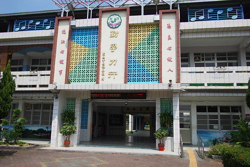](http://flickr.com/photos/33703965@N00/15018913593) 有機會到不同的校園參觀很是有趣 且也是了解地方的方式之一 這回到老街除了又買了一手送禮加自用的醬料 我們也到茄芷阿嬤工作坊買了一個充滿台味但很時尚的買菜籃 回去後我跟徹愛說我要提著這去市場買菜 他們大笑但也說真的很有味道阿!  我們也去在地老牌的和興冰果店  跟徹爸二人老派約會  紅豆香蕉冰 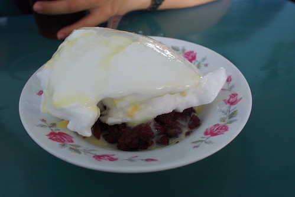 香蕉冰漂浮紅茶  一切老的這樣好的味道與約會!  徹爸說這裡的老街跟其他地方很不一樣 他很是喜歡 我說或許也因為只有我們二人 沒小孩吵才得以這樣慢慢走 慢慢看 慢慢感受 也或許因為這是我們二人的甜蜜小約會 所以這樣喜歡....
