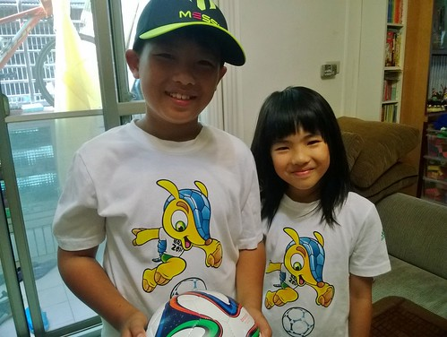
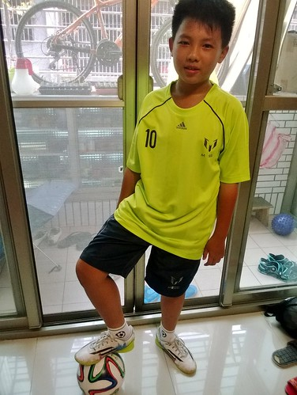

奧運 溫網 世足等大盛會 對於不懂門道也不愛湊熱鬧的我們來說 就像聽聞人家去環遊世界時只會淡淡噢一聲那樣冷淡 沒想到這一年我們家卻突然多了兩個愛踢足球的小朋友  兩人竟然嚷起要看世足賽 鑒於徹家最重視的就是吃飯睡覺外加上廁所這三件事 小孩子半夜看Live比賽根本是不被允許的事 曾經錄了幾場比賽要給兄妹看 但知道結果的比賽總讓徹哥少了興致(結果一場也沒看) 於是最後的一場比賽 為娘破天荒准許兄妹倆可以看Live 可以在關鍵的冠軍戰替偶像梅西加油 兩人開心不已~ 只是爸媽不提供叫床服務 所以兩人只能靠自己調鬧鐘 其實我跟徹爸是壓根不看好兄妹起的來 也做好半夜起床關鬧鐘的心理準備 沒想到我卻在睡夢中陸續聽到鬧鈴大響,小人起身到客廳,爸爸起床瞄眼小人並叮嚀不可以開冷氣,小人歡呼叫好聲... 然後最後是小人進房再開冷氣的聲音 那時我努力瞄個鬧鐘，五點半多!!! 好樣的徹愛! 竟然真的靠自己看完生平第一場世足賽! 這是除了玩與卡通外，罕見的堅毅阿! 

那早我與徹爸起床後的第一件事就是手機上網查比賽結果 看到阿根廷在延長賽裡0比1輸給德國失去冠軍  心裡小小遺憾下 徹愛對於結果倒是沒失落也沒說什麼 不過卻說了好些次的"他們好厲害喔" 或許對於懂足球規則又正努力爭取守門員後備一號的徹來說 對結果平常心也是他這一年裡的最大學習

我問兩人不會想睡覺嗎? 因為要阿母真的肯定會看到睡著  完全沒料到兩人可以全身而退... 看到兄妹倆形容二人利用廣告與中場時間輪流瞇一下(一個說要睡一下 另一個就保持醒著) 覺得他們真是可愛~ 而這也肯定是他們津津樂道一輩子的共患難事蹟阿! 話說二週前媽媽在addids專櫃如被下蠱似的 讓徹哥予取予求的從頭到腳的買了梅西的帽衣褲與世足紀念衫 雖然掏錢掏的心很疼 但這是阿母不可說的放長線釣大魚阿 希望更多的開心與熱情 可以支撐著天份不夠 努力也可以更多的徹哥 一直努力堅持下去(起碼小學畢業)
