節氣來到立秋 可是天氣還是好熱... 不過小學生的開學日已指日可待  每天渾渾噩噩的暑假真的咻一下就快過完! 上週愛愛宣布 從瑞穗帶回來的兩罐牛奶糖都吃完了(每次(天)只吃一顆 很省著吃) 我們的夏騎回憶跟著好吃牛奶糖一起收進我們的心坎裡~ 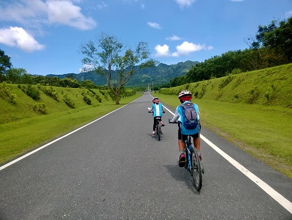

年初旅行來到光復的大農大富平地森林園區後 就蠻期待有朝一日來這騎車 這次經過光復 當然就把可對應的路段用園區的路替代 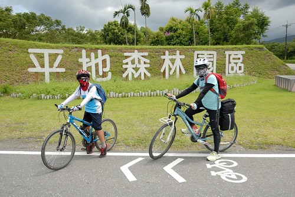 從台九轉近的大農路口 矗立的這顆樹應可媲美池上的金城武樹 吸引前來遊客的停車拍照  我也請徹爸幫我們母子拍一張 沒想向來不落俗套的徹爸竟然真的就給我們隨便照照..........右邊矗著的歐都麥完全沒躲的入鏡 [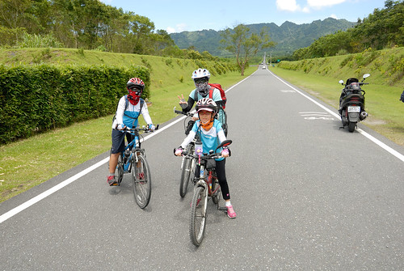](http://flickr.com/photos/33703965@N00/14362028920) 然後徹爸就去幫單車環島旅行的年輕人拍照還聊天 剩下我只能用手機拍下我覺得很美的這一幕幕 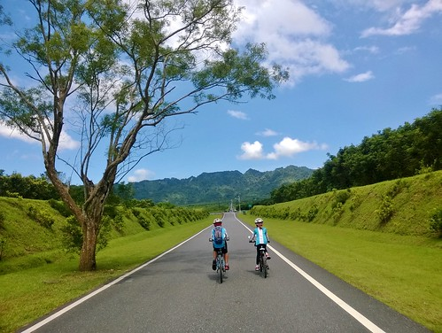 等候徹爸迎上的時間  徹愛來來回回騎著 享受著衝刺與下滑 徹爸也嘗試放手騎 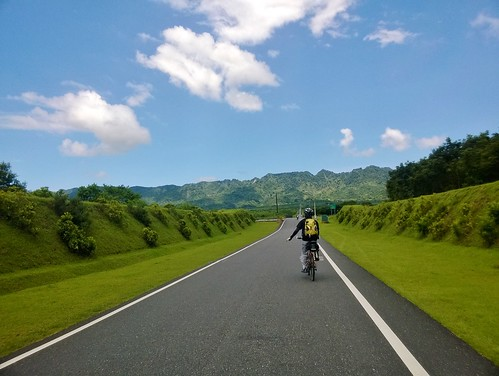 可惜不夠帥氣 我也一沒捕捉到厲害的畫面 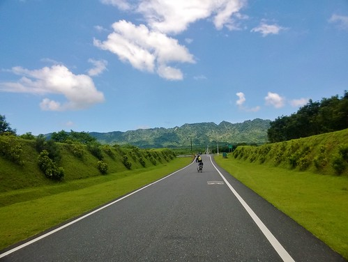 通往自強外役的這條路真的很筆直  而且連綿往山裡去的氣勢讓人心曠神怡  雖然微上坡讓愛愛騎到後來有些東倒西歪 有些喘 [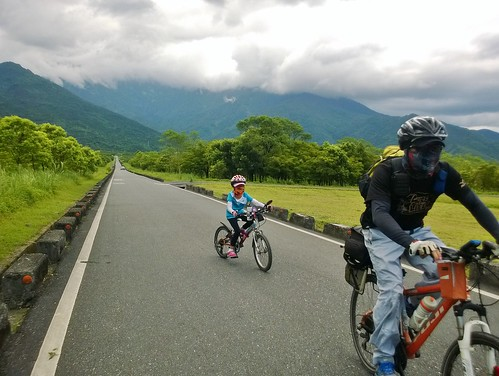](http://flickr.com/photos/33703965@N00/14525602836) 但風景太美 所以愛愛一點也不以為苦 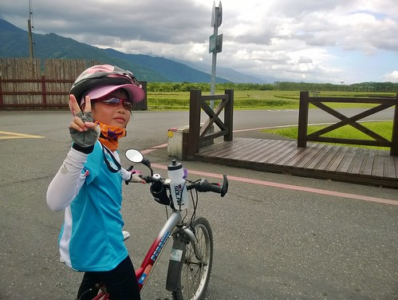 來到大農大富花卉區 果然還是如年初來時一樣不甚討喜  不過沒關係 我們也只是路過而已 從這我們接園區的南環道繼續往南的方向騎 南環道上 我們一直與鮮明的紅色自強外役遙遙相望  經過彩虹釣竿橋 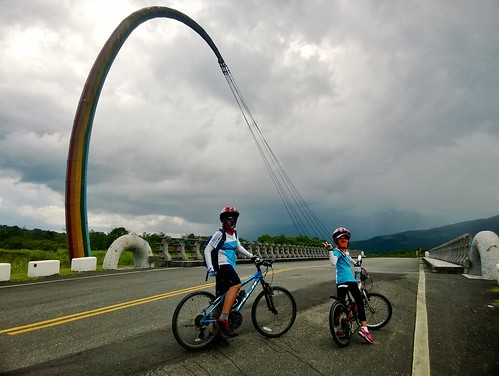 騎在兩旁樹林包圍的美麗綠色車道  這段路 好平甚至有些下坡 而且好綠好涼 很棒享受的單車道(大推) 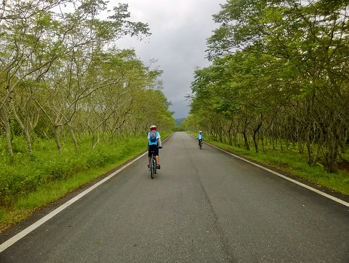 可惜我們直到台九的出口才看到園區的整個導覽圖 才看明白園內的車道分布 原來我們只走了南環道的小小一段 北環道跟自行車道 我們連邊都沒騎上... 

離開大農大富後 我們走台九快速往瑞穗鄉前進 看到乳牛 我們開心著我們總算來到這次旅行的最後一個鄉鎮 [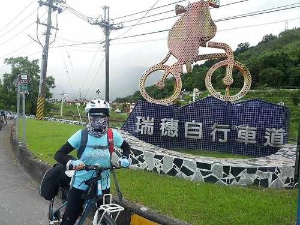](http://flickr.com/photos/33703965@N00/14362047570) 我們轉進往富源社區的路 我喜歡這路的S曲線  也很剛巧 路口的鐵路平交道有火車經過  我們猜 這應該是太魯閣號吧! 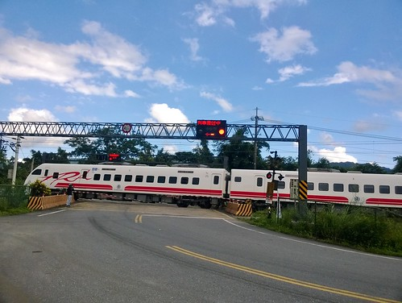 沒想到 天卻突然下起雨 我們只好往富源火車站的方向去躲雨 然後意外地來到富源的拔仔庄常民文化館  我們在這躲雨 也給喝了好多茶與冰水 還與這的志工們聊天 才知道拔仔庄是鼓的故鄉 每天夏天都有舉辦全國各方甚至連國外好手都參加的鼓王爭霸戰 很是熱鬧!  日後有機會 我們再來富源參與盛會且親近這也是蝴蝶故鄉的地方 [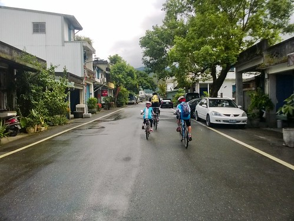](http://flickr.com/photos/33703965@N00/14362098029)大雨過後 地濕滑的得更小心騎車 [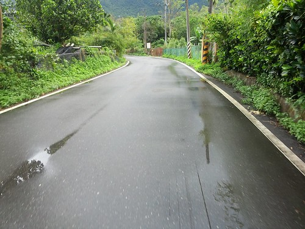](http://flickr.com/photos/33703965@N00/14548711315) 但空氣卻也格外的新鮮且一掃熾熱 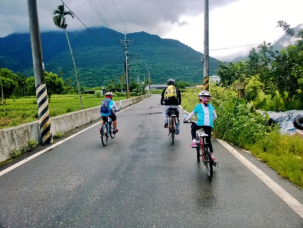我們好奇的想再往山裡去 但已經被雨耽擱了一小時怕再多騎會耽誤到火車的時間 我們只好遺憾的截彎取直往瑞穗市區去 [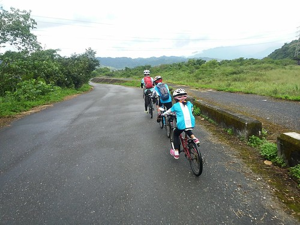](http://flickr.com/photos/33703965@N00/14545314581) 每次旅行我們都會事前就規畫好行程與路徑 但我們也總是隨遇而安的隨機應變 這些小意外 小發現 小經過 常把我們的旅行點綴得更豐富又難忘  離開富源社區後 我們再次在台九上快馬加鞭著 直到四點初抵達瑞穗火車站才安心 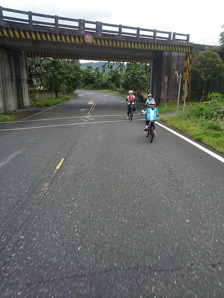 99%確保不會延誤到5點半的搭火車時間  我們才又放心的(也是打發時間)去吉蒸牧場喝牛奶 買牛奶糖 [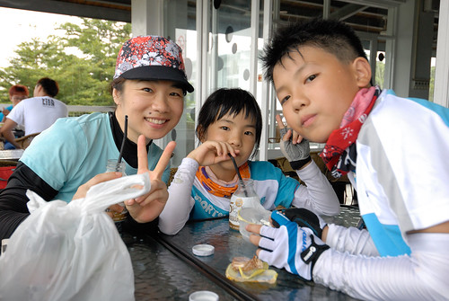](http://flickr.com/photos/33703965@N00/14547788702) 不若瑞穗牧場那的經營與熱鬧 吉蒸牧場一直相較顯得沒什麼 不過我們喜歡吉蒸的原始香濃好味道  每次經過瑞穗時總忍不住就繞進泛舟中心後頭的吉蒸牧場  農場的鮮奶 鮮奶酪 牛奶糖都是旅行中很棒的點心 [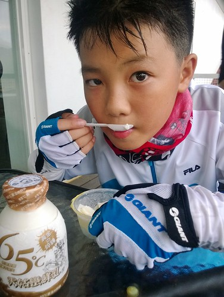](http://flickr.com/photos/33703965@N00/14525628026) 喝牛奶的時後 下了一場傾盆大雨 雨停了也剛好是我們得起身回火車站的時候 (謝老天爺體貼我們的沒雨具) 我們順著牧場外的堤道(沒走回頭路)繞回市區 地圖上就像是在瑞穗打了一個句號般 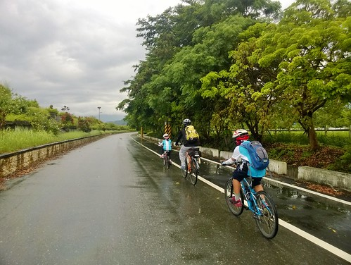 順利抵達瑞穗火車站 也代表我們的旅行即將平安結束  不同於平常的上車就睡 愛愛在回程的火車上精神特好 (可見真的有high阿)  胃口也特佳  在瑞穗買的便當一人一個 徹哥吃的一粒米也沒剩 愛妹也很厲害的獨嗑大半  阿母最愛這樣能動能吃的好小孩  只是好小孩嫌阿母的自拍技術太差  愛妹示範這樣的自拍才好看!  我們的2014夏騎紀錄總算寫結束  再次由衷謝謝徹爸與徹愛同我這樣旅行 每一次旅行都是我的生活與人生中很棒的養份與美好~~~
